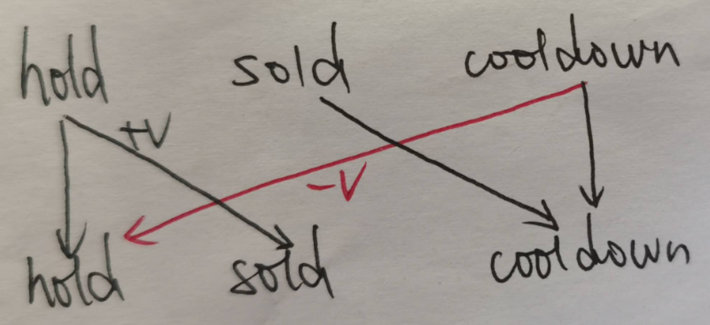

<!--
 * @Filename:
 * @Author: shifaqiang
 * @Email: 14061115@buaa.edu.cn
 * @Github: https://github.com/luoboganer
 * @Date: 2019-09-13 13:35:19
 * @LastEditors: shifaqiang
 * @LastEditTime: 2020-06-25 16:17:43
 * @Software: Visual Studio Code
 * @Description:
 -->

# record about problems in [leetcode](https://leetcode.com/)

## [algorithms](https://leetcode.com/problemset/algorithms/)

- [1](https://leetcode.com/problems/two-sum/)

    题目要求在一个数组中寻找两个和为给定值的数，暴力枚举时两层遍历的时间复杂度为$O(n^2)$，因此使用**unorder_map**的接近$O(1)$的查询效率来实现$O(n)$一遍扫描的做法，这里注意cpp中STL template **unorder_map** 的用法

    ```cpp
    vector<int> twoSum(vector<int>& nums, int target) {
		vector<int> res(2, 0);
		unordered_map<int, int> tmp;
		int count = nums.size();
		for (int i = 0; i < count; i++)
		{
			int diff = target - nums[i];
			unordered_map<int, int>::iterator got = tmp.find(diff);
			if (got != tmp.end())
			{
				res[0] = got->second;
				res[1] = i;
				break;
			}
			else
			{
				tmp.insert(pair<int, int>{nums[i], i});
			}
		}
		return res;
    }
    ```

- [4](https://leetcode.com/problems/median-of-two-sorted-arrays/)

    给定两个长度分别为m和n的有序数组，返回两个数组合并后新数组的中位数

    - 思路一：两个有序数组归并排序后返回下标中间值一个数即可，时间复杂度$O(log(m+n))$

    ```cpp
    double findMedianSortedArrays(vector<int>& nums1, vector<int>& nums2) {
        vector<int> nums;
        int i=0,j=0,length_a=nums1.size(),length_b=nums2.size();
        while(i<length_a && j<length_b){
            if(nums1[i]<nums2[j]){
                nums.push_back(nums1[i++]);
            }else{
                nums.push_back(nums2[j++]);
            }
        }
        while(i<length_a){
            nums.push_back(nums1[i++]);
        }
        while (j<length_b)
        {
            nums.push_back(nums2[j++]);
        }
        int length=nums.size();
        double ans=0.0;
        if(length&1){
            ans=nums[length>>1];
        }else{
            ans=(nums[length>>1]+nums[(length>>1)+1])/2.0;
        }
        return ans;
    }
    ```

    - 思路二：因为两个给定数组都是有序的，因此可以通过二分查找来实现寻找中位数，这样可以将时间复杂度降到$O(log(min(m,n)))$

    ```cpp
    double findMedianSortedArrays(vector<int>& nums1, vector<int>& nums2) {
        int m=nums1.size(),n=nums2.size();
        double ans=0;
        if(m>n){
            // m<n时交换两个数组，保证第一个二分搜索的数组长度不小于第二个
            vector<int> temp=nums1;
            nums1=nums2;
            nums2=temp;
            swap(m,n);
        }
        int start=0,end=m,mid=(m+n+1)/2;
        while(start<=end){
            int i=(start+end)/2;
            int j=mid-i;
            // 此时可以保证i左侧和j左侧的所有数字数量，i右侧与j右侧的所有数字的数量相同
            // 接下来通过二分查找保证 max(nums1[i-1],nums2[j-1])<=min(nums1[i],nums2[j])
            if(i<end && nums2[j-1]>nums1[i]){
                // i is lower, move right
                start=i+1;
            }else if(i>start && nums1[i-1]>nums2[j]){
                // i is upper, move left
                end=i-1;
            }else{
                // i刚好合适，但也有特殊情况是i到达数组nums1的边界
                int max_left=0; // 左半部分最大值
                if(i==0){
                    max_left=nums2[j-1];
                }else if(j==0){
                    max_left=nums1[i-1];
                }else{
                    max_left=max(nums1[i-1],nums2[j-1]);
                }
                if((m+n)%2==1){
                    ans=max_left;
                    break;
                }else{
                    int min_right;
                    if(i==m){
                        min_right=nums2[j];
                    }else if(j==n)
                    {
                        min_right=nums1[i];
                    }else{
                        min_right=min(nums1[i],nums2[j]);
                    }
                    ans=(max_left+min_right)/2.0;
                    break;
                }
            }
        }
        return ans;
    }
    ```

- [5. Longest Palindromic Substring](https://leetcode.com/problems/longest-palindromic-substring/)

    在给定字符串s中求其最长回文子串

    - 动态规划（DP），时间复杂度$O(n^2)$，dp[i][j]表示$s_i,...,s_j$是回文子串，则状态转移方程为：
    $$dp[i][j]=\left\{\begin{matrix}True, dp[i+1][j-1] \ and \ s_i==s_j\\ False, otherwise \end{matrix}\right.$$

    ```cpp
    string longestPalindrome(string s)
    {
        string ret;
        const int length = s.length();
        if (length > 0)
        {
            vector<vector<int>> dp(length, vector<int>(length, 0));
            int start = 0, substring_length = 1;
            for (int i = length - 1; i >= 0; i--)
            {
                dp[i][i] = 1;
                for (int j = i + 1; j < length; j++)
                {
                    dp[i][j] = ((dp[i + 1][j - 1] || (j - i < 3)) && s[i] == s[j]) ? 1 : 0;
                    if (dp[i][j] && (j - i + 1 > substring_length))
                    {
                        start = i, substring_length = j - i + 1;
                    }
                }
            }
            ret = s.substr(start, substring_length);
        }
        return ret;
    }
    ```

    - 以s中任何一字符为中心，向两边扩展求其回文子序列，时间复杂度$O(n^2)$

        - 基本实现

        ```cpp
        string longestPalindrome(string s)
        {
            string ret;
            const int length = s.length();
            // 奇数长度的回文子串
            for (int i = 0; i < length; i++)
            {
                int left = i, right = i, valid_start = i, valid_end = i;
                while (left >= 0 && right < length && s[left] == s[right])
                {
                    valid_start = left, valid_end = right;
                    left--, right++;
                }
                if (valid_end - valid_start + 1 > ret.length())
                {
                    ret = s.substr(valid_start, valid_end - valid_start + 1);
                }
            }
            // 偶数长度的回文子串
            for (int i = 0; i < length; i++)
            {
                int left = i, right = i + 1, valid_start = i, valid_end = i;
                while (left >= 0 && right < length && s[left] == s[right])
                {
                    valid_start = left, valid_end = right;
                    left--, right++;
                }
                if (valid_end - valid_start + 1 > ret.length())
                {
                    ret = s.substr(valid_start, valid_end - valid_start + 1);
                }
            }
            return ret;
        }
        ```

        - 一种改进的实现

        ```cpp
        vector<int> lengthOfExporedSubstring(string s, int left, int right)
        {
            int valid_left = left, valid_right = left, length = s.length();
            while (left >= 0 && right < length && s[left] == s[right])
            {
                valid_left = left, valid_right = right;
                left--, right++;
            }
            return {valid_left, valid_right};
        }
        string longestPalindrome(string s)
        {
            int start = 0, end = 0;
            for (int i = 0; i < s.length(); i++)
            {
                vector<int> explored_odd = lengthOfExporedSubstring(s, i, i);
                if (explored_odd[1] - explored_odd[0] > end - start)
                {
                    start = explored_odd[0], end = explored_odd[1];
                }
                vector<int> explored_even = lengthOfExporedSubstring(s, i, i + 1);
                if (explored_even[1] - explored_even[0] > end - start)
                {
                    start = explored_even[0], end = explored_even[1];
                }
            }
            return s.substr(start, end - start + 1);
        }
        ```

    - 马拉车算法（Manacher's algorithm）[简书](https://www.jianshu.com/p/392172762e55)、[知乎专栏](https://zhuanlan.zhihu.com/p/62351445)、[Wikipad](https://en.wikipedia.org/wiki/Longest_palindromic_substring#Manacher%27s_algorithm)，时间复杂度$O(n)$

    ```cpp
    string longestPalindrome(string s)
    {
        string ret;
        if (s.length() < 2)
        {
            ret = s;
        }
        else
        {
            // 预处理字符串
            string t = "#";
            for (auto &&ch : s)
            {
                t.push_back(ch), t.push_back('#');
            }
            t.push_back('%');
            // 计算表示回文半径的p数组
            int length = t.length(), mx = 0, id = 0, max_length = -1, index = 0;
            vector<int> p(length, 0);
            for (int i = 1; i < length - 1; i++)
            {
                p[i] = (mx > i) ? min(p[2 * id - i], mx - i) : 1;
                while (i + p[i] < length && i - p[i] >= 0 && t.at(i + p[i]) == t.at(i - p[i]))
                {
                    p[i]++;
                }
                // 如果回文子串的右边界超过了mx，则需要更新mx和id的值
                if (mx < p[i] + i)
                {
                    id = i, mx = p[i] + i;
                }
                // 如果回文子串的长度大于maxLength，则更新maxLength和index的值
                if (p[i] - 1 > max_length)
                {
                    max_length = p[i] - 1;
                    index = i;
                }
            }
            int start = (index - max_length) / 2;
            ret = s.substr(start, max_length);
        }
        return ret;
    }
    ```

- [10. Regular Expression Matching](https://leetcode.com/problems/regular-expression-matching/)

	- 递归回溯

	```cpp
	bool isMatch(string s, string p)
	{
		bool ret;
		if (p.empty())
		{
			ret = s.empty();
		}
		else
		{
			// 首先查看第一个元素是否匹配
			bool first_match = (!s.empty()) && (s[0] == p[0] || p[0] == '.');
			if (p.size() >= 2 && p[1] == '*')
			{
				ret = (first_match && isMatch(s.substr(1), p)) || isMatch(s, p.substr(2));
			}
			else
			{
				ret = first_match && isMatch(s.substr(1), p.substr(1));
			}
		}
		return ret;
	}
	```

	- 动态规划，时间复杂度$O(s.length*p.length)$

	```cpp
	bool isMatch(string s, string p)
	{
		int s_length = s.length(), p_length = p.length();
		vector<vector<int>> dp(s_length + 1, vector<int>(p_length + 1, 0)); // default dp[i][j]=false
		dp[0][0] = true;													// s和p均为空的时候matched
		for (auto j = 2; j <= p_length; j++)
		{
			dp[0][j] = p[j - 1] == '*' && dp[0][j - 2];
		}
		for (auto i = 0; i < s_length; i++)
		{
			for (auto j = 0; j < p_length; j++)
			{
				if (p[j] == '*')
				{
					dp[i + 1][j + 1] = dp[i + 1][j - 1] || (dp[i][j + 1] && (s[i] == p[j - 1] || p[j - 1] == '.'));
				}
				else
				{
					dp[i + 1][j + 1] = dp[i][j] && (s[i] == p[j] || p[j] == '.');
				}
			}
		}
		return dp.back().back();
	}
	```

	- some test cases

	```cpp
	"aa"
	"a"
	"aa"
	"a*"
	"ab"
	".*"
	"aab"
	"c*a*b"
	"mississippi"
	"mis*is*p*."
	```

- [11](https://leetcode.com/problems/container-with-most-water/)

    在一组通过数组给定高度的立柱中选择两根立柱，使得中间的空间可以装水最多，即在具有高度$\{a_0,a_1,...,a_n\}$的这些柱子中选择两根$a_i,a_j$使得$min(a_i,a_j)*(j-i)$最大。

    ```cpp
    int maxArea(vector<int>& height) {
        int ans=0;
        int i=0,j=height.size()-1;
        while(i<j){
            ans=max(ans,min(height[i],height[j])*(j-i));
            if(height[i]<height[j]){
                i++;
            }else{
                j--;
            }
        }
        return ans;
    }
    ```

- [13](https://leetcode.com/problems/roman-to-integer/)

    罗马数字转阿拉伯数字，主要是思想是对罗马数字字符序列从右到左扫描，注意IXC的位置和表示的数字有关即可。

- [22](https://leetcode.com/problems/generate-parentheses/)

    本题给定左右括号对数量n，生成所有符合条件的括号数

    - 方法一，回溯+剪枝，回溯的时间复杂度高达$O(4^n)$，但是剪枝策略可以有效降低实际运行时间

    ```cpp
    void dfs_helper_generateParenthesis(string cur, int left, int right, vector<string> &ans)
    {
        if (left == 0 && right == 0)
        {
            ans.push_back(cur);
        }
        else
        {
            if (left > 0)
            {
                dfs_helper_generateParenthesis(cur + '(', left - 1, right, ans);
            }
            if (left < right && right > 0)
            {
                dfs_helper_generateParenthesis(cur + ')', left, right - 1, ans);
            }
        }
    }
    vector<string> generateParenthesis(int n)
    {
        vector<string> ans;
        dfs_helper_generateParenthesis("", n, n, ans);
        return ans;
    }
    ```
    
    同样的思路，这里将参数ans的传递方式从引用传递改为值传递（这里体现为全局变量）的时候，在LeetCode在线提交的时间效率从80%提高到beat 100%，这说明在cpp中值传递的效率高于引用传递。

    ```cpp
    class Solution {
    public:
        vector<string> ans;
        void dfs_helper_generateParenthesis(string cur, int left, int right)
        {
            if (left == 0 && right == 0)
            {
                ans.push_back(cur);
            }
            else
            {
                if (left > 0)
                {
                    dfs_helper_generateParenthesis(cur + '(', left - 1, right);
                }
                if (left < right && right > 0)
                {
                    dfs_helper_generateParenthesis(cur + ')', left, right - 1);
                }
            }
        }
        vector<string> generateParenthesis(int n)
        {
            dfs_helper_generateParenthesis("", n, n);
            return ans;
        }
    };
    ```

    - 方法二，dynamic plan

    用$dp[i]$表示含有i对括号的结果，则$dp[i]$可以从$dp[i-1]$的结果添加一对括号即可，在$i-1$对括号的基础上添加第$i$对括号，将左括号放在最坐标，然后在剩下的位置选择合适位置插入右括号即可，状态转移方程为:
    $$dp[i]='('+dp[j]+')'+dp[i-j-1], j \in \{0,1,2,3,...,i-1\}$$

    ```cpp
    vector<string> generateParenthesis(int n)
    {
        vector<vector<string>> dp;
        dp.push_back(vector<string>{""});
        if (n > 0)
        {
            for (int i = 1; i <= n; i++)
            {
                vector<string> cur;
                // dp[i]= ( + dp[j] + ) +dp[i-j-1]
                for (int j = 0; j < i; j++)
                {
                    for (auto &&item1 : dp[j])
                    {
                        for (auto &&item2 : dp[i - j - 1])
                        {
                            cur.push_back('(' + item1 + ')' + item2);
                        }
                    }
                }
                dp.push_back(cur);
            }
        }
        return dp.back();
    }
    ```

- [25. Reverse Nodes in k-Group](https://leetcode.com/problems/reverse-nodes-in-k-group/)

    翻转链表的进化版，考察链表操作的基本功

    ```cpp
    ListNode *reverseKGroup(ListNode *head, int k)
    {
        ListNode *start = head, *tail = head, *new_head = new ListNode(0), *new_prev = new_head;
        new_head->next = head;
        while (tail)
        {
            int count = k;
            while (tail && count > 0)
            {
                tail = tail->next, count--;
            }
            if (count == 0)
            {
                // 翻转k个 [start,tail)节点，左闭右开
                ListNode *cur = start, *pre = nullptr;
                while (cur != tail)
                {
                    // 翻转当前段的k个节点
                    ListNode *next = cur->next;
                    cur->next = pre;
                    pre = cur;
                    cur = next;
                }
                new_prev->next = pre; //上一段的结尾(new_prev->next)连接到当前段的开始(pre)
                new_prev = start;     //当前段的结尾(start是当前段的开始，翻转之后变成当前段的结尾)
                start = tail;         // 起始指针指向下一段
                // cout << listNodeToString(pre) << endl;
            }
            else
            {
                // 到了当前段(结尾)不够k个节点，直接从上一段结尾连接到当前段的开始
                new_prev->next = start;
                break;
            }
        }
        return new_head->next;
    }
    ```

- [29. Divide Two Integers](https://leetcode.com/problems/divide-two-integers/)

    - 本题特别注意边界条件特别是超出signed int的处理
    - 不用内置符号的两数之间的算术运算，加法用按位异或、按位与运算，减法转化为加法，除法用左右位移操作

    ```cpp
    int divide(int dividend, int divisor)
    {
        long long ans = 0, coef = 1, a = abs((long long)dividend), b = abs((long long)divisor);
        if (dividend < 0)
        {
            coef *= -1;
        }
        if (divisor < 0)
        {
            coef *= -1;
        }
        while (a >= b)
        {
            int width = 0;
            while (a >= (b << width))
            {
                width++;
            }
            ans += ((long long)1 << (width - 1));
            a -= (b << (width - 1));
        }
        ans *= coef;
        ans = max(ans, (long long)numeric_limits<int>::min());
        ans = min(ans, (long long)numeric_limits<int>::max());
        return (int)ans;
    }
    ```

- [32. Longest Valid Parentheses](https://leetcode.com/problems/longest-valid-parentheses/)

    在'('和')'组成的字符串中求出最长有效（左右括号匹配）括号串的长度

    - 用栈st来存储当前有效'('的下标，然后遇到匹配的')'则当前有效串长为下标$index-st.top()$，时间复杂度$O(n)$，空间复杂度$O(n)$

    ```cpp
    int longestValidParentheses(string s)
    {
        int ans = 0;
        stack<int> st;
        st.push(-1);
        for (int i = 0; i < s.length(); i++)
        {
            if (s[i] == '(')
            {
                st.push(i);
            }
            else
            {
                st.pop();
                if (st.empty())
                {
                    st.push(i);
                }
                else
                {
                    ans = max(ans, i - st.top());
                }
            }
        }
        return ans;
    }
    ```

    - 用left、right两个变量来统计当前有效地'('和')'数量，时间复杂度$O(n)$，空间复杂度$O(1)$

    ```cpp
    int singleDirection(string s, char ch)
    {
        int ans = 0, left = 0, right = 0;
        for (int i = 0; i < s.length(); i++)
        {
            if (s[i] == ch)
            {
                left++;
            }
            else
            {
                right++;
            }
            if (left == right)
            {
                ans = max(ans, right * 2);
            }
            else if (left < right)
            {
                left = 0, right = 0;
            }
        }
        return ans;
    }
    int longestValidParentheses(string s)
    {
        int ans = singleDirection(s,'(');
        reverse(s.begin(), s.end());
        ans = max(ans, singleDirection(s,')'));
        return ans;
    }
    ```

- [33](https://leetcode.com/problems/search-in-rotated-sorted-array/)

    在有序的旋转数组$(eg,{4,5,6,7,0,1,2,3})$中查找一个数target，首先二分查找确定数组的起点pivot，然后第二次二分查找确定target的index。

    ```cpp
    int search(vector<int>& nums, int target) {
        int const n=nums.size();
        int left=0,right=n-1;
        while(left<right){
            int mid=(left+right)>>1;
            if(nums[mid]<nums[right]){
                right=mid;
            }else{
                left=mid+1;
            }
        }
        int pivot=left;
        left=0,right=n-1;
        while(left<=right){
            int mid=(left+right)>>1;
            int index=(mid+pivot)%n;
            if(target<nums[index]){
                right=mid-1;
            }else if(target>nums[index]){
                left=mid+1;
            }else{
                return index;
            }
        }
        return -1;
    }
    ```

- [37. Sudoku Solver](https://leetcode.com/problems/sudoku-solver/)

    填满一个数独表格，每一个格子有9中可能，用DFS的方式尝试、回溯即可，时间复杂度$O(9^k),k \le 81$，其中$k$是给定数独表中待填充空格的数量

    ```cpp
    bool sudoku_dfs(vector<vector<int>> &sudoku, int index, vector<vector<bool>> &row, vector<vector<bool>> &col, vector<vector<bool>> &cell)
    {
        bool ret = false;
        if (index < 81)
        {
            int i = index / 9, j = index % 9;
            if (sudoku[i][j] == 0)
            {
                for (int v = 1; v <= 9; v++)
                {
                    if (row[i][v] && col[j][v] && cell[i / 3 * 3 + j / 3][v])
                    {
                        row[i][v] = false, col[j][v] = false, cell[i / 3 * 3 + j / 3][v] = false;
                        sudoku[i][j] = v;
                        if (sudoku_dfs(sudoku, index + 1, row, col, cell))
                        {
                            ret = true;
                            break;
                        }
                        else
                        {
                            // backtracking
                            row[i][v] = true, col[j][v] = true, cell[i / 3 * 3 + j / 3][v] = true;
                            sudoku[i][j] = 0;
                        }
                    }
                }
            }
            else
            {
                ret = sudoku_dfs(sudoku, index + 1, row, col, cell);
            }
        }
        else
        {
            ret = true; // 9*9=81个格子全部填满了
        }
        return ret;
    }
    void solveSudoku(vector<vector<char>> &board)
    {
        const int size = 9;
        vector<vector<int>> sudoku(size, vector<int>(size, 0));
        vector<vector<bool>> row(size, vector<bool>(size + 1, true)), col(size, vector<bool>(size + 1, true)),
            cell(size, vector<bool>(size + 1, true));
        // build the matrix
        for (int i = 0; i < size; i++)
        {
            for (int j = 0; j < size; j++)
            {
                if (board[i][j] != '.')
                {
                    int v = (int)(board[i][j] - '0');
                    sudoku[i][j] = v;
                    row[i][v] = false, col[j][v] = false, cell[i / 3 * 3 + j / 3][v] = false;
                }
            }
        }
        sudoku_dfs(sudoku, 0, row, col, cell);
        // convert the matrix to sudoku board
        for (int i = 0; i < size; i++)
        {
            for (int j = 0; j < size; j++)
            {
                board[i][j] = (char)('0' + sudoku[i][j]);
            }
        }
    }
    ```

- [39](https://leetcode.com/problems/combination-sum/)

    给定一个数组candidates，没有重复数字，从中选出一些数字（可以重复使用）使其和为给定的target，找出所有可能的组合，这里勇递归的方式解决，即遍历candidates中的数字，对于任意的$candidates[i]$递归求解满足和为$target-candidates[i]$的所有可能值即可，递归结束条件为$target=0$

    ```cpp
    void dfs_helper(vector<int> &candidates, int target, int index, vector<int> &cur, vector<vector<int>> &ans)
    {
        if (target == 0)
        {
            ans.push_back(cur);
        }
        else if (target > 0)
        {
            cur.push_back(candidates[index]);
            for (int i = index; i < candidates.size() && candidates[i] <= target; i++)
            {
                dfs_helper(candidates, target - candidates[index], i, cur, ans);
            }
            cur.pop_back();
        }
    }
    vector<vector<int>> combinationSum(vector<int> &candidates, int target)
    {
        vector<int> cur;
        vector<vector<int>> ans;
        sort(candidates.begin(), candidates.end());
        for (int i = 0; i < candidates.size(); i++)
        {
            dfs_helper(candidates, target, i, cur, ans);
        }
        return ans;
    }
    ```

- [40](https://leetcode.com/problems/combination-sum-ii/)

    本题与[39](https://leetcode.com/problems/combination-sum/)的区别有两点，一是给定数字有重复，二是所有给定数字只允许使用一次，因此需要特别注意去重

    ```cpp
    void dfs_helper(vector<int> &candidates, int target, int index, vector<int> &cur, vector<vector<int>> &ans)
    {
        if (target == 0)
        {
            ans.push_back(cur);
        }
        else if (target > 0)
        {
            for (int i = index; i < candidates.size(); i++)
            {
                if (i > index && candidates[i] == candidates[i - 1])
                {
                    continue; // skip duplications
                }
                cur.push_back(candidates[i]);
                dfs_helper(candidates, target - candidates[i], i + 1, cur, ans);
                cur.pop_back();
            }
        }
    }
    vector<vector<int>> combinationSum2(vector<int> &candidates, int target)
    {
        vector<int> cur;
        vector<vector<int>> ans;
        sort(candidates.begin(), candidates.end());
        dfs_helper(candidates, target, 0, cur, ans);
        return ans;
    }
    ```

- [41](https://leetcode.com/problems/first-missing-positive/)

    寻找给定数组nums中第一个缺失的正整数，首先初始化一个长度相同的全false数组flags，然后线性扫描nums中每一个数，如果是正整数x且在1到nums.length()范围内，则在flags[x]中标记为true，然后线性扫描flags找到第一个false即可，如果限定在O(1)空间内，则想到用nums数组本身的下标就是0到n-1可以作为标记，线性扫描nums将正整数nums[i]交换到nums[nums[i]-1]即可，然后第二遍扫描确定第一个i+1和nums[i]不匹配的值即可，特别注意空数组等边界测试条件

    ```cpp
    int firstMissingPositive(vector<int> &nums)
    {
        const int count = nums.size(); 
        for (int i = 0; i < count; i++)
        {
            if(i+1!=nums[i]){
                while(nums[i]>=1 && nums[i]<=count && nums[i]!=nums[nums[i]-1]){
                    swap(nums[i], nums[nums[i] - 1]);
                }
            }
        }
        int ans = 1; // for empty numbers, the 1 is the correct answer
        for (int i = 0; i < count; i++)
        {
            if(nums[i]!=i+1){
                ans = i + 1;
                break;
            }else{
                ans = count + 1;
            }
        }
        return ans;
    }
    ```

    这是典型的测试用例

    ```cpp
    [1,2,0]
    [3,4,-1,1]
    [7,8,9,11,12]
    []
    [1]
    ```

- [42. Trapping Rain Water](https://leetcode.com/problems/trapping-rain-water/)

	维护一个单调递减栈，栈中存储的是单调递减的下标index，时间复杂度$O(n)$

	```cpp
	int trap(vector<int> &height)
	{
		const int n = height.size();
		stack<int> st;
		int curIndex = 0, ret = 0;
		while (curIndex < n)
		{
			// 维护一个单调递降栈，栈中存储单调递降的index
			while (!st.empty() && height[curIndex] > height[st.top()])
			{
				int top = st.top();
				st.pop();
				if (!st.empty())
				{
					ret += (min(height[curIndex], height[st.top()]) - height[top]) * (curIndex - st.top() - 1);
				}
			}
			st.push(curIndex);
		}
		return ret;
	}
	```

- [45](https://leetcode.com/problems/jump-game-ii/)

    Jump Game([55](https://leetcode.com/problems/jump-game/))判断是否可以到达右侧终点，本题演化为求到达右端点的最小代价（步数），同样是贪心的思维（DP动态规划会TLE），从左到右扫描一遍即可，时间复杂度$O(n)$，也是一种隐式的BFS（宽度优先搜索），$i==curEnd$即表示扫描了当前level，而curFurthest是当前level的size，即当前level可以到达的最右侧端点。

    ```cpp
    int jump(vector<int>& nums) {
        const int count=nums.size()-1;
        int steps=0,curEnd=0,curFurthest=0;
        for (int i = 0; i < count; i++)
        {
            curFurthest=max(curFurthest,i+nums[i]);
            if(i==curEnd){
                steps++;
                curEnd=curFurthest;
            }
        }
        return steps;
    }
    ```

- [46](https://leetcode.com/problems/permutations/)

    - 注意全排列的实现，递归的和非递归的，字典序的和非字典序的
    - cpp的STL中有*next_permutation*和*prev_permutation*两个函数，注意他们的实现方式

- [48](https://leetcode.com/problems/rotate-image/)

    Rotate Image，旋转图片90度，即将一个二维数组原地旋转90度。
    
    - 我的蠢办法，冥思苦想半小时，Debug又是半小时，仔细设计每次的坐标变换即可，按照每次旋转一个环（一圈），圈内从左到右一层一层旋转，每次基本的旋转单元只有四个数

    ```cpp
    void rotate(vector<vector<int>>& matrix) {
        const int n=matrix.size();
        int circles=n/2;
        for (int circle = 0; circle < circles; circle++)
        {
            int levels=n-circle*2-1; // 内层循环次数
            levels+=circle; // circle是内层循环开始点
            for (int level = circle; level < levels; level++)
            {
                int top=circle,left=level;
                int tmp=matrix[circle][level];
                matrix[circle][level]=matrix[n-1-level][circle];
                matrix[n-1-level][circle]=matrix[n-1-circle][n-1-level];
                matrix[n-1-circle][n-1-level]=matrix[level][n-1-circle];
                matrix[level][n-1-circle]=tmp;
            }
        }
    }
    ```

    - 大神的方案，令人虎躯一震，数学好真的是可以为所欲为 [Rotate Image Solution](https://leetcode.com/problems/rotate-image/discuss/18872/A-common-method-to-rotate-the-image)

    ```cpp
    void rotate(vector<vector<int>> &matrix)
    {
        reverse(matrix.begin(), matrix.end());
        for (int i = 0; i < matrix.size(); i++)
        {
            for (int j = i + 1; j < matrix[i].size(); j++)
            {
                swap(matrix[i][j], matrix[j][i]);
            }
        }
    }
    ```

- [49. Group Anagrams](https://leetcode.com/problems/group-anagrams/)

    将给定的一串单词按照组成字符分组

    - 统计每个单词中每个字母的数量并逐个对比，$\color{red}{TLE}$

    ```cpp
	bool check(vector<int> &a, vector<int> &b)
	{
		bool ret = true;
		if (a.size() != b.size())
		{
			ret = false;
		}
		else
		{
			for (int i = 0; i < a.size(); i++)
			{
				if (a[i] != b[i])
				{
					ret = false;
					break;
				}
			}
		}
		return ret;
	}
	vector<vector<string>> groupAnagrams(vector<string> &strs)
	{
		vector<vector<string>> ret;
		int length_of_strings = strs.size(), number_of_lowercase = 26;
		vector<vector<int>> count(length_of_strings, vector<int>(number_of_lowercase, 0));
		vector<bool> used(length_of_strings, false);
		// 统计每个字符串中每个小写字母出现的次数
		for (int i = 0; i < length_of_strings; i++)
		{
			for (auto x : strs[i])
			{
				count[i][int(x - 'a')]++;
			}
		}
		// grouping
		for (int i = 0; i < length_of_strings; i++)
		{
			if (!used[i])
			{
				used[i] = true;
                vector<string> anagrams_of_cur_string{strs[i]};
				for (int j = i + 1; j < length_of_strings; j++)
				{
					if (!used[j])
					{
						if (check(count[i], count[j]))
						{
							used[j] = true;
                            anagrams_of_cur_string.push_back(strs[j]);
						}
					}
				}
				ret.push_back(anagrams_of_cur_string);
			}
		}
		return ret;
	}
    ```

    - 将每个单词中所有字母排序并用哈希表存储，时间复杂度$O(nklogk)$，其中$n$是给定单词数量，$k$是单词的最大长度

    ```cpp
    vector<vector<string>> groupAnagrams(vector<string> &strs)
    {
        unordered_map<string, vector<string>> records;
        vector<vector<string>> ret;
        for (auto &&s : strs)
        {
            string temp = s;
            sort(temp.begin(), temp.end());
            records[temp].push_back(s);
        }
        for (auto &&item : records)
        {
            ret.push_back(item.second);
        }
        return ret;
    }
    ```

- [51. N-Queens](https://leetcode.com/problems/n-queens/)

    给定n，求所有可能的N皇后排列，N皇后的规则为N个皇后放入N*N的棋盘中使其不能互相攻击：
    - 同行会互相攻击
    - 同列会互相攻击
    - 同斜线会互相攻击
    解决该问题的基本思路是DFS+backtracking

    - 基本的回溯法，并在每次尝试时检查是否会有互相攻击的情况（$\color{red}{52ms}$）
    
    ```cpp
    bool check(vector<string> cur, int r, int c, int n)
    {
        bool ret = true;
        // 同一列
        for (int i = 0; ret && i < n; i++)
        {
            if (cur[i][c] == 'Q')
            {
                ret = false;
            }
        }
        // 主对角线
        int i = r - 1, j = c - 1;
        while (ret && i >= 0 && j >= 0)
        {
            if (cur[i][j] == 'Q')
            {
                ret = false;
            }
            i--, j--;
        }
        i = r + 1, j = c + 1;
        while (ret && i < n && j < n)
        {
            if (cur[i][j] == 'Q')
            {
                ret = false;
            }
            i++, j++;
        }
        // 副对角线
        i = r - 1, j = c + 1;
        while (ret && i >= 0 && j < n)
        {
            if (cur[i][j] == 'Q')
            {
                ret = false;
            }
            i--, j++;
        }
        i = r + 1, j = c - 1;
        while (ret && i < n && j >= 0)
        {
            if (cur[i][j] == 'Q')
            {
                ret = false;
            }
            i++, j--;
        }
        return ret;
    }
    void dfs_NQueens(vector<vector<string>> &ans, vector<string> &cur, int row, int n)
    {
        if (row < n)
        {
            // setting cur[i][j]='Q'
            for (int j = 0; j < n; j++)
            {
                if (check(cur, row, j, n))
                {
                    cur[row][j] = 'Q';
                    dfs_NQueens(ans, cur, row + 1, n);
                    cur[row][j] = '.'; // backtracking
                }
            }
        }
        else
        {
            ans.push_back(cur);
        }
    }
    vector<vector<string>> solveNQueens(int n)
    {
        vector<vector<string>> ans;
        string s;
        for (int i = 0; i < n; i++)
        {
            s.push_back('.');
        }
        vector<string> cur(n, s);
        dfs_NQueens(ans, cur, 0, n);
        return ans;
    }
    ```

    - 提前记录当前已经放在放置的皇后位置，bitmask方法，快速检查冲突，提高时间效率（$\color{red}{4ms}$），参见[BLOG](https://leetcode.com/problems/n-queens/discuss/19808/Accepted-4ms-c%2B%2B-solution-use-backtracking-and-bitmask-easy-understand.)

    ```cpp
    void dfs_NQueens(vector<vector<string>> &ans, vector<string> &cur, int row, int n, vector<int> &flag)
    {
        if (row < n)
        {
            // setting cur[i][j]='Q'
            for (int j = 0; j < n; j++)
            {
                if (flag[j] && flag[n + row + j] && flag[4 * n - row - 2 + j])
                {
                    flag[j] = flag[n + row + j] = flag[4 * n - row - 2 + j] = 0;
                    cur[row][j] = 'Q';
                    dfs_NQueens(ans, cur, row + 1, n, flag);
                    cur[row][j] = '.'; // backtracking
                    flag[j] = flag[n + row + j] = flag[4 * n - row - 2 + j] = 1;
                }
            }
        }
        else
        {
            ans.push_back(cur);
        }
    }
    vector<vector<string>> solveNQueens(int n)
    {
        vector<vector<string>> ans;
        vector<string> cur(n, string(n, '.'));
        vector<int> flag(5 * n - 2, 1);
        // [col(n), row+col(2n-1), n-row-1+col(2n-1)], 累计有[col,n+row+col,4n+col-row-1](5n-2)
        dfs_NQueens(ans, cur, 0, n, flag);
        return ans;
    }
    ```

- [52. N-Queens II](https://leetcode.com/problems/n-queens-ii/)

    与[51. N-Queens](https://leetcode.com/problems/n-queens/)相同的N皇后问题，本题要求输出符合要求的排列个数即可，无需输出全部的排列，在回溯法与DFS搜索的基础上，可以利用对称性减少一半的计算量

    ```cpp
    void dfs_NQueens(int &ans, vector<string> &cur, int row, int n, vector<int> &flag)
    {
        if (row < n)
        {
            // setting cur[i][j]='Q'
            for (int j = 0; j < n; j++)
            {
                if (flag[j] && flag[n + row + j] && flag[4 * n - row - 2 + j])
                {
                    flag[j] = flag[n + row + j] = flag[4 * n - row - 2 + j] = 0;
                    cur[row][j] = 'Q';
                    dfs_NQueens(ans, cur, row + 1, n, flag);
                    cur[row][j] = '.'; // backtracking
                    flag[j] = flag[n + row + j] = flag[4 * n - row - 2 + j] = 1;
                }
            }
        }
        else
        {
            ans++;
        }
    }
    int totalNQueens(int n)
    {
        int ans = 0;
        vector<string> cur(n, string(n, '.'));
        vector<int> flag(5 * n - 2, 1);
        // [col(n), row+col(2n-1), n-row-1+col(2n-1)], 累计有[col,n+row+col,4n+col-row-1](5n-2)
        dfs_NQueens(ans, cur, 0, n, flag);
        return ans;
    }
    ```

- [53](https://leetcode.com/problems/maximum-subarray/)

    一维dp(dynamic plan)

- [54](https://leetcode.com/problems/spiral-matrix/)

    spiral matrix，按照蛇形回环遍历一个二维数组，主要难点在数组的下标控制。类似的问题有[59](https://leetcode.com/problems/spiral-matrix-ii/)，将$1-n^2$这$n^2$个数按照蛇形规则填充到一个$n*n$的二维数组中；还有[885](https://leetcode.com/problems/spiral-matrix-iii/)，将指定的数字按照蛇序列从指定位置$(i,j)$开始填充到一个二维数组中。

    ```cpp
    vector<int> spiralOrder(vector<vector<int>>& matrix) {
		vector<int> ans;
		if(!(matrix.size()==0 || matrix[0].size()==0)){
			int up=0,down=matrix.size()-1,left=0,right=matrix[0].size()-1;
			while(true){
				for(int i = left; i <= right; i++)
				{
					// from left to right
					ans.push_back(matrix[up][i]);
				}
				if(++up>down){
					break;
				}
				for(int i = up; i <= down; i++)
				{
					// from up to down
					ans.push_back(matrix[i][right]);
				}
				if(--right<left){
					break;
				}
				for(int i = right; i >= left; i--)
				{
					// for right to left
					ans.push_back(matrix[down][i]);
				}
				if(--down<up){
					break;
				}
				for(int i = down; i >= up; i--)
				{
					// from down to up
					ans.push_back(matrix[i][left]);
				}
                if(++left>right){
					break;
				}
			}
		}
		return ans;
    }
    ```

    另外一种思路，将每一次外层的环抽象成四段相等的线段，只要确定了起始点和方向、长度，就可以确定这条线上的每个坐标，然后输出该坐标下的值，时间复杂度$O(n)$，其中$n$为矩阵中数字的数量
    
    ```cpp
    vector<int> spiralOrder(vector<vector<int>> &matrix)
    {
        vector<int> ans;
        if (matrix.size() > 0 && matrix[0].size() > 0)
        {
            int rows = matrix.size(), cols = matrix[0].size();
            int total_number = rows * cols, cur_number = 0;
            vector<int> directionX{0, 1, 0, -1};
            vector<int> directionY{1, 0, -1, 0};
            int direction = 0, step_length = rows;
            int x = 0, y = -1;
            while (cur_number < total_number)
            {
                if (direction == 0 || direction == 2)
                {
                    step_length = cols;
                    rows--;
                }
                else
                {
                    step_length = rows;
                    cols--;
                }
                for (int i = 0; i < step_length; i++)
                {
                    x += directionX[direction];
                    y += directionY[direction];
                    ans.push_back(matrix[x][y]);
                    cur_number++;
                }
                direction = (++direction) % 4;
            }
        }
        return ans;
    }
    ```

- [55](https://leetcode.com/problems/jump-game/)

    给定一个int形数组nums，初始位置在0，$nums[i]$表示从位置i出发向右可以跳跃的最大步数，即从i出发可以到达的步数范围为$[i,i+nums_i]$，判断对于给定的数组能否到达最后一个位置$nums_{nums.size()-1}$

    - 最朴素的想法是用一个bool数组来标记从0出发是否可以到达当前位置i，首先将位置0设置为可达，然后从左到右遍历每一个位置position，如过位置position是可达的，则将从position出发可达的位置区间$[i,i+nums_i]$全部标记为可达，然后检查最后一个位置是否被标记为可达。

    ```cpp
    bool canJump(vector<int> &nums)
    {
        const int count = nums.size();
        if (count > 0)
        {
            vector<bool> reachable(count, false);
            reachable[0] = true;
            for (int i = 0; i < count; i++)
            {
                if (reachable[i] && nums[i] > 0)
                {
                    for (int j = 1; j <= nums[i] && i + j < count; j++)
                    {
                        reachable[i + j] = true;
                    }
                }
                if (reachable.back())
                {
                    return true;
                }
            }
            return false;
        }
        else
        {
            return true;
        }
    }
    ```

    $\color{red}{时间复杂度O(n^2),Time\  Limit\  Exceeded}$
    - Dynamic Programming Top-down，自顶向下的动态规划，递归思想，辅以memorization，即用一个memo数组来标记从位置$nums_i$出发是否可达终点，首先将所有位置均标注为unknown，然后从0开始询问每个位置是否可达终点，如果可达则返回true，如果不可达则返回false，如果unknow，则从当前位置开始递归地依次询问从当前位置可达的所有右侧位置是否可达，如果是，则将改点标记为可达，并返回true，如以上询问失败，则将该点标记为不可达并返回false。如此最后可递归询问到目标结果。

    ```cpp
    bool canJumpFromPosition(int position,vector<int>& nums,vector<int>& memo){
        if(memo[position]!=0){
            return (memo[position]==1)?true:false;
        }else{
            int furthest=min((int)(nums.size()-1),position+nums[position]); // 从当前位置出发可以抵达的最远位置
            for (int nextPosition = position+1; nextPosition <= furthest; nextPosition++)
            {
                if(canJumpFromPosition(nextPosition,nums,memo)){
                    memo[position]=1;
                    return true;
                }
            }
            memo[position]=2;
            return false;
        }
    }
    bool canJump(vector<int> &nums)
    {
        vector<int> memo(nums.size(),0); // 0-unknown, 1-reachable, 2-unreachable
        memo[nums.size()-1]=1; // final position is reachable from itself
        return canJumpFromPosition(0,nums,memo);
    }
    ```

    $\color{red}{时间复杂度O(n^2),Time\  Limit\  Exceeded}$
    - Dynamic Programming Bottom-up，自底向上的动态规划，从top-down到bottom-up的转换通常用来消除递归过程

    ```cpp
    bool canJump(vector<int> &nums)
    {
        int const count=nums.size();
        vector<int> memo(count,0); // 0-unknown, 1-reachable, 2-unreachable
        memo[count-1]=1; // final position is reachable from itself
        for (int i = count-2; i >= 0; i--)
        {
            int furthest=min(count-1,i+nums[i]);
            for (int j = i+1; j <= furthest; j++)
            {
                if(memo[j]==1){
                    memo[i]=1;
                    break;
                }
            }
        }
        return memo[0]==1; // 从位置0是否可达右端点
    }
    ```

    $\color{green}{时间复杂度O(n^2),Accepted,faster\  than\  13.04\%}$
    - greedy algorithm，贪心算法，通过观察自底向上的动态规划方法可以看出，我们只需要当前节点可以到达现在已经确定的可以到达的最左端，就可以确保从当前点出发可以到达最右端点，即初始化$curPosition=nums_{length}-1$，即当前可以到达的最左点，然后从右到左遍历所有点i时$nums_i+i>=curPosition$即可确定位置i可达，可以更新curPosition为i，最后判断curPosition是否为出发的左端点0即可。

    ```cpp
    bool canJump(vector<int> &nums)
    {
        int const count=nums.size();
        int curPosition=count-1;
        for (int i = count-2; i >= 0; i--)
        {
            if(i+nums[i]>=curPosition){
                curPosition=i;
            }
        }
        return curPosition==0;
    }
    ```

    $\color{green}{时间复杂度O(n),Accepted,faster\  than\  99.96\%}$

- [57. Insert Interval](https://leetcode.com/problems/insert-interval/)

    将一个给定的区间[a,b]插入一个给定的区间序列，并合并重复区间

    ```cpp
    vector<vector<int>> insert(vector<vector<int>> &intervals, vector<int> &newInterval)
    {
        vector<vector<int>> ans;
        int i = 0, count = intervals.size();
        while (i < count && intervals[i][1] < newInterval[0])
        {
            ans.push_back(intervals[i++]);
        }
        while (i < count && intervals[i][0] <= newInterval[1])
        {
            newInterval[0] = min(newInterval[0], intervals[i][0]);
            newInterval[1] = max(newInterval[1], intervals[i][1]);
            i++; // merge two intervals with overlay
        }
        ans.push_back(newInterval);
        while (i < count)
        {
            ans.push_back(intervals[i++]);
        }
        return ans;
    }
    ```

- [60](https://leetcode.com/problems/permutation-sequence/)

    求$"1234...n"$形成的第$k$个全排列，数学上可以计算第$k$个全排列的第$i$个字符。

    ```cpp
    string getPermutation(int n, int k) {
		string s,ans;
		int factory=1;
		for (int i = 1; i <= n; i++)
		{
			s+=i+'0';
			factory*=i;
		}
		if(n<1 || n>9){
			return ans;
		}else{
			k--;
			for (int i = 0; i < n; i++)
			{
				factory/=n-i;
				ans+=s[i+k/factory];
				s.erase(s.begin()+i+k/factory);
				k%=factory;
			}
			return ans;
		}
    }    
    ```

- [62](https://leetcode.com/problems/unique-paths/)

    一维dp(dynamic plan)
    $$dp[m,n]=dp[m-1,n]+dp[m,n-1],\left\{\begin{matrix} dp[0,0]=0\\  dp[0,1]=1\\ dp[1,0]=1 \end{matrix}\right.$$

- [63](https://leetcode.com/problems/unique-paths-ii/)

    在[62-unique-path](https://leetcode.com/problems/unique-paths/)的基础上增加了障碍点，因此需要考虑初始化条件，即第一行、第一列有障碍的问题，同时咱有障碍的点路径数为0。

    另外需要注意由于障碍点的0路径导致最终结果在int表示范围内，但是计算过程中可能会出现超出int表示范围的数字，需要用long long来表示并取模(mod INT_MAX)。

- [65. Valid Number](https://leetcode.com/problems/valid-number/)

    验证给定的字符串是否是一个符合科学计数法的十进制浮点数

    ```cpp
    bool isNumber(string s)
    {
        bool ret = false;
        if (s.length() > 0)
        {
            int index_of_e = -1, index_of_dot = -1;
            int start = 0;
            // 首先去除首位的空字符
            while (start < s.length() && s[start] == ' ')
            {
                start++;
            }
            while (s.back() == ' ')
            {
                s.pop_back();
            }
            if (start < s.length() && (s[start] == '+' || s[start] == '-'))
            {
                start++; // 过滤可能的空字符
            }
            if (start >= s.length())
            {
                return false;
            }
            // 检查此后所有字符必须为 0-9|e|.
            // 其中e不出现或仅出现一次
            // 小数点不出现或仅出现一次
            // 如果小数点和e同时出现，小数点必须在e前面
            for (int j = start; j < s.length(); j++)
            {
                if (isdigit(s[j]))
                {
                    continue;
                }
                else if (s[j] == 'e')
                {
                    if (index_of_e == -1)
                    {
                        index_of_e = j;
                        if (j == start)
                        {
                            return false; // e前面必须有数
                        }
                        if (j + 1 < s.length() && (s[j + 1] == '+' || s[j + 1] == '-'))
                        {
                            j++; // e后面的指数部分必须是整数，但可以是负数或者0
                        }
                        if (j == s.length() - 1)
                        {
                            return false; // 指数部分必须有数
                        }
                    }
                    else
                    {
                        return false;
                    }
                }
                else if (s[j] == '.')
                {
                    if (index_of_dot == -1)
                    {
                        index_of_dot = j;
                        if (!((j > start && isdigit(s[j - 1])) || (j + 1 < s.length() && isdigit(s[j + 1]))))
                        {
                            return false; // 小数点前面或者后面至少有一个数字，即小数点不能单独出现
                        }
                    }
                    else
                    {
                        return false;
                    }
                }
                else
                {
                    return false;
                }
            }
            if (index_of_dot != -1 && index_of_e != -1 && index_of_dot >= index_of_e)
            {
                return false;
            }
            ret = true;
        }
        return ret;
    }
    ```

- [68. Text Justification](https://leetcode.com/problems/text-justification/)

    将给定字符串根据固定行宽进行对齐操作

    ```cpp
    vector<string> fullJustify(vector<string> &words, int maxWidth)
    {
        vector<string> ans;
        const int count = words.size();
        int i = 0, j = 0, k = 0;
        while (i < count)
        {
            string line = words[i];
            int length = words[i].length();
            j = i + 1;
            while (j < count && length + words[j].length() + 1 <= maxWidth)
            {
                length += words[j++].length() + 1;
            }
            int number_spaces = j - i - 1, total_spaces = maxWidth - length + number_spaces;
            if (number_spaces > 0)
            {
                // two or more word in a line
                k = i + 1;
                if (j < count)
                {
                    //this is not the last line, full-justified
                    int single_spaces = total_spaces / number_spaces, remainder = total_spaces % number_spaces;
                    while (k < j)
                    {
                        for (int r = 0; r < single_spaces; r++)
                        {
                            line += ' ';
                        }
                        if (k - i - 1 < remainder)
                        {
                            line += ' ';
                        }
                        line += words[k++];
                    }
                }
                else
                {
                    // the last line, left-justified
                    while (k < j)
                    {
                        line += ' ' + words[k++];
                    }
                    while (line.length() < maxWidth)
                    {
                        line += ' ';
                    }
                }
            }
            else
            {
                // only one word in a line, left-justified
                while (line.length() < maxWidth)
                {
                    line += ' ';
                }
            }
            ans.push_back(line);
            i = j;
        }
        return ans;
    }
    ```

- [69](https://leetcode.com/problems/sqrtx/)

    牛顿迭代法

- [71](https://leetcode.com/problems/simplify-path/)

    将一个给定的unix形式的文件路径改为标准的canonical path形式，将有效地目录结构自顶向下存储为string数组，然后使用/字符将string数组链接起来即可，注意首尾边界形式的处理和函数结构的设计

    ```cpp
    void helper(vector<string>& paths,string s){
        if(!s.empty()){
            if(s.compare("..")){
                if(!paths.empty()){
                    paths.pop_back();
                }
            }else if(s.compare(".")!=0){
                paths.push_back(s);
            }
        }
    }
    string simplifyPath(string path)
    {
        vector<string> paths;
        string s;
        for (auto &&ch : path)
        {
            if(ch=='/'){
                helper(paths, s);
                s.clear();
            }else{
                s.push_back(ch);
            }
        }
        helper(paths, s); // for last segmentation of the path
        string ans;
        for (auto &&simple_path : paths)
        {
            ans.push_back('/');
            ans += simple_path;
        }
        if (ans.empty())
        {
            // for empth path
            ans.push_back('/');
        }
        return ans;
    }
    ```

- [72](https://leetcode.com/problems/edit-distance/)

    经典的编辑距离问题，即给定两个字符串a和b，求从a转化到b的最少单字符操作次数，单字符操作指一个字符的增加、删除、改变三种操作中的一种，这是一个经典的动态规划问题，和[1035](https://leetcode.com/problems/uncrossed-lines/)的解法很像，定义状态$dp_{i,j}$表示字符串a的前$i$个字符到字符串b的前$j$个字符之间的编辑距离，则其状态转移方程如下：
    $$dp_{i,j}=\left\{\begin{matrix}
        min(i,j) = 0 : max(i,j)\\
        min(i,j) \neq 0 : \left\{\begin{matrix}
        a_i = b_j : dp_{i-1,j-1}\\
        a_i \neq b_j : min \left\{\begin{matrix}
        dp_{i-1,j}+1 \\
        dp_{i-1,j-1}+1 \\
        dp_{i,j-1}+1 \\
        \end{matrix}\right.
        \end{matrix}\right.
        \end{matrix}\right.$$

    **注意数学公式中0-index和代码中1-index的转换**

    ```cpp
    int minDistance(string word1, string word2)
    {
        int ans = 0;
        int length1 = word1.length(), length2 = word2.length();
        if (min(length1, length2) == 0)
        {
            ans = max(length1, length2);
        }
        else
        {
            vector<vector<int>> dp(length1 + 1, vector<int>(length2 + 1, 0));
            for (int i = 1; i <= length1; i++)
            {
                dp[i][0] = i;
            }
            for (int i = 1; i <= length2; i++)
            {
                dp[0][i] = i;
            }
            for (int i = 1; i <= length1; i++)
            {
                for (int j = 1; j <= length2; j++)
                {
                    if (word1[i-1] == word2[j-1])
                    {
                        dp[i][j] = dp[i - 1][j - 1];
                    }
                    else
                    {
                        dp[i][j] = min(min(dp[i - 1][j], dp[i - 1][j - 1]), dp[i][j - 1]) + 1;
                    }
                }
            }
            ans = dp.back().back();
        }
        return ans;
    }
    ```

    为了节省内存空间，可以从二维数组实现的DP压缩到一维数组实现

    ```cpp
    int minDistance(string word1, string word2)
    {
        int ans = 0;
        int length1 = word1.length(), length2 = word2.length();
        if (min(length1, length2) == 0)
        {
            ans = max(length1, length2);
        }
        else
        {
            vector<int> dp(length2 + 1, 0);
            for (int i = 0; i <= length2; i++)
            {
                dp[i] = i;
            }
            for (int i = 1; i <= length1; i++)
            {
                int cur = i, temp = 0;
                for (int j = 1; j<=length2; j++)
                {
                    if(word1[i-1]==word2[j-1]){
                        temp = dp[j-1];
                    }else{
                        temp = min(cur, min(dp[j], dp[j - 1])) + 1;
                    }
                    dp[j - 1] = cur;
                    cur = temp;
                }
                dp.back() = cur;
            }
            ans = dp.back();
        }
        return ans;
    }
    ```

- [73](https://leetcode.com/problems/set-matrix-zeroes/)

    将一个矩阵中有0的行和列全部set为0

    - 方法1：pass one记录所有的值为0的行和列坐标，pass two按记录的坐标将这些行和列全部set为0，时间复杂度$O(m*n)$，空间复杂度$O(m*n)$，缺点在于空间复杂度高

    ```cpp
    void setZeroes(vector<vector<int>> &matrix)
    {
        unordered_set<int> indexs;
        int m = matrix.size(), n = matrix[0].size();
        for (int i = 0; i < m; i++)
        {
            for (int j = 0; j < n; j++)
            {
                if (matrix[i][j] == 0)
                {
                    indexs.insert((i + 1));
                    indexs.insert(-(j + 1));
                }
            }
        }
        for (auto &&index : indexs)
        {
            if (index > 0)
            {
                for (int i = 0; i < n; i++)
                {
                    matrix[index - 1][i] = 0;
                }
            }
            else
            {
                for (int i = 0; i < m; i++)
                {
                    matrix[i][-index - 1] = 0;
                }
            }
        }
    }
    ```

    - 方法2：pass one将有0所在的行首和列首set为0，pass two将首值为0的行和列全部set为0，时间复杂度$O(m*n)$，空间复杂度$O(1)$

    ```cpp
    void setZeroes(vector<vector<int>> &matrix)
    {
        int m = matrix.size(), n = matrix[0].size();
        bool firstCol = false, firstRow = false;
        if(matrix[0][0]==0){
            firstCol = true;
            firstRow = true;
        }else{
            for (int i = 0; i < m; i++)
            {
                if (matrix[i][0] == 0)
                {
                    firstCol = true;
                }
            }
            for (int j = 0; j < n; j++)
            {
                if (matrix[0][j] == 0)
                {
                    firstRow = true;
                }
            }
        }
        // one pass
        for (int i = 1; i < m; i++)
        {
            for (int j = 1; j < n; j++)
            {
                if (matrix[i][j] == 0)
                {
                    matrix[i][0] = 0;
                    matrix[0][j] = 0;
                }
            }
        }
        // two pass
        for (int i = 1; i < m; i++)
        {
            for (int j = 1; j < n; j++)
            {
                if (matrix[i][0]==0 ||matrix[0][j]==0){
                    matrix[i][j] = 0;
                }
            }
        }
        // specifial for first column and first row
        if(firstCol){
            for (int i = 0; i < m; i++)
            {
                matrix[i][0] = 0;
            }
        }
        if(firstRow){
            for (int j = 0; j < n; j++)
            {
                matrix[0][j] = 0;
            }
        }
    }
    ```

- [74](https://leetcode.com/problems/search-a-2d-matrix/)

    在一个排序矩阵中搜索某个数存在与否，$m*n$矩阵每一行都是升序的且每一行第一个元素都比前一行最后一个元素大，则reshape成$(m*n,1)$的形状后为升序的，则可binary search，时间复杂度$O(m*n)$

    ```cpp
    bool searchMatrix(vector<vector<int>> &matrix, int target)
    {
        bool ret = false;
        if (matrix.size() > 0 && matrix[0].size() > 0)
        {
            int m = matrix.size(), n = matrix[0].size();
            int left = 0, right = m * n - 1;
            while (left <= right)
            {
                int mid = left + ((right - left) >> 1);
                if (matrix[mid / n][mid % n] == target)
                {
                    ret = true;
                    break;
                }
                else if (matrix[mid / n][mid % n] < target)
                {
                    left = mid + 1;
                }
                else
                {
                    right = mid - 1;
                }
            }
        }
        return ret;
    }
    ```

- [75](https://leetcode.com/problems/sort-colors/)

    即荷兰国旗问题，三色排序，快速排序的基本思想练习

    - two pass，count and set

    ```cpp
    void sortColors(vector<int> &nums)
    {
        vector<int> count(3, 0);
        for (auto &&v : nums)
        {
            count[v]++;
        }
        int start = 0, end = 0;
        for (int v = 0; v < 3; v++)
        {
            start = end, end += count[v];
            for (int i = start; i < end; i++)
            {
                nums[i] = v;
            }
        }
    }
    ```

    - one pass，method like quick sort

    ```cpp
    void sortColors(vector<int> &nums)
    {
        int left = -1, right = nums.size(), cur = 0;
        while (cur < right)
        {
            if (nums[cur] == 0)
            {
                swap(nums[++left], nums[cur++]);
            }
            else if (nums[cur] == 2)
            {
                swap(nums[--right], nums[cur]);
            }
            else
            {
                cur++;
            }
        }
    }
    ```

    - one pass , [0,i) - 0   [i,j) - 1    [j,k) - 2

    ```cpp
    void sortColors(vector<int> &nums)
    {
        int i = 0, j = 0, tmp = 0;
        for (int k = 0; k < nums.size(); k++)
        {
            tmp = nums[k];
            nums[k] = 2;
            if (tmp < 2)
            {
                nums[j++] = 1;
            }
            if (tmp == 0)
            {
                nums[i++] = 0;
            }
        }
    }
    ```

- [77](https://leetcode.com/problems/combinations/)

    求组合数C(n,k)所有可能形式，一般为DFS的递归写法
    
    ```cpp
    vector<vector<int>> ans;
    vector<int> combination;
    int target;
    void dfs_helper(int n, int k)
    {
        for (int i = n; i >= k; i--)
        {
            combination[k - 1] = i;
            if(k>1){
                dfs_helper(i - 1, k - 1);
            }else{
                ans.push_back(combination);
            }
        }
    }
    vector<vector<int>> combine(int n, int k)
    {
        target = k;
        combination = vector<int>(k, 0);
        dfs_helper(n, k);
        return ans;
    }
    ```

- [78](https://leetcode.com/problems/subsets/)

    给定一个没有重复数字的数组，求该数组所有可能的子集，即该集合的超集，首先求出n-1个元素的超集，然后将该超集中的每个集合添加第n个元素后添加入超集即可

    ```cpp
    vector<vector<int>> subsets(vector<int> &nums)
    {
        vector<vector<int>> ans;
        ans.push_back({});
        for (auto &&v : nums)
        {
            const int count = ans.size();
            for (int i = 0; i < count; i++)
            {
                vector<int> temp = ans[i];
                temp.push_back(v);
                ans.push_back(temp);
            }
        }
        return ans;
    }
    ```

- [79. Word Search](https://leetcode.com/problems/word-search/)

    在一个给定的字符矩阵grid中搜索是否有连续的字符串组成单词word，典型的DFS深度优先搜索应用

    ```cpp
    bool dfs_helper(vector<vector<char>> &board, string word, int i, int j, int index)
    {
        bool ret = false;
        if (index == word.length())
        {
            ret = true;
        }
        else if (!(i < 0 || j < 0 || i >= board.size() || j >= board[0].size() || board[i][j] == '#' || board[i][j] != word[index]))
        {
            // 数组越界、当前字符已被占用、当前字符不符合word当前index位置的值，直接返回false
            board[i][j] = '#'; // flag for visited node
            vector<int> direction{1, 0, -1, 0, 1};
            for (int k = 0; !ret && k < 4; k++)
            {
                ret = dfs_helper(board, word, i + direction[k], j + direction[k + 1], index + 1);
            }
            board[i][j] = word[index]; // backtracking for visited node, mark it as unvisited
        }
        return ret;
    }
    bool exist(vector<vector<char>> &board, string word)
    {
        bool ret = false;
        if (board.size() > 0 && board[0].size() > 0 && word.length() > 0)
        {
            const int m = board.size(), n = board[0].size();
            for (int i = 0; !ret && i < m; i++)
            {
                for (int j = 0; !ret && j < n; j++)
                {
                    ret = dfs_helper(board, word, i, j, 0);
                }
            }
        }
        return ret;
    }
    ```

- [81](https://leetcode.com/problems/search-in-rotated-sorted-array-ii/)

    在一个升序旋转后的数组中寻找是否存在一个值，与题目[33](https://leetcode.com/problems/search-in-rotated-sorted-array/)不同的是本题中增加条件，数组中可能有duplicated的值，这时仍然用二分搜索，平均时间复杂度$O(log(n))$，但是由于需要在二分查找是判断mid和left、right的值都相同的情况，所以最坏情况下会退化到$O(n)$

    - [33]没有duplicated的情况

    ```cpp
    int search(vector<int>& nums, int target) {
        int const n=nums.size();
        int left=0,right=n-1;
        while(left<right){
            int mid=(left+right)>>1;
            if(nums[mid]<nums[right]){
                right=mid;
            }else{
                left=mid+1;
            }
        }
        int pivot=left;
        left=0,right=n-1;
        while(left<=right){
            int mid=(left+right)>>1;
            int index=(mid+pivot)%n;
            if(target<nums[index]){
                right=mid-1;
            }else if(target>nums[index]){
                left=mid+1;
            }else{
                return index;
            }
        }
        return -1;
    }
    ```

    - 本题有duplicated的情况
    可以参考以下两篇artical，[ref_1](https://leetcode.com/problems/search-in-rotated-sorted-array-ii/discuss/28218/My-8ms-C%2B%2B-solution-(o(logn)-on-average-o(n)-worst-case))，[ref_2](https://leetcode.com/problems/search-in-rotated-sorted-array-ii/discuss/28194/C%2B%2B-concise-log(n)-solution)

    ```cpp
    bool search(vector<int> &nums, int target)
    {
        int left = 0, right = nums.size() - 1;
        int ans = false;
        while (left <= right)
        {
            int mid = left + ((right - left) / 2);
            if (nums[mid] == target)
            {
                ans = true;
                break;
            }
            else if (nums[mid] == nums[left] && nums[mid] == nums[right])
            {
                left++, right--;
            }
            else if (nums[left] <= nums[mid])
            {
                if (nums[left] <= target && nums[mid] > target)
                {
                    right = mid - 1;
                }
                else
                {
                    left = mid + 1;
                }
            }
            else
            {
                // nums[left]>nums[mid]
                if (nums[mid] < target && target <= nums[right])
                {
                    left = mid + 1;
                }
                else
                {
                    right = mid - 1;
                }
            }
        }
        return ans;
    }
    ```

- [88. Merge Sorted Array](https://leetcode.com/problems/merge-sorted-array/)

    - 借助额外的空间合并排序数组，归并排序的思想，时间复杂度$O(n)$

    ```cpp
    void merge(vector<int> &nums1, int m, vector<int> &nums2, int n)
    {
        int count = m + n;
        vector<int> ret(count, 0);
        int i = 0, j = 0, k = 0;
        while (i < m && j < n)
        {
            if (nums1[i] < nums2[j])
            {
                ret[k] = nums1[i++];
            }
            else
            {
                ret[k] = nums2[j++];
            }
            k++;
        }
        while (i < m)
        {
            ret[k++] = nums1[i++];
        }
        while (j < n)
        {
            ret[k++] = nums2[j++];
        }
        nums1 = ret;
    }
    ```

    - 在nums1的原地合并数组，时间复杂度$O(n)$，和空间复杂度为$O(1)$

    ```cpp
    void merge(vector<int> &nums1, int m, vector<int> &nums2, int n)
    {
        int count = m + n;
        for (auto i = count - 1; i >= n; i--)
        {
            nums1[i] = nums1[i - n]; // 腾出nums1的前半部分空间
        }
        int i = n, j = 0, k = 0;
        while (i < count && j < n)
        {
            if (nums1[i] < nums2[j])
            {
                nums1[k++] = nums1[i++];
            }
            else
            {
                nums1[k++] = nums2[j++];
            }
        }
        while (j < n)
        {
            nums1[k++] = nums2[j++];
        }
    }
    ```

- [89](https://leetcode.com/problems/gray-code/)

    给定一个位宽值n，求$range(0,2^{n}-1)$的一个全排列，要求排列中每两个相邻的数字的二进制表示仅仅有一个bit位不同，类似的还有[1238](https://leetcode.com/problems/circular-permutation-in-binary-representation/)，比本题多了一个要求是该排列要从指定数字k开始。

    本题的规律在于，从位宽为n-1即$range(0,2^{n-1}-1)$的全排列，逆转之后附加上最高位bit(前一半为0，后一半为0)，即可实现位宽为n即$range(0,2^{n}-1)$之间的全排列。

    ```cpp
    vector<int> grayCode(int n)
    {
        if(n==0){
            return {0};
        }
        vector<int> ans{0, 1};
        for (int i = 1; i < n; i++)
        {
            int added = (1 << i);
            int count = ans.size() - 1;
            for (int j = count; j >= 0; j--)
            {
                ans.push_back(ans[j] + added);
            }
        }
        return ans;
    }
    ```

- [90](https://leetcode.com/problems/subsets-ii/)

    在[78](https://leetcode.com/problems/subsets/)的基础上，本题加入了给定数组中可能存在重复数字的条件

    ```cpp
    vector<vector<int>> subsetsWithDup(vector<int>& nums)
    {
        vector<vector<int>> ans;
        vector<int> indexs;
        ans.push_back({});
        sort(nums.begin(), nums.end());
        int last_count = 0;
        for (int i = 0; i < nums.size(); i++)
        {
            const int count = ans.size();
            int j = 0;
            if (i > 0 && nums[i] == nums[i - 1])
            {
                j = last_count;
            }
            for (; j < count; j++)
            {
                vector<int> temp = ans[j];
                temp.push_back(nums[i]);
                ans.push_back(temp);
            }
            last_count = count;
        }
        return ans;
    }
    ```

- [91. Decode Ways](https://leetcode.com/problems/decode-ways/)

    对于给定字符串s用dp[i+1]表示s的的前缀s[0]...s[i]可以构成的decode ways数，则
    $$
    dp[i]+=\left\{\begin{matrix}
    dp[i-1], 1 \le s[i] \le 9 \quad and \\
    dp[i-2], s[i-2]=1, 0 \le s[i] \le 9 \quad or \quad s[i-2]=2, 0 \le s[i] \le 6
    \end{matrix}\right.
    $$

    ```cpp
    int numDecodings(string s)
    {
        int ans = 0;
        int const count = s.length();
        if (count > 0)
        {
            vector<int> dp(count + 1, 0);
            dp[0] = 1;
            if (s[0] != '0')
            {
                dp[1] = 1;
            }
            for (int i = 1; i < count; i++)
            {
                if (s[i] != '0')
                {
                    dp[i + 1] += dp[i];
                }
                if (s[i - 1] == '1' || (s[i - 1] == '2' && (s[i] >= '0' && s[i] <= '6')))
                {
                    dp[i + 1] += dp[i - 1];
                }
            }
            ans = dp.back();
        }
        return ans;
    }
    ```

- [93. Restore IP Addresses](https://leetcode.com/problems/restore-ip-addresses/)

    每次从剩余字符串的开头取出1到3位作为一个整型数，递归得处理剩余字符串，看是否构成四个0到255范围内的整型数时恰好用完字符串，其中注意0只能由字符串'0'构成，stoi('00')=0不符合要求

    ```cpp
    void helper(string &s, int i, int length, vector<int> &cur, vector<string> &ans)
    {
        if (i + length <= s.length())
        {
            int v = stoi(s.substr(i, length));
            if (to_string(v).length() != length)
            {
                return; // for avoiding stoi(00)=0
            }
            if (v < 256 && v >= 0)
            {
                cur.push_back(v);
                if (cur.size() < 4 && i + length < s.length())
                {
                    for (int k = 1; k <= 3; k++)
                    {
                        helper(s, i + length, k, cur, ans);
                    }
                }
                else if (cur.size() == 4 && i + length == s.length())
                {
                    string ip;
                    for (int i = 0; i < 4; i++)
                    {
                        ip += to_string(cur[i]);
                        ip.push_back('.');
                    }
                    ans.push_back(ip.substr(0, ip.length() - 1));
                }
                cur.pop_back();
            }
        }
    }
    vector<string> restoreIpAddresses(string s)
    {
        vector<string> ans;
        vector<int> cur;
        helper(s, 0, 1, cur, ans);
        helper(s, 0, 2, cur, ans);
        helper(s, 0, 3, cur, ans);
        return ans;
    }
    ```

- [95. Unique Binary Search Trees II](https://leetcode.com/problems/unique-binary-search-trees-ii/)

    - 递归生成从1到n的二叉搜索树

    ```cpp
    vector<TreeNode *> generate_recursive(int left, int right)
    {
        vector<TreeNode *> ret;
        if (left <= right)
        {
            for (int k = left; k <= right; k++)
            {
                vector<TreeNode *> left_children = generate_recursive(left, k - 1);
                vector<TreeNode *> right_children = generate_recursive(k + 1, right);
                for (auto &&left_node : left_children)
                {
                    for (auto &&right_node : right_children)
                    {
                        TreeNode *root = new TreeNode(k);
                        root->left = left_node;
                        root->right = right_node;
                        ret.push_back(root);
                    }
                }
            }
        }
        else
        {
            ret.push_back(nullptr);
        }
        return ret;
    }
    vector<TreeNode *> generateTrees(int n)
    {
        vector<TreeNode *> ret;
        if (n > 0)
        {
            ret = generate_recursive(1, n);
        }
        return ret;
    }
    ```

    - 减少递归次数，提高时间效率的实现

    ```cpp
    vector<TreeNode *> generate_recursive(int left, int right)
    {
        vector<TreeNode *> ret;
        if (left < right)
        {
            for (int k = left; k <= right; k++)
            {
                vector<TreeNode *> left_children = generate_recursive(left, k - 1);
                vector<TreeNode *> right_children = generate_recursive(k + 1, right);
                for (auto &&left_node : left_children)
                {
                    for (auto &&right_node : right_children)
                    {
                        TreeNode *root = new TreeNode(k);
                        root->left = left_node;
                        root->right = right_node;
                        ret.push_back(root);
                    }
                }
            }
        }
        else if (left == right)
        {
            TreeNode *node = new TreeNode(left);
            ret.push_back(node);
        }
        else
        {
            ret.push_back(nullptr);
        }
        return ret;
    }
    vector<TreeNode *> generateTrees(int n)
    {
        vector<TreeNode *> ret;
        if (n > 0)
        {
            ret = generate_recursive(1, n);
        }
        return ret;
    }
    ```

- [98](https://leetcode.com/problems/validate-binary-search-tree/)

    验证给定的二叉树是否为二叉搜索树(BST)

    - 思路一，通过迭代或递归的方式获取二叉树的中序遍历数组inorder，然后线性扫描验证inorder数组是否为升序，时间复杂度$O(n)$，其中n为二叉树节点数量
    
    ```cpp
    bool isValidBST(TreeNode* root) {
    	bool ret = true;
		if (root)
		{
			vector<int> inorder;
			TreeNode *cur = root;
			stack<TreeNode *> st;
			while (cur || !st.empty())
			{
				if (cur)
				{
					st.push(cur);
					cur = cur->left;
				}
				else
				{
					cur = st.top();
					st.pop();
					inorder.push_back(cur->val);
					if (cur->right)
					{
						cur = cur->right;
					}
					else
					{
						cur = nullptr;
					}
				}
			}
			for (int i = 1; i < inorder.size(); i++)
			{
				if (inorder[i] <= inorder[i - 1])
				{
					ret = false;
					break;
				}
			}
		}
		return ret;
    }
    ```

    - 思路二，递归式验证非空二叉树的左子树为BST且左子树所有节点值小于当前节点，右子树为BST且右子树所有节点值大于当前节点，则为BST

    ```cpp
    bool helper(TreeNode *root, long long lower, long long upper)
    {
        bool ret = true;
        if (root)
        {
            int v = root->val;
            if ((v <= lower) || (v >= upper))
            {
                ret = false;
            }
            else
            {
                ret = helper(root->left, lower, v) && helper(root->right, v, upper);
            }
        }
        return ret;
    }
    bool isValidBST(TreeNode *root)
    {
        return helper(root, numeric_limits<long long>::min(), numeric_limits<long long>::max());
    }
    ```

- [101](https://leetcode.com/problems/symmetric-tree/)

    分析一棵树对称问题的本质，是：

    - 空树是对称的
    - 没有左右子树的叶节点是对称的
    - 非空的非叶子节点对称的条件有：
        - 左右子树同时存在且左右子树的值相同（对称）
        - 左子树的左子树和右子树的右子树递归对称，左子树的右子树和右子树的左子树递归对称

- [104](https://leetcode.com/problems/maximum-depth-of-binary-tree/)

    计算一颗二叉树的最大深度，这是典型的使用递归解决tree类问题的模板，按照top-down和bottom-up两种思路，参见[article](https://leetcode.com/explore/learn/card/data-structure-tree/17/solve-problems-recursively/534/)。
    - top-down

    ```cpp
    int ans = 0;
    void updateDepth(TreeNode *root, int depth){
        if (root){
            ans = max(ans, depth);
            updateDepth(root->left, depth + 1);
            updateDepth(root->right, depth + 1);
        }
    }
    int maxDepth(TreeNode *root){
        if (root){
            updateDepth(root, 1);
        }
        return ans;
    }
    ```

    - bottom-up

    ```cpp
    int maxDepth(TreeNode* root) {
        if(!root){
            return 0;
        }else{
            int left=maxDepth(root->left);
            int right=maxDepth(root->right);
            return 1+max(left,right);
        }
    }
    ```

- [110](https://leetcode.com/problems/balanced-binary-tree/)

    判断二叉树是否是平衡二叉树（任何节点左右子树的高度差小于等于1），在递归求二叉树最大深度的过程中维护一个全局变量balanced，随时比较任意节点的左右子树高度差即可。

- [116](https://leetcode.com/problems/populating-next-right-pointers-in-each-node/)

    更一般化的问题是如题[117](https://leetcode.com/problems/populating-next-right-pointers-in-each-node-ii/)所示的条件，给定一个二叉树，将每一个节点的next指针指向他的同深度的右侧兄弟节点，简单BFS(Breadth-First-Search)，即层序遍历然后将同层的节点扫描一遍将每个节点的next指针指向同层下一个节点即可。

    ```cpp
    Node *connect(Node *root)
    {
        if(root){
            vector<Node *> level{root}, next_level;
            while (!level.empty()){
                for (auto &&node : level){
                    if(node->left){
                        next_level.push_back(node->left);
                    }
                    if(node->right){
                        next_level.push_back(node->right);
                    }
                }
                int i = 0, count = next_level.size() - 1;
                while(i < count){
                    next_level[i]->next = next_level[i + 1];
                    i++;
                }
                level = next_level;
                next_level.clear();
            }
        }
        return root;
    }
    ```

    当将给定二叉树限定为本题所示的Perfect Binary Tree的时候，可以用递归的方式来完成而无需BFS层序遍历的庞大空间开销，需要注意递归到子节点时需要利用父节点的next指针信息。

    ```cpp
    Node *connect(Node *root)
    {
        if(root && root->left){
            root->left->next = root->right;
            if(root->next){
                root->right->next = root->next->left;
            }
            connect(root->left);
            connect(root->right);
        }
        return root;
    }
    ```

- [122](https://leetcode.com/problems/best-time-to-buy-and-sell-stock-ii/)

    不限交易次数的股票交易

    - 我的方法

    ```cpp
    int maxProfit(vector<int>& prices) {
        int ans=0,cur_value=0;
        for (int i = prices.size()-1; i >= 0; i--)
        {
            if(cur_value<=prices[i]){
                cur_value=prices[i];
            }else{
                while(i>0 && prices[i-1]<=prices[i]){
                    i--;
                }
                ans+=cur_value-prices[i];
                cur_value=0;
            }
        }
        return ans;
    }
    ```

    - Solution方法

    其实就是(c-b)+(b-a)=c-a的基本原理，greedy algorithm，时间复杂度$O(n)$

    ```cpp
    int maxProfit(vector<int> &prices)
    {
        int ans = 0;
        for (int i = 1; i < prices.size(); i++)
        {
            ans += max(prices[i] - prices[i - 1], 0);
        }
        return ans;
    }
    ```

    - dynamic plan，时间复杂度$O(n)$

    ```cpp
	int maxProfit(vector<int> &prices)
	{
		/**
		 * dynamic plan algorithm
		*/
		int n = prices.size(), inf = numeric_limits<int>::max();
		vector<vector<int>> dp(n + 1, vector<int>(2));
		dp[0][0] = -inf;
		dp[0][1] = 0;
		for (auto i = 0; i < n; i++)
		{
			dp[i + 1][0] = max(dp[i][0], dp[i][1] - prices[i]);
			dp[i + 1][1] = max(dp[i][1], dp[i][0] + prices[i]);
		}
		return dp[n][1];
	}
    ```

- [123. Best Time to Buy and Sell Stock III](https://leetcode.com/problems/best-time-to-buy-and-sell-stock-iii/)

    - 动态规划，时间复杂度$O(n)$

    ```cpp
	int maxProfit(vector<int> &prices)
	{
		/**
		 * dynamic plan algorithm
		*/
		int n = prices.size(), inf = numeric_limits<int>::max();
		vector<vector<int>> dp(n + 1, vector<int>(4));
		dp[0][0] = dp[0][2] = -inf; // 初始为买入状态，收益为负无穷
		dp[0][1] = dp[0][3] = 0;	// 初始为出售（不再持有）状态，收益为0
		for (auto i = 0; i < n; i++)
		{
			dp[i + 1][0] = max(dp[i][0], -prices[i]);
			dp[i + 1][1] = max(dp[i][1], dp[i][0] + prices[i]);
			dp[i + 1][2] = max(dp[i][2], dp[i][1] - prices[i]);
			dp[i + 1][3] = max(dp[i][3], dp[i][2] + prices[i]);
		}
		return max(dp[n][1], dp[n][3]); // 只有最终为售出状态才有可能收益最大
	}
	```
	
	- 空间复杂度为$O(1)$优化

	```cpp
	int maxProfit(vector<int> &prices)
	{
		/**
		 * dynamic plan algorithm
		 *********************************
		 * 空间复杂度从O(n)优化到O(1)
		 * 
		 * 初始化条件：
		 * 		初始状态为get时收益为负无穷，初始状态为清仓售空时收益为0
		 * 返回值：
		 * 		只有最终状态为售出时才有可能获得最大收益
		*/
		int n = prices.size(), inf = numeric_limits<int>::max();
		int get1 = -inf, out1 = 0, get2 = -inf, out2 = 0;
		for (auto &&v : prices)
		{
			get1 = max(get1, -v);
			out1 = max(out1, get1 + v);
			get2 = max(get2, out1 - v);
			out2 = max(out2, get2 + v);
		}
		return max(out1, out2);
	}
	```

- [124. Binary Tree Maximum Path Sum](https://leetcode.com/problems/binary-tree-maximum-path-sum/)

    递归，时间复杂度$O(n)$，其中n是给定二叉树的所有节点数

    ```cpp
    class Solution
    {
    private:
        int ret;
        int PathSum(TreeNode *root)
        {
            int max_path_sum = 0;
            if (root)
            {
                int left = max(0, PathSum(root->left));
                int right = max(0, PathSum(root->right));
                ret = max(ret, left + right + root->val);
                max_path_sum = max(left, right) + root->val;
            }
            return max_path_sum;
        }

    public:
        int maxPathSum(TreeNode *root)
        {
            ret = numeric_limits<int>::min();
            PathSum(root);
            return (int)ret;
        }
    };
    ```

- [128. Longest Consecutive Sequence](https://leetcode.com/problems/longest-consecutive-sequence/)

	在集合中查找一个数v的下一个连续值v+1是否存在，时间复杂度$O(n)$

	```cpp
	int longestConsecutive(vector<int> &nums)
	{
		unordered_set<int> nums_set;
		for (auto &&v : nums)
		{
			nums_set.insert(v);
		}
		int ret = 0, cur_length = 0;
		for (auto &v : nums_set)
		{
			if (nums_set.find(v - 1) == nums_set.end())
			{
				// 当 v-1在集合中的时候v必然被统计过了
				cur_length = 1;
				while (nums_set.find(v + cur_length) != nums_set.end())
				{
					cur_length++;
				}
				ret = max(ret, cur_length);
			}
		}
		return ret;
	}
	```

- [130. Surrounded Regions](https://leetcode.com/problems/surrounded-regions/)

    时间复杂度$O(m*n)$，其中$m*n$为矩阵中所有元素的个数，具体算法流程：
    - 遍历四个边界，寻找所有边界上的'O'，然后DFS该'O'及所有相连的'O'全部标记为'#'
    - 遍历board，所有节点中'O'标记为'X'，'#'改回'O'

    ```cpp
    void dfs_marker(vector<vector<char>> &board, int r, int c)
    {
        if (r >= 0 && c >= 0 && r < board.size() && c < board[0].size() && board[r][c] == 'O')
        {
            board[r][c] = '#';
            vector<int> directions{1, 0, -1, 0, 1};
            for (int k = 0; k < 4; k++)
            {
                dfs_marker(board, r + directions[k], c + directions[k + 1]);
            }
        }
    }
    void solve(vector<vector<char>> &board)
    {
        if (board.size() > 0 && board[0].size() > 0)
        {
            const int m = board.size(), n = board[0].size();
            for (int j = 0; j < n; j++)
            {
                if (board[0][j] == 'O')
                {
                    dfs_marker(board, 0, j);
                }
                if (board[m - 1][j] == 'O')
                {
                    dfs_marker(board, m - 1, j);
                }
            }
            for (int j = 0; j < m; j++)
            {
                if (board[j][0] == 'O')
                {
                    dfs_marker(board, j, 0);
                }
                if (board[j][n - 1] == 'O')
                {
                    dfs_marker(board, j, n - 1);
                }
            }
            for (int i = 0; i < m; i++)
            {
                for (int j = 0; j < n; j++)
                {
                    board[i][j] = (board[i][j] == '#') ? 'O' : 'X';
                }
            }
        }
    }
    ```

- [136](https://leetcode.com/problems/single-number/)

    一个数组中只有一个数落单、其他数均成对出现，采用异或的按位操作一遍扫描找到那个落单的数。
    
    进一步[260](https://leetcode.com/problems/single-number-iii/)中寻找两个落单的数，一遍异或操作可以得到这两个落单数的异或结果，然后其他数按照这个结果二进制表示中第一个非零位是否为1分为两组异或一遍即可。
    
    还有[137](https://leetcode.com/problems/single-number-ii/)中除了一个落单的数字、其他数字均出现了三次，可以统计int的32位表示中每一位为1的个数，然后这个统计结果为不能被3整除的那些bit位为1的二进制表示结果即为所求的落单的那个数。

- [139. Word Break](https://leetcode.com/problems/word-break/)

	- 对wordDict中的每个单词，遍历在s中是否可以找到，找到之后在以该单词截断s，递归检查s的剩余部分，leetcode评测机$\color{red}{TLE}$

	```cpp
	class Solution
	{
		int findSubstring(string s, string word)
		{
			int ret = -1, s_length = s.length(), word_length = word.length();
			if (s_length >= word_length)
			{
				int count = s_length - word_length + 1;
				for (int i = 0; i < count; i++)
				{
					bool found = true;
					for (int j = 0; found && j < word_length; j++)
					{
						if (word[j] != s[i + j])
						{
							found = false;
						}
					}
					if (found)
					{
						ret = i;
						break;
					}
				}
			}
			return ret;
		}

	public:
		bool wordBreak(string s, vector<string> &wordDict)
		{
			if (s.empty())
			{
				return true;
			}
			for (auto word : wordDict)
			{
				int start = findSubstring(s, word);
				if (start != -1 && wordBreak(s.substr(0, start), wordDict) && wordBreak(s.substr(start + word.size()), wordDict))
				{
					return true;
				}
			}
			return false;
		}
	};
	```

    - 动态规划，dp[i]表示s中前i个字符可以有wordDict中的单词形成，时间复杂度$O(n^2)$，其中$n=s.length$

    ```cpp
	bool wordBreak(string s, vector<string> &wordDict)
	{
		int n = s.length(), max_word_length = 0;
		unordered_set<string> words;
		for (auto &&word : wordDict)
		{
			words.insert(word);
			max_word_length = max(max_word_length, (int)word.length());
		}
		vector<bool> dp(n + 1, false);
		/**
		 * 1. dp[i]表示字符串s.substr(0,i)是否可以有wordDict中的单词组成
		 * 		Runtime: 24 ms, faster than 54.32% of C++ online submissions for Word Break.
		 * 2. 优化点：在内层循环中j = max(0, i - max_word_length)，这样可以使得内层循环直接从wordDict中长度最长的单词处开始所有，减小内层循环的长度
		 * 		Runtime: 4 ms, faster than 99.02% of C++ online submissions for Word Break.
		*/
		dp[0] = true;
		for (auto i = 1; i <= n; i++)
		{
			for (auto j = max(0, i - max_word_length); !dp[i] && j < i; j++)
			{
				if (dp[j] && words.find(s.substr(j, i - j)) != words.end())
				{
					dp[i] = true;
				}
			}
		}
		return dp[n];
	}
    ```

- [141](https://leetcode.com/problems/linked-list-cycle/)

    检查单向链表中是否存在cycle，两种方法，O(n)时间复杂度
    - hastset 存储节点，不停的检查set中是否存在cur->next
    - 快慢双指针遍历，当快慢指针相同的时候出现cycle

    ```cpp
    bool hasCycle(ListNode *head)
    {
        // method 1, hashset
        // unordered_set<ListNode *> record;
        // bool ret = false;
        // while (head)
        // {
        // 	if (record.find(head) != record.end())
        // 	{
        // 		ret = true;
        // 		break;
        // 	}
        // 	else
        // 	{
        // 		record.insert(head);
        // 	}
        // 	head = head->next;
        // }
        // return ret;

        // method 2, two pointer (slower and faster)
        bool ret = false;
        if (head != NULL && head->next != NULL)
        {
            ret = true;
            ListNode *slow = head, *fast = head->next;
            while (slow != fast)
            {
                if (slow == NULL || fast == NULL)
                {
                    ret = false;
                    break;
                }
                else
                {
                    slow = slow->next;
                    fast = fast->next->next;
                }
            }
        }
        return ret;
    }
    ```

- [142. Linked List Cycle II](https://leetcode.com/problems/linked-list-cycle-ii/)

    在 141判断链表中是否有cycle的基础上找出cycle的入口entry pointer，[detail algorithm](https://leetcode.com/problems/linked-list-cycle-ii/discuss/44781/Concise-O(n)-solution-by-using-C%2B%2B-with-Detailed-Alogrithm-Description)。

- [143](https://leetcode.com/problems/reorder-list/)

    链表、树、图等指针操作千千万万要注意空指针甚至是输入根节点为空的情况。

- [146. LRU Cache](https://leetcode.com/problems/lru-cache/)

    - hashmap + double linked list，get与put操作时间复杂度均为$O(1)$

    ```cpp
    class LRUCache
    {
    private:
        struct DoubleListNode
        {
            /* data */
            int key, val;
            DoubleListNode *prev, *next;
            DoubleListNode(int _key, int _val) : key(_key), val(_val), prev(NULL), next(NULL) {}
        };
        unordered_map<int, DoubleListNode *> cache; // 存储key-node pointer对
        int cache_capacity, current_capacity;
        // 按照队列原则管理，head->next是最长时间未被使用的节点，每次刚刚cache到使用的节点/刚刚insert的节点移动至队尾tail->prev
        DoubleListNode *head, *tail;
        bool isEmptyCache()
        {
            return current_capacity == 0;
        }
        bool isFullCache()
        {
            return current_capacity == cache_capacity;
        }
        DoubleListNode *removeFromHead()
        {
            /*
            1、 head->next是最长时间未被使用的节点，capacity满时需要删除最长时间未被使用的节点head->next来说释放空间
            2、 成功删除头结点返回被删除的节点指针，否则返回nullptr
            */
            DoubleListNode *ret = nullptr;
            if (!isEmptyCache())
            {
                current_capacity--;
                ret = head->next;
                head->next = head->next->next;
                head->next->prev = head;
            }
            return ret;
        }
        DoubleListNode *addToTail(DoubleListNode *current_node)
        {
            /*
            1、 每次刚刚cache到使用的节点/刚刚insert的节点移动至队尾tail->prev，capacity满时需要删除
            2、 如果需要释放空间删除了某个节点，则返回被删除节点指针，否则返回nullptr
            */
            DoubleListNode *removed_node = nullptr;
            if (isFullCache())
            {
                removed_node = removeFromHead(); // cache满时抛弃最长时间未被使用节点，释放空间
            }
            DoubleListNode *temp = tail->prev;
            temp->next = current_node, current_node->prev = temp;
            current_node->next = tail, tail->prev = current_node;
            current_capacity++;
            return removed_node;
        }
        bool removeFromNode(DoubleListNode *current_node)
        {
            bool ret = false;
            if (current_node != nullptr && !isEmptyCache())
            {
                DoubleListNode *a = current_node->prev, *b = current_node->next;
                a->next = b, b->prev = a;
                current_capacity--;
                ret = true;
            }
            return ret;
        }

    public:
        LRUCache(int capacity)
        {
            cache_capacity = capacity, current_capacity = 0;
            head = new DoubleListNode(-1, -1), tail = new DoubleListNode(-1, -1);
            head->next = tail, tail->prev = head; // 构建双向链表
        }

        int get(int key)
        {
            int ret = -1;
            auto it = cache.find(key);
            if (it != cache.end())
            {
                // cache 命中
                removeFromNode(it->second);
                addToTail(it->second);
                ret = it->second->val;
            }
            return ret;
        }

        void put(int key, int value)
        {
            auto it = cache.find(key);
            DoubleListNode *current_node = nullptr;
            if (it != cache.end())
            {
                // key已经存在，重新set value
                current_node = it->second;
                current_node->val = value;
                // 然后将该节点放到末尾
                removeFromNode(current_node);
            }
            else
            {
                // 插入该key-value对
                current_node = new DoubleListNode(key, value);
                cache[key] = current_node;
            }
            auto *removed_node = addToTail(current_node);
            if (removed_node)
            {
                cache.erase(removed_node->key);
            }
        }
    };

    /**
    * Your LRUCache object will be instantiated and called as such:
    * LRUCache* obj = new LRUCache(capacity);
    * int param_1 = obj->get(key);
    * obj->put(key,value);
    */
    ```

- [147. Insertion Sort List](https://leetcode.com/problems/insertion-sort-list/)

    链表存储的数组，插入排序操作

    ```cpp
    ListNode *insertionSortList(ListNode *head)
    {
        ListNode *new_head = new ListNode(0), *root = new_head, *cur = head, *pre_of_cur = new_head;
        new_head->next = head;
        while (cur)
        {
            root = new_head;
            while (root->next != cur && root->next->val < cur->val)
            {
                // 为cur寻找合适的位置
                root = root->next;
            }
            if (root->next != cur)
            {
                // cur不在合适的位置，需要移动
                pre_of_cur->next = cur->next, cur->next = root->next, root->next = cur;
                cur = pre_of_cur->next; // 将cur移动到下一个未排序节点
            }
            else
            {
                // 当前cur已经在正确位置，直接将cur移动到下一个未排序位置
                pre_of_cur = cur, cur = cur->next;
            }
        }
        return new_head->next;
    }
    ```

- [148. Sort List](https://leetcode.com/problems/sort-list/)

    归并排序（merge sort），时间复杂度$O(nlog(n))$

    ```cpp
    ListNode *merge(ListNode *a, ListNode *b)
    {
        ListNode *auxiliary_head = new ListNode(0), *cur = auxiliary_head;
        while (a && b)
        {
            if (a->val < b->val)
            {
                cur->next = a, cur = cur->next, a = a->next;
            }
            else
            {
                cur->next = b, cur = cur->next, b = b->next;
            }
        }
        while (a)
        {
            cur->next = a, cur = cur->next, a = a->next;
        }
        while (b)
        {
            cur->next = b, cur = cur->next, b = b->next;
        }
        return auxiliary_head->next;
    }
    ListNode *sortList(ListNode *head)
    {
        ListNode *ret = nullptr;
        if (!head || !head->next)
        {
            ret = head;
        }
        else
        {
            ListNode *slow = head, *fast = head;
            while (fast->next && fast->next->next)
            {
                slow = slow->next, fast = fast->next->next;
            }
            fast = slow->next;
            slow->next = nullptr;
            head = sortList(head), fast = sortList(fast);
            ret = merge(head, fast);
        }
        return ret;
    }
    ```

- [155](https://leetcode.com/problems/min-stack/)

    设计实现一个最小栈，即除正常的压栈、弹栈操作外，可以随时返回栈中元素的最小值，因此使用一个int型数组st来保存元素，在数组尾部操作实现压栈与弹栈操作，另外使用一个int型数组min_index，在每次压栈时用min_index[i]到记录st中从栈底到栈顶(st[0]到st[i])的最小值元素位置下标，即可随时返回栈中最小值元素，这样压栈、弹栈、返回最小值的操作均为$O(1)$时间

    ```cpp
    class MinStack {
        private:
            vector<int> st;
            vector<int> min_indexs;
        public:
            /** initialize your data structure here. */
            MinStack() {}
            void push(int x) {
                if(!st.empty()){
                    int index=x<st[min_indexs.back()]?st.size():min_indexs.back();
                    min_indexs.push_back(index);
                }else{
                    min_indexs.push_back(0);
                }
                st.push_back(x);
            }
            void pop() {
                st.pop_back();
                min_indexs.pop_back();
            }
            int top() {
                return st.back();
            }
            int getMin() {
                return st[min_indexs.back()];
            }
    };
    ```

- [162](https://leetcode.com/problems/find-peak-element/)

    寻找peak element即是寻找局部最大值，因此可以二分搜索在$O(log(n))$时间内实现，如果是全局最大值则至少要遍历一次，需要$O(n)$时间来实现

    ```cpp
    int findPeakElement(vector<int>& nums) {
        int left=0,right=nums.size()-1;
        while(left<right){
            int mid=(left+right)>>1;
            if(nums[mid]>nums[mid+1]){
                right=mid;
            }else{
                left=mid+1;
            }
        }
        return left;
    }
    ```

    注意peak element只需要比自己左右两侧的值大就可以了，没必要比最左端和最右端的值大

- [164. Maximum Gap](https://leetcode.com/problems/maximum-gap/)

    - 排序后求相邻两个数之间的gap，时间复杂度$O(nlog(n))$

    ```cpp
    int maximumGap(vector<int> &nums)
    {
        int ret = 0;
        if(nums.size()>=2){
            sort(nums.begin(), nums.end());
            for (int i = 1; i < nums.size(); i++)
            {
                ret = max(ret, nums[i] - nums[i - 1]);
            }
        }
        return ret;
    }
    ```

    - **桶排序(bucket sort)**，时间复杂度$O(n+m) \approx O(n)$，其中m为桶的大小

    ```cpp
    int maximumGap(vector<int> &nums)
    {
        int ret = 0;
        if (nums.size() >= 2)
        {
            // bucket sort
            int min_value = *min_element(nums.begin(), nums.end());
            int max_value = *max_element(nums.begin(), nums.end());
            int bucketSize = max(1, (max_value - min_value) / (int)(nums.size() - 1));
            int bucketCount = (int)(ceil((max_value - min_value + 1) * 1.0 / bucketSize));
            vector<vector<int>> buckets(bucketCount);
            for (auto &&v : nums)
            {
                buckets[(v - min_value) / bucketSize].push_back(v);
            }
            nums.clear();
            for (auto &&bucket : buckets)
            {
                if (!bucket.empty())
                {
                    sort(bucket.begin(), bucket.end());
                    nums.insert(nums.end(), bucket.begin(), bucket.end());
                }
            }
            // get the max gap
            for (int i = 1; i < nums.size(); i++)
            {
                ret = max(ret, nums[i] - nums[i - 1]);
            }
        }
        return ret;
    }
    ```

    - 使用桶排序(bucket sort)的概念而不排序，直接在桶的内部比较，时间复杂度$O(n+m) \approx O(n)$

    ```cpp
    struct Bucket
    {
        bool used = false;
        int low = numeric_limits<int>::max();
        int high = numeric_limits<int>::min();
    };

    int maximumGap(vector<int> &nums)
    {
        int ret = 0;
        if (nums.size() >= 2)
        {
            // bucket sort
            int min_value = *min_element(nums.begin(), nums.end());
            int max_value = *max_element(nums.begin(), nums.end());
            int bucketSize = max(1, (max_value - min_value) / (int)(nums.size() - 1));
            int bucketCount = (int)(ceil((max_value - min_value + 1) * 1.0 / bucketSize));
            vector<Bucket> buckets(bucketCount);
            for (auto &&v : nums)
            {
                int index = (v - min_value) / bucketSize;
                buckets[index].used = true;
                buckets[index].low = min(buckets[index].low, v);
                buckets[index].high = max(buckets[index].high, v);
            }
            // get the max gap
            int preBucketMax = min_value;
            for (auto &&bucket : buckets)
            {
                if (bucket.used)
                {
                    ret = max(ret, bucket.low - preBucketMax);
                    preBucketMax = bucket.high;
                }
            }
        }
        return ret;
    }
    ```

- [166. Fraction to Recurring Decimal](https://leetcode.com/problems/fraction-to-recurring-decimal/)

    基本思想是在小数部分除不尽的情况下用hashmap来记录出现过的所有余数，余数r重复出现时则从r第一次出现的位置到当前位置构成无限循环小数，本题的难点在于测试数据中的各种边界点，需要注意点有：
    - 对负数的处理，可以转化为正数计算，然后再将可能有的负号添加到结果中，此时一定注意-2147483648转化为正数会导致int溢出，一定要用long long类型
    - 除数为0没有意义，直接返回空串作为结果
    - cpp STL中有内置的gcd()函数求最大公约数，可以不用自己写
    - 结果为0是前面不能添加负号(eg, 0 / (-2) = 0)

    ```cpp
    string fractionToDecimal(int numerator, int denominator)
    {
        string ret, remainder;
        long long a = numerator, b = denominator; // 防止-2147483648变为正数溢出
        // 首先保证除数不为0
        if (b != 0)
        {
            // 处理正负数的情况
            int sign = 1;
            if (a < 0)
            {
                a = -a, sign *= -1;
            }
            if (b < 0)
            {
                b = -b, sign *= -1;
            }
            // 计算整数部分
            long long factor = gcd(a, b);
            a /= factor, b /= factor;
            long long q = a / b, r = a % b;
            if (sign < 0 && a != 0)
            {
                ret.push_back('-');
            }
            ret += to_string(q);
            unordered_map<long long, int> remainder2index;
            int startPointOfRepeating = 0;
            // 计算小数部分
            while (r != 0)
            {
                remainder2index[r] = startPointOfRepeating++;
                r *= 10;
                q = r / b, r = r % b;
                remainder.push_back((char)(q + '0'));
                if (remainder2index.find(r) != remainder2index.end())
                {
                    // 如果余数出现重复，则是无限循环小数
                    remainder.insert(remainder.begin() + remainder2index[r], '(');
                    remainder.push_back(')');
                    break;
                }
            }
            if (remainder.length() > 0)
            {
                ret += '.' + remainder;
            }
        }
        return ret;
    }
    ```

- [167](https://leetcode.com/problems/two-sum-ii-input-array-is-sorted/)

	在给定的有序数组中寻找两个数使其和为给定的target，O(n)时间复杂度

  	```cpp
    vector<int> twoSum(vector<int> &numbers, int target)
    {
		int left = 0, right = numbers.size() - 1;
		while (left < right)
		{
			if (numbers.at(left) + numbers.at(right) == target)
			{
				break;
			}
			else if (numbers.at(left) + numbers.at(right) > target)
			{
				right--;
			}
			else if (numbers.at(left) + numbers.at(right) < target)
			{
				left++;
			}
		}
		return vector<int>{left + 1, right + 1};
    }
  	```

- [169](https://leetcode.com/problems/majority-element/)

    找出给定数组中出现次数超过一半的数，后续还有升级版[229](https://leetcode.com/problems/majority-element-ii/)寻找给定数组中出现次数超过$\frac{1}{3}$的数。

    - 首先遍历数组用hashmap统计每个数出现的次数，然后遍历hashmap来比较是否有出现次数超过一半，假定hashmap的$O(1)$存取效率，可以实现$O(n)$的限行时间复杂度
    - 首先对数组排序，从而使得相同数字全部相邻，然后从左到右遍历是否有出现次数超过一半的数字，时间复杂度来自排序算法，一般为$O(nlog(n))$
    - MOOER voting 算法，可以实现真$O(n)$的线性时间和$O(1)$的常量空间，[here](https://www.hijerry.cn/p/45987.html)and[here](https://blog.csdn.net/tinyjian/article/details/79110473)有相关技术博客。
    
        > 摩尔投票法的基本原理是数学上可以证明数组中出现次数超过数组长度一半的元素最多仅有一个。在从左向右遍历数组的过程中维护两个变量，当前大多数cur_majority和当前大多数的投票得分cur_votes，在遍历数组的过程中遇到投票vote：
        - 如果vote和当前大多数相同，则得分cur_votes++
        - 如果vote和当前大多数不同
            - 此时如果当前大多数的得分已经为0，则用vote更新当前大多数，且得分更新为1
            - 此时如果当前大多数的得分尚大于0，则得分cur_vote--
        > 最终的当前大多数即是得票过半的 majority element。
    
    ```cpp
    int majorityElement(vector<int> &nums)
    {
        // method 1, sorting and search

        // sort(nums.begin(), nums.end());
        // int cur_count = 1, count = nums.size(), half = count / 2, pivot = nums[0];
        // for (int i = 1; i < count; i++)
        // {
        // 	if (cur_count > half)
        // 	{
        // 		break;
        // 	}
        // 	if (nums[i] == pivot)
        // 	{
        // 		cur_count++;
        // 	}
        // 	else
        // 	{
        // 		cur_count = 1;
        // 		pivot = nums[i];
        // 	}
        // }
        // return pivot;

        // method 2, mooer voting

        int cur_majority = nums[0], cur_votes = 1;
        for (int i = 1; i < nums.size(); i++)
        {
            if (nums[i] == cur_majority)
            {
                cur_votes++;
            }
            else if (cur_votes > 0)
            {
                cur_votes--;
            }
            else
            {
                cur_majority = nums[i];
                cur_votes = 1;
            }
        }
        return cur_majority;
    }
    ```

- [172](https://leetcode.com/problems/factorial-trailing-zeroes/)

    计算给定数n的阶乘($n!$)的结果中0的个数，理论上结果中0只能由5的偶数倍得来，因此计算从1到n的所有数中因子5的个数即可，时间复杂度$O(log(n))$。

    ```cpp
    int trailingZeroes(int n)
    {
        int ans = 0, power = 1;
        long base = 5;
        while (base <= n)
        {
            ans += n / base;
            base *= 5;
            power++;
        }
        return ans;
    }
    ```

- [173](https://leetcode.com/problems/binary-search-tree-iterator/)

    用$O(n)$的时间复杂度和$O(h)$的空间复杂度实现一个二叉搜索树（BST）的迭代器，n和h分别为二叉搜索树的节点数和高度，这里用一个栈来存储所有的左子节点即可实现$O(h)$的空间复杂度，同时保证栈顶即为当前最左子节点，即最小值，每次next请求返回栈顶元素，同时将栈顶的右子节点压栈即可，这样每个节点至多访问一次，实现$O(n)$的时间复杂度，同时判断栈是否为空即可确定hasNext

    ```cpp
    class BSTIterator
    {
    public:
        stack<TreeNode *> st;
        void push_stack(TreeNode *root)
        {
            while (root)
            {
                st.push(root);
                root = root->left;
            }
        }
        BSTIterator(TreeNode *root)
        {
            push_stack(root);
        }

        /** @return the next smallest number */
        int next()
        {
            TreeNode *cur = st.top();
            st.pop();
            int ans = cur->val;
            push_stack(cur->right);
            return ans;
        }

        /** @return whether we have a next smallest number */
        bool hasNext()
        {
            return !st.empty();
        }
    };
    ```

- [174. Dungeon Game](https://leetcode.com/problems/dungeon-game/)

	动态规划，时间复杂度$O(m*n)$

	```cpp
	int calculateMinimumHP(vector<vector<int>> &dungeon)
	{
		int ret = 0;
		if (dungeon.size() > 0 && dungeon[0].size() > 0)
		{
			int rows = dungeon.size(), cols = dungeon[0].size();
			// K到达P的生命值必须为正数，又要血量最少，则为1
			dungeon[rows - 1][cols - 1] = max(1, 1 - dungeon[rows - 1][cols - 1]);
			for (auto i = rows - 2; i >= 0; i--)
			{
				dungeon[i][cols - 1] = max(1, dungeon[i + 1][cols - 1] - dungeon[i][cols - 1]);
			}
			for (auto j = cols - 2; j >= 0; j--)
			{
				dungeon[rows - 1][j] = max(1, dungeon[rows - 1][j + 1] - dungeon[rows - 1][j]);
			}
			for (auto i = rows - 2; i >= 0; i--)
			{
				for (auto j = cols - 2; j >= 0; j--)
				{
					dungeon[i][j] = max(1, min(dungeon[i][j + 1], dungeon[i + 1][j]) - dungeon[i][j]);
				}
			}
			return dungeon[0][0];
		}
		return ret;
	}
	```

- [179. Largest Number](https://leetcode.com/problems/largest-number/)

    将给定的一个数组中所有的数重新排列串联起来构成一个新的整数，使得其值最大，遵循越接近9的数字尽量靠前排就可以，注意潜在的前导0的处理

    ```cpp
    string largestNumber(vector<int> &nums)
    {
        vector<string> nums_str;
        int count_zero = 0;
        for (auto &&v : nums)
        {
            if (v != 0)
            {
                nums_str.push_back(to_string(v));
            }
            else
            {
                count_zero++;
            }
        }
        sort(nums_str.begin(), nums_str.end(), [](string a, string b) {
            while (true)
            {
                int i = 0, length_a = a.length(), length_b = b.length(), length = min(length_a, length_b);
                if (length == 0)
                {
                    return true; // two equal string
                }
                while (i < length)
                {
                    if (a[i] > b[i])
                    {
                        return true;
                    }
                    else if (a[i] < b[i])
                    {
                        return false;
                    }
                    else
                    {
                        i++;
                    }
                }
                if (i < length_a && i == length_b)
                {
                    a = a.substr(i, length_a - i);
                }
                else if (i == length_a && i < length_b)
                {
                    b = b.substr(i, length_b - i);
                }
                else
                {
                    return true; // two equal string
                }
            }
        });
        string ans;
        for (auto &&s : nums_str)
        {
            ans += s;
        }
        if (count_zero != 0)
        {
            // for potential leading zero
            if (ans.empty())
            {
                ans = "0";
            }
            else
            {
                for (int i = 0; i < count_zero; i++)
                {
                    ans.push_back('0');
                }
            }
        }
        return ans;
    }
    ```

- [187. Repeated DNA Sequences](https://leetcode.com/problems/repeated-dna-sequences/)

	在给定字符串中查找固定长度的重复出现的字符串，rolling hash，时间复杂度$O(n)$

	```cpp
	class Solution
	{
	private:
		bool compare(vector<int> &nums, int a, int b, int fixed_length)
		{
			for (auto i = 0; i < fixed_length; i++)
			{
				if (nums[a + i] != nums[b + i])
				{
					return false;
				}
			}
			return true;
		}

	public:
		vector<string> findRepeatedDnaSequences(string s)
		{
			vector<string> ret;
			if (s.length() > 10)
			{
				unordered_set<int> founds;
				unordered_map<int, vector<int>> map; // rolling hash value -> start index of substring with length 10
				long long hash_value = 0, base = 26, mod = 1e9 + 7;
				int n = s.length(), fixed_length = 10;
				vector<int> nums(n);
				vector<long long> powers(fixed_length, 1);
				for (int i = 1; i < fixed_length; i++)
				{
					powers[i] = (base * powers[i - 1]) % mod;
				}
				for (auto i = 0; i < n; i++)
				{
					nums[i] = static_cast<int>(s.at(i) - 'A');
				}
				for (auto i = 0; i < fixed_length; i++)
				{
					hash_value = (hash_value * base + nums[i]) % mod;
				}
				map[hash_value] = vector<int>{0};
				for (auto i = fixed_length; i < n; i++)
				{
					int current_start = i - fixed_length + 1;
					hash_value = ((hash_value - nums[i - fixed_length] * powers[fixed_length - 1]) % mod + mod) % mod;
					hash_value = (hash_value * base + nums[i]) % mod;
					if (map.find(hash_value) != map.end())
					{
						for (auto &&start_index : map[hash_value])
						{
							if (compare(nums, start_index, current_start, fixed_length))
							{
								founds.insert(start_index);
								break;
							}
						}
						map[hash_value].push_back(current_start);
					}
					else
					{
						map[hash_value] = vector<int>{current_start};
					}
				}
				for (auto &&item : founds)
				{
					ret.push_back(s.substr(item, fixed_length));
				}
			}
			return ret;
		}
	};
	```

- [188. Best Time to Buy and Sell Stock IV](https://leetcode.com/problems/best-time-to-buy-and-sell-stock-iv/)

    - 动态规划，时间复杂度$O(n*k)$，空间复杂度$O(k)

	```cpp
	int maxProfit(int k, vector<int> &prices)
	{
		/**
		 * dynamic plan algorithm
		 *********************************
		 * 空间复杂度从O(n)优化到O(1)
		 * 
		 * 初始化条件：
		 * 		初始状态为get时收益为负无穷，初始状态为清仓售空时收益为0
		 * 返回值：
		 * 		只有最终状态为售出时才有可能获得最大收益
		*/
		int ret = 0, n = prices.size(), inf = numeric_limits<int>::max();
		if (k * 2 < n)
		{
			vector<int> get(k + 1, -inf), out(k + 1, 0);
			for (auto &&v : prices)
			{
				for (auto i = k; i >= 1; i--)
				{
					out[i] = max(out[i], get[i] + v);
					get[i] = max(get[i], out[i - 1] - v);
				}
			}
			ret = *max_element(out.begin(), out.end());
		}
		else
		{
			for (auto i = 1; i < n; i++)
			{
				ret += max(0, prices[i] - prices[i - 1]);
			}
		}
		return ret;
	}
	```

- [200](https://leetcode.com/problems/number-of-islands/submissions/)

    统计岛屿数量，典型的DFS应用，每当发现一个unvisited陆地标记('1')的时候，岛屿数量加1，递归地将其四个方向的陆地('1')全部标记为visited即可。

    ```cpp
    void marker(vector<vector<char>> &grid, int i, int j)
    {
        if (i > 0 && grid[i - 1][j] == '1')
        {
            grid[i - 1][j] = '2'; // visited
            marker(grid, i - 1, j);
        }
        if (i < grid.size() - 1 && grid[i + 1][j] == '1')
        {
            grid[i + 1][j] = '2'; // visited
            marker(grid, i + 1, j);
        }
        if (j > 0 && grid[i][j - 1] == '1')
        {
            grid[i][j - 1] = '2'; // visited
            marker(grid, i, j - 1);
        }
        if (j < grid[0].size() - 1 && grid[i][j + 1] == '1')
        {
            grid[i][j + 1] = '2'; // visited
            marker(grid, i, j + 1);
        }
    }
    int numIslands(vector<vector<char>> &grid)
    {
        int ans = 0;
        if (grid.size() > 0 && grid[0].size() > 0)
        {
            int rows = grid.size(), cols = grid[0].size();
            for (int i = 0; i < rows; i++)
            {
                for (int j = 0; j < cols; j++)
                {
                    if (grid[i][j] == '1')
                    {
                        // 发现陆地
                        marker(grid, i, j);
                        ans++;
                    }
                }
            }
        }
        return ans;
    }
    ```

- [201. Bitwise AND of Numbers Range](https://leetcode.com/problems/bitwise-and-of-numbers-range/)

    - 顺序遍历，时间复杂度$O(n)$，借助0与任何数按位与之后均为0剪枝（没有剪枝会TLE）

    ```cpp
    int rangeBitwiseAnd(int m, int n)
    {
        long long ret = 0xffffffff;
        for (long long v = m; ret != 0 && v <= n; v++)
        {
            ret &= v;
        }
        return (int)ret;
    }
    ```

    - 可以观察并验证[m,n]中所有数字按位与的结果是[m,n]区间内所有数字二进制表示的左侧相同的部分，因此从一个32bits全1的mash开始向左移动即可，时间复杂度$O(1)$

    ```cpp
    int rangeBitwiseAnd(int m, int n)
    {
        int width = 0;
        while (m != n)
        {
            width++;
            m >>= 1, n >>= 1;
        }
        return m << width;
    }
    ```

- [207. Course Schedule](https://leetcode.com/problems/course-schedule/)

    **相关题目**

    - [210. Course Schedule II](https://leetcode.com/problems/course-schedule-ii/)
    - [630. Course Schedule III](https://leetcode.com/problems/course-schedule-iii/)
    - [1462. Course Schedule IV](https://leetcode.com/problems/course-schedule-iv/)

    **拓扑排序问题-BFS/DFS**
    
    所有课程的前后依赖关系构成了directed graph/tree，递归/迭代式的检查所有入度为0（没有先修依赖）的课程，然后首先安排这些课程，然后将其子节点的入度减1，最后比较安排了的课程数和总的课程数是否相同即可

    - BFS邻接矩阵写法，时间复杂度$O(V*E)$

	```cpp
	bool canFinish(int numCourses, vector<vector<int>> &prerequisites)
	{
		/*
			1. 邻接矩阵会导致后期遍历的时间复杂度变为O(V*E)
			2. 使用邻接链表会将后期遍历的时间复杂度降为O(V+E)
		*/
		// 建立邻接矩阵，统计每个node的入度
		vector<vector<int>> graph(numCourses, vector<int>(numCourses, 0)); // 1 for edge
		vector<int> indegrees(numCourses, 0);
		for (auto &&edge : prerequisites)
		{
			graph[edge[0]][edge[1]] = 1; // a edge from start to end (directed graph/tree)
			indegrees[edge[1]]++;
		}
		// 当前入度为0的节点即可安排，其父节点（prerequisite）被安排时该节点变为入度0
		queue<int> qe;
		for (auto node = 0; node < numCourses; node++)
		{
			if (indegrees[node] == 0)
			{
				qe.push(node);
				indegrees[node] = -1; //  -1 标识该node/course已经安排
			}
		}
		int count = 0;
		while (!qe.empty())
		{
			int cur_node = qe.front();
			qe.pop(), count++; // node代表的课程可以安排
			for (auto node = 0; node < numCourses; node++)
			{
				/* cur_node的后续课程的入度均减1，因为cur_node已经安排 */
				if (graph[cur_node][node] == 1)
				{
					indegrees[node]--;
				}
				if (indegrees[node] == 0)
				{
					qe.push(node);
					indegrees[node] = -1;
				}
			}
		}
		// 当可安排的课程数量等于总的课程数量时安排完毕
		return count == numCourses;
	}
	```

	- BFS邻接链表写法，时间复杂度$O(V+E)$

	```cpp
	bool canFinish(int numCourses, vector<vector<int>> &prerequisites)
	{
		// 建立邻接矩阵，统计每个node的入度
		vector<vector<int>> graph(numCourses); // 1 for edge
		vector<int> indegrees(numCourses, 0), bfs;
		for (auto &&edge : prerequisites)
		{
			graph[edge[0]].push_back(edge[1]); // a edge from start to end (directed graph/tree)
			indegrees[edge[1]]++;
		}
		// 当前入度为0的节点即可安排，其父节点（prerequisite）被安排时该节点变为入度0
		for (auto node = 0; node < numCourses; node++)
		{
			if (indegrees[node] == 0)
			{
				bfs.push_back(node);
			}
		}
		for (auto i = 0; i < bfs.size(); i++)
		{
			for (auto &&j : graph[bfs[i]])
			{
				if (--indegrees[j] == 0)
				{
					bfs.push_back(j);
				}
			}
		}
		// 当可安排的课程数量等于总的课程数量时安排完毕
		return bfs.size() == numCourses;
	}
	```

	-  DFS，时间复杂度$O(V+E)$

	```cpp
    class Solution
    {
    private:
        bool hasCycle(vector<vector<int>> &graph, vector<int> &visited, vector<int> &onPath, int cur_node)
        {
            if (!visited[cur_node])
            {
                visited[cur_node] = true, onPath[cur_node] = true;
                for (auto &&node : graph[cur_node])
                {
                    if (onPath[node] || hasCycle(graph, visited, onPath, node))
                    {
                        return true;
                    }
                }
            }
            onPath[cur_node] = false; // 回溯思想，该数组是用来判断cur_node在DFS过程中所有从节点node出发的路径中是否重复出现（有环）
            return false;
        }

    public:
        bool canFinish(int numCourses, vector<vector<int>> &prerequisites)
        {
            // 建立邻接链表
            vector<vector<int>> graph(numCourses); // 1 for edge
            for (auto &&edge : prerequisites)
            {
                graph[edge[0]].push_back(edge[1]); // a edge from start to end (directed graph/tree)
            }
            // DFS检查是否图中存在环路
            vector<int> visited(numCourses, 0), onPath(numCourses, 0);
            for (auto i = 0; i < numCourses; i++)
            {
                if (!visited[i] && hasCycle(graph, visited, onPath, i))
                {
                    return false;
                }
            }
            return true;
        }
    };
	```

- [208. Implement Trie (Prefix Tree)](https://leetcode.com/problems/implement-trie-prefix-tree/)

    建立字典树，有插入单词和查询单词函数

    ```cpp
    class Trie
    {
    private:
        struct TrieNode
        {
            /* data */
            bool is_word;
            TrieNode *next[26];
            TrieNode()
            {
                is_word = false;
                for (int i = 0; i < 26; i++)
                {
                    next[i] = nullptr;
                }
            }
        };

        TrieNode *dictionary = nullptr;

    public:
        /** Initialize your data structure here. */
        Trie()
        {
            dictionary = new TrieNode();
        }

        /** Inserts a word into the trie. */
        void insert(string word)
        {
            TrieNode *root = dictionary;
            for (int i = 0; i < word.length(); i++)
            {
                int index = (int)(word[i] - 'a');
                if (!root->next[index])
                {
                    root->next[index] = new TrieNode();
                }
                root = root->next[index];
            }
            root->is_word = true;
        }

        /** Returns if the word is in the trie. */
        bool search(string word)
        {
            TrieNode *root = dictionary;
            for (auto &&ch : word)
            {
                int index = (int)(ch - 'a');
                if (root->next[index])
                {
                    root = root->next[index];
                }
                else
                {
                    return false;
                }
            }
            return root->is_word;
        }

        /** Returns if there is any word in the trie that starts with the given prefix. */
        bool startsWith(string prefix)
        {
            TrieNode *root = dictionary;
            for (auto &&ch : prefix)
            {
                int index = (int)(ch - 'a');
                if (root->next[index])
                {
                    root = root->next[index];
                }
                else
                {
                    return false;
                }
            }
            return true;
        }
    };
    ```

- [209](https://leetcode.com/problems/minimum-size-subarray-sum/)

    用左右双指针left、right设置滑动窗口capacity来满足sum和的要求，求滑动窗口可能的最小值即可
    
    ```cpp
    int minSubArrayLen(int s, vector<int> &nums)
    {
        int left = 0, right = 0, capacity = 0, count = nums.size(), ret = numeric_limits<int>::max();
        while (right < count)
        {
            // while (right < count && capacity < s)
            // {
            // 	capacity += nums.at(right++);
            // }
            // while (left < count && capacity >= s)
            // {
            // 	ret = min(right - left, ret);
            // 	capacity -= nums.at(left++);
            // }

            capacity += nums[right++];
            while (capacity >= s)
            {
                ret = min(ret, right - left);
                capacity -= nums[left--];
            }
        }
        ret = (ret == numeric_limits<int>::max()) ? 0 : ret;
        return ret;
    }
    ```

- [211. Add and Search Word - Data structure design](https://leetcode.com/problems/add-and-search-word-data-structure-design/)

    字典树的建立与使用，比[208. Implement Trie (Prefix Tree)](https://leetcode.com/problems/implement-trie-prefix-tree/)多了查询单词时满足通配符的要求，通配符的查询通过递归调用来实现

    ```cpp
    struct TrieNode
    {
        bool is_word;
        TrieNode *next[26];
        TrieNode()
        {
            is_word = false;
            for (int i = 0; i < 26; i++)
            {
                next[i] = nullptr;
            }
        }
    };

    class WordDictionary
    {
    private:
        TrieNode *dictionary = nullptr;

    public:
        /** Initialize your data structure here. */
        WordDictionary()
        {
            dictionary = new TrieNode();
        }

        /** Adds a word into the data structure. */
        void addWord(string word)
        {
            TrieNode *root = dictionary;
            for (int i = 0; i < word.length(); i++)
            {
                int index = (int)(word[i] - 'a');
                if (!root->next[index])
                {
                    root->next[index] = new TrieNode();
                }
                root = root->next[index];
            }
            root->is_word = true;
        }

        /** Returns if the word is in the data structure. A word could contain the dot character '.' to represent any one letter. */
        bool search_helper(string word, TrieNode *root)
        {
            for (int i = 0; i < word.length(); i++)
            {
                char ch = word[i];
                if (ch == '.')
                {
                    bool ret = false;
                    for (int j = 0; !ret && j < 26; j++)
                    {
                        if (root->next[j])
                        {
                            ret = search_helper(word.substr(i + 1, word.length() - i - 1), root->next[j]);
                        }
                    }
                    return ret;
                }
                else if (isalpha(ch))
                {
                    int index = (int)(ch - 'a');
                    if (root->next[index])
                    {
                        root = root->next[index];
                    }
                    else
                    {
                        return false;
                    }
                }
                else
                {
                    return false;
                }
            }
            if (root->is_word)
            {
                return true;
            }
            else
            {
                return false;
            }
        }
        bool search(string word)
        {
            return search_helper(word, dictionary);
        }
    };
    ```

- [212. Word Search II](https://leetcode.com/problems/word-search-ii/)

    与[79. Word Search](https://leetcode.com/problems/word-search/)类似，在给定的二维字符表格中搜索可能的单词，当单词数量太多时采用字典树（Trie）数据结构来存储所有单词，DFS方式遍历整个字符表格

    ```cpp
    class Solution
    {
    private:
        struct TrieNode
        {
            bool isword;
            TrieNode *next[26];
            TrieNode()
            {
                isword = false;
                for (int i = 0; i < 26; i++)
                {
                    next[i] = nullptr;
                }
            }
        };
        void dfs_helper(TrieNode *root, vector<vector<char>> &board, int i, int j, string &cur, vector<string> &ans)
        {
            if (i >= 0 && j >= 0 && i < board.size() && j < board[0].size() && board[i][j] != '#')
            {
                // 搜索范围没有超出board且当前字符未被使用
                char ch = board[i][j];
                int index = (int)(ch - 'a');
                if (root->next[index])
                {
                    board[i][j] = '#';
                    cur.push_back(ch);
                    if (root->next[index]->isword)
                    {
                        ans.push_back(cur);                // find a word
                        root->next[index]->isword = false; // remove the word to avoiding duplication
                    }
                    // 递归查找
                    vector<int> directions{1, 0, -1, 0, 1};
                    root = root->next[index];
                    for (int k = 0; k < 4; k++)
                    {
                        dfs_helper(root, board, i + directions[k], j + directions[k + 1], cur, ans);
                    }
                    cur.pop_back();
                    board[i][j] = ch;
                }
            }
        }

    public:
        vector<string> findWords(vector<vector<char>> &board, vector<string> &words)
        {
            // 建立字典树
            TrieNode *dictionary = new TrieNode();
            for (auto &&word : words)
            {
                TrieNode *root = dictionary;
                for (auto &&ch : word)
                {
                    int index = (int)(ch - 'a');
                    if (!root->next[index])
                    {
                        root->next[index] = new TrieNode();
                    }
                    root = root->next[index];
                }
                root->isword = true;
            }
            // 在二维字母表中dfs搜索字典树中的每个单词
            vector<string> ans;
            if (board.size() > 0 && board[0].size() > 0)
            {
                int m = board.size(), n = board[0].size();
                string cur;
                for (int i = 0; i < m; i++)
                {
                    for (int j = 0; j < n; j++)
                    {
                        dfs_helper(dictionary, board, i, j, cur, ans);
                    }
                }
            }
            return ans;
        }
    };
    ```

- [215. Kth Largest Element in an Array](https://leetcode.com/problems/kth-largest-element-in-an-array/)

    - 排序，默认quick sort时间复杂度$O(nlog(n))$

    ```cpp
    int findKthLargest(vector<int> &nums, int k)
    {
        sort(nums.begin(), nums.end());
        return nums[nums.size() - k];
    }
    ```

    - 维护一个大顶堆，时间复杂度$O(n)$

    ```cpp
    int findKthLargest(vector<int> &nums, int k)
    {
        int ret;
        make_heap(nums.begin(), nums.end()); // 大顶堆
        for (int i = 0; i < k; i++)
        {
            pop_heap(nums.begin(), nums.end());
            ret = nums.back();
            nums.pop_back();
        }
        return ret;
    }
    ```

- [216](https://leetcode.com/problems/combination-sum-iii/)

    从$[1,2,3,4,5,6,7,8,9]$这9个数字中选择k个使其和为n，则k和n的取值范围为$1 \le k \le 9, \frac{k(k+1)}{2} \le n \le \frac{k(19-k)}{2}$，在此有效范围内，$f(k,n)$可以在选择任一个数$x$后递归到$f(k-1,n-x)$

    ```cpp
    void dfs_helper(vector<vector<int>> &ans, vector<int> cur, int n, int k, int start_value)
    {
        if (n == 0 && k == 0)
        {
            ans.push_back(cur);
        }
        else if (n > 0 && k > 0)
        {
            for (int v = start_value; v < 10; v++)
            {
                cur.push_back(v);
                dfs_helper(ans, cur, n - v, k - 1, v + 1);
                cur.pop_back();
            }
        }
    }
    vector<vector<int>> combinationSum3(int k, int n)
    {
        vector<vector<int>> ans;
        if (k >= 1 && k <= 9 && n >= k * (k + 1) / 2 && n <= k * (19 - k) / 2)
        {
            vector<int> cur;
            dfs_helper(ans, cur, n, k, 1);
        }
        return ans;
    }
    ```

- [217](https://leetcode.com/problems/contains-duplicate/submissions/)

    在给定数组中查找是否有重复值，典型的集合的应用

    - 先排序然后一遍扫描，O(nlog(n))

    ```cpp
    bool containsDuplicate(vector<int>& nums) {
        sort(nums.begin(), nums.end());
        int count = nums.size() - 1;
        bool res = false;
        for (int i = 0; i < count; i++)
        {
        	if (nums.at(i) == nums.at(i + 1))
        	{
        		res = true;
        		break;
        	}
        }
        return res;
    }
    ```

    - hash set，近似O(n)

    ```cpp
    bool containsDuplicate(vector<int> &nums)
    {
        unordered_set<int> nums_set;
        int count = nums.size();
        bool res = false;
        for (int i = 0; i < count; i++)
        {
            if (nums_set.find(nums.at(i)) != nums_set.end())
            {
                res = true;
                break;
            }
            nums_set.insert(nums.at(i));
        }
        return res;
    }
    ```

    在n较小的情况下，hash查询的效率较高，在n较大的情况下，快速排序扫描的效率较高

- [219](https://leetcode.com/problems/contains-duplicate-ii/)

    在给定数组nums中下标i和j的间距在给定值k以内的滑动窗口内($abs(i-j) \le k$)是否存在重复值
    
    - 在线性扫描的过程中用hash map记录已经出现过的数下标，然后检查该数是否在之前已经出现并检查下标差距是否小于k（在滑动窗口内）即可

    ```cpp
    bool containsNearbyDuplicate(vector<int>& nums, int k) {
        bool ret=false;
		if(nums.size()>0){
			unordered_map<int,int> record;
			for(int i=0;i<nums.size();i++){
				if(record.find(nums[i])==record.end()){
					record[nums[i]]=i;
				}else{
					if(i-record[nums[i]]<=k){
						ret=true;
						break;
					}else{
						record[nums[i]]=i;
					}
				}
			}
		}
		return ret;
    }
    ```

    - 在线性扫描给定数组的过程中，用一个hash set记录长度为k的滑动窗口内出现过的数以备查询

    ```cpp
    bool containsNearbyDuplicate(vector<int> &nums, int k)
    {
        bool ret = false;
        if (nums.size() > 0)
        {
            unordered_set<int> record;
            for (int i = 0; i < nums.size(); i++)
            {
                if (record.find(nums[i]) != record.end())
                {
                    ret = true;
                    break;
                }
                else
                {
                    record.insert(nums[i]);
                    // 窗口向右滑动，把右侧下一个数包含进来
                    if (i >= k)
                    {
                        record.erase(nums[i - k]);
                        // slide window 向右滑动，删除窗口外左侧已经滑出的一个数
                    }
                }
            }
        }
        return ret;
    }
    ```

- [220](https://leetcode.com/problems/contains-duplicate-iii/)

    - 题意：求给定数组nums中是否存在两个数nums[i]和nums[j]，下标差小于等于k（即在长度为k的滑动窗口内，$abs(i-j) \le k$）且两数差的绝对值小于等于t（$abs(nums[i]-nums[j]) \le t$）
    
    - 对比：题目要求即是在[219](https://leetcode.com/problems/contains-duplicate-ii/)的基础上添加了两数差的绝对值小于等于t（$abs(nums[i]-nums[j]) \le t$）的要求

    - 思路：线性遍历数组nums的过程中用一个hash set来保存长度为k的滑动窗口内的数，并检验当前遍历到的nums[i]是否满足与hash set内的任何一个数差值小于等于限定值t即可

    - 代码实现：

    ```cpp
    bool containsNearbyAlmostDuplicate(vector<int> &nums, int k, int t)
    {
        bool ret = false;
        long long threshold = (long long)(t);
        if (nums.size() > 0 && k > 0 && t >= 0)
        {
            unordered_set<int> record;
            for (int i = 0; !ret && i < nums.size(); i++)
            {
                int cur_v = (long long)(nums[i]);
                // 防止int型减法溢出
                for (auto &&v : record)
                {
                    if (abs(cur_v - (long long)(v)) <= threshold)
                    {
                        ret = true;
                        break;
                    }
                }
                record.insert(nums[i]);
                // 窗口向右滑动，把右侧下一个数包含进来
                if (i >= k)
                {
                    record.erase(nums[i - k]);
                    // slide window 向右滑动，删除窗口外左侧已经滑出的一个数
                }
            }
        }
        return ret;
    }
    ```

    该方法可以通过所有测试用例，但是会TLE(Time Limit Exceeded)，分析代码发现外层循环遍历每个数是必须的，无法降低复杂度，因此在内层循环hash set的遍历处着手，将其改为set，然后利用排序set的lower bound特性。另一方面将 $abs(nums[i]-nums[j]) \le t$ 分解为
    $$nums[j] \ge nums[i] - t \quad and \quad nums[j] \le nums[i] + t$$
    分别进行判断，从而降低遍历set的时间复杂度，代码如下：

    参考[blog](https://leetcode.com/problems/contains-duplicate-iii/discuss/61641/C%2B%2B-using-set-(less-10-lines)-with-simple-explanation.)

    ```cpp
    bool containsNearbyAlmostDuplicate(vector<int> &nums, int k, int t)
    {
        bool ret = false;
        long long threshold = (long long)(t);
        if (nums.size() > 0 && k > 0 && t >= 0)
        {
            set<long long> record;
            for (int i = 0; i < nums.size(); i++)
            {
                if (i > k)
                {
                    record.erase(nums[i - k - 1]);
                    // slide window 向右滑动，删除窗口外左侧已经滑出的一个数
                }
                auto it = record.lower_bound((long long)(nums[i]) - (long long)t);
                if ((it != record.end()) && (*it <= ((long long)(nums[i]) + (long long)(t))))
                {
                    ret = true;
                    break;
                }
                record.insert(nums[i]);
            }
        }
        return ret;
    }
    ```

- [221. Maximal Square](https://leetcode.com/problems/maximal-square/)

    动态规划，时间复杂度$O(m*n)$

    ```cpp
    int maximalSquare(vector<vector<char>> &matrix)
    {
        /*
            动态规划，dp[i][j]标识到当前位置所能组成的最大正方形的边长
        */
        int area = 0, max_side_length = 0;
        if (matrix.size() > 0 && matrix[0].size() > 0)
        {
            int rows = matrix.size(), cols = matrix[0].size();
            vector<vector<int>> dp(rows, vector<int>(cols, 0));
            for (auto i = 0; i < rows; i++)
            {
                for (auto j = 0; j < cols; j++)
                {
                    if (i == 0 || j == 0)
                    {
                        dp[i][j] = (int)(matrix[i][j] - '0');
                    }
                    else
                    {
                        if (matrix[i][j] == '1')
                        {
                            dp[i][j] = min(min(dp[i - 1][j], dp[i][j - 1]), dp[i - 1][j - 1]) + 1;
                        }
                    }
                    max_side_length = max(dp[i][j], max_side_length);
                }
            }
            area = max_side_length * max_side_length;
        }
        return area;
    }
    ```

- [222. Count Complete Tree Nodes](https://leetcode.com/problems/count-complete-tree-nodes/)

    统计一颗完全二叉树的节点

    - $O(n)$时间遍历所有节点

    ```cpp
    int countNodes(TreeNode *root)
    {
        int ans = 0;
        if (root)
        {
            ans++;
            ans += countNodes(root->left);
            ans += countNodes(root->right);
        }
        return ans;
    }
    ```

    - $O((log(n))^2)$时间内通过计算完全树的高度来计算其节点数量

    ```cpp
    int height(TreeNode *root)
    {
        int ans = -1;
        while (root)
        {
            ans++;
            root = root->left;
        }
        return ans;
    }
    int countNodes(TreeNode *root)
    {
        int ans = 0;
        if (root)
        {
            int h = height(root);
            if (h == height(root->right) + 1)
            {
                ans = (1 << h) + countNodes(root->right);
            }
            else
            {
                ans = (1 << (h - 1)) + countNodes(root->left);
            }
        }
        return ans;
    }
    ```

- [227](https://leetcode.com/problems/basic-calculator-ii/)

    计算只包含加减乘除和正整数的表达式的值

    - 方法一，给加减和乘除定义不同的优先级，然后使用栈将其转化为逆波兰表达式，最终求值的

    ```cpp
    int calculate(string s) {
        vector<string> items;
        unordered_map<string,int> priority;
        priority["+"]=0;
        priority["-"]=0;
        priority["*"]=1;
        priority["/"]=1;
        string item;
        stack<string> ops;
        for (int i = 0; i < s.length(); i++)
        {
            if(s[i]==' '){
                continue;
            }else if(isdigit(s[i])){
                item+=s[i];
            }else{
                if(item.length()>0){
                    items.push_back(item);
                    item.clear();
                }
                item=s[i];
                while(!ops.empty() && priority[item]<=priority[ops.top()]){
                    items.push_back(ops.top());
                    ops.pop();
                }
                ops.push(item);
                item.clear();
            }
        }
        if(item.length()>0){
            items.push_back(item);
        }
        while (!ops.empty())
        {
            items.push_back(ops.top());
            ops.pop();
        }
        // for calculate
        stack<int> nums;
        for (const string &x:items)
        {
            if(isdigit(x[0])){
                nums.push(stoi(x));
            }else
            {
                char c=x[0];
                int b=nums.top();
                nums.pop();
                int a=nums.top();
                nums.pop();
                switch (c)
                {
                case '+':
                    /* code */
                    nums.push(a+b);
                    break;
                case '-':
                    /* code */
                    nums.push(a-b);
                    break;
                case '*':
                    /* code */
                    nums.push(a*b);
                    break;
                case '/':
                    /* code */
                    nums.push(a/b);
                    break;
                default:
                    break;
                }
            }
        }
        return nums.top();
    }
    ```

    - 方法二，因为没有使用括号，因此可以在 one pass 扫描的时候直接计算高优先级的乘除的值，并将减法转化为相反数的加法，最后将所有的数直接求和即可

    ```cpp
    int calculate(string s)
    {
        int ans = 0;
        if (s.length() > 0)
        {
            stack<int> nums;
            string ops = "+-*/";
            nums.push(0);
            char op = '+';
            int cur_value = 0;
            string::iterator it = s.begin();
            while (true)
            {
                if (isdigit(*it))
                {
                    cur_value = cur_value * 10 + (int)(*it - '0');
                }
                if (it + 1 == s.end() || (ops.find(*it) != ops.npos))
                {
                    if (op == '+')
                    {
                        nums.push(cur_value);
                    }
                    else if (op == '-')
                    {
                        nums.push(-cur_value);
                    }
                    else if (op == '*')
                    {
                        int temp = nums.top();
                        nums.pop();
                        nums.push(temp * cur_value);
                    }
                    else if (op == '/')
                    {
                        int temp = nums.top();
                        nums.pop();
                        nums.push(temp / cur_value);
                    }
                    cur_value = 0;
                    op = *it;
                }
                if (it + 1 == s.end())
                {
                    break;
                }
                else
                {
                    it++;
                }
            }
            while (!nums.empty())
            {
                ans += nums.top();
                nums.pop();
            }
        }
        return ans;
    }
    ```

- [229](https://leetcode.com/problems/majority-element-ii/)

    在给定数组中寻找出现次数超过$\frac{1}{3}$的数字，是[169](https://leetcode.com/problems/majority-element/)题的升级版，同样用hashmap进行统计，排序，摩尔投票等方法解决。

    ```cpp
    vector<int> majorityElement(vector<int> &nums)
    {
        // method 1, hash map counting

        // unordered_map<int, int> count;
        // for (auto x : nums)
        // {
        // 	if (count.find(x) != count.end())
        // 	{
        // 		count[x]++;
        // 	}
        // 	else
        // 	{
        // 		count[x] = 1;
        // 	}
        // }
        // int length_one_of_third = nums.size() / 3;
        // vector<int> ret;
        // for (const auto &pair : count)
        // {
        // 	if (pair.second > length_one_of_third)
        // 	{
        // 		ret.push_back(pair.first);
        // 	}
        // }
        // return ret;

        // method 2, mooer voting
        vector<int> ret;
        if (nums.size() > 0)
        {
            int cur_majority_A = nums[0], cur_majority_B = nums[0];
            int cur_votes_A = 0, cur_votes_B = 0;
            for (auto x : nums)
            {
                // 投票过程
                if (x == cur_majority_A)
                {
                    cur_votes_A++;
                    continue;
                }
                if (x == cur_majority_B)
                {
                    cur_votes_B++;
                    continue;
                }
                if (cur_votes_A == 0)
                {
                    cur_majority_A = x;
                    cur_votes_A = 1;
                    continue;
                }
                if (cur_votes_B == 0)
                {
                    cur_majority_B = x;
                    cur_votes_B = 1;
                    continue;
                }

                // 此时AB均为被投票且他们的得票数都大于0，因此都减一分
                cur_votes_A--;
                cur_votes_B--;
            }
            /*
            投票结束，题目并未保证给定数组中一定有两个出现次数超过1/3的数字，
            所以还要检查这两个数出现的次数是否真的超过1/3,
            这是因为摩尔投票法仅能找出出现次数超过一半的数而不能找出出现次数最多的众数
        	*/
            cur_votes_A = 0, cur_votes_B = 0;
            for (auto x : nums)
            {
                if (x == cur_majority_A)
                {
                    cur_votes_A++;
                }
                else if (x == cur_majority_B)
                {
                    cur_votes_B++;
                }
            }
            if (cur_votes_A > nums.size() / 3)
            {
                ret.push_back(cur_majority_A);
            }
            if (cur_votes_B > nums.size() / 3)
            {
                ret.push_back(cur_majority_B);
            }
        }
        return ret;
    }
    ```

- [230. Kth Smallest Element in a BST](https://leetcode.com/problems/kth-smallest-element-in-a-bst/)

    在给定二叉搜索树中找到第K小的数，二叉搜索树中序遍历即为升序数列，则迭代式中序遍历这棵树，遍历到第K个输出值时，返回结果

    ```cpp
    int kthSmallest(TreeNode *root, int k)
    {
        int count = 0, ans;
        stack<TreeNode *> st;
        TreeNode *cur = root;
        while (cur || !st.empty())
        {
            if (cur)
            {
                st.push(cur), cur = cur->left;
            }
            else
            {
                count++;
                if (count == k)
                {
                    ans = st.top()->val;
                    break;
                }
                else
                {
                    cur = st.top()->right;
                    st.pop();
                }
            }
        }
        return ans;
    }
    ```

- [234](https://leetcode.com/problems/palindrome-linked-list/)

    判断一个链表是否回文
    
    - 没有空间使用限制时，可以one pass将链表值存入vector<int>，然后two pass对比是否相同

    ```cpp
    bool isPalindrome(ListNode *head)
    {
        bool ret = true;
        if (head)
        {
            vector<int> nums;
            ListNode *cur = head;
            while (cur)
            {
                nums.push_back(cur->val);
                cur = cur->next;
            }
            cur = head;
            for (int i = nums.size() - 1; i >= 0; i--)
            {
                if (nums[i] != cur->val)
                {
                    ret = false;
                    break;
                }
                else
                {
                    cur = cur->next;
                }
            }
        }
        return ret;
    }
    ```

    - 在$O(n)$时间和$O(1)$空间下，使用slow和fast两个指针，第一次遍历找到链表中点，然后翻转链表后半部分并和前半部分进行比较

    ```cpp
    bool isPalindrome(ListNode *head)
    {
        bool ret = true;
        if (head)
        {
            ListNode *slow = head, *fast = head;
            while (fast && fast->next)
            {
                slow = slow->next;
                fast = fast->next->next;
            }
            if (fast)
            {
                slow = slow->next;
            }
            // this time, pointer slow is the begin of the last half of the linked list
            // reverse the last half of the linked list
            ListNode *pre = nullptr, *next = nullptr;
            while (slow)
            {
                next = slow->next;
                slow->next = pre;
                pre = slow;
                slow = next;
            }
            slow = pre;  // negative
            next = head; // positive
            while (slow)
            {
                if (slow->val != next->val)
                {
                    ret = false;
                    break;
                }
                else
                {
                    slow = slow->next, next = next->next;
                }
            }
        }
        return ret;
    }
    ```

- [235. Lowest Common Ancestor of a Binary Search Tree](https://leetcode.com/problems/lowest-common-ancestor-of-a-binary-search-tree/)

    - 利用BST的性质，root左子树的值均小于root->val，root右子树的值均大于root->val，可快速定位p和q的LCA最低公共祖先，时间复杂度$O(n)$

        - 递归写法

        ```cpp
        int findMinFibonacciNumbers(int k)
        {
            vector<int> fibonacci{1, 2};
            int last = 1;
            while (fibonacci[last] < k)
            {
                fibonacci.push_back(fibonacci[last - 1] + fibonacci[last]);
                last++;
            }
            vector<int> dp(k + 1, 0);
            for (auto i = 0; i <= k; i++)
            {
                dp[i] = i; // 全部用1
            }
            for (auto &&v : fibonacci)
            {
                for (auto i = v; i <= k; i++)
                {
                    dp[i] = min(dp[i - v] + 1, dp[i]);
                }
            }
            return dp.back();
        }
        ```

        - 迭代式写法

        ```cpp
		TreeNode *lowestCommonAncestor(TreeNode *root, TreeNode *p, TreeNode *q)
		{
			TreeNode *ret = nullptr;
			if (p->val > q->val)
			{
				swap(p, q);
			}
			bool notfound = true;
			while (notfound && root)
			{
				if (root->val == p->val || root->val == q->val || (q->val > root->val && p->val < root->val))
				{
					ret = root;
					notfound = false;
				}
				root = p->val > root->val ? root->right : root->left;
			}
			return ret;
		}
        ```


    - 按照一般的二叉树求LCA问题，通过DFS后序遍历分别求出从root到p和q的两条路径，两条路径的最后一个相同节点即为LCA节点，时间复杂度$O(n)$

    ```cpp
	class Solution
	{
	private:
		TreeNode *ret = nullptr;
		bool helper(TreeNode *root, TreeNode *p, TreeNode *q)
		{
			bool ret_root = false;
			if (root)
			{
				int left = helper(root->left, p, q) ? 1 : 0;
				int right = helper(root->right, p, q) ? 1 : 0;
				int mid = (root == p || root == q) ? 1 : 0;
				if (left + right + mid >= 2)
				{
					ret = root;
				}
				ret_root = mid + left + right > 0;
			}
			return ret_root;
		}

	public:
		TreeNode *lowestCommonAncestor(TreeNode *root, TreeNode *p, TreeNode *q)
		{
			helper(root, p, q);
			return ret;
		}
	};
    ```

- [237](https://leetcode.com/problems/delete-node-in-a-linked-list/)

    给定链表中某个节点，删除该节点，难点在于该节点的前继节点未知。如果该节点有后继，则用后继节点来代替该节点，如果没有后继，则该节点指向空即可。

    ```cpp
    void deleteNode(ListNode* node) {
        if(node->next){
            node->val=node->next->val;
            node->next=node->next->next;
        }else{
            node=nullptr;
        }
    }
    ```

- [238](https://leetcode.com/problems/product-of-array-except-self/)

    数组双向遍历的典型应用

    ```cpp
    vector<int> productExceptSelf(vector<int> &nums)
    {
        int const n = nums.size();
        vector<int> ret(n, 1);
        for (int i = 1; i < n; i++)
        {
            ret[i] = ret[i - 1] * nums[i - 1];
        }
        int base = 1;
        for (int i = n - 1; i > 0; i--)
        {
            ret[i] *= base;
            base *= nums[i];
        }
        ret[0] *= base;
        return ret;
    }
    ```

- [239](https://leetcode.com/problems/sliding-window-maximum/)

    给定数组nums和窗口大小k，求数组在窗口滑动过程中的最大值，这里主要是双端队列的使用。

    ```cpp
    vector<int> maxSlidingWindow(vector<int>& nums, int k) {
		vector<int> ans;
		deque<int> dq;
		for (int i = 0; i < nums.size(); i++)
		{
			while(!dq.empty()&&nums[dq.back()]<nums[i]){
				dq.pop_back();
			}
			dq.push_back(i); // 记录当前最大值的下标
			if(dq.back()-dq.front()>k-1){
				dq.pop_front();
			}
			if(i>=k-1){
				ans.push_back(nums[dq.front()]);
			}
		}
		return ans;
    }
    ```

- [240](https://leetcode.com/problems/search-a-2d-matrix-ii/)

    和[74](https://leetcode.com/problems/search-a-2d-matrix/)不同的是，本题限定矩阵中每一行为升序、每一列为升序
    
    - 以中心点将矩阵分为四个部分，中心点值大于target时，目标区间缩小为左上、左下、右上三个子区间，中心点值小于target时，目标区间定位到右上、右下、左下三个子区间，即每次比较可以排除四分之一区域，时间复杂度$O(log_{\frac{4}{3}}{(m*n)})$，但是递归写法效率较低

    ```cpp
    bool searchMatrix(vector<vector<int>> &matrix, int target, int i, int j, int m, int n)
    {
        bool ret = false;
        if (!(i > m || j > n))
        {
            // to ensure the matrix is not empty
            int mid_i = i + ((m - i) >> 1), mid_j = j + ((n - j) >> 1);
            if (matrix[mid_i][mid_j] == target)
            {
                ret = true;
            }
            else if (matrix[mid_i][mid_j] > target)
            {
                ret = searchMatrix(matrix, target, i, mid_j, mid_i - 1, n) || searchMatrix(matrix, target, i, j, m, mid_j - 1);
            }
            else
            {
                ret = searchMatrix(matrix, target, i, mid_j + 1, mid_i, n) || searchMatrix(matrix, target, mid_i + 1, j, m, n);
                // right || bottom
            }
        }
        return ret;
    }
    bool searchMatrix(vector<vector<int>> &matrix, int target)
    {
        bool ret = false;
        if (matrix.size() > 0 && matrix[0].size() > 0)
        {

            ret = searchMatrix(matrix, target, 0, 0, matrix.size() - 1, matrix[0].size() - 1);
        }
        return ret;
    }
    ```

    - 从左下向右上方向搜索，或者反向从右上到左下搜索，时间复杂度$O(m+n)$，迭代式写法效率较高

    ```cpp
    bool searchMatrix(vector<vector<int>> &matrix, int target)
    {
        bool ret = false;
        if (matrix.size() > 0 && matrix[0].size() > 0)
        {
            int m = matrix.size(), n = matrix[0].size();
            int i = m - 1, j = 0;
            while (i >= 0 && j < n)
            {
                if (target == matrix[i][j])
                {
                    ret = true;
                    break;
                }
                else if (target < matrix[i][j])
                {
                    i--;
                }
                else
                {
                    j++;
                }
            }
        }
        return ret;
    }
    ```

- [258](https://leetcode.com/problems/add-digits/)
    
    对一个数字求各个数位的和，递归直到这个数是个位数

    - 循环或者递归的方法

    ```cpp
    int addDigitals(int n)
    {
        while (n > 9)
        {
            int base = n;
            n = 0;
            while (base)
            {
                n += base % 10;
                base /= 10;
            }
        }
        return n;
    }
    ```

    - O(1)方法，可以[数学证明](https://leetcode.com/problems/add-digits/discuss/241551/Explanation-of-O(1)-Solution-(modular-arithmetic))

    ```cpp
	return (n - 1) % 9 + 1
    ```

- [264](https://leetcode.com/problems/ugly-number-ii/)

    定义：素因子只有2,3,5的数正整数成为ugly数，1是特殊的ugly数。

    问题：寻找第n个ugly数

    方法：
    - 暴力：从1开始逐个检查所有正整数序列是否为ugly数直到统计量count达到n
    - dynamic program：除1外，下一个ugly数必然是2,3,5的倍数(倍率分别从1开始，每使用一次倍率增长一次)中较小的一个

- [268](https://leetcode.com/problems/missing-number/)
    - Gauss formual
    
    从0到n的和是$S_0=\frac{n(n+1)}{2}$，missing一个数x以后的和是$S=\frac{n(n+1)}{2}-x$，则丢失的数是$x=S_0-S$。

    - bit XOR

    下标是0到n-1，补充一个n作为初始值，然后这些数字是0-n且missing一个数，相当于从0-n除了missing的这个数只出现一次之外其他数字都出现了两次，因此可以用XOR操作找到这个只出现了一次的数即可。

- [274. H-Index](https://leetcode.com/problems/h-index/)

    给定一个科学家所有论文的引用次数，求其H指数
    
    - 先对其引用次数排序（快排），然后当H小于等于当前引用次数时H持续自增，时间复杂度$O(nlog(n))$

    ```cpp
    int hIndex(vector<int> &citations)
    {
        sort(citations.begin(), citations.end());
        int h = 0;
        for (int i = citations.size() - 1; i >= 0; i--)
        {
            if (h + 1 <= citations[i])
            {
                h++;
            }
        }
        return h;
    }
    ```

    - 利用桶排序实现，two pass the citations，时间复杂度$O(n)$

    ```cpp
    int hIndex(vector<int> &citations)
    {
        const int count = citations.size(); // number of papers
        vector<int> buckets(count + 1, 0);
        for (auto &&v : citations)
        {
            if (v > count)
            {
                buckets[count]++;
            }
            else
            {
                buckets[v]++;
            }
        }
        int ans = 0, h_papers = 0;
        for (int i = count; i >= 0; i--)
        {
            h_papers += buckets[i];
            if (h_papers >= i)
            {
                ans = i;
                break;
            }
        }
        return ans;
    }
    ```

- [275. H-Index II](https://leetcode.com/problems/h-index-ii/)

    与[274. H-Index](https://leetcode.com/problems/h-index/)相比本题的citations数组保证升序，但是需要在对数时间复杂度呢解决求H指数问题

    这里对数时间复杂度且为排序数组，则必然要用到二分法，则可以想到用right标记所有满足H指数的定义中最小的下标值，即$min_{right}{(citations[right] \ge citations.size() - right）}$

    ```cpp
    int hIndex(vector<int> &citations)
    {
        int size = citations.size();
        int left = 0, right = size - 1;
        while (left < right)
        {
            int mid = left + ((right - left) >> 1);
            if (citations[mid] >= size - mid)
            {
                right = mid;
            }
            else
            {
                left = mid + 1;
            }
        }
        int h_index = 0;
        if (right >= 0 && citations[right] >= size - right)
        {
            h_index = size - right;
        }
        return h_index;
    }
    ```

- [278](https://leetcode.com/problems/first-bad-version/)

    在形如$(1,2,3,4,5,...,n,n+1,n+1,n+1,n+1,n+1,n+1)$这样的数组中中寻找第一个$n+1$的下标位置，这是二叉搜索的另一种形式，即每次命中$n+1$的右侧都是$n+1$，而没有命中的左侧都不是。相似的题目还有寻找有重复的排序数组中某个元素出现的下标区间[leetcode 34](https://leetcode.com/problems/find-first-and-last-position-of-element-in-sorted-array/)等。

    ```cpp
    int firstBadVersion(int n) {
        unsigned int lo=1,hi=n;
        while(lo<hi){
            unsigned int mid=(lo+hi)>>1;
            if(isBadVersion(mid)){
                hi=mid;
            }else{
                lo=mid+1;
            }
        }
        return lo;
    }
    ```

- [279. Perfect Squares](https://leetcode.com/problems/perfect-squares/)

	- BFS搜索

	```cpp
	int numSquares(int n)
	{
		int ret = 0;
		unordered_set<int> bfs;
		bfs.insert(n);
		while (true)
		{
			unordered_set<int> cur;
			for (auto &&v : bfs)
			{
				if (v == 0)
				{
					return ret;
				}
				else
				{
					int q = 1;
					while (q * q <= v)
					{
						cur.insert(v - q * q);
						q++;
					}
				}
			}
			bfs = cur, ret++;
		}
		return ret;
	}
	```

	- 动态规划，时间复杂度$O(n*\sqrt{n})$

	```cpp
	int numSquares(int n)
	{
		vector<int> dp(n + 1, n);
		dp[0] = 0;
		for (int v = 1; v <= n; v++)
		{
			int max_q = floor(sqrt(v));
			for (int q = 1; q <= max_q; q++)
			{
				dp[v] = min(dp[v], 1 + dp[v - q * q]);
			}
		}
		return dp.back();
	}
	```

	- 使用static关键字，使得动态规划的结果在多个case之间复用

	```cpp
	int numSquares(int n)
	{
		static vector<int> dp{0};
		for (int v = dp.size(); v <= n; v++)
		{
			int cnt = numeric_limits<int>::max();
			for (int q = 1; q * q <= v; q++)
			{
				cnt = min(cnt, 1 + dp[v - q * q]);
			}
			dp.push_back(cnt);
		}
		return dp[n];
	}
	```

- [283](https://leetcode.com/problems/move-zeroes/)

    将一个数列中的0元素全部移动到数列尾部，O(1)空间复杂度和O(n)时间复杂度，保持原数列的稳定性

    ```cpp
    void moveZeroes(vector<int> &nums)
    {
        // int count = nums.size(), i = 0, k = 0;
        // for (int i = 0; i < count; i++)
        // {
        // 	if (nums[i])
        // 	{
        // 		nums[k++] = nums[i];
        // 	}
        // }
        // for (; k < count; k++)
        // {
        // 	nums[k++] = 0;
        // }

        // optimization
        int count = nums.size(), k = 0, i = 0;
        for (; i < count; i++)
        {
            if (nums[i])
            {
                swap(nums[i], nums[k++]);
            }
        }
    }
    ```

- [287. Find the Duplicate Number](https://leetcode.com/problems/find-the-duplicate-number/)

    - 线性扫描，使用bool数组标记出现过得所有数，时间复杂度$O(n)$、空间复杂度$O(n)$

    ```cpp
    int findDuplicate(vector<int> &nums)
    {
        int ret = -1;
        vector<int> flag(nums.size() + 1, 0);
        for (auto &&v : nums)
        {
            if (flag[v] == 1)
            {
                ret = v;
                break;
            }
            else
            {
                flag[v] = 1;
            }
        }
        return ret;
    }
    ```

    - 更改数组，以下标作为该数出现与否的标记，时间复杂度$O(n)$，空间复杂度$O(1)$

    ```cpp
    int findDuplicate(vector<int> &nums)
    {
        int ret = -1;
        for (int i = 0; i < nums.size(); i++)
        {
            int index = abs(nums[i]) - 1;
            if (nums[index] > 0)
            {
                nums[index] = -nums[index];
            }
            else
            {
                ret = index + 1;
                break;
            }
        }
        return ret;
    }
    ```

    - 按照题目要求，原数组只读不可写，空间复杂度$O(1)$，时间复杂度$O(n)$，Floyd cycle detection algorithm[wikipad](https://en.wikipedia.org/wiki/Cycle_detection)，与题目[142. Linked List Cycle II](https://leetcode.com/problems/linked-list-cycle-ii/)方法相同

    ```cpp
    int findDuplicate(vector<int> &nums)
    {
        int slow = nums[0], fast = nums[0];
        do
        {
            slow = nums[slow], fast = nums[nums[fast]];
        } while (slow != fast);
        int ret = nums[0];
        while (ret != slow)
        {
            slow = nums[slow], ret = nums[ret];
        }
        return ret;
    }
    ```

- [289. Game of Life](https://leetcode.com/problems/game-of-life/)

    - 仿真模拟，统计每个cell周边的live数，时间复杂度$O(m*n)$，空间复杂度$O(m*n)$

    ```cpp
    void gameOfLife(vector<vector<int>> &board)
    {
        if (board.size() > 0 && board[0].size() > 0)
        {
            int m = board.size(), n = board[0].size();
            vector<vector<int>> auxiliary(m, vector<int>(n, 0));
            for (int i = 0; i < m; i++)
            {
                for (int j = 0; j < n; j++)
                {
                    auxiliary[i][j] = board[i][j];
                }
            }
            for (int i = 0; i < m; i++)
            {
                for (int j = 0; j < n; j++)
                {
                    int live = -auxiliary[i][j]; // 下面的9宫格求和会计算中心点自己，提前除去
                    for (int r = -1; r <= 1; r++)
                    {
                        for (int c = -1; c <= 1; c++)
                        {
                            int a = i + r, b = j + c;
                            if (a >= 0 && a < m && b >= 0 && b < n)
                            {
                                live += auxiliary[a][b];
                            }
                        }
                    }
                    if (board[i][j] == 1)
                    {
                        board[i][j] = (live == 2 || live == 3) ? 1 : 0;
                    }
                    else if (board[i][j] == 0 && live == 3)
                    {
                        board[i][j] = 1;
                    }
                }
            }
        }
    }
    ```

    - 用值的正负状态来表示live和dead，实现inplace的update，时间复杂度$O(m*n)$，空间复杂度$O(1)$

    ```cpp
    void gameOfLife(vector<vector<int>> &board)
    {
        if (board.size() > 0 && board[0].size() > 0)
        {
            int m = board.size(), n = board[0].size();
            for (int i = 0; i < m; i++)
            {
                for (int j = 0; j < n; j++)
                {
                    int live = -board[i][j]; // 下面的9宫格求和会计算中心点自己，提前出去
                    for (int r = -1; r <= 1; r++)
                    {
                        for (int c = -1; c <= 1; c++)
                        {
                            int a = i + r, b = j + c;
                            if (a >= 0 && a < m && b >= 0 && b < n)
                            {
                                live += abs(board[a][b]) == 1 ? 1 : 0;
                            }
                        }
                    }
                    if (board[i][j] == 1)
                    {
                        board[i][j] = (live == 2 || live == 3) ? 1 : -1;
                    }
                    else if (board[i][j] == 0 && live == 3)
                    {
                        board[i][j] = 2;
                    }
                }
            }
            for (int i = 0; i < m; i++)
            {
                for (int j = 0; j < n; j++)
                {
                    board[i][j] = board[i][j] > 0 ? 1 : 0;
                }
            }
        }
    }
    ```

- [297](https://leetcode.com/problems/serialize-and-deserialize-binary-tree/)

    序列化或者反序列化一颗树

    ```cpp
    class Codec {
    public:
        // Encodes a tree to a single string.
        string serialize(TreeNode *root)
        {
            vector<TreeNode *> serialized, current_level, next_level;
            if (root)
            {
                // serialize a tree
                current_level.push_back(root);
                while (!current_level.empty())
                {
                    // add current level to serialized
                    for (int i = 0; i < current_level.size(); i++)
                    {
                        serialized.push_back(current_level[i]);
                        if (current_level[i])
                        {
                            next_level.push_back(current_level[i]->left);
                            next_level.push_back(current_level[i]->right);
                        }
                    }
                    current_level = next_level;
                    next_level.clear();
                }
                // remove nullptr in the end
                while (!current_level.empty())
                {
                    if (current_level.back() == nullptr)
                    {
                        current_level.pop_back();
                    }
                    else
                    {
                        break;
                    }
                }
            }
            // convert serialized to string
            string ans;
            for (auto &&node : serialized)
            {
                if (node)
                {
                    ans += to_string(node->val);
                }
                else
                {
                    ans += "NULL";
                }
                ans.push_back(',');
            }
            if (ans.length() > 0)
            {
                ans.pop_back();
            }
            ans = '[' + ans + ']';
            return ans;
        }
        // Decodes your encoded data to tree.
        TreeNode *deserialize(string data)
        {
            TreeNode *root = nullptr;
            data = data.substr(1, data.length() - 2);
            if (data.length() > 0)
            {
                stringstream ss;
                string item;
                ss.str(data);
                getline(ss, item, ',');
                root = new TreeNode(stoi(item));
                queue<TreeNode *> qe;
                qe.push(root);
                while (true)
                {
                    TreeNode *cur_node = qe.front();
                    qe.pop();
                    if (!getline(ss, item, ','))
                    {
                        break; // end of the string
                    }
                    if (item.compare("NULL") != 0)
                    {
                        TreeNode *left = new TreeNode(stoi(item));
                        cur_node->left = left;
                        qe.push(left);
                    }
                    if (!getline(ss, item, ','))
                    {
                        break; // end of the string
                    }
                    if (item.compare("NULL") != 0)
                    {
                        TreeNode *right = new TreeNode(stoi(item));
                        cur_node->right = right;
                        qe.push(right);
                    }
                }
            }
            return root;
        }

    };

    // test case
    // [1,2,3,null,null,4,5]
    // [3,5,1,6,2,0,8,null,null,7,4,null,9,null,null,null,8,5]
    // [3,5,1,6,2,0,8,null,null,7,4,null,9,null,8,5]

    // Your Codec object will be instantiated and called as such:
    // Codec codec;
    // codec.deserialize(codec.serialize(root));
    ```

- [300](https://leetcode.com/problems/longest-increasing-subsequence/)

    求给定无序顺序的最长升序子序列

    - 思路一，dynamic plan，时间复杂度$O(n^2)$

    ```cpp
    int lengthOfLIS(vector<int> &nums)
    {
        const int count = nums.size();
        vector<int> length(count, 1);
        int ans = 0;
        for (int i = 0; i < count; i++)
        {
            int j = 0;
            while (j < i)
            {
                if (nums[j] < nums[i])
                {
                    length[i] = max(length[j] + 1, length[i]);
                }
                j++;
            }
            ans = max(ans, length[i]);
        }
        return ans;
    }
    ```

    - 思路二，dynamic + binary search，时间复杂度$O(nlog(n))$

    ```cpp
    int lengthOfLIS(vector<int> &nums)
    {
        const int count = nums.size();
        int ans = 0;
        if (count < 2)
        {
            ans = count;
        }
        else
        {
            vector<int> longestIncreasingSeries;
            longestIncreasingSeries.push_back(nums[0]);
            for (int i = 1; i < count; i++)
            {
                if (nums[i] > longestIncreasingSeries.back())
                {
                    longestIncreasingSeries.push_back(nums[i]);
                }
                int left = 0, right = longestIncreasingSeries.size() - 1;
                // 在当前 longIncreasingSeries 中用 nums[i] 替换比其大的最小值
                while (left < right)
                {
                    int mid = left + ((right - left) >> 1);
                    if (nums[i] > longestIncreasingSeries[mid])
                    {
                        left = mid + 1;
                    }
                    else
                    {
                        right = mid;
                    }
                }
                longestIncreasingSeries[left] = nums[i];
            }
            ans = longestIncreasingSeries.size();
        }
        return ans;
    }
    ```

- [309. Best Time to Buy and Sell Stock with Cooldown](https://leetcode.com/problems/best-time-to-buy-and-sell-stock-with-cooldown/)

    - 动态规划，时间复杂度$O(n)$，空间复杂度$O(1)$

	

	```cpp
	int maxProfit(vector<int> &prices)
	{
		/**
		 * dynamic plan algorithm
		 *********************************
		 * 空间复杂度从O(n)优化到O(1)
		 * 
		 * 初始化条件：
		 * 		初始状态为get时收益为负无穷，初始状态为清仓售空时收益为0
		 * 返回值：
		 * 		只有最终状态为售出时才有可能获得最大收益
		*/
		int n = prices.size(), inf = numeric_limits<int>::max();
		int get1 = -inf, out1 = 0, get2 = -inf, out2 = 0;
		for (auto &&v : prices)
		{
			get1 = max(get1, -v);
			out1 = max(out1, get1 + v);
			get2 = max(get2, out1 - v);
			out2 = max(out2, get2 + v);
		}
		return max(out1, out2);
	}
	```

	- some test case

	```cpp
	[1,2,3,0,2]
	[3,3,5,0,0,3,1,4]
	[1,2,3,4,5]
	[7,6,4,3,1]
	```

- [315](https://leetcode.com/problems/count-of-smaller-numbers-after-self/)

	求逆序数对的问题，线段树或者归并排序(稳定排序)的过程中统计交换的次数或者BST。

	```cpp
	class Solution
	{
	private:
		struct myTreeNode
		{
			/* data */
			int val;
			int count;      // number of the value in nums
			int less_count; // number of x in nums where x < value and x is in the right of value
			myTreeNode *left;
			myTreeNode *right;
			myTreeNode(int x) : val(x), count(1), less_count(0), left(NULL), right(NULL) {}
		};

		int update_BST(myTreeNode *root, int val)
		{
			int cur_count = 0;
			if (root)
			{
				// three case of comparision between val and root->val
				if (val < root->val)
				{
					// go to left subtree
					root->less_count++;
					if (root->left)
					{
						cur_count += update_BST(root->left, val);
					}
					else
					{
						root->left = new myTreeNode(val);
					}
				}
				else if (val == root->val)
				{
					// return the result without update on the BST
					cur_count = root->less_count;
					root->count++;
				}
				else
				{
					// go to right subtree
					cur_count += root->count + root->less_count;
					if (root->right)
					{
						cur_count += update_BST(root->right, val);
					}
					else
					{
						root->right = new myTreeNode(val);
					}
				}
			}
			return cur_count;
		}

	public:
		vector<int> countSmaller(vector<int> &nums)
		{
			const int count = nums.size();
			vector<int> ans(count, 0);
			if (count > 0)
			{
				// iteration from right to left
				myTreeNode *root = new myTreeNode(nums.back());
				for (int i = count - 2; i >= 0; i--)
				{
					ans[i] = update_BST(root, nums.at(i));
				}
			}
			return ans;
		}
	};
	```

- [316. Remove Duplicate Letters](https://leetcode.com/problems/remove-duplicate-letters/)

    与[1081. Smallest Subsequence of Distinct Characters](https://leetcode.com/problems/smallest-subsequence-of-distinct-characters/)完全相同

- [319. Bulb Switcher](https://leetcode.com/problems/bulb-switcher/)

    - 模拟操作，时间复杂度$O(n^2)$，结果正确，但是$\color{red}{TLE}$

    ```cpp
    int bulbSwitch(int n)
    {
        vector<bool> bulbs(n, false);
        for (int i = 0; i < n; i++)
        {
            for (int j = i; j < n; j += i + 1)
            {
                bulbs[j] = !bulbs[j];
            }
        }
        int ret = 0;
        for (int i = 0; i < n; i++)
        {
            if (bulbs[i])
            {
                ret++;
            }
        }
        return ret;
    }
    ```

    - math方法，时间复杂度$O(1)$

    ```cpp
    int bulbSwitch(int n)
    {
        return (int)(sqrt(n));
    }
    ```

- [322. Coin Change](https://leetcode.com/problems/coin-change/)

    动态规划，$dp[i]$表示兑换钱数为i时需要的硬币总数，则$dp[i]=min_{j}(dp[i],dp[i-coins[j]]+1)$，时间复杂度$O(amount*coins.length)$

    ```cpp
    int coinChange(vector<int> &coins, int amount)
    {
        vector<int> dp(amount + 1, numeric_limits<int>::max());
        dp[0] = 0;
        for (auto &&v : coins)
        {
            for (int i = v; i <= amount; i++)
            {
                dp[i] = min(dp[i] - 1, dp[i - v]) + 1;
            }
        }
        return dp.back() == numeric_limits<int>::max() ? -1 : dp.back();
    }
    ```

- [326](https://leetcode.com/problems/power-of-three/)

    验证一个数是否是3的幂

    - 迭代式，循环用3去除，直到无法整除或值为1

    ```cpp
    bool isPowerOfThree(int n) {
		bool ret = false;
		if (n == 1)
		{
			ret = true;
		}
		else if (n > 1)
		{
			while (n % 3 == 0)
			{
				n /= 3;
			}
			ret = (n == 1) ? true : false;
		}
		return ret;
    }
    ```

    - 用数学方式直接判断，在官方[Solution](https://leetcode.com/problems/power-of-three/solution/)中有较为详细的解释

    ```cpp
    bool isPowerOfThree(int n)
    {
        return n > 0 && 1162261467 % n == 0;
    }
    ```
    
- [337](https://leetcode.com/problems/house-robber-iii/)

    - 最简单版本[198](https://leetcode.com/problems/house-robber/)
        所有房子的价值以数组nums形式给出，顺序遍历dp即可
        $$dp[i]=\left\{\begin{matrix} x[0], i=0\\ max(x[0],x[1]), i=1\\ max(dp[i-2]+x[i],dp[i-1]), i\geqslant 2 \end{matrix}\right.$$

    - 升级版[213](https://leetcode.com/problems/house-robber-ii/)
        此时所有房子形成了一个环，即第一个和最后一个互相接壤，会互相影响，对数组nums[0,n-2],nums[1,n-1]执行两次dp取较大值即可

    - 本题中所有房子价值按照二叉树形式给出，只有一个入口，即根节点root，优质discussion在[这里](https://leetcode.com/problems/house-robber-iii/discuss/79330/Step-by-step-tackling-of-the-problem)
        - naive dp with recursion **[TLE](Time Limit Exceeded)**

        ```cpp
      	int rob(TreeNode* root) {
            int ret=0;
            if(root){
                int cur_value=root->val;
                if(root->left){
                    cur_value+=rob(root->left->left)+rob(root->left->right);
                }
                if(root->right){
                    cur_value+=rob(root->right->left)+rob(root->right->right);
                }
                ret=max(rob(root->left)+rob(root->right),cur_value);
            return ret;
        }
        ```

        - 朴素的递归过程中有很多的重复计算问题，可以通过hashmap来记录拜访过的子节点，在递归的过程中相当于实现了自底向上的dp过程，可以在$O(n)$时间和$O(n)$空间限制内解决问题

        ```cpp
        unordered_map<TreeNode*,int> visited;
        int rob(TreeNode* root) {
            int ret=0;
            if(root){
                if(visited.find(root)!=visited.end()){
                    ret=visited[root];
                }else{
                    int cur_value=root->val;
                    if(root->left){
                        cur_value+=rob(root->left->left)+rob(root->left->right);
                    }
                    if(root->right){
                        cur_value+=rob(root->right->left)+rob(root->right->right);
                    }
                    ret=max(rob(root->left)+rob(root->right),cur_value);
                    visited[root]=ret;
                }
            }
            return ret;
        }
        ```

        - 在每个节点计算两个值pair<int,int>，其中pair.first表示当前节点不选择时左右子树获得的最大价值，pair.second代表选择当前节点时当前节点及其子树可以获得的最大价值，递归之后在根节点的两个值中选择最大值即可

        ```cpp
        int rob(TreeNode* root) {
            pair<int,int> res=robsub(root);
            return max(res.first,res.second);
        }

        pair<int,int> robsub(TreeNode* root){
            if(root){
                /*
                    pair.first	当前节点不选择的最大价值
                    pair.second	当前节点选择的最大价值
                */
                pair<int,int> left=robsub(root->left);
                pair<int,int> right=robsub(root->right);
                return make_pair(max(left.first,left.second)+max(right.first,right.second),root->val+left.first+right.first);
            }else{
                return make_pair(0,0);
            }
        }
        ```

- [338](https://leetcode.com/problems/counting-bits/)

    注意分组统计的办法，类似和二进制表示中1的数量有关的问题和2的倍数有关系，主要有两条规则：
    - 一个偶数乘以2之后其二进制表示中1的个数不变
    - 一个奇数的二进制表示中1的个数等于它的前一个数（必然是偶数）的二进制表示中1的个数加一

    ```cpp
	vector<int> countBits(int num)
	{
		// method, count for every number
		// vector<int> ret(num + 1, 0);
		// for (int i = 1; i <= num; i++)
		// {
		// 	int count = 0, n = i;
		// 	while (n)
		// 	{
		// 		count += n & 1;
		// 		n = (n >> 1);
		// 	}
		// 	ret[i] = count;
		// }
		// return ret;

		// method 2, divide and computing
		vector<int> ret(num + 1, 0);
		for (int i = 1, distance = 1; i <= num; i++)
		{
			distance = (i == (distance << 1)) ? (distance << 1) : distance;
			ret[i] = ret[i - distance] + 1;
		}
		return ret;
	}
    ```

- [343. Integer Break](https://leetcode.com/problems/integer-break/)

	- 数学方法，列出推导式求导数优化求值，时间复杂度$O(1)$

	```cpp
	int integerBreak(int n)
	{
		int ret = n - 1;
		if (n > 3)
		{
			int q = n / 3, r = n % 3;
			if (r == 0)
			{
				ret = pow(3, q);
			}
			else if (r == 1)
			{
				ret = pow(3, q - 1) * 4;
			}
			else if (r == 2)
			{
				ret = pow(3, q) * 2;
			}
		}
		return ret;
	}
	```

    - 动态规划，状态转移方程为$f(n)=max_{1\le k \le n-1}(max\left\{\begin{matrix}k*f(n-k)\\ k*(n-k)\end{matrix}\right.)$，时间复杂度$O(n^2)$

    ```cpp
    int integerBreak(int n)
    {
        vector<int> dp(n + 1, 0);
        dp[1] = 1;
        for (int v = 2; v <= n; v++)
        {
            for (int k = 1; k < v; k++)
            {
                dp[v] = max(dp[v], max(k * dp[v - k], k * (v - k)));
            }
        }
        return dp.back();
    }
    ```

	- 根据数学计算的结果，每一段的长度必然小于等于3，则动态规划可以优化到时间复杂度$O(n)$

	```cpp
	int integerBreak(int n)
	{
		int ret = n - 1;
		if (n > 3)
		{
			vector<int> dp(n + 1, 0);
			dp[1] = 1, dp[2] = 2, dp[3] = 3;
			for (auto i = 4; i <= n; i++)
			{
				dp[i] = max(max(3 * dp[i - 3], 2 * dp[i - 2]), dp[i - 1]);
			}
			ret = dp.back();
		}
		return ret;
	}
	```

	- 使用static关键字，使得动态规划的结果在多个case之间复用

	```cpp
	int integerBreak(int n)
	{
		int ret = n - 1;
		if (n > 3)
		{
			static vector<int> dp{0, 1, 2, 3};
			for (auto i = dp.size(); i <= n; i++)
			{
				int v = max(max(3 * dp[i - 3], 2 * dp[i - 2]), dp[i - 1]);
				dp.push_back(v);
			}
			ret = dp[n];
		}
		return ret;
	}
	```

- [347. Top K Frequent Elements](https://leetcode.com/problems/top-k-frequent-elements/)

    先用hashmap统计每个数出现的frequency，然后使用quick sort或者heap来定位frequency第k高的值

    - quick sort，时间复杂度$O(nlog(n))$，LeetCode时间效率$\color{red}{24 ms, 41.43\%}$

    ```cpp
    vector<int> topKFrequent(vector<int> &nums, int k)
    {
        unordered_map<int, int> count;
        for (auto &&v : nums)
        {
            auto it = count.find(v);
            if (it == count.end())
            {
                count[v] = 1;
            }
            else
            {
                it->second++;
            }
        }
        vector<vector<int>> value_frequency;
        for (auto &&item : count)
        {
            value_frequency.push_back({item.first, item.second});
        }
        sort(value_frequency.begin(), value_frequency.end(), [](const vector<int> &a, const vector<int> &b) -> bool { return a[1] > b[1]; });
        vector<int> ret(k, 0);
        for (int i = 0; i < k; i++)
        {
            ret[i] = value_frequency[i][0];
        }
        return ret;
    }
    ```

    - heap，时间复杂度$O(nlog(k))$，LeetCode时间效率$\color{red}{20 ms, 80.85\%}$

    ```cpp
    vector<int> topKFrequent(vector<int> &nums, int k)
    {
        unordered_map<int, int> count;
        for (auto &&v : nums)
        {
            auto it = count.find(v);
            if (it == count.end())
            {
                count[v] = 1;
            }
            else
            {
                it->second++;
            }
        }
        priority_queue<int, vector<int>, greater<int>> max_k;
        for (auto &&item : count)
        {
            max_k.push(item.second);
            while (max_k.size() > k)
            {
                max_k.pop();
            }
        }
        vector<int> ret;
        for (auto &&item : count)
        {
            if (item.second >= max_k.top())
            {
                ret.push_back(item.first);
            }
        }
        return ret;
    }
    ```

    - bucket sort，时间复杂度$O(n)$，LeetCode时间效率$\color{red}{24 ms, 41.43\%}$

    ```cpp
    vector<int> topKFrequent(vector<int> &nums, int k)
    {
        unordered_map<int, int> count;
        for (auto &&v : nums)
        {
            auto it = count.find(v);
            if (it == count.end())
            {
                count[v] = 1;
            }
            else
            {
                it->second++;
            }
        }
        vector<vector<int>> buckets(nums.size() + 1, vector<int>{});
        for (auto &&item : count)
        {
            buckets[item.second].push_back(item.first);
        }
        vector<int> ret(k, 0);
        for (int i = nums.size(), j = 0; i >= 0 && j < k; i--)
        {
            int r = 0;
            while (r < buckets[i].size() && j < k)
            {
                ret[j++] = buckets[i][r++];
            }
        }
        return ret;
    }
    ```

- [349](https://leetcode.com/problems/intersection-of-two-arrays/)

    给定两个数组，求两个数组的交集，可以先用哈希表st存储第一个数组的值，然后遍历第二个数组，在哈希st中查询是否存在即可，时间复杂度$O(n)$

    ```cpp
    vector<int> intersection(vector<int> &nums1, vector<int> &nums2)
    {
        unordered_set<int> st(nums1.begin(), nums1.end()), intersection;
        for (auto x : nums2)
        {
            if (st.find(x) != st.end() && intersection.find(x) == intersection.end())
            {
                intersection.insert(x);
            }
        }
        return vector<int>(intersection.begin(), intersection.end());
    }
    ```

    仿照[350](https://leetcode.com/problems/intersection-of-two-arrays-ii/)先排序再遍历的方式在$O(nlog(n))$时间内实现，在n较大时效率高于hash的$O(n)$时间

    ```cpp
    vector<int> intersection(vector<int> &nums1, vector<int> &nums2)
    {
        sort(nums1.begin(), nums1.end());
        sort(nums2.begin(), nums2.end());
        vector<int> intersection;
        int i = 0, j = 0, count1 = nums1.size(), count2 = nums2.size();
        while (i < count1 && j < count2)
        {
            if (nums1[i] == nums2[j])
            {
                if (intersection.empty() || intersection.back() != nums1[i])
                {
                    intersection.push_back(nums1[i]);
                }
                i++, j++;
            }
            else if (nums1[i] < nums2[j])
            {
                i++;
            }
            else
            {
                j++;
            }
        }
        return intersection;
    }
    ```

- [350](https://leetcode.com/problems/intersection-of-two-arrays-ii/)

    与[349](https://leetcode.com/problems/intersection-of-two-arrays/)不同的是此题要求重复的数字也要在求得交集中重复出现，因此在$O(nlog(n))$时间内对两个数组排序，然后同时在线性时间内遍历两个数组，相同的数字插入交集中即可，实际上[349](https://leetcode.com/problems/intersection-of-two-arrays/)也可以用这种方式实现，只需要在将两个数组相同的数字插入交集前查询交集末尾是否存在相同的数即可，在n较大的情况下可能要比hash的方式效率更高

    ```cpp
    vector<int> intersect(vector<int> &nums1, vector<int> &nums2)
    {
        sort(nums1.begin(), nums1.end());
        sort(nums2.begin(), nums2.end());
        int i = 0, j = 0;
        vector<int> ret;
        while (i < nums1.size() && j < nums2.size())
        {
            if (nums1[i] == nums2[j])
            {
                ret.push_back(nums1[i]);
                i++;
                j++;
            }
            else if (nums1[i] < nums2[j])
            {
                i++;
            }
            else
            {
                j++;
            }
        }
        return ret;
    }
    ```

- [367](https://leetcode.com/problems/valid-perfect-square/)

    线性时间内判断一个数是否是完全平方数而不用开方函数，代码如下：

    ```cpp
    bool isPerfectSquare(int num) {
        long long i = 1, sum = 0;
        while (sum < num)
        {
            sum += i;
            i += 2;
        }
        return sum == num;
    }
    ```

    在数学上可以证明对于任何一个完全平方数有：
    $$
    \begin{array}{l}{n^{2}=1+3+5+ \ldots +(2 \cdot n-1)=\sum_{i=1}^{n}(2 \cdot i-1)} \\
    {\text { provement:}}
    \\ {\quad 1+3+5+\ldots+(2 \cdot n-1)} \\
    {=(2 \cdot 1-1)+(2 \cdot 2 - 1) + (2 \cdot 3-1)+\ldots+(2 \cdot n-1)} \\
    {=2 \cdot(1+2+3+\ldots+n)-(\underbrace{1+1+\ldots+1}_{n \text { times }})} \\
    {=2 \cdot \frac{n(n+1)}{2}-n} \\
    {=n^{2}+n-n} \\
    {=n^{2}}\end{array}
    $$

- [368. Largest Divisible Subset](https://leetcode.com/problems/largest-divisible-subset/)

    - 经典DP，dp[i]表示区间[i,count-1]内最大可整除子集的长度，再用一个parent数组记录最长可整除子集的路径，时间复杂度$O(n^2)$

    ```cpp
	vector<int> largestDivisibleSubset(vector<int> &nums)
	{
		int mx = 0, mx_idx = -1, count = nums.size();
		vector<int> dp(count, 0), parent(count, 0), ret;
		/**
		 * mx 表示当前最大可整除子集的长度
		 * mx_idx表示当前最大可整除子集的起始第一个数的坐标
		 * dp[i]表示区间[i,count-1]内最大可整除子集的长度
		 * parent[i]表示包含nums[i]的最大可整除子集的nums[i]的后一个数的下标index
		*/
		sort(nums.begin(), nums.end());
		for (auto i = count - 1; i >= 0; i--)
		{
			for (auto j = i; j < count; j++)
			{
				if (nums[j] % nums[i] == 0 && dp[i] < dp[j] + 1)
				{
					dp[i] = dp[j] + 1;
					parent[i] = j;
					if (mx < dp[i])
					{
						mx = dp[i], mx_idx = i;
					}
				}
			}
		}
		for (auto i = 0; i < mx; i++)
		{
			ret.push_back(nums[mx_idx]);
			mx_idx = parent[mx_idx];
		}
		return ret;
	}
	```
	
	- some test case

	```cpp
	[1,2,3]
	[1,2,4,8]
	[3,4,16,8]
	```

- [371](https://leetcode.com/problems/sum-of-two-integers/)

    不用加减操作求两个有符号整数的和，使用位操作实现，这里与一些列位操作相关问题[here](https://leetcode.com/problems/sum-of-two-integers/discuss/84278/A-summary%3A-how-to-use-bit-manipulation-to-solve-problems-easily-and-efficiently)

    ```cpp
    int getSum(int a, int b) {
        long long c = 0;
        while (b)
        {
            c = a & b;
            a = a ^ b;
            b = (c & 0xffffffff) << 1;
            /*
            这里c定义为长整型而又和0xffffffff按位与的目的是
            1. 避免signed int表示的最小负数左移时溢出的问题
            2. 将c限制在unsigned int的32 bits内
            */
        }
        return a;
    }
    ```

- [372. Super Pow](https://leetcode.com/problems/super-pow/)

    求一个$a^b，其中b是一个巨大的数，结果对1337取模

    ```cpp
    int superPow(int a, vector<int> &b)
    {
        vector<int> powers(10, 1);
        const int mode = 1337;
        a %= mode;
        for (int i = 1; i < 10; i++)
        {
            powers[i] = (powers[i - 1] * a) % mode;
        }
        int ans = 1;
        for (auto &&v : b)
        {
            int base = ans;
            for (int i = 1; i < 10; i++)
            {
                ans = (ans * base) % mode;
            }
            ans = (ans * powers[v]) % mode;
        }
        return ans;
    }
    ```

- [376. Wiggle Subsequence](https://leetcode.com/problems/wiggle-subsequence/)

    - 动态规划，$dp[i]$表示包含nums[i]的序列nums[0-i]区间内的LWS子问题的最优解，时间复杂度$O(n^2)$，空间复杂度$O(n)$

	```cpp
	int wiggleMaxLength(vector<int> &nums)
	{
		int n = nums.size(), ret = 0;
		if (n == 1)
		{
			ret = 1;
		}
		else if (n >= 2)
		{
			vector<int> dp(n + 1, 1);
			ret = 1; // initialization
			for (int i = 1; i < n; i++)
			{
				if (nums[i] == nums[i - 1])
				{
					continue;
				}
				int j = i;
				if (nums[i] > nums[i - 1])
				{
					while (j > 0 && nums[j] >= nums[j - 1])
					{
						j--;
					}
				}
				else if (nums[i] < nums[i - 1])
				{
					while (j > 0 && nums[j] <= nums[j - 1])
					{
						j--;
					}
				}
				dp[i + 1] += dp[j + 1];
				ret = max(ret, dp[i + 1]);
			}
		}
		return ret;
	}
	```

    - 动态规划，up表示以当前元素结尾且上升的最大长度，down表示以当前元素结尾且下降的最大长度，时间复杂度$O(n)$，空间复杂度$O(1)$

	```cpp
	int wiggleMaxLength(vector<int> &nums)
	{
		int n = nums.size(), ret = 0;
		if (n > 0)
		{
			int up = 1, down = 1;
			for (int i = 1; i < n; i++)
			{
				if (nums[i] > nums[i - 1])
				{
					up = down + 1;
				}
				else if (nums[i] < nums[i - 1])
				{
					down = up + 1;
				}
			}
			ret = max(up, down);
		}
		return ret;
	}
	```

- [377](https://leetcode.com/problems/combination-sum-iv/)

    与前面三个组合数相关的题目[39](https://leetcode.com/problems/combination-sum/)、[40](https://leetcode.com/problems/combination-sum-ii/)、[216](https://leetcode.com/problems/combination-sum-iii/)不同的是，这里不需要给出所有可能的结果，只需要求出可能的结果种类数即可，DP方法足以胜任，这里注意DP数组中的数据类型为unsigned int，防止数字超出int的限制，直接使用long long也可以有正确结果，但是会浪费空间资源并降低运算速度

    ```cpp
    int combinationSum4(vector<int> &nums, int target)
    {
        vector<unsigned int> dp(target + 1, 0);
        sort(nums.begin(), nums.end());
        dp[0] = 1;
        for (int i = 0; i <= target; i++)
        {
            for (int j = 0; j < nums.size() && nums[j] <= i; j++)
            {
                dp[i] += dp[i - nums[j]];
            }
        }
        return dp.back(); // dp[target]
    }
    ```

- [380. Insert Delete GetRandom O(1)](https://leetcode.com/problems/insert-delete-getrandom-o1/)

    - ListNode + HashMap

    ```cpp
	class RandomizedSet
	{
	private:
		ListNode *head, *last;
		unordered_map<int, ListNode *> prev;
		int size;

	public:
		/** Initialize your data structure here. */
		RandomizedSet()
		{
			head = new ListNode(0);
			last = head;
			prev.clear();
			size = 0;
		}

		/** Inserts a value to the set. Returns true if the set did not already contain the specified element. */
		bool insert(int val)
		{
			bool ret = false;
			if (prev.find(val) == prev.end())
			{
				ret = true;
				prev[val] = last;
				last->next = new ListNode(val);
				last = last->next;
				size++;
			}
			return ret;
		}

		/** Removes a value from the set. Returns true if the set contained the specified element. */
		bool remove(int val)
		{
			bool ret = false;
			if (prev.find(val) != prev.end())
			{
				ret = true;
				ListNode *cur = prev[val];
				prev.erase(val);
				if (cur->next->next == NULL)
				{
					last = cur;
				}
				else
				{
					prev[cur->next->next->val] = cur;
				}
				cur->next = cur->next->next;
				size--;
			}
			return ret;
		}

		/** Get a random element from the set. */
		int getRandom()
		{
			int n = rand() % size;
			ListNode *cur = head->next;
			while (n > 0)
			{
				cur = cur->next;
				n--;
			}
			return cur->val;
		}
	};
	```

	- hashmap+vector

	```cpp
	class RandomizedSet
	{
	private:
		unordered_map<int, int> key_index;
		vector<int> values;

	public:
		/** Initialize your data structure here. */
		RandomizedSet()
		{
			key_index.clear();
			values.clear();
		}

		/** Inserts a value to the set. Returns true if the set did not already contain the specified element. */
		bool insert(int val)
		{
			bool ret = false;
			if (key_index.find(val) == key_index.end())
			{
				ret = true;
				key_index[val] = values.size();
				values.push_back(val);
			}
			return ret;
		}

		/** Removes a value from the set. Returns true if the set contained the specified element. */
		bool remove(int val)
		{
			bool ret = false;
			if (key_index.find(val) != key_index.end())
			{
				ret = true;
				// 先交换（交换当前位置和values最后一个值，然后删除最后一个值）
				int loc = key_index[val];
				values[loc] = values.back();
				key_index[values[loc]] = loc;
				// 再删除
				values.pop_back();
				key_index.erase(val);
			}
			return ret;
		}

		/** Get a random element from the set. */
		int getRandom()
		{
			int n = rand() % values.size();
			return values[n];
		}
	};
	```

	- some test case

	```cpp
	["RandomizedSet","insert","remove","insert","getRandom","remove","insert","getRandom"]
	[[],[1],[2],[2],[],[1],[2],[]]
	["RandomizedSet","insert","insert","remove","insert","remove","getRandom"]
	[[],[0],[1],[0],[2],[1],[]]
	["RandomizedSet","remove","remove","insert","getRandom","remove","insert"]
	[[],[0],[0],[0],[],[0],[0]]
	```

- [384](https://leetcode.com/problems/shuffle-an-array/)

    给定一个数组，实现shuffle操作，即每次等概率地返回他的任何一种全排列。倒序遍历数组nums从i到0，每次对nums[i]，生成一个随机数r使得$r \in [0,i]$，交换nums[i]和nums[r]即可，数学上可以证明这是等概率操作

    ```cpp
    class Solution
    {
        public:
            vector<int> array;
            Solution(vector<int> &nums)
            {
                array = nums;
            }

            /** Resets the array to its original configuration and return it. */
            vector<int> reset()
            {
                vector<int> ans = array;
                return ans;
            }

            /** Returns a random shuffling of the array. */
            vector<int> shuffle()
            {
                vector<int> ans = array;
                for (int i = ans.size() - 1; i >= 0; i--)
                {
                    int r = random() % (i + 1);
                    swap(ans[i], ans[r]);
                }
                return ans;
            }
    };
    ```

- [386. Lexicographical Numbers](https://leetcode.com/problems/lexicographical-numbers/)

	- 从1-n的数字转化为字符串，字符串按照字典序排序，然后转换为int值输出，时间复杂度$O(nlog(n))$

	```cpp
    vector<int> lexicalOrder(int n)
    {
        vector<string> strs;
        for (int i = 1; i <= n; i++)
        {
            strs.push_back(to_string(i));
        }
        sort(strs.begin(), strs.end());
        vector<int> ret;
        for (auto i = 0; i < n; i++)
        {
            ret.push_back(stoi(strs[i]));
        }
        return ret;
    }
	```

	- 递归构造按照字典序排序的数字，时间复杂度$O(n)$

	```cpp
    class Solution
    {
    private:
        void helper(vector<int> &ret, int start, int boundary)
        {
            if (start <= boundary)
            {
                ret.push_back(start);
                for (auto i = 0; i <= 9; i++)
                {
                    helper(ret, start * 10 + i, boundary);
                }
            }
        }

    public:
        vector<int> lexicalOrder(int n)
        {
            vector<int> ret;
            int count = min(9, n);
            for (auto v = 1; v <= count; v++)
            {
                helper(ret, v, n);
            }
            return ret;
        }
    };
	```

- [388. Longest Absolute File Path](https://leetcode.com/problems/lexicographical-numbers/)

    首先将字符串预处理为每个目录项的深度levels，字符长度lengths，是否是文件的isfile标记数组，然后使用栈来DFS具体的每个文件路径，计算其最大长度，时间复杂度$O(n)$，其中n为给定字符串input的长度

    ```cpp
    class Solution
    {
    private:
        void pre_process_input(string input, vector<int> &levels, vector<int> &lengths, vector<int> &isfile)
        {
            input.push_back('\n'); // for last item
            int cur_level = 0, cur_length = 0, file = 0;
            char prev_char;
            for (auto &&ch : input)
            {
                if (ch == '\n')
                {
                    // get a single item
                    file == 1 ? cur_length : cur_length++; // 如果是目录有末尾的斜杠占一个字符位置
                    levels.push_back(cur_level);
                    lengths.push_back(cur_length);
                    isfile.push_back(file);
                    cur_level = 0, cur_length = 0, file = 0;
                }
                else if (ch == '\t')
                {
                    cur_level++;
                }
                else
                {
                    cur_length++;
                    if (prev_char == '.')
                    {
                        file = 1;
                    }
                }
                prev_char = ch;
            }
        }
    public:
        int lengthLongestPath(string input)
        {
            vector<int> levels, lengths, isfile;
            pre_process_input(input, levels, lengths, isfile);
            // cout << integerVectorToString(levels) << endl;
            // cout << integerVectorToString(lengths) << endl;
            // cout << integerVectorToString(isfile) << endl;
            int ret = 0, cur_length = 0, count = levels.size();
            stack<int> st;
            for (auto i = 0; i < count; i++)
            {
                while (st.size() > levels[i])
                {
                    cur_length -= st.top();
                    st.pop();
                }
                cur_length += lengths[i];
                st.push(lengths[i]);
                ret = isfile[i] ? max(ret, cur_length) : ret;
            }
            return ret;
        }
    };
    ```

- [394](https://leetcode.com/problems/decode-string/)

    关于括号中嵌套的问题，可以用递归的方法解决

    ```cpp
    string decodeString(string s)
    {
        string ans;
        if (s.length() > 0)
        {
            int i = 0, count = s.length();
            while (i < count)
            {
                if (isdigit(s[i]))
                {
                    int length = 0;
                    while (i < count && isdigit(s[i]))
                    {
                        length = length * 10 + (int)(s[i] - '0');
                        i++;
                    }
                    int open_start = i + 1, open_count = 1;
                    i++; // skip the first [
                    while (i < count && open_count > 0)
                    {
                        if (s[i] == '[')
                        {
                            open_count++;
                        }
                        else if (s[i] == ']')
                        {
                            open_count--;
                        }
                        i++;
                    }
                    string temp = s.substr(open_start, i - 1 - open_start); // substr(begin_index,length)
                    temp = decodeString(temp);
                    for (int j = 0; j < length; j++)
                    {
                        ans += temp;
                    }
                }
                else
                {
                    ans.push_back(s[i++]);
                }
            }
        }
        return ans;
    }
    ```

- [396. Rotate Function](https://leetcode.com/problems/rotate-function/)

    对于给定整数（可能是负数）数组A，定义$F(k)=\sum_{i=0}^{n-1}{i*A[(i+k)\%n]},n=A.length()$，求$max_{0 \le k \le n-1}{F(k)}$

    - 暴力搜索所有可能的$F(k)$，时间复杂度$O(n^2)$，结果正确，但是$\color{red}{TLE}$

    ```cpp
    int maxRotateFunction(vector<int> &A)
    {
        int ans = 0;
        const int count = A.size();
        if (count > 0)
        {
            ans = numeric_limits<int>::min();
            for (int i = 0; i < count; i++)
            {
                int temp = 0;
                for (int j = 0; j < count; j++)
                {
                    temp += j * A[(i + j) % count];
                }
                ans = max(ans, temp);
            }
        }
        return ans;
    }
    ```

    - 根据数学公式，在$O(n)$时间内遍历，$\color{red}{Accepted}$

    在数学上可以推导$F(0)=\sum_{i=0}^{n-1}{i*A[i]}$且$sum=\sum_{i=0}^{n-1}A[i]$，其中$n=A.length()$，则之后类似于高中数学数列的错位相减法，有递推公式：
    $$F(k+1)=F(k)-(n-1)*A[n-k]+sum-A[n-k]=F(k)+sum-n*A[n-k]$$

    ```cpp
    int maxRotateFunction(vector<int> &A)
    {
        const int count = A.size();
        long long ans = 0, n = count;
        if (count > 0)
        {
            long long F = 0, sum_of_A = 0;
            for (int i = 0; i < count; i++)
            {
                F += i * A[i], sum_of_A += A[i];
            }
            ans = F; // f[0]
            for (int i = 1; i < count; i++)
            {
                F = F + sum_of_A - n * A[count - i]; // F(k+1)=F(k)+sum-n*A[n-k]
                ans = max(ans, F);
            }
        }
        return (int)ans;
    }
    ```

- [397. Integer Replacement](https://leetcode.com/problems/integer-replacement/)

    - 递归写法，LeetCode提交时间效率30%

    ```cpp
    int integerReplacement(int n)
    {
        return unsignedIntegerReplacement((unsigned int)(n));
    }
    int unsignedIntegerReplacement(unsigned int n)
    {
        if (n > 1)
        {
            if (n & 0x1)
            {
                return 1 + min(unsignedIntegerReplacement(n + 1), unsignedIntegerReplacement(n - 1));
            }
            else
            {
                return 1 + unsignedIntegerReplacement(n >> 1);
            }
        }
        return 0;
    }
    ```

    - 非递归，统计1的数量并快速消除右侧的所有1，数学方法，LeetCode提交时间效率75%

    ```cpp
    int countbits(int n)
    {
        int ret = 0;
        while (n)
        {
            ret++;
            n &= n - 1;
        }
        return ret;
    }
    int integerReplacement(int n)
    {
        int ret = 0;
        if (n == numeric_limits<int>::max())
        {
            ret = 32;
        }
        else
        {
            while (n != 1)
            {
                if (n & 0x1)
                {
                    if (n == 3 || countbits(n - 1) < countbits(n + 1))
                    {
                        n--;
                    }
                    else
                    {
                        n++;
                    }
                }
                else
                {
                    n = (n >> 1);
                }
                ret++;
            }
        }
        return ret;
    }
    ```

- [400](https://leetcode.com/problems/nth-digit/)
    
    在$1,2,3,4,5,6,7,8,9,10,11,...$的数列中找到第n个数字，思想简单，分别计算不同位宽的数字个数即可(k位数一共占据$k*(9*10^k)$个位置)，但是注意实现时的具体细节处理。

    ```cpp
    int findNthDigit(int n)
    {
        long base = 9, digits = 1;
        while (n - base * digits > 0)
        {
            n -= base * digits;
            base *= 10;
            digits++;
        }
        int index = (n % digits) ? (n % digits) : digits;
        long num = 1;
        for (int i = 1; i < digits; i++)
        {
            num *= 10;
        }
        num += (index == digits) ? n / digits - 1 : n / digits;
        for (int i = index; i < digits; i++)
        {
            num /= 10;
        }
        return num % 10;
    }
    ```

- [401](https://leetcode.com/problems/binary-watch/)

    有些问题要用逆向思维来解决，本题本来是要用给定二进制位中1的个数来拼凑出可能的时间表示，组合数过程不好写，可以反过来写所有$00:00 - 23:59$中所有可能的时间中二进制位中1的个数符合题目要求的时间点。

- [402. Remove K Digits](https://leetcode.com/problems/remove-k-digits/)

    用栈的思想在目标字符串中维护一个字符的字典序非严格升序（严格非降序）序列，即贪心地尽可能使高位的数字小，如果当前数字小于更高位，则在k允许的范围内移除更高位，在此过程中每个字符最多入栈、弹栈被处理两次，时间复杂度$O(n),n=num.length$，num为给定的数字字符串

    需要注意的点有：
    - 完成非严格升序栈后，可移除指标k仍然未用完，则从最低位开始移除，因为此时最低位数字值最大，移除之后先前的高位会顺次降为低位，且数字值更低
    - k个移除指标用完后，num的后续部分无需处理直接拼接到结果串中即可
    - 完成移除后要删除数字中可能出现的前导0
    - 如果结果串为空要输出字符'0'

    ```cpp
    string removeKdigits(string num, int k)
    {
        string ret;
        int i = 0, length = num.length();
        while (k > 0 && i < length)
        {
            while (!ret.empty() && k > 0 && num[i] < ret.back())
            {
                ret.pop_back(), k--;
            }
            ret.push_back(num[i]), i++;
        }
        if (i < length)
        {
            // k个可移除指标已经用完，num中剩余的部分直接拼接到ret尾部
            ret.insert(ret.end(), num.begin() + i, num.end());
        }
        while (k > 0 && !ret.empty())
        {
            k--, ret.pop_back(); // num已经遍历完，k个指标尚未用完，在ret中从后往前删除
        }
        i = 0, length = ret.length(); // 删除前导零
        while (i < length && ret[i] == '0')
        {
            i++;
        }
        ret = string(ret.begin() + i, ret.end());
        if (ret.empty())
        {
            ret.push_back('0');
        }
        return ret;
    }
    ```

- [419. Battleships in a Board](https://leetcode.com/problems/battleships-in-a-board/)

    - 每次发现battleship则统计值count自增，并DFS标记其周边所有相连的X均为同一个battleship，LeetCode时间效率$\color{red}{12ms,12.8\%}$

    ```CPP
    void mark_dfs(vector<vector<char>> &board, int i, int j)
    {
        if (i >= 0 && j >= 0 && i < board.size() && j < board[0].size() && board[i][j] == 'X')
        {
            board[i][j] = '.';
            vector<int> directions{1, 0, -1, 0, 1};
            for (int k = 0; k < 4; k++)
            {
                mark_dfs(board, i + directions[k], j + directions[k + 1]);
            }
        }
    }
    int countBattleships(vector<vector<char>> &board)
    {
        int ret = 0;
        if (board.size() > 0 && board[0].size() > 0)
        {
            int rows = board.size(), cols = board[0].size();
            for (int i = 0; i < rows; i++)
            {
                for (int j = 0; j < cols; j++)
                {
                    if (board[i][j] == 'X')
                    {
                        ret++;
                        mark_dfs(board, i, j);
                    }
                }
            }
        }
        return ret;
    }
    ```

    - 因为battleship只能成横线或者竖线$(1*n 或 n*1)$，因此从left-top到right-bottom扫描的过程中重复统计只可能来自上侧或者左侧，规避这种重复计数接口，时间复杂度$O(N)$，其中N为board中总的节点数，即one pass+ $O(1)$ extra memory + without modifying the value of the board，LeetCode时间效率$\color{red}{8ms,71.21\%}$

    ```cpp
    int countBattleships(vector<vector<char>> &board)
    {
        int ret = 0;
        if (board.size() > 0 && board[0].size() > 0)
        {
            int rows = board.size(), cols = board[0].size();
            for (int i = 0; i < rows; i++)
            {
                for (int j = 0; j < cols; j++)
                {
                    if (board[i][j] == 'X')
                    {
                        if (i > 0 && board[i - 1][j] == 'X')
                        {
                            continue; // 上方已经统计过
                        }
                        if (j > 0 && board[i][j - 1] == 'X')
                        {
                            continue; // 左侧已经统计过
                        }
                        ret++;
                    }
                }
            }
        }
        return ret;
    }
    ```
    
- [427. Construct Quad Tree](https://leetcode.com/problems/construct-quad-tree/)

    递归construct

    ```cpp
    Node *construct_rec(vector<vector<int>> &grid, int i, int j, int n)
    {
        Node *ret = nullptr;
        if (n == 1)
        {
            ret = new Node(grid[i][j], true, nullptr, nullptr, nullptr, nullptr);
        }
        else
        {
            int width = n / 2;
            Node *tl = construct_rec(grid, i, j, width);
            Node *tr = construct_rec(grid, i, j + width, width);
            Node *bl = construct_rec(grid, i + width, j, width);
            Node *br = construct_rec(grid, i + width, j + width, width);
            if (tl->isLeaf && tr->isLeaf && bl->isLeaf && br->isLeaf && tl->val == tr->val && bl->val == br->val && tl->val == bl->val)
            {
                ret = new Node(tl->val, true, nullptr, nullptr, nullptr, nullptr);
            }
            else
            {
                ret = new Node(grid[i][j], false, tl, tr, bl, br);
            }
        }
        return ret;
    }
    Node *construct(vector<vector<int>> &grid)
    {
        Node *root = nullptr;
        if (grid.size() > 0)
        {
            int n = grid.size();
            root = construct_rec(grid, 0, 0, n);
        }
        return root;
    }
    ```

- [430. Flatten a Multilevel Doubly Linked List](https://leetcode.com/problems/flatten-a-multilevel-doubly-linked-list/)

    链表操作，拉平一个多级列表

    ```cpp
    Node *flatten(Node *head)
    {
        if (head)
        {
            stack<Node *> st;
            Node *pre = nullptr, *cur = head;
            while (cur || !st.empty())
            {
                if (cur)
                {
                    if (cur->child)
                    {
                        if(cur->next){
                            st.push(cur->next);
                        }
                        cur->next = cur->child;
                        cur->next->prev = cur;
                        cur->child = nullptr;
                    }
                    pre = cur, cur = cur->next;
                }
                else
                {
                    cur = pre, cur->next = st.top(), st.top()->prev = cur, cur = cur->next, st.pop();
                }
            }
        }
        return head;
    }
    ```

- [437. Path Sum III](https://leetcode.com/problems/path-sum-iii/)

    在一颗二叉树上任意节点为七点，统计向下的和为指定sum的路径数，首先统计以root为起点的和为sum的路径数，然后递归地统计以root的左右子树为起点的和为sum的路径数量

    ```cpp
    int helper(TreeNode *root, int pre, int sum)
    {
        int ret = 0;
        if (root)
        {
            pre += root->val;
            if (pre == sum)
            {
                ret = 1;
            }
            ret += helper(root->left, pre, sum) + helper(root->right, pre, sum);
        }
        return ret;
    }
    int pathSum(TreeNode *root, int sum)
    {
        int ret = 0;
        if (root)
        {
            ret = pathSum(root->left, sum) + pathSum(root->right, sum) + helper(root, 0, sum);
        }
        return ret;
    }
    ```

- [442](https://leetcode.com/problems/find-all-duplicates-in-an-array/)
    
    在一个数组$a_n,1 \le a_i \le n$中找出出现了两次的数字（其他数字只出现了一次），要求不占用额外的内存空间、$O(n)$时间复杂度
    - 逐位负数标记法
    - 交换法

- [462](https://leetcode.com/problems/minimum-moves-to-equal-array-elements-ii/)

    使用nth_element()函数找到中位数即可。注意理解这个函数的实现原理，[here](http://c.biancheng.net/view/566.html)and[here](http://www.cplusplus.com/reference/algorithm/nth_element/)。

- [447](https://leetcode.com/problems/number-of-boomerangs/)

    给定平面上的一堆点，求符合欧氏距离$d_{ij}=d_{ik}$的点的三元组$(i,j,k)$的数量。

    - 暴力搜索，时间复杂度$O(n^3)$

    ```cpp
    int numberOfBoomerangs(vector<vector<int>>& points) {
        int length=points.size();
        vector<vector<int>> distances(length,vector<int>(length,0));
        for (int i = 0; i < length; i++)
        {
            for (int j = 0; j < length; j++)
            {
                int x=points[i][0]-points[j][0];
                int y=points[i][1]-points[j][1];
                distances[i][j]=x*x+y*y;
            }
        }
        int ans=0;
        for (int i = 0; i < length; i++)
        {
            for (int j = i+1; j < length; j++)
            {
                for (int k = j+1; k < length; k++)
                {
                    if(distances[i][j]==distances[i][k]){
                        ans++;
                    }
                    if(distances[j][i]==distances[j][k]){
                        ans++;
                    }
                    if(distances[k][i]==distances[k][j]){
                        ans++;
                    }
                }
            }
        }
        return ans*2; // (i,j,k) and (i,k,j)
    }    
    ```

    - 使用哈希map和排列算法，即到任意一点i的距离为固定值d的点数为p时，符合条件的三元组数量为$p*(p-1)$，时间复杂度$O(n^2)$

    ```cpp
    int numberOfBoomerangs(vector<vector<int>>& points) {
        int length=points.size(),ans=0;
        unordered_map<long,int> count;
        for (int i = 0; i < length; i++)
        {
            for (int j = 0; j < length; j++)
            {
                if(i==j){
                    continue;
                }else{
                    auto x=points[i][0]-points[j][0];
                    auto y=points[i][1]-points[j][1];
                    count[x*x+y*y]++;
                }
            }
            for (auto &&x : count)
            {
                ans+=x.second*(x.second-1); // permutation
            }
            count.clear();
        }
        return ans;
    }
    ```

- [448](https://leetcode.com/problems/find-all-numbers-disappeared-in-an-array/)

    本题和[442](https://leetcode.com/problems/find-all-duplicates-in-an-array/)很像，在遍历数组的过程中可以简单的用一个bool数组来标记每个下标是否出现即可，在不使用额外空间的情况下，可以用正负标记来代替true和false的bool标记在原数组中标记，只不过每次读取原数组的时候取绝对值即可。

- [454. 4Sum II](https://leetcode.com/problems/4sum-ii/)

    - 四个数组，两两组合求和形成两个数组，然后再遍历两个数组，时间复杂度$O(n^4)$，LeetCode提交$\color{red}{TLE}$

    ```cpp
    int fourSumCount(vector<int> &A, vector<int> &B, vector<int> &C, vector<int> &D)
    {
        int count = 0, length = A.size(), length_2 = length * length;
        vector<int> a(length_2, 0), b(length_2, 0);
        for (int i = 0, cur = 0; i < length; i++)
        {
            for (int j = 0; j < length; j++)
            {
                a[cur] = A[i] + B[j], b[cur] = C[i] + D[j];
                cur++;
            }
        }
        for (int i = 0; i < length_2; i++)
        {
            for (int j = 0; j < length_2; j++)
            {
                if (a[i] + b[j] == 0)
                {
                    count++;
                }
            }
        }
        return count;
    }
    ```

    - 使用hashmap存储两两组合求和形成的结果，时间复杂度$O(n^2)$，实际上hashmap在查询的过程中$O(1)$操作也很耗时，LeetCode提交$172ms,72.52\%$

    ```cpp
    int fourSumCount(vector<int> &A, vector<int> &B, vector<int> &C, vector<int> &D)
    {
        int count = 0, length = A.size();
        unordered_map<int, int> record;
        for (int i = 0, v = 0; i < length; i++)
        {
            for (int j = 0; j < length; j++)
            {
                v = A[i] + B[j];
                auto it = record.find(v);
                if (it != record.end())
                {
                    it->second++;
                }
                else
                {
                    record[v] = 1;
                }
            }
        }
        for (int i = 0, v = 0; i < length; i++)
        {
            for (int j = 0; j < length; j++)
            {
                v = C[i] + D[j];
                auto it = record.find(-v);
                if (it != record.end())
                {
                    count += it->second;
                }
            }
        }
        return count;
    }
    ```

- [459. Repeated Substring Pattern](https://leetcode.com/problems/repeated-substring-pattern/)

    判断一个字符串s是否是由字符串t经过$[t_1,t_2,...,t_n],n\ge2$构成

    - 使用KMP，时间复杂度$O(n)$
    - 将字符串s分割为k段($k \in [2,s.length]$)，检查每段是否相同，时间复杂度$O(n^3)$

    ```cpp
    bool repeatedSubstringPattern(string s)
    {
        int const length = s.length();
        if (length > 1)
        {
            int count = (length >> 1);
            for (int length_of_substring = count; length_of_substring >= 1; length_of_substring--)
            {
                if (length % length_of_substring == 0)
                {
                    int count_of_substring = length / length_of_substring;
                    string base = s.substr(0, length_of_substring);
                    bool flag = true;
                    for (int j = 1; flag && j < count_of_substring; j++)
                    {
                        if (base.compare(s.substr(length_of_substring * j, length_of_substring)) != 0)
                        {
                            flag = false;
                            break;
                        }
                    }
                    if (flag)
                    {
                        return true;
                    }
                }
            }
        }
        return false;
    }
    ```

- [468](https://leetcode.com/problems/validate-ip-address/)

    验证据given string是否是符合given rules的IPv4或IPv6地址，本题的key points有两处，一是正确理解given rules并在代码中体现出来，而是代码的有效结构设计，精巧的设计模式可以有效降低代码量并提高代码的可读性。

    ```cpp
    class Solution {
        public:
            bool check_IPv4_block(string item)
            {
                int v = 0;
                bool ans = false;
                if (item.length() >= 1 && item.length() <= 3)
                {
                    for (auto &&ch : item)
                    {
                        if (isdigit(ch))
                        {
                            v = v * 10 + (int)(ch - '0');
                        }
                        else
                        {
                            break;
                        }
                    }
                    if (v >= 0 && v <= 255 && item.compare(to_string(v)) == 0)
                    {
                        ans = true;
                    }
                }
                return ans;
            }
            bool check_IPv6_block(string item)
            {
                string chars = "0123456789abcdefABCDEF";
                bool ans = true;
                if (!(item.length() >= 1 && item.length() <= 4))
                {
                    // ensure item.length in [1,2,3,4]
                    ans = false;
                }
                else
                {
                    // ensure all characters in item si valid (in given chars)
                    for (auto &&ch : item)
                    {
                        if (chars.find(ch) == chars.npos)
                        {
                            ans = false;
                            break;
                        }
                    }
                }
                return ans;
            }
            string validIPAddress(string IP)
            {
                stringstream ss(IP);
                string item;
                if (IP.find('.') != IP.npos)
                {
                    // 可能是IPv4
                    for (int i = 0; i < 4; i++)
                    {
                        // check four block for IPv4
                        if (!getline(ss, item, '.') || !check_IPv4_block(item))
                        {
                            return "Neither";
                        }
                    }
                    if (!ss.eof())
                    {
                        // if their are other extra charachers, returh Neither
                        return "Neither";
                    }
                    return "IPv4";
                }
                else
                {
                    // 可能是IPv6
                    for (int i = 0; i < 8; i++)
                    {
                        // check four block for IPv6

                        if (!getline(ss, item, ':') || !check_IPv6_block(item))
                        {
                            return "Neither";
                        }
                    }
                    if (!ss.eof())
                    {
                        // if their are other extra charachers, returh Neither
                        return "Neither";
                    }
                    return "IPv6";
                }
                return "Neither";
            }
    };
    ```

- [470. Implement Rand10() Using Rand7()](https://leetcode.com/problems/implement-rand10-using-rand7/)

    拒绝采样即可

    ```cpp
    int rand10()
    {
        int ret;
        do
        {
            ret = rand7() + (rand7() - 1) * 7;
        } while (ret>40);
        return 1 + (ret - 1) % 10;
    }
    ```

- [475](https://leetcode.com/problems/heaters/submissions/)

    在数轴上固定位置有一些house，同样在固定位置有一些heater，求heater的最小作用半径以覆盖所有的house，算法基本思想如下：
    - 首先对house坐标和heater坐标排序，时间复杂度为$max(O(nlog(n)),O(mlog(m)))$，其中m和n是house数组和heater数组的长度
    - 然后从右到左扫描确定每个house到其左侧最近的heater的距离，时间复杂度$O(m+n)$
    - 然后从左到右扫描确定每个house到其右侧最近的heater的距离，时间复杂度$O(m+n)$
    - 然后每个house在其左右两侧最近的两个heater中选择一个，记录其距离
    - 最后在所有house的距离中选择最大值即可实现全覆盖
    这样在给定house和heater数组有序的情况下可以实现线性时间复杂度

    ```cpp
    int findRadius(vector<int> &houses, vector<int> &heaters)
    {
        sort(houses.begin(), houses.end());
        sort(heaters.begin(), heaters.end());
        // 记录每个house到左侧最近的heater的距离，相同位置距离为0，左侧没有heater距离为无穷大
        vector<int> left(houses.size(), numeric_limits<int>::max());
        for (int i = houses.size() - 1, h = heaters.size() - 1; i >= 0 && h >= 0;)
        {
            if (houses[i] >= heaters[h])
            {
                left[i] = houses[i] - heaters[h];
                i--;
            }
            else
            {
                h--;
            }
        }
        // 记录每个house到右侧最近的heater的距离，相同位置距离为0，右侧没有heater距离为无穷大
        vector<int> right(houses.size(), numeric_limits<int>::max());
        for (int i = 0, h = 0; i < houses.size() && h < heaters.size();)
        {
            if (houses[i] <= heaters[h])
            {
                right[i] = -(houses[i] - heaters[h]);
                i++;
            }
            else
            {
                h++;
            }
        }
        int ans = 0;
        for (int i = 0; i < left.size(); i++)
        {
            ans = max(ans, min(left[i], right[i]));
            // 然后每个house选择左右两侧距离自己较近的那个heater
            // ans在所有house选择的heater距离中选择最大值即可
        }
        return ans;
    }
    ```

- [477. Total Hamming Distance](https://leetcode.com/problems/total-hamming-distance/)

    - 二重遍历求异或值后统计bit位中1的个数，暴力计算，时间复杂度$O(n^2)$，显然遇到了$\color{red}{TLE}$

    ```cpp
    int count_bits(int v)
    {
        int ret = 0;
        while (v)
        {
            v = v & (v - 1);
            ret++;
        }
        return ret;
    }
    int totalHammingDistance(vector<int> &nums)
    {
        int ret = 0, count = nums.size();
        for (int i = 0; i < count; i++)
        {
            for (int j = i + 1; j < count; j++)
            {
                ret += count_bits(nums[i] ^ nums[j]);
            }
        }
        return ret;
    }
    ```

    - 统计所有数中在每一位置上1的个数，然后计算每个bit位0和1的组合数之和，时间复杂度$O(n)$

    ```cpp
    int totalHammingDistance(vector<int> &nums)
    {
        const int length = 32;
        vector<int> count(length, 0);
        for (auto &&v : nums)
        {
            for (int i = 0; i < length; i++)
            {
                if (v & 0x1)
                {
                    count[i]++;
                }
                v >>= 1;
            }
        }
        int ret = 0, total_numbers = nums.size();
        for (int i = 0; i < length; i++)
        {
            ret += count[i] * (total_numbers - count[i]);
        }
        return ret;
    }
    ```

- [478. Generate Random Point in a Circle](https://leetcode.com/problems/generate-random-point-in-a-circle/)

    在给定圆心坐标和半径的圆内，生成随机点的坐标，这里特别注意cpp中随机函数的应用，srand()函数设置随机数种子，rand()函数生成[0,RAND_MAX]之间的均匀分布随机数

    - 圆内随机点的坐标可以通过随机生成r和theta两个极坐标参数来确定

    ```cpp
    #define random() ((double)(rand())/RAND_MAX)
    class Solution {
    private:
        double r,x,y;
        const double PI=3.14159265358979732384626433832795;
    public:
        Solution(double radius, double x_center, double y_center) {
            r=radius,x=x_center,y=y_center;
        }
        vector<double> randPoint() {
            double r0=sqrt(random()); // 在二维空间内[0,r^2]才是均匀采样
            double theta=2*PI*random();
            return vector<double>{x+r0*r*cos(theta),y+r0*r*sin(theta)};
        }
    };
    ```
    
    - 拒绝采样法

    ```cpp
    #define random() ((double)(rand())/RAND_MAX)
    class Solution {
    private:
        double r,x,y;
    public:
        Solution(double radius, double x_center, double y_center) {
            r=radius,x=x_center,y=y_center;
        }
        vector<double> randPoint() {
            double x0,y0;
            do{
                x0=random()*2-1,y0=random()*2-1;
            }while(x0*x0+y0*y0>1);
            return {x+x0*r,y+y0*r};
        }
    };
    ```

- [508. Most Frequent Subtree Sum](https://leetcode.com/problems/most-frequent-subtree-sum/)

    递归地或者非递归自底向上的求所有节点的和，然后用hashmap统计每个值出现的频率，求频率最大的值

    ```cpp
    void sumOfNodes(TreeNode *root, unordered_map<int, int> &count)
    {
        if (root)
        {
            int v = root->val;
            if (root->left)
            {
                sumOfNodes(root->left, count);
                v += root->left->val;
            }
            if (root->right)
            {
                sumOfNodes(root->right, count);
                v += root->right->val;
            }
            root->val = v;
            if (count.find(v) != count.end())
            {
                count[v]++;
            }
            else
            {
                count[v] = 1;
            }
        }
    }
    vector<int> findFrequentTreeSum(TreeNode *root)
    {
        unordered_map<int, int> count;
        sumOfNodes(root, count);
        vector<int> ans;
        int frequency;
        for (auto &&item : count)
        {
            if (ans.empty())
            {
                ans.push_back(item.first), frequency = item.second;
            }
            else
            {
                if (item.second == frequency)
                {
                    ans.push_back(item.first);
                }
                else if (item.second > frequency)
                {
                    ans.clear();
                    ans.push_back(item.first), frequency = item.second;
                }
            }
        }
        return ans;
    }
    ```

- [509](https://leetcode.com/problems/fibonacci-number/)
    
    斐波那契数列
    - 递归法
    - 非递归循环 faster

- [516](https://leetcode.com/problems/longest-palindromic-subsequence/)

    求给定字符串s中的最长回文子串长度，将s翻转后形成字符串t，用动态规划求s和t的最长公共子序列LCS长度即可‘时间复杂度$O(log(n))$

    ```cpp
    int longestPalindromeSubseq(string s)
    {
        string t = s;
        reverse(s.begin(), s.end());
        const int length = s.length();
        vector<vector<int>> dp(length + 1, vector<int>(length + 1, 0));
        for (int i = 1; i <= length; i++)
        {
            for (int j = 1; j <= length; j++)
            {
                if (s[i - 1] == t[j - 1])
                {
                    dp[i][j] = dp[i - 1][j - 1] + 1;
                }
                else
                {
                    dp[i][j] = max(dp[i - 1][j], dp[i][j - 1]);
                }
            }
        }
        return dp.back().back();
    }
    ```

- [521](https://leetcode.com/problems/longest-uncommon-subsequence-i/)

    注意理解最长非公共子串儿的正确含义，即只有两个字符串完全相同时才构成公共子串，否则最长非公共子串就是两个字符串中较长的一个。

- [523. Continuous Subarray Sum](https://leetcode.com/problems/continuous-subarray-sum/)

	- 计算数组nums的前缀和，然后双重遍历计算其超过两个数的连续和是否是k的倍数（包括k的0倍，其k本身可能为0），时间复杂度$O(n^2)$

	```cpp
    bool checkSubarraySum(vector<int> &nums, int k)
    {
        nums.insert(nums.begin(), 0);
        int count = nums.size();
        for (auto i = 1; i < count; i++)
        {
            nums[i] += nums[i - 1];
        }
        for (auto i = 0; i < count; i++)
        {
            for (auto j = i + 2; j < count; j++)
            {
                int temp = nums[j] - nums[i];
                if (temp == k || (k != 0 && temp % k == 0))
                {
                    return true;
                }
            }
        }
        return false;
    }
	```

	- 计算nums前缀和，然后每个值取%k的结果，当某个值出现两次的时候，即$a\%k==b\%k$，则$b-a=n*k$，符合题意，用hashmap来存储出现过得数字，时间复杂度$O(n)$

	```cpp
    bool checkSubarraySum(vector<int> &nums, int k)
    {
        nums.insert(nums.begin(), 0);
        int count = nums.size();
        unordered_map<int, int> prefix_sum;
        prefix_sum[0] = 0; // nums的第一个数是0
        for (auto i = 1; i < count; i++)
        {
            // 防止除0错误
            nums[i] = (k == 0) ? (nums[i] + nums[i - 1]) : ((nums[i] + nums[i - 1]) % k);
            if (prefix_sum.find(nums[i]) != prefix_sum.end())
            {
                // 保证该值以及出现过且下标差大于1（连续子数组中至少包括两个数）
                if (i - prefix_sum[nums[i]] > 1)
                {
                    return true;
                }
            }
            else
            {
                // 第一次遇到值nums[i]出现时，记录其出现的index
                prefix_sum[nums[i]] = i;
            }
        }
        return false;
    }
	```

- [524. Longest Word in Dictionary through Deleting](https://leetcode.com/problems/longest-word-in-dictionary-through-deleting/)

	- 对字典d排序后一次比较s是否可以形成字典d中的某个字符串，时间复杂度$O(nlog(n)*x+n*x)$，其中$x=max(s.length,d_{i}.length)$

	```cpp
	class Solution
	{
		bool sFormedt(string s, string t)
		{
			if (s.length() < t.length())
			{
				return false;
			}
			int i = 0, j = 0;
			while (i < s.length() && j < t.length())
			{
				if (s[i] == t[j])
				{
					i++, j++;
				}
				else
				{
					i++;
				}
			}
			return j == t.length();
		}

	public:
		string findLongestWord(string s, vector<string> &d)
		{
			sort(d.begin(), d.end(), [](const string &a, const string &b) { return a.length() > b.length() || (a.length() == b.length() && a.compare(b) < 0); });
			for (auto &&t : d)
			{
				if (sFormedt(s, t))
				{
					return t;
				}
			}
			return "";
		}
	};
	```

    - 不排序依次直接比较s是否可以形成字典d中的某个字符串，时间复杂度$O(n*x)$，其中$x=max(s.length,d_{i}.length)$

    ```cpp
	class Solution
	{
		bool sFormedt(string s, string t)
		{
			if (s.length() < t.length())
			{
				return false;
			}
			int i = 0, j = 0;
			while (i < s.length() && j < t.length())
			{
				if (s[i] == t[j])
				{
					i++, j++;
				}
				else
				{
					i++;
				}
			}
			return j == t.length();
		}
		bool compareGreater(const string &a, const string &b)
		{
			return a.length() > b.length() || (a.length() == b.length() && a.compare(b) < 0);
		}

	public:
		string findLongestWord(string s, vector<string> &d)
		{
			string ret;
			for (auto &&t : d)
			{
				if (sFormedt(s, t) && compareGreater(t, ret))
				{
					ret = t;
				}
			}
			return ret;
		}
	};
    ```

- [525. Contiguous Array](https://leetcode.com/problems/contiguous-array/)

    - 统计数组截止到nums[i]位置0和1的数量zeros[i]和ones[i]，然后比较zeros[j] - zeros[i] == ones[j] - ones[i]$，时间复杂度$O(n^2)$，$LeetCode评测机$\color{red}{TLE}$

    ```cpp
    int findMaxLength(vector<int> &nums)
    {
        int ret = 0;
        const int count = nums.size();
        vector<int> zeros(count + 1, 0), ones(count + 1, 0);
        int zero = 0, one = 0;
        for (auto i = 0; i < count; i++)
        {
            nums[i] == 0 ? zero++ : one++;
            zeros[i + 1] = zero, ones[i + 1] = one;
        }
        for (int i = 0; i <= count; i++)
        {
            for (int j = i + 1; j <= count; j++)
            {
                if (zeros[j] - zeros[i] == ones[j] - ones[i])
                {
                    ret = max(ret, ones[j] - ones[i]);
                }
            }
        }
        return ret * 2;
    }
    ```

    - 用一个count变量来统计0和1出现的次数，出现1自增，出现0自减，则count在两个位置i和j出现同一个数的时候意味着i和j之间0和1的数量相同，寻找$max(j-i)$即可，时间复杂度$O(n)$，参考[solution](https://leetcode.com/problems/contiguous-array/solution/)，时间效率$\color{red}{ 96 ms, 90.38\%}$

    ```cpp
    int findMaxLength(vector<int> &nums)
    {
        int ret = 0, count = 0, n = nums.size();
        vector<int> count2index(2 * n + 1, -2);
        count2index[n] = -1;
        for (auto i = 0; i < n; i++)
        {
            nums[i] == 1 ? count++ : count--;
            if (count2index[count + n] == -2)
            {
                count2index[count + n] = i;
            }
            else
            {
                ret = max(ret, i - count2index[count + n]);
            }
        }
        return ret;
    }
    ```

- [535](https://leetcode.com/problems/encode-and-decode-tinyurl/)

    tinyURL的encode与decode算法

    整体思路：采用hashmap或者字符串数组存储<key,value>对，key是个全局唯一的ID，value是其longURL。而shortURL则是key的64进制表示，这64个字符一般是[0-9a-zA-Z+-]。这里之所以是64进制是因为64为2的6次幂，进制转换效率高。

- [539](https://leetcode.com/problems/minimum-time-difference/)

    在24时制的"hh:mm"格式字符串表示的时间序列中寻找最近的两个时间段差值，将每个时间用转换为分钟数后排序，在任意相邻的两个时间的差值中取最小值即可，时间复杂度$O(nlog(n))$，特别注意排序之后的时间序列第一个值和最后一个值之间的差值也要考虑在内。

    ```cpp
    int findMinDifference(vector<string> &timePoints)
    {
        vector<int> minutes;
        for (auto &&point : timePoints)
        {
            minutes.push_back(((point[0] - '0') * 10 + (point[1] - '0')) * 60 + ((point[3] - '0') * 10 + (point[4] - '0')));
        }
        sort(minutes.begin(), minutes.end());
        minutes.push_back(minutes[0] + 1440);
        int diff = numeric_limits<int>::max();
        for (int i = 1; i < minutes.size(); i++)
        {
            diff = min(diff, min(minutes[i] - minutes[i - 1], minutes[i - 1] + 1440 - minutes[i]));
        }
        return diff;
    }
    ```

- [542](https://leetcode.com/problems/01-matrix/)

    给定一个0/1矩阵，寻找每个1位置距离最近的0的距离，两种思路，一是以每个1为中心BFS遍历，第一次出现0的层深即为距离，二是典型的DP思维，每个1到0的最近距离是它的四个邻居（上下左右）到最近的0的距离的最小值加一。

    DP的实现代码

    ```cpp
    vector<vector<int>> updateMatrix(vector<vector<int>> &matrix)
    {
        int m = matrix.size(), n = matrix[0].size();
        vector<vector<int>> dist(m, vector<int>(n, 1e4 + 1)); // 1e4是矩阵中元素的最大数量，题目给定
        // 左上角到右下角
        for (int i = 0; i < m; i++)
        {
            for (int j = 0; j < n; j++)
            {
                if (matrix[i][j] == 1)
                {
                    if (i > 0)
                    {
                        dist[i][j] = min(dist[i][j], dist[i - 1][j] + 1);
                    }
                    if (j > 0)
                    {
                        dist[i][j] = min(dist[i][j], dist[i][j - 1] + 1);
                    }
                }
                else
                {
                    dist[i][j] = 0;
                }
            }
        }
        // 从右下角到左上角
        for (int i = m - 1; i >= 0; i--)
        {
            for (int j = n - 1; j >= 0; j--)
            {
                if (matrix[i][j] == 1)
                {
                    if (i < m - 1)
                    {
                        dist[i][j] = min(dist[i][j], dist[i + 1][j] + 1);
                    }
                    if (j < n - 1)
                    {
                        dist[i][j] = min(dist[i][j], dist[i][j + 1] + 1);
                    }
                }
                else
                {
                    dist[i][j] = 0;
                }
            }
        }

        return dist;
    }
    ```

- [543. Diameter of Binary Tree](https://leetcode.com/problems/diameter-of-binary-tree/)

    - 递归方法，DFS，时间复杂度$O(n)$

    ```cpp
    int ans = 1;
    int depth(TreeNode *node)
    {
        int ret = 0;
        if (node)
        {
            int left = depth(node->left);
            int right = depth(node->right);
            ans = max(left + right + 1, ans);
            ret = max(left, right) + 1;
        }
        return ret;
    }
    int diameterOfBinaryTree(TreeNode *root)
    {
        depth(root);
        return ans - 1;
    }

- [560. Subarray Sum Equals K](https://leetcode.com/problems/subarray-sum-equals-k/)

    在给定数组nums中，求其和为K的子数组的数量，如果数组中不含有负数，可以使用滑动窗口计算

    - 计算数组nums的前缀和prefix，即$prefix[i]=\sum_{j=0}^{i}nums_j$，然后从0到j遍历，每次从prefix[i]中减掉前面的一个数，即可在$O(n^2)$时间内实现

    ```cpp
    int subarraySum(vector<int> &nums, int k)
    {
        int ret = 0, prefix_sum = 0;
        for (int i = 0; i < nums.size(); i++)
        {
            prefix_sum += nums[i];
            int base = prefix_sum;
            for (int j = 0; j <= i; j++)
            {
                if (base == k)
                {
                    ret++;
                }
                base -= nums[j];
            }
        }
        return ret;
    }
    ```

    - 结合hashmap的$O(1)$存取效率与前缀和方式实现$O(n)$时间复杂度，其基本原理为如果前缀和$prefix[j]-prefix[i]=K$，则$\sum_{r=i+1}^{j}nums[r]=K$

    ```cpp
    int subarraySum(vector<int> &nums, int k)
    {
        int ret = 0, prefix_sum = 0;
        unordered_map<int, int> prefix_count;
        prefix_count[0] = 1;
        for (int i = 0; i < nums.size(); i++)
        {
            prefix_sum += nums[i];
            if (prefix_count.find(prefix_sum - k) != prefix_count.end())
            {
                ret += prefix_count[prefix_sum - k];
            }
            if (prefix_count.find(prefix_sum) != prefix_count.end())
            {
                prefix_count[prefix_sum]++;
            }
            else
            {
                prefix_count[prefix_sum] = 1;
            }
        }
        return ret;
    }
    ```

- [561](https://leetcode.com/problems/array-partition-i/)
    
    2n个给定范围的数据划分成n组使得每组最小值求和最大，基本思路是对所有数排序后对基数位置上的数求和即可，这里类似于NMS非极大值抑制的思路，主要的时间复杂度在排序上。
    - 基本想法是quick sort，时间复杂度$O(nlog(n))$
    - 本题给出了数据范围，可以bucket sort，时间复杂度$O(n)$，但是需要$O(N)$的额外空间

- [572. Subtree of Another Tree](https://leetcode.com/problems/subtree-of-another-tree/)

    判断二叉树t是否是二叉树s的子树，递归地，s和t完全相同或者t是s->left的子树或者t是s->right的子树

    ```cpp
    bool same(TreeNode *s, TreeNode *t)
    {
        bool ret = false;
        if (!s && !t)
        {
            ret = true;
        }
        else if (s && t && s->val == t->val)
        {
            ret = same(s->left, t->left) && same(s->right, t->right);
        }
        return ret;
    }
    bool isSubtree(TreeNode *s, TreeNode *t)
    {
        bool ret = false;
        if (!t)
        {
            ret = true; // 空树是任何树的子树
        }
        else
        {
            if (!s)
            {
                ret = false; // t非空而s空，t不可能是s的子树
            }
            else
            {
                ret = same(s, t) || isSubtree(s->left, t) || isSubtree(s->right, t);
            }
        }
        return ret;
    }
    ```

- [581. Shortest Unsorted Continuous Subarray](https://leetcode.com/problems/shortest-unsorted-continuous-subarray/)

    - 将nums排序后比较与原数组不同的部分长度即可，时间复杂度$O(nlog(n))$

    ```cpp
    int findUnsortedSubarray(vector<int> &nums)
    {
        const int count = nums.size();
        vector<int> sorted_nums = nums;
        sort(sorted_nums.begin(), sorted_nums.end());
        int left = 0, right = count - 1;
        while (left <= right && sorted_nums[left] == nums[left])
        {
            left++;
        }
        while (left <= right && sorted_nums[right] == nums[right])
        {
            right--;
        }
        return right - left + 1;
    }
    ```

    - 寻找左侧已排序的部分长度和右侧已排序部分长度，剩余的中间长度即为最长未排序部分，时间复杂度$O(n)$

    ```cpp
    int findUnsortedSubarray(vector<int> &nums)
    {
        const int count = nums.size();
        vector<int> left_max = nums, right_min = nums;
        for (auto i = 1; i < count; i++)
        {
            left_max[i] = max(left_max[i - 1], left_max[i]), right_min[count - i - 1] = min(right_min[count - i], right_min[count - i - 1]);
        }
        int left = 0, right = count - 1;
        while (left <= right && right_min[left] == nums[left])
        {
            left++;
        }
        while (left <= right && left_max[right] == nums[right])
        {
            right--;
        }
        return right - left + 1;
    }
    ```

- [583](https://leetcode.com/problems/delete-operation-for-two-strings/)

    删除最少数量的字符使得两个字符串相等即可，因为删除完成之后要保证相等，因此保留下来的是最长公共子串(LCS)，递归求解LCS会TLE，需要二维DP或者一维DP。

- [593](https://leetcode.com/problems/valid-square/)

    验证给定的任意四个点是否可以组成一个正方形，思路如下：
    - [1] 任意选定一个点p1，在剩余三个点中选择距离p1最远的点作为p2，另外两个点作为p3和p4
    - [2] 首先验证连线(对角线)p1p2和p3p4垂直，这样可以组成筝形或者菱形
    - [3] 验证对角线等长，这样排除菱形
    - [4] 验证筝形的相邻两条边相等，即p1p2和p2p3相等，则构成正方形

    ```cpp
    long long edge_length_square(vector<int> &p1, vector<int> &p2)
    {
        return (p1[0] - p2[0]) * (p1[0] - p2[0]) + (p1[1] - p2[1]) * (p1[1] - p2[1]);
    }
    bool validSquare(vector<int> &p1, vector<int> &p2, vector<int> &p3, vector<int> &p4)
    {
        bool ret = true;
        // 知道距离p1最远的点构成一条线，另外两个点构成一条线
        long long dist_12 = edge_length_square(p1, p2), dist_13 = edge_length_square(p1, p3), dist_14 = edge_length_square(p1, p4);
        vector<int> indexs;
        if (dist_12 > dist_13 && dist_12 > dist_14)
        {
            indexs = vector<int>{1, 2, 3, 4};
        }
        else if (dist_13 > dist_12 && dist_13 > dist_14)
        {
            indexs = vector<int>{1, 3, 2, 4};
        }
        else if (dist_14 > dist_12 && dist_14 > dist_13)
        {
            indexs = vector<int>{1, 4, 2, 3};
        }
        else
        {
            ret = false;
        }
        if (ret)
        {
            // 验证两条线等长且互相垂直
            vector<vector<int>> nodes{p1, p2, p3, p4};
            p1 = nodes[indexs[0] - 1], p2 = nodes[indexs[1] - 1], p3 = nodes[indexs[2] - 1], p4 = nodes[indexs[3] - 1];
            ret = ret && (edge_length_square(p1, p2) == edge_length_square(p3, p4));
            ret = ret && ((p4[0] - p3[0]) * (p2[0] - p1[0]) + (p4[1] - p3[1]) * (p2[1] - p1[1]) == 0);
            // 验证相邻两条边相等，排除筝形
            ret = ret && (edge_length_square(p1, p3) == edge_length_square(p2, p3));
        }
        return ret;
    }
    ```

    四个经典的测试样例

    ```cpp
    [1,1]
    [5,3]
    [3,5]
    [7,7]
    [2,1]
    [1,2]
    [0,0]
    [2,0]
    [1,0]
    [0,1]
    [0,-1]
    [-1,0]
    [0,0]
    [1,1]
    [1,0]
    [0,1]
    ```

- [606](https://leetcode.com/problems/construct-string-from-binary-tree/)

    重点是二叉树的非递归先序遍历 preorder

    ```cpp
    string tree2str(TreeNode *t)
    {
        // method 1, recursive

        // string s;
        // if (t)
        // {
        // 	s += t->val + '0';
        // 	if (t->right)
        // 	{
        // 		s = s + '(' + tree2str(t->left) + ")(" + tree2str(t->right) + ')';
        // 	}
        // 	else
        // 	{
        // 		if (t->left)
        // 		{
        // 			s = s + '(' + tree2str(t->left) + ')';
        // 		}
        // 	}
        // }
        // return s;

        //  method 2, non-recursive with stack

        string s;
        if (t)
        {
            stack<TreeNode *> st;
            st.push(t);						   // st.top() is the current node
            unordered_set<TreeNode *> visited; // set visited contain all visited nodes
            while (!st.empty())
            {
                t = st.top();
                if (visited.find(t) != visited.end())
                {
                    // node t has been processed
                    s += ')';
                    st.pop();
                }
                else
                {
                    // node t hasn't been processed
                    s += '(' + to_string(t->val);
                    visited.insert(t);
                    if(t->right){
                        st.push(t->right);
                    }
                    if(t->left){
                        st.push(t->left);
                    }
                    else if(t->right){
                        s+="()";
                    }
                }
            }
            s = s.substr(1, s.length() - 2);
        }
        return s;
    }
    ```

- [622](https://leetcode.com/problems/design-circular-queue/)

    设计实现一个队列类，主要是队列为空或者队列为满的判断，设置front和tail两个指针，实现入队、出队、判满、判空等操作

    ```cpp
    class MyCircularQueue
    {
    private:
        vector<int> values;
        int front = 0, tail = -1, count = 0, size = 0;
        // front 指向队首元素，tail指向队尾元素

    public:
        /** Initialize your data structure here. Set the size of the queue to be k. */
        MyCircularQueue(int k)
        {
            values = vector<int>(k, 0);
            front = 0, tail = -1, count = 0, size = k;
        }

        /** Insert an element into the circular queue. Return true if the operation is successful. */
        bool enQueue(int value)
        {
            if (count < size)
            {
                tail = (tail + 1) % size;
                values[tail] = value;
                count++;
                return true;
            }
            else
            {
                return false;
            }
        }

        /** Delete an element from the circular queue. Return true if the operation is successful. */
        bool deQueue()
        {
            if (count > 0)
            {
                front = (front + 1) % size;
                count--;
                return true;
            }
            else
            {
                return false;
            }
        }

        /** Get the front item from the queue. */
        int Front()
        {
            return count > 0 ? values[front] : -1;
        }

        /** Get the last item from the queue. */
        int Rear()
        {
            return count > 0 ? values[tail] : -1;
        }

        /** Checks whether the circular queue is empty or not. */
        bool isEmpty()
        {
            return count == 0;
        }

        /** Checks whether the circular queue is full or not. */
        bool isFull()
        {
            return count == size;
        }
    };
    ```

- [639. Decode Ways II](https://leetcode.com/problems/decode-ways-ii/)

    与[91. Decode Ways](https://leetcode.com/problems/decode-ways/)不同的是，本题增加了一个可以表示1-9的通配符*

    ```cpp
    int numDecodings(string s)
    {
        const int mode = 1e9 + 7, count = s.length();
        vector<long long> dp(count + 1, 0);
        if (count > 0)
        {
            dp[0] = 1;
            dp[1] = (s[0] == '*') ? 9 : (s[0] == '0' ? 0 : 1);
            for (int i = 1; i < count; i++)
            {
                // dp[i], s[i] is a letter
                dp[i + 1] = (s[i] == '*') ? ((dp[i] * 9) % mode) : (s[i] == '0' ? 0 : dp[i]);
                // dp[i-1], s[i-1]s[i] is a letter
                if (s[i - 1] == '1')
                {
                    dp[i + 1] = (dp[i + 1] + dp[i - 1] * (s[i] == '*' ? 9 : 1)) % mode;
                }
                else if (s[i - 1] == '2')
                {
                    dp[i + 1] = (dp[i + 1] + dp[i - 1] * (s[i] == '*' ? 6 : (s[i] <= '6' && s[i] >= '0') ? 1 : 0)) % mode;
                }
                else if (s[i - 1] == '*')
                {
                    dp[i + 1] = (dp[i + 1] + dp[i - 1] * (s[i] == '*' ? 9 : 1) + dp[i - 1] * (s[i] == '*' ? 6 : (s[i] <= '6' && s[i] >= '0') ? 1 : 0)) % mode;
                }
            }
        }
        return (int)dp.back();
    }
    ```

- [648. Replace Words](https://leetcode.com/problems/replace-words/)

    给定一串单词前缀root，构建字典树，然后对给定句子中的每个单词，查询字典树，如果有前缀，则用前缀代替该单词，然后输出该句子

    ```cpp
    class Solution {
    private:
        struct TrieNode
        {
            /* data */
            bool is_word;
            TrieNode *next[26];
            TrieNode()
            {
                is_word = false;
                for (int i = 0; i < 26; i++)
                {
                    next[i] = nullptr;
                }
            }
        };
    public:
        string replaceWords(vector<string> &dict, string sentence)
        {
            // build a Trie dictionary
            TrieNode *dictionary = new TrieNode();
            for (auto &&word : dict)
            {
                TrieNode *root = dictionary;
                for (int i = 0; i < word.length(); i++)
                {
                    /* code */
                    int index = (int)(word[i] - 'a');
                    if (!root->next[index])
                    {
                        root->next[index] = new TrieNode();
                    }
                    root = root->next[index];
                }
                root->is_word = true;
            }
            // query dictionary for every word in the sentense
            string ans, item;
            stringstream ss(sentence);
            while (getline(ss, item, ' '))
            {
                TrieNode *root = dictionary;
                int root_length = -1;
                for (int i = 0; i < item.length(); i++)
                {
                    /* code */
                    if (root)
                    {
                        if (root->is_word)
                        {
                            root_length = i;
                            break;
                        }
                        else
                        {
                            int index = (int)(item[i] - 'a');
                            root = root->next[index];
                        }
                    }
                }
                if (root_length != -1)
                {
                    item = item.substr(0, root_length);
                }
                ans += item + ' ';
            }
            // return the answer
            if (ans.length() > 0)
            {
                ans = ans.substr(0, ans.length() - 1); // delete the last space
            }
            return ans;
        }
    };
    ```

- [662. Maximum Width of Binary Tree](https://leetcode.com/problems/maximum-width-of-binary-tree/)

    - BFS遍历所有非空节点，在cur_level去除两端的nullptr后计算长度，时间复杂度$O(n)$，其中n为给定树的节点数量，LeetCode提交$\color{red}{48ms,5.22\%}$

    ```cpp
    int widthOfBinaryTree(TreeNode *root)
    {
        int ret = 0;
        if (root)
        {
            vector<TreeNode *> cur_level{root};
            while (!cur_level.empty())
            {
                vector<TreeNode *> next_level;
                int left = 0, right = cur_level.size() - 1, count = cur_level.size();
                while (left < count && cur_level[left] == nullptr)
                {
                    left++;
                }
                while (right >= left && cur_level[right] == nullptr)
                {
                    right--;
                }
                if (left <= right)
                {
                    ret = max(right - left + 1, ret);
                    while (left <= right)
                    {
                        if (cur_level[left])
                        {
                            next_level.push_back(cur_level[left]->left);
                            next_level.push_back(cur_level[left]->right);
                        }
                        else
                        {
                            next_level.push_back(nullptr), next_level.push_back(nullptr);
                        }
                        left++;
                    }
                    cur_level = next_level;
                }else{
                    break;
                }
            }
        }
        return ret;
    }
    ```

    - 给任意节点指定$parent\_id$，则其左子树$left\_id=parent\_id*2$,且右子树$right\_id=parent\_id*2+1$，在DFS过程中用数组lefts记录最左子树的ID，则包含当前节点的最大width即为当前节点id与当前深度下最左子树的id只差，即$width=cur\_id+1-left[depth]$，然后在DFS过程中对width去最大值即可，时间复杂度$O(n)$，其中n为所欲节点数量，LeetCode提交效率$\color{red}{0ms,100\%}$
        - 在此过程中所有id数用unsigned int防止int型溢出

    ```cpp
    unsigned int dfs(TreeNode *root, unsigned int node_id, unsigned int depth, vector<unsigned int> &leftIDs)
    {
        unsigned int ret = 0;
        if (root)
        {
            if (leftIDs.size() <= depth)
            {
                leftIDs.push_back(node_id);
            }
            ret = max({node_id + 1 - leftIDs[depth], dfs(root->left, node_id * 2, depth + 1, leftIDs), dfs(root->right, node_id * 2 + 1, depth + 1, leftIDs)});
        }
        return ret;
    }
    int widthOfBinaryTree(TreeNode *root)
    {
        vector<unsigned int> leftIDs;
        return (int)(dfs(root, 1, 0, leftIDs));
    }
    ```

    几个测试用例

    ```cpp
    [1,3,2,5,3,null,9]
    [1,3,null,5,3]
    [1,3,2,5]
    [1,3,2,9,null,null,9,6,null,null,9]
    [0,null,0,null,0,null,0,null,0,null,0,null,0,null,0,null,0,null,0,null,0,null,0,null,0,null,0,null,0,null,0,null,0,null,0,null,0,null,0,null,0,null,0,null,0,null,0,null,0,null,0,null,0,null,0,null,0,null,0,null,0,null,0,null,0,null,0,null,0,null,0,null,0,null,0,null,0,null,0,null,0,null,0,null,0,null,0,null,0,null,0,null,0,null,0,null,0,null,0,null,0,null,0,null,0,null,0,null,0,null,0,null,0,null,0,null,0,null,0,null,0,null,0,null,0,null,0,null,0,null,0,null,0,null,0,null,0,null,0,null,0,null,0,null,0,null,0,null,0,null,0,null,0,null,0,null,0,null,0,null,0,null,0,null,0,null,0,null,0,null,0,null,0,null,0,null,0,null,0,null,0,null,0,null,0,null,0,null,0,null,0,null,0,null,0,null,0,null,0,null,0,null,0,null,0,null,0,null,0,null,0,null,0,null,0,null,0,null,0,null,0,null,0,null,0,null,0,null,0,null,0,null,0,null,0,null,0,null,0,null,0,null,0,null,0,null,0,null,0,null,0,null,0,null,0,null,0,null,0,null,0,null,0,null,0,null,0,null,0,null,0,null,0,null,0,null,0,null,0,null,0,null,0,null,0,null,0,null,0,null,0,null,0,null,0,null,0,null,0,null,0,null,0,null,0,null,0,null,0,null,0,null,0,null,0,null,0,null,0,null,0,null,0,null,0,null,0,null,0,null,0,null,0,null,0,null,0,null,0,null,0,null,0,null,0,null,0,null,0,null,0,null,0,null,0,null,0,null,0,null,0,null,0,null,0,null,0,null,0,null,0,null,0,null,0,null,0,null,0,null,0,null,0,null,0,null,0,null,0,null,0,null,0,null,0,null,0,null,0,null,0,null,0,null,0,null,0,null,0,null,0,null,0,null,0,null,0,null,0,null,0,null,0,null,0,null,0,null,0,null,0,null,0,null,0,null,0,null,0,null,0,null,0,null,0,null,0,null,0,null,0,null,0,null,0,null,0,null,0,null,0,null,0,null,0,null,0,null,0,null,0,null,0,null,0,null,0,null,0,null,0,null,0,null,0,null,0,null,0,null,0,null,0,null,0,null,0,null,0,null,0,null,0,null,0,null,0,null,0,null,0,null,0,null,0,null,0,null,0,null,0,null,0,null,0,null,0,null,0,null,0,null,0,null,0,null,0,null,0,null,0,null,0,null,0,null,0,null,0,null,0,null,0,null,0,null,0,null,0,null,0,null,0,null,0,null,0,null,0,null,0,null,0,null,0,null,0,null,0,null,0,null,0,null,0,null,0,null,0,null,0,null,0,null,0,null,0,null,0,null,0,null,0,null,0,null,0,null,0,null,0,null,0,null,0,null,0,null,0,null,0,null,0,null,0,null,0,null,0,null,0,null,0,null,0,null,0,null,0,null,0,null,0,null,0,null,0,null,0,null,0,null,0,null,0,null,0,null,0,null,0,null,0,null,0,null,0,null,0,null,0,null,0,null,0,null,0,null,0,null,0,null,0,null,0,null,0,null,0,null,0,null,0,null,0,null,0,null,0,null,0,null,0,null,0,null,0,null,0,null,0,null,0,null,0,null,0,null,0,null,0,null,0,null,0,null,0,null,0,null,0,null,0,null,0,null,0,null,0,null,0,null,0,null,0,null,0,null,0,null,0,null,0,null,0,null,0,null,0,null,0,null,0,null,0,null,0,null,0,null,0,null,0,null,0,null,0,null,0,null,0,null,0,null,0,null,0,null,0,null,0,null,0,null,0,null,0,null,0,null,0,null,0,null,0,null,0,null,0,null,0,null,0,null,0,null,0,null,0,null,0,null,0,null,0,null,0,null,0,null,0,null,0,null,0,null,0,null,0,null,0,null,0,null,0,null,0,null,0,null,0,null,0,null,0,null,0,null,0,null,0,null,0,null,0,null,0,null,0,null,0,null,0,null,0,null,0,null,0,null,0,null,0,null,0,null,0,null,0,null,0,null,0,null,0,null,0,null,0,null,0,null,0,null,0,null,0,null,0,null,0,null,0,null,0,null,0,null,0,null,0,null,0,null,0,null,0,null,0,null,0,null,0,null,0,null,0,null,0,null,0,null,0,null,0,null,0,null,0,null,0,null,0,null,0,null,0,null,0,null,0,null,0,null,0,null,0,null,0,null,0,null,0,null,0,null,0,null,0,null,0,null,0,null,0,null,0,null,0,null,0,null,0,null,0,null,0,null,0,null,0,null,0,null,0,null,0,null,0,null,0,null,0,null,0,null,0,null,0,null,0,null,0,null,0,null,0,null,0,null,0,null,0,null,0,null,0,null,0,null,0,null,0,null,0,null,0,null,0,null,0,null,0,null,0,null,0,null,0,null,0,null,0,null,0,null,0,null,0,null,0,null,0,null,0,null,0,null,0,null,0,null,0,null,0,null,0,null,0,null,0,null,0,null,0,null,0,null,0,null,0,null,0,null,0,null,0,null,0,null,0,null,0,null,0,null,0,null,0,null,0,null,0,null,0,null,0,null,0,null,0,null,0,null,0,null,0,null,0,null,0,null,0,null,0,null,0,null,0,null,0,null,0,null,0,null,0,null,0,null,0,null,0,null,0,null,0,null,0,null,0,null,0,null,0,null,0,null,0,null,0,null,0,null,0,null,0,null,0,null,0,null,0,null,0,null,0,null,0,null,0,null,0,null,0,null,0,null,0,null,0,null,0,null,0,null,0,null,0,null,0,null,0,null,0,null,0,null,0,null,0,null,0,null,0,null,0,null,0,null,0,null,0,null,0,null,0,null,0,null,0,null,0,null,0,null,0,null,0,null,0,null,0,null,0,null,0,null,0,null,0,null,0,null,0,null,0,null,0,null,0,null,0,null,0,null,0,null,0,null,0,null,0,null,0,null,0,null,0,null,0,null,0,null,0,null,0,null,0,null,0,null,0,null,0,null,0,null,0,null,0,null,0,null,0,null,0,null,0,null,0,null,0,null,0,null,0,null,0,null,0,null,0,null,0,null,0,null,0,null,0,null,0,null,0,null,0,null,0,null,0,null,0,null,0,null,0,null,0,null,0,null,0,null,0,null,0,null,0,null,0,null,0,null,0,null,0,null,0,null,0,null,0,null,0,null,0,null,0,null,0,null,0,null,0,null,0,null,0,null,0,null,0,null,0,null,0,null,0,null,0,null,0,null,0,null,0,null,0,null,0,null,0,null,0,null,0,null,0,null,0,null,0,null,0,null,0,null,0,null,0,null,0,null,0,null,0,null,0,null,0,null,0,null,0,null,0,null,0,null,0,null,0,null,0,null,0,null,0,null,0,null,0,null,0,null,0,null,0,null,0,null,0,null,0,null,0,null,0,null,0,null,0,null,0,null,0,null,0,null,0,null,0,null,0,null,0,null,0,null,0,null,0,null,0,null,0,null,0,null,0,null,0,null,0,null,0,null,0,null,0,null,0,null,0,null,0,null,0,null,0,null,0,null,0,null,0,null,0,null,0,null,0,null,0,null,0,null,0,null,0,null,0,null,0,null,0,null,0,null,0,null,0,null,0,null,0,null,0,null,0,null,0,null,0,null,0,null,0,null,0,null,0,null,0,null,0,null,0,null,0,null,0,null,0,null,0,null,0,null,0,null,0,null,0,null,0,null,0,null,0,null,0,null,0,null,0,null,0,null,0,null,0,null,0,null,0,null,0,null,0,null,0,null,0,null,0,null,0,null,0,null,0,null,0,null,0,null,0,null,0,null,0,null,0,null,0,null,0,null,0,null,0,null,0,null,0,null,0,null,0,null,0,null,0,null,0,null,0,null,0,null,0,null,0,null,0,null,0,null,0,null,0,null,0,null,0,null,0,null,0,null,0,null,0,null,0,null,0,null,0,null,0,null,0,null,0,null,0,null,0,null,0,null,0,null,0,null,0,null,0,null,0,null,0,null,0,null,0,null,0,null,0,null,0,null,0,null,0,null,0,null,0,null,0,null,0,null,0,null,0,null,0,null,0,null,0,null,0,null,0,null,0,null,0,null,0,null,0,null,0,null,0,null,0,null,0,null,0,null,0,null,0,null,0,null,0,null,0,null,0,null,0,null,0,null,0,null,0,null,0,null,0,null,0,null,0,null,0,null,0,null,0,null,0,null,0,null,0,null,0,null,0,null,0,null,0,null,0,null,0,null,0,null,0,null,0,null,0,null,0,null,0,null,0,null,0,null,0,null,0,null,0,null,0,null,0,null,0,null,0,null,0,null,0,null,0,null,0,null,0,null,0,null,0,null,0,null,0,null,0,null,0,null,0,null,0,null,0,null,0,null,0,null,0,null,0,null,0,null,0,null,0,null,0,null,0,null,0,null,0,null,0,null,0,null,0,null,0,null,0,null,0,null,0,null,0,null,0,null,0,null,0,null,0,null,0,null,0,null,0,null,0,null,0,null,0,null,0,null,0,null,0,null,0,null,0,null,0,null,0,null,0,null,0,null,0,null,0,null,0,null,0,null,0,null,0,null,0,null,0,null,0,null,0,null,0,null,0,null,0,null,0,null,0,null,0,null,0,null,0,null,0,null,0,null,0,null,0,null,0,null,0,null,0,null,0,null,0,null,0,null,0,null,0,null,0,null,0,null,0,null,0,null,0,null,0,null,0,null,0,null,0,null,0,null,0,null,0,null,0,null,0,null,0,null,0,null,0,null,0,null,0,null,0,null,0,null,0,null,0,null,0,null,0,null,0,null,0,null,0,null,0,null,0,null,0,null,0,null,0,null,0,null,0,null,0,null,0,null,0,null,0,null,0,null,0,null,0,null,0,null,0,null,0,null,0,null,0,null,0,null,0,null,0,null,0,null,0,null,0,null,0,null,0,null,0,null,0,null,0,null,0,null,0,null,0,null,0,null,0,null,0,null,0,null,0,null,0,null,0,null,0,null,0,null,0,null,0,null,0,null,0,null,0,null,0,null,0,null,0,null,0,null,0,null,0,null,0,null,0,null,0,null,0,null,0,null,0,null,0,null,0,null,0,null,0,null,0,null,0,null,0,null,0,null,0,null,0,null,0,null,0,null,0,null,0,null,0,null,0,null,0,null,0,null,0,null,0,null,0,null,0,null,0,null,0,null,0,null,0,null,0,null,0,null,0,null,0,null,0,null,0,null,0,null,0,null,0,null,0,null,0,null,0,null,0,null,0,null,0,null,0,null,0,null,0,null,0,null,0,null,0,null,0,null,0,null,0,null,0,null,0,null,0,null,0,null,0,null,0,null,0,null,0,null,0,null,0,null,0,null,0,null,0,null,0,null,0,null,0,null,0,null,0,null,0,null,0,null,0,null,0,null,0,null,0,null,0,null,0,null,0,null,0,null,0,null,0,null,0,null,0,null,0,null,0,null,0,null,0,null,0,null,0,null,0,null,0,null,0,null,0,null,0,null,0,null,0,null,0,null,0,null,0,null,0,null,0,null,0,null,0,null,0,null,0,null,0,null,0,null,0,null,0,null,0,null,0,null,0,null,0,null,0,null,0,null,0,null,0,null,0,null,0,null,0,null,0,null,0,null,0,null,0,null,0,null,0,null,0,null,0,null,0,null,0,null,0,null,0,null,0,null,0,null,0,null,0,null,0,null,0,null,0,null,0,null,0,null,0,null,0,null,0,null,0,null,0,null,0,null,0,null,0,null,0,null,0,null,0,null,0,null,0,null,0,null,0,null,0,null,0,null,0,null,0,null,0,null,0,null,0,null,0,null,0,null,0,null,0,null,0,null,0,null,0,null,0,null,0,null,0,null,0,null,0,null,0,null,0,null,0,null,0,null,0,null,0,null,0,null,0,null,0,null,0,null,0,null,0,null,0,null,0,null,0,null,0,null,0,null,0,null,0,null,0,null,0,null,0,null,0,null,0,null,0,null,0,null,0,null,0,null,0,null,0,null,0,null,0,null,0,null,0,null,0,null,0,null,0,null,0,null,0,null,0,null,0,null,0,null,0,null,0,null,0,null,0,null,0,null,0,null,0,null,0,null,0,null,0,null,0,null,0,null,0,null,0,null,0,null,0,null,0,null,0,null,0,null,0,null,0,null,0,null,0,null,0,null,0,null,0,null,0,null,0,null,0,null,0,null,0,null,0,null,0,null,0,null,0,null,0,null,0,null,0,null,0,null,0,null,0,null,0,null,0,null,0,null,0,null,0,null,0,null,0,null,0,null,0,null,0,null,0,null,0,null,0,null,0,null,0,null,0,null,0,null,0,null,0,null,0,null,0,null,0,null,0,null,0,null,0,null,0,null,0,null,0,null,0,null,0,null,0,null,0,null,0,null,0,null,0,null,0,null,0,null,0,null,0,null,0,null,0,null,0,null,0,null,0,null,0,null,0,null,0,null,0,null,0,null,0,null,0,null,0,null,0,null,0,null,0,null,0,null,0,null,0,null,0,null,0,null,0,null,0,null,0,null,0,null,0,null,0,null,0,null,0,null,0,null,0,null,0,null,0,null,0,null,0,null,0,null,0,null,0,null,0,null,0,null,0,null,0,null,0,null,0,null,0,null,0,null,0,null,0,null,0,null,0,null,0,null,0,null,0,null,0,null,0,null,0,null,0,null,0,null,0,null,0,null,0,null,0,null,0,null,0,null,0,null,0,null,0,null,0,null,0,null,0,null,0,null,0,null,0,null,0,null,0,null,0,null,0,null,0,null,0,null,0,null,0,null,0,null,0,null,0,null,0,null,0,null,0,null,0,null,0,null,0,null,0,null,0,null,0,null,0,null,0,null,0,null,0,null,0,null,0,null,0,null,0,null,0,null,0,null,0,null,0,null,0,null,0,null,0,null,0,null,0,null,0,null,0,null,0,null,0,null,0,null,0,null,0,null,0,null,0,null,0,null,0,null,0,null,0,null,0,null,0,null,0,null,0,null,0,null,0,null,0,null,0,null,0,null,0,null,0,null,0,null,0,null,0,null,0,null,0,null,0,null,0,null,0,null,0,null,0,null,0,null,0,null,0,null,0,null,0,null,0,null,0,null,0,null,0,null,0,null,0,null,0,null,0,null,0,null,0,null,0,null,0,null,0,null,0,null,0,null,0,null,0,null,0,null,0,null,0,null,0,null,0,null,0,null,0,null,0,null,0,null,0,null,0,null,0,null,0,null,0,null,0,null,0,null,0,null,0,null,0,null,0,null,0,null,0,null,0,null,0,null,0,null,0,null,0,null,0,null,0,null,0,null,0,null,0,null,0,null,0,null,0,null,0,null,0,null,0,null,0,null,0,null,0,null,0,null,0,null,0,null,0,null,0,null,0,null,0,null,0,null,0,null,0,null,0,null,0,null,0,null,0,null,0,null,0,null,0,null,0,null,0,null,0,null,0,null,0,null,0,null,0,null,0,null,0,null,0,null,0,null,0,null,0,null,0,null,0,null,0,null,0,null,0,null,0,null,0,null,0,null,0,null,0,null,0,null,0,null,0,null,0,null,0,null,0,null,0,null,0,null,0,null,0,null,0,null,0,null,0,null,0,null,0,null,0,null,0,null,0,null,0,null,0,null,0,null,0,null,0,null,0,null,0,null,0,null,0,null,0,null,0,null,0,null,0,null,0,null,0,null,0,null,0,null,0,null,0,null,0,null,0,null,0,null,0,null,0,null,0,null,0,null,0,null,0,null,0,null,0,null,0,null,0,null,0,null,0,null,0,null,0,null,0,null,0,null,0,null,0,null,0,null,0,null,0,null,0,null,0,null,0,null,0,null,0,null,0,null,0,null,0,null,0,null,0,null,0,null,0,null,0,null,0,null,0,null,0,null,0,null,0,null,0,null,0,null,0,null,0,null,0,null,0,null,0,null,0,null,0,null,0,null,0,null,0,null,0,null,0,null,0,null,0,null,0,null,0,null,0,null,0,null,0,null,0,null,0,null,0,null,0,null,0,null,0,null,0,null,0,null,0,null,0,null,0,null,0,null,0,null,0,null,0,null,0,null,0,null,0,null,0,null,0,null,0,null,0,null,0,null,0,null,0,null,0,null,0,null,0,null,0,null,0,null,0,null,0,null,0,null,0,null,0,null,0,null,0,null,0,null,0,null,0,null,0,null,0,null,0,null,0,null,0,0]
    ```

- [665. Non-decreasing Array](https://leetcode.com/problems/non-decreasing-array/)

    判断在最多修改一个数字的条件下是否给定数组可以成为非严格升序的，时间复杂度$O(n)$，注意在第一次遇到$nums[i]>nums[i+1]$的情况下，判断是否可以通过修改$nums[i]$来保证数组非严格升序，如果可以则按照符合条件的修改办法更新数组，第二次遇到$nums[i]>nums[i+1]$则直接返回$False$

    ```cpp
    bool checkPossibility(vector<int> &nums)
    {
        bool cached = false, ret = true;
        int const count = nums.size();
        for (int i = 0; i < count - 1; i++)
        {
            if (nums[i] > nums[i + 1])
            {
                if (cached)
                {
                    ret = false;
                    break;
                }
                else
                {
                    cached = true;
                    if (i == 0)
                    {
                        nums[0] = nums[1]; // nums[i]是第一个数
                    }
                    else if (i == count - 2)
                    {
                        nums[i + 1] = nums[i]; // nums[i]是倒数第二个数
                    }
                    else if (nums[i - 1] <= nums[i + 1])
                    {
                        nums[i] = nums[i - 1];
                        // nums[i]在数组中间，即 0 < i < count-1
                        // 把nums[i]降低到和nums[i-1]一样小
                    }
                    else if (nums[i] <= nums[i + 2])
                    {
                        nums[i] = nums[i + 1];
                        // nums[i]在数组中间，即 0 < i < count-2
                        // 把nums[i]提高到和nums[i+1]一样大
                    }
                    else
                    {
                        ret = false;
                        break;
                    }
                }
            }
        }
        return ret;
    }
    ```

    几个典型测试数据

    ```cpp
    [4,2,3]
    [4,2,1]
    [2,3,3,2,4]
    [3,4,2,3]
    ```

- [669](https://leetcode.com/problems/trim-a-binary-search-tree/)

    binary search tree (BST)中减掉值小于L的节点和值大于R的节点。分两步先减掉小于L的节点，第二步减掉大于R的节点。[$\color{red}{分治思想}$]

    ```cpp
    TreeNode* trimLeftBST(TreeNode* root, int value) {
        if(root){
            if(root->val < value){
                root=trimLeftBST(root->right,value);
            }else{
                root->left=trimLeftBST(root->left,value);
            }
        }
        return root;
    }
    TreeNode* trimRightBST(TreeNode* root, int value) {
        if(root){
            if(root->val > value){
                root=trimRightBST(root->left,value);
            }else{
                root->right=trimBST(root->right,value);
            }
        }
        return root;
    }
    TreeNode* trimBST(TreeNode* root, int L, int R) {
        root=trimLeftBST(root,L);
        root=trimRightBST(root,R);
        return root;
    }
    ```

- [670. Maximum Swap](https://leetcode.com/problems/maximum-swap/)

    将数字num作为字符串，从右向左记录当前最大字符的下标max_digit_index，然后由左向右找到第一个与当前最大字符不同的位置（不是当前最大字符的最高位），交换该位置与当前最大字符即可，时间复杂度为$O(n),n=num.length$，而题目限制$num \in [0,1e8]$，则$n \le 8$，时间复杂度为$O(1)$

    ```cpp
    int maximumSwap(int num)
    {
        string s = to_string(num);
        const int length = s.length();
        vector<int> max_digit_index(length, length - 1);
        for (int i = length - 2; i >= 0; i--)
        {
            max_digit_index[i] = (s[i] > s[max_digit_index[i + 1]]) ? i : (max_digit_index[i + 1]);
        }
        for (int i = 0; i < length; i++)
        {
            if (s[i] != s[max_digit_index[i]])
            {
                swap(s[i], s[max_digit_index[i]]);
                break;
            }
        }
        int ret = stoi(s);
        return ret;
    }
    ```

- [673. Number of Longest Increasing Subsequence](https://leetcode.com/problems/number-of-longest-increasing-subsequence/)

    使用动态规划，dp[i]表示数组截止到nums[i]的最长升序子序列，count[i]表示数组截止到nums[i]的最长升序子序列数量，然后找出dp中最大值，再累计该最大值在count中的数量即可

    ```cpp
    int findNumberOfLIS(vector<int> &nums)
    {
        const int n = nums.size();
        int ret = 0, max_length = 0;
        if (n > 1)
        {
            vector<int> dp(n, 0), count(n, 1);
            for (int i = 0; i < n; i++)
            {
                for (int j = 0; j < i; j++)
                {
                    if (nums[i] > nums[j])
                    {
                        if (dp[i] <= dp[j])
                        {
                            dp[i] = dp[j] + 1, count[i] = count[j];
                        }
                        else if (dp[i] == dp[j] + 1)
                        {
                            count[i] += count[j];
                        }
                    }
                }
            }
            for (int i = 0; i < n; i++)
            {
                if (dp[i] > max_length)
                {
                    max_length = dp[i], ret = count[i];
                }
                else if (dp[i] == max_length)
                {
                    ret += count[i];
                }
            }
        }
        else
        {
            ret = n;
        }
        return ret;
    }
    ```

- [674. Longest Continuous Increasing Subsequence](https://leetcode.com/problems/longest-continuous-increasing-subsequence/)

    使用滑动窗口框出所有严格递增子数组，取滑动窗口最大值即可，时间复杂度$O(n)$

    ```cpp
    int findLengthOfLCIS(vector<int> &nums)
    {
        int ans = 0, cur_length = 1, count = nums.size();
        if (count > 0)
        {
            for (int i = 1; i < nums.size(); i++)
            {
                if (nums[i] > nums[i - 1])
                {
                    cur_length++;
                }
                else
                {
                    cur_length = 1;
                    ans = max(ans, cur_length);
                }
            }
            ans = max(ans, cur_length); // for first and last item
        }
        return ans;
    }
    ```

- [679. 24 Game](https://leetcode.com/problems/24-game/)

	DFS深度优先搜索 + 回溯

	```cpp
	class Solution
	{
	private:
		vector<double> compute(double a, double b)
		{
			// a和b两个数之间采用加减乘除有六种可能的结果
			return {a + b, a - b, b - a, a * b, a / b, b / a};
		}
		bool dfs_backtrack(vector<double> &nums)
		{
			const int n = nums.size();
			if (n == 1 && abs(nums[0] - 24) < 1e-9)
			{
				return true;
				// 递归回溯的结束条件		}
			}
			// 选择两个数进行计算，得到结果后与剩余的数接着进行递归计算
			for (auto i = 0; i < n; i++)
			{
				for (auto j = i + 1; j < n; j++)
				{
					vector<double> result = compute(nums[i], nums[j]);
					vector<double> cur_nums(n - 1);
					for (auto r = 0, k = 0; r < n; r++)
					{
						if (r != i && r != j)
						{
							cur_nums[k++] = nums[r];
						}
					}
					for (auto &&v : result)
					{
						cur_nums[n - 2] = v;
						if(dfs_backtrack(cur_nums)){
							return true;
						}
					}
				}
			}
			return false;
		}

	public:
		bool judgePoint24(vector<int> &nums)
		{
			vector<double> nums_double(nums.size());
			for (int i = 0; i < nums.size(); i++)
			{
				nums_double[i] = 1.0 * nums[i];
			}
			return dfs_backtrack(nums_double);
		}
	};
	```

- [687. Longest Univalue Path](https://leetcode.com/problems/longest-univalue-path/)

    求给定二叉树中节点值相同的连续路径最大长度

    ```cpp
    int ret;
    int count(TreeNode *root)
    {
        int ans = 0;
        if (root)
        {
            int left = count(root->left), right = count(root->right);
            int countLeft = 0, countRight = 0;
            if (root->left && root->val == root->left->val)
            {
                countLeft += left + 1;
            }
            if (root->right && root->val == root->right->val)
            {
                countRight += right + 1;
            }
            ret = max(ret, countLeft + countRight);
            ans = max(countLeft, countRight);
        }
        return ans;
    }
    int longestUnivaluePath(TreeNode *root)
    {
        ret = 0;
        count(root);
        return ret;
    }
    ```

- [692. Top K Frequent Words](https://leetcode.com/problems/top-k-frequent-words/)

    hashmap统计+buckte sort，时间复杂度$O(n)$

    ```cpp
    vector<string> topKFrequent(vector<string> &words, int k)
    {
        unordered_map<string, int> counts;
        for (auto &&word : words)
        {
            counts[word]++;
        }
        int n = words.size();
        vector<vector<string>> buckets(n, vector<string>{});
        for (auto &&item : counts)
        {
            buckets[item.second].push_back(item.first);
        }
        reverse(buckets.begin(), buckets.end());
        auto it = buckets.begin();
        vector<string> ret(k);
        int index = 0;
        for (auto &&item : buckets)
        {
            sort(item.begin(), item.end());
            for (int i = 0; i < item.size() && index < k; i++)
            {
                ret[index++] = item[i];
            }
            if (index == k)
            {
                break;
            }
        }
        return ret;
    }
    ```

- [696](https://leetcode.com/problems/count-binary-substrings/)

    首先对连续的0和1进行分组并统计个数，然后相邻的一组a个0和b个1，可以构成$min(a,b)$个符合条件的子串，然后求和即可。

    ```cpp
    int countBinarySubstrings(string s)
    {
        int ans=0,count=1;
        int length=s.length();
        if(length>0){
            vector<int> groups;
            for (int i = 1; i < length; i++)
            {
                if(s[i-1]==s[i]){
                    count++;
                }else{
                    groups.push_back(count);
                    count=1;
                }
            }
            groups.push_back(count);
            if(groups.size()>1){
                for (int i = 1; i < groups.size(); i++)
                {
                    ans+=min(groups[i-1],groups[i]);
                }
            }
        }
        return ans;
    }
    ```

- [697](https://leetcode.com/problems/degree-of-an-array/)
    
    给定一个非空非负数组$nums$，该数组中出现次数最多的数字出现的次数（即最高频数）称之为该数组的$degree$，求该数组的一个连续子段$nums[i]-nums[j]$使得该子段长度最小（$min(j-i+1)$）且与原数组有相同的$degree$。
    
    因为给定数组元素$nums[i] \in [0,50000]$，因此可以统计$[0,50000]$范围内每个数在原数组中出现的频率以及最左位置和最右位置，然后对所有频率最高的数中，按照端点位置计算子段长度并取较小值即可，时间复杂度$O(max(n,50000))$

    ```cpp
    int findShortestSubArray(vector<int>& nums) {
        const int length=1e5;
        vector<vector<int>> count(length,vector<int>(3,0));
        for (int i = 0; i < nums.size(); i++)
        {
            if(count[nums[i]][0]==0){
                count[nums[i]][0]=1;
                count[nums[i]][1]=i;
                count[nums[i]][2]=i;
            }else{
                count[nums[i]][0]+=1;
                count[nums[i]][2]=i;
            }
        }
        int cur_degree=0,ans=nums.size();
        for (int i = 0; i < length; i++)
        {
            if(count[i][0]>cur_degree){
                ans=count[i][2]-count[i][1]+1;
                cur_degree=count[i][0];
            }else if(count[i][0]==cur_degree){
                ans=min(ans,count[i][2]-count[i][1]+1);
            }
        }
        return ans;
    }
    ```

- [720. Longest Word in Dictionary](https://leetcode.com/problems/longest-word-in-dictionary/)

    Trie + BFS

    ```cpp
    class Solution
    {
    private:
        struct TrieNode
        {
            /* data */
            bool is_word;
            TrieNode *next[26];
            TrieNode()
            {
                is_word = false;
                for (int i = 0; i < 26; i++)
                {
                    next[i] = nullptr;
                }
            }
        };
        string find(TrieNode *root)
        {
            string ans;
            if (root && root->is_word)
            {
                for (int i = 0; i < 26; i++)
                {
                    string temp = (char)('a' + i) + find(root->next[i]);
                    if (temp.length() > ans.length())
                    {
                        ans = temp;
                    }
                }
            }
            return ans;
        }

    public:
        string longestWord(vector<string> &words)
        {
            // build the Trie dictionary
            TrieNode *dictionary = new TrieNode();
            dictionary->is_word = true; // the word is "", empty
            for (auto &&word : words)
            {
                TrieNode *root = dictionary;
                for (auto &&ch : word)
                {
                    int index = (int)(ch - 'a');
                    if (!root->next[index])
                    {
                        root->next[index] = new TrieNode();
                    }
                    root = root->next[index];
                }
                root->is_word = true;
            }
            // BFS查询
            string ans = find(dictionary);
            return ans.substr(0, ans.length() - 1); // for the last excess 'a'
        }
    };
    ```

- [722. Remove Comments](https://leetcode.com/problems/remove-comments/)

    删除c/c++风格的代码注释，分为行注释和块注释两种类型

    ```cpp
	vector<string> removeComments(vector<string> &source)
	{
		vector<string> ret;
		string s;
		for (auto &&line : source)
		{
			s += line;
			s.push_back('\n'); // 标记换行  
		}
		int i = 0, count = s.length();
		string line;
		while (i < count)
		{
			if (s[i] == '/')
			{
				if (i + 1 < count && s[i + 1] == '/')
				{
					// 行注释
					while (i < count && s[i] != '\n')
					{
						i++; // i走到行注释之后的第一个字符
					}
				}
				else if (i + 1 < count && s[i + 1] == '*')
				{
					// 块注释开始
					i += 2;
					while (i + 1 < count && !(s[i] == '*' && s[i + 1] == '/'))
					{
						i++;
					}
					i += 2; // i走到块注释之后的第一个字符
				}
				else
				{
					// 非注释项，单独出现了一个正常的 '/' 字符
					line.push_back(s[i++]);
				}
			}
			else if (s[i] == '\n')
			{
				if (!line.empty())
				{
					ret.push_back(line);
					line.clear();
				}
				i++; // i走到下一行的第一个字符
			}
			else
			{
				line.push_back(s[i++]);
			}
		}
		return ret;
	}
	```

	- some test case

	```cpp
    ["/*Test program */", "int main()", "{ ", "  // variable declaration ", "int a, b, c;", "/* This is a test", "   multiline  ", "   comment for ", "   testing */", "a = b + c;", "}"]
    ["a/*comment", "line", "more_comment*/b"]
    ["void func(int k) {", "// this function does nothing /*", "   k = k*2/4;", "   k = k/2;*/", "}"]
	```

- [725. Split Linked List in Parts](https://leetcode.com/problems/split-linked-list-in-parts/)

    将给定的单向链表截断为长度尽量相等的k组，链表节点数小于k的用空链表补足k组

    ```cpp
    vector<ListNode *> splitListToParts(ListNode *root, int k)
    {
        int count = 0;
        ListNode *cur = root;
        while (cur)
        {
            count++, cur = cur->next;
        }
        int part_id = 0, length_of_part = count / k, number_of_parts_with_additional = count % k;
        vector<ListNode *> ret;
        cur = root;
        while (part_id < k)
        {
            ListNode *head = cur, *pre = nullptr;
            int length = length_of_part;
            if (head)
            {
                while (head && length > 0)
                {
                    pre = head, head = head->next, length--;
                }
                if (head && part_id < number_of_parts_with_additional)
                {
                    pre = head, head = head->next;
                }
                pre->next = nullptr;
                ret.push_back(cur);
            }
            else
            {
                ret.push_back(nullptr);
            }
            cur = head;
            part_id++; // 分出一组到ret
        }
        return ret;
    }
    ```

- [733](https://leetcode.com/problems/flood-fill/)
    
    类似于图像处理中区域增长的方式，采用DFS递归写法或者用栈stack实现

- [738. Monotone Increasing Digits](https://leetcode.com/problems/monotone-increasing-digits/)

    将给定数字N当做字符串s，从右向左遍历s并维护一个字符的非严格降序栈（逆转之后则为非严格升序栈，符合题目要求的结果），如果当前字符小于或等于栈顶则入栈，大于则$st=string(st.size, '9')$，并将当前字符自减（类比减法中的借位思想），最后将非严格降序的字符栈翻转并转化为int型数即可，时间复杂度$O(n),n=s.length$，其中n是给定数字N的字符宽度，当限定为int型数字时$n<10$，则时间复杂度为$O(1)$

    ```cpp
    int monotoneIncreasingDigits(int N)
    {
        string s = to_string(N);
        string monotone_increasing;
        for (int i = s.length() - 1; i >= 0; i--)
        {
            char cur = s[i];
            if (!monotone_increasing.empty() && cur > monotone_increasing.back())
            {
                cur--;
                monotone_increasing = string(monotone_increasing.length(), '9');
            }
            monotone_increasing.push_back(cur);
        }
        reverse(monotone_increasing.begin(), monotone_increasing.end());
        int ret = stoi(monotone_increasing);
        return ret;
    }
    ```

- [739](https://leetcode.com/problems/daily-temperatures/)

    在给定的一段时间的温度记录中，寻找下一个比当前温度高的日期与当前日期的间隔

    - 从后往前遍历所有日期，对于每个日期，从次日向后遍历找到第一个比当前日期温度高的日期即可

    ```cpp
    vector<int> dailyTemperatures(vector<int>& T) {
		int count = T.size();
		vector<int> res(count, 0);
		for (int i = count - 2; i >= 0; i--)
		{
			int j = i + 1;
			while (T.at(i) >= T.at(j) && j < count)
			{
				if (res[j] != 0)
				{
					j += res[j];
				}
				else
				{
					j = i;
					break;
				}
			}
			res[i] = j - i;
		}
		return res;
    }
    ```

    - 用栈的思想，从后往前遍历所有日期，维护一个温度降序的日期下标栈，这样每次遍历到一个日期，只需比较其与栈顶日期的温度，即可发现其右侧第一个比当前温度高的日期，这里注意因为时降序栈，因此栈顶的温度必然小于栈底，则在栈顶第一次发现比当前日期小的温度时，必然是其右侧出现的第一个比当前温度高所有值中最小的，这样每个日期下标最多在栈中进出一次，时间复杂度为$O(n)$

    ```cpp
    vector<int> dailyTemperatures(vector<int> &T)
    {
        int const count = T.size();
        vector<int> ret(count, 0);
        stack<int> st;
        for (int i = count - 1; i >= 0; i--)
        {
            while (!st.empty() && T[i] >= T[st.top()])
            {
                st.pop();
            }
            ret[i] = st.empty() ? 0 : st.top() - i;
            st.push(i);
        }
        return ret;
    }
    ```

- [744](https://leetcode.com/problems/find-smallest-letter-greater-than-target/)

    在给定的有序（升序）小写字母序列letters中寻找第一个大于target的字母
    - 顺序扫描[$O(n)$]

    ```cpp
    char nextGreatestLetter(vector<char>& letters, char target) {
        vector<bool> count(26,false);
        for(auto &ch:letters){
            count[ch-'a']=true;
        }
        char ans='a';
        int start=target-'a'+1;
        int end=start+26;
        for (int i = start; i < end; i++)
        {
            if(count[i%26]){
                ans+=i%26;
                break;
            }
        }
        return ans;
    }
    ```

    - 二分查找[$O(log(n))$]

    ```cpp
    char nextGreatestLetter(vector<char>& letters, char target) {
        int low=0,high=letters.size();
        while(low<high){
            int mid=low+((high-low)>>1);
            if(letters[mid]<=target){
                low=mid+1;
            }else{
                high=mid;
            }
        }
        return letters[low%letters.size()];
    }
    ```

- [745. Prefix and Suffix Search](https://leetcode.com/problems/prefix-and-suffix-search/)

	对于给定的words构造前缀字典树（TrieTree），然后查询其中符合prefix和suffix限制的单词，可将每个单词word所有可能的后缀直接编码到word的前部插入TrieTree，用'{'和word分割，然后直接查询即可，时间复杂度$O(NK^2+QK)$，空间复杂度$O(NK^2)$，其中N是word的个数，K是word的最大长度，Q是查询的次数

	```cpp
	class WordFilter
	{
	private:
		struct TrieNode
		{
			int is_leaf;
			TrieNode *next[27];
			TrieNode()
			{
				is_leaf = -1;
				for (auto i = 0; i < 27; i++)
				{
					next[i] = nullptr;
				}
			}
		};
		TrieNode *root; // 按照前缀构造
		void insert(TrieNode *trie_root, string word, int weight)
		{
			TrieNode *cur = trie_root;
			for (auto &&ch : word)
			{
				int index = (int)(ch - 'a');
				if (cur->next[index] == nullptr)
				{
					cur->next[index] = new TrieNode();
				}
				cur = cur->next[index];
			}
			cur->is_leaf = weight;
		}
		int find(TrieNode *cur, string prefix, int weight)
		{
			if (cur)
			{
				if (cur->is_leaf > weight)
				{
					weight = cur->is_leaf; // 当前单词即符合查询条件
				}
				for (auto i = 0; i < 27; i++)
				{
					if (cur->next[i])
					{
						weight = find(cur->next[i], prefix, weight);
					}
				}
			}
			return weight;
		}

	public:
		WordFilter(vector<string> &words)
		{
			int count = words.size();
			root = new TrieNode();
			for (auto i = 0; i < count; i++)
			{
				int weight = i, length = words[i].length();
				// 按照可能的后缀 + # + word 构造TrieTree
				for (auto k = 0; k <= length; k++)
				{
					string cur_word = words[i].substr(length - k, k) + '{' + words[i];
					insert(root, cur_word, weight);
					// cout << cur_word << endl;
				}
			}
		}

		int f(string prefix, string suffix)
		{
			// 查找符合前缀的所有单词
			TrieNode *cur = root;
			prefix = suffix + '{' + prefix;
			for (auto &&ch : prefix)
			{
				int index = (int)(ch - 'a');
				if (cur->next[index] == nullptr)
				{
					return -1; // 没有符合该prefix的word
				}
				else
				{
					cur = cur->next[index];
				}
			}
			return find(cur, prefix, -1);
		}
	};
	```

- [748. Shortest Completing Word](https://leetcode.com/problems/shortest-completing-word/)

    - letter count，时间复杂度$O(\sum{word.length()})$，LeetCode时间效率$\color{red}{16ms,91.56\%}$

    ```cpp
    string shortestCompletingWord(string licensePlate, vector<string> &words)
    {
        vector<int> cnt_license(26, 0);
        for (auto &&ch : licensePlate)
        {
            if (islower(ch))
            {
                cnt_license[(int)(ch - 'a')]++;
            }
            else if (isupper(ch))
            {
                cnt_license[(int)(ch - 'A')]++;
            }
        }
        string ret;
        int length = numeric_limits<int>::max();
        for (auto &&word : words)
        {
            if (word.length() < length)
            {
                vector<int> cnt_word(26, 0);
                for (auto &&ch : word)
                {
                    cnt_word[(int)(ch - 'a')]++;
                }
                int i = 0;
                while (i < 26 && cnt_word[i] >= cnt_license[i])
                {
                    i++;
                }
                if(i==26){
                    length = word.length(), ret = word;
                }
            }
        }
        return ret;
    }
    ```

    - encode by prime numbers

    ```cpp
    uint64_t getCharProduct(string s, uint64_t mode)
    {
        // the first 26 prime numbers
        vector<int> primes{2, 3, 5, 7, 11, 13, 17, 19, 23, 29, 31, 37, 41, 43, 47, 53, 59, 61, 67, 71, 73, 79, 83, 89, 97, 101};
        uint64_t ret = 1;
        for (auto &&ch : s)
        {
            ret = (ret * primes[(int)(ch - 'a')]) % mode;
        }
        return ret;
    }
    string shortestCompletingWord(string licensePlate, vector<string> &words)
    {
        string processed_licensePlate;
        for (auto &&ch : licensePlate)
        {
            if (isupper(ch))
            {
                processed_licensePlate += ch - 'A' + 'a';
            }
            else if (islower(ch))
            {
                processed_licensePlate += ch;
            }
        }
        uint64_t charProduct = getCharProduct(processed_licensePlate, UINT64_MAX);
        string ret = "0123456789012345";
        for (auto &&word : words)
        {
            if (word.length() < ret.length() && (getCharProduct(word, charProduct) % charProduct == 0))
            {
                ret = word;
            }
        }
        return ret;
    }
    ```

- [754](https://leetcode.com/problems/reach-a-number/)

    从$k=1$开始累加直到超过target，根据奇偶性校验的结果来修正最终值

    ```cpp
    int reachNumber(int target) {
        int k = 0;
        target = abs(target);
        while (target > 0)
        {
            target -= ++k;
        }
        return (target & 1) ? k + 1 + k % 2 : k;
    }
    ```

- [763. Partition Labels](https://leetcode.com/problems/partition-labels/submissions/)

    下标cur从前往后遍历字符串S，在当前段内每个字符在整个字符串的最后出现位置更新为last，当cur等于last时截断即可

    ```cpp
    vector<int> partitionLabels(string S)
    {
        vector<int> last(26, -1);
        for (int i = 0; i < S.length(); i++)
        {
            int index = (int)(S[i] - 'a');
            last[index] = max(i, last[index]);
        }
        int start = -1, end = 0;
        vector<int> ans;
        for (int i = 0; i < S.length(); i++)
        {
            int index = (int)(S[i] - 'a');
            if (last[index] > end)
            {
                end = last[index];
            }
            if (i == end)
            {
                ans.push_back(end - start);
                start = end;
            }
        }
        return ans;
    }
    ```

- [775. Global and Local Inversions](https://leetcode.com/problems/global-and-local-inversions/)

    注意这是一个返回bool值得判定题目，并不需要真的计算出global inversions和local inversions

    - 理论上有local inversion一定是global inversion，但是global inversion不一定是local inversion，所以只需要保证所有global inversion全部是local inversion即可返回true，时间复杂度$O(n)$

    ```cpp
    bool isIdealPermutation(vector<int> &A)
    {
        const int count = A.size() - 2;
        int cur_max = numeric_limits<int>::min();
        for (auto i = 0; i < count; i++)
        {
            cur_max = max(cur_max, A[i]);
            if (cur_max > A[i + 2])
            {
                return false;
            }
        }
        return true;
    }
    ```

    - 数学上可以证明global inversions和local inversions相同的条件是$abs(A[i] - i) \le 1$，时间复杂度$O(n)$

    ```cpp
    bool isIdealPermutation(vector<int> &A)
    {
        const int count = A.size();
        for (auto i = 0; i < count; i++)
        {
            if (abs(A[i] - i) > 1)
            {
                return false;
            }
        }
        return true;
    }
    ```

- [784](https://leetcode.com/problems/letter-case-permutation/)

    对给定的字符串中的字母做大小写的全排列
    - BFS

    ```cpp
    vector<string> letterCasePermutation(string S) {
        string init;
        for (int i = 0; i < S.length(); i++)
        {
            if(isdigit(S.at(i))){
                init.push_back(S.at(i));
            }else{
                init.push_back(tolower(S.at(i)));
            }
        }
        vector<string> ans;
        ans.push_back(init);
        for (int level = 0; level < S.length(); level++)
        {
            if(isdigit(S.at(level))){
                continue;
            }else{
                int count=ans.size();
                for (int i = 0; i < count; i++)
                {
                    string next=ans[i];
                    next[level]+='A'-'a';
                    ans.push_back(next);
                }
            }
        }
        return ans;
    }

    ```

    - DFS/backtracking

    ```cpp
    vector<string> letterCasePermutation(string S) {
        vector<string> ans;
        adder(ans,S,0);
        return ans;    
    }
    void adder(vector<string>& ans,string s,int pos){
        if(pos<s.length()){
            if(isdigit(s[pos])){
                adder(ans,s,pos+1);
            }else{
                adder(ans,s,pos+1);
                if(islower(s[pos])){
                    s[pos]=toupper(s[pos]);
                }else{
                    s[pos]=tolower(s[pos]);
                }
                adder(ans,s,pos+1);
            }
        }else{
            ans.push_back(s);
        }
    }
    ```

- [785](https://leetcode.com/problems/is-graph-bipartite/)

    验证通过邻接矩阵给定的无向图是否为二部图，使用两种颜色对图中所有节点染色即可，若染色成功则，任何两个相邻节点颜色不同，则为true，否则为false

    - 递归写法

    ```cpp
    class Solution
    {
    private:
        bool dfs_helper(vector<vector<int>> &g, vector<int> &colors, int cur_node, int cur_color)
        {
            if (!g[cur_node].empty())
            {
                colors[cur_node] = cur_color;
                // 与当前节点相连的节点均需染与cur_color不同的颜色
                for (auto &&node : g[cur_node])
                {
                    if (colors[node] == cur_color)
                    {
                        return false; // 颜色冲突
                    }
                    if (colors[node] == 0 && !dfs_helper(g, colors, node, -cur_color))
                    {
                        return false; // 染色失败
                    }
                }
            }
            return true;
        }

    public:
        bool isBipartite(vector<vector<int>> &graph)
        {
            const int count = graph.size(); //  number of nodes
            vector<int> colors(count, 0);	// 0 unknown, 1 to A, -1 to B
            for (auto i = 0; i < count; i++)
            {
                if (colors[i] == 0 && !dfs_helper(graph, colors, i, 1))
                {
                    return false;
                }
            }
            return true;
        }
    };
    ```
    - 非递归/迭代式写法

    ```cpp
	bool isBipartite(vector<vector<int>> &graph)
	{
		const int count = graph.size(); //  number of nodes
		vector<int> colors(count, 0);	// 0 unknown, 1 to A, -1 to B
		for (auto i = 0; i < count; i++)
		{
			if (colors[i] == 0)
			{
				// node i 需要开始染色
				colors[i] = 1;
				queue<int> qe{{i}};
				while (!qe.empty())
				{
					int cur_node = qe.front();
					qe.pop();
					for (auto &&node : graph[cur_node])
					{
						if (colors[node] == colors[cur_node])
						{
							return false;
						}
						if (colors[node] == 0)
						{
							colors[node] = -colors[cur_node];
							qe.push(node);
						}
					}
				}
			}
		}
		return true;
	}
    ```

- [787. Cheapest Flights Within K Stops](https://leetcode.com/problems/cheapest-flights-within-k-stops/)

    - 求图中从src到dst的最小花费，Bellman-Ford(DP)，时间复杂度$O(E*K)$，其中E是边数，n是节点数

    ```cpp
	int findCheapestPrice(int n, vector<vector<int>> &flights, int src, int dst, int K)
	{
		const int inf = numeric_limits<int>::max();
		const long long auxiliary = 0;
		/**
		 * dp[i][j]表示最多飞i次航班到达j位置时的最少价格，
		*/
		vector<vector<int>> dp(K + 2, vector<int>(n, inf));
		dp[0][src] = 0; // 一开始就在src位置
		for (auto i = 1; i <= K + 1; i++)
		{
			dp[i][src] = 0;
			for (auto &&x : flights)
			{
				dp[i][x[1]] = static_cast<int>(min(auxiliary + dp[i - 1][x[0]] + x[2], auxiliary + dp[i][x[1]]));
			}
		}
		return dp.back()[dst] == inf ? -1 : dp.back()[dst];
	}
	```

- [788](https://leetcode.com/problems/rotated-digits/)

    判断一个整数的每个位置上数字旋转180度之后是否可以形成一个不等于原来值的有效数字，暴力搜索$O(nlog(n))$，动态规划$O(log(n))$，[here](http://www.frankmadrid.com/ALudicFallacy/2018/02/28/rotated-digits-leet-code-788/)算法描述。

    - [暴力搜索]

    ```cpp
    int rotatedDigits(int N)
    {
        const int count = 10;
        int *rotated = new int[count];
        rotated[0] = 0;
        rotated[1] = 1;
        rotated[2] = 5;
        rotated[3] = -1;
        rotated[4] = -1;
        rotated[5] = 2;
        rotated[6] = 9;
        rotated[7] = -1;
        rotated[8] = 8;
        rotated[9] = 6;

        int count_of_good = 0;
        for (int i = 1; i <= N; i++)
        {
            int base = i;
            vector<int> digits;
            bool flag = true;
            while (base)
            {
                if (rotated[base % 10] != -1)
                {
                    digits.push_back(rotated[base % 10]);
                    base /= 10;
                }
                else
                {
                    flag = false;
                    break;
                }
            }
            if (flag)
            {
                base = 0;
                while (!digits.empty())
                {
                    base = base * 10 + digits.back();
                    digits.pop_back();
                }
                if (base != i)
                {
                    count_of_good++;
                }
            }
        }
        return count_of_good;
    }
	```

    这里同样的思路换种写法，将ans参数从引用传递改为值传递（这里体现为全局变量），在LeetCode的在线提交中时间效率可以从战胜80%提高到战胜100%，这说明cpp中值传递的效率要高于引用传递

    ```cpp
    class Solution {
    public:
        vector<string> ans;
        void dfs_helper_generateParenthesis(string cur, int left, int right)
        {
            if (left == 0 && right == 0)
            {
                ans.push_back(cur);
            }
            else
            {
                if (left > 0)
                {
                    dfs_helper_generateParenthesis(cur + '(', left - 1, right);
                }
                if (left < right && right > 0)
                {
                    dfs_helper_generateParenthesis(cur + ')', left, right - 1);
                }
            }
        }
        vector<string> generateParenthesis(int n)
        {
            dfs_helper_generateParenthesis("", n, n);
            return ans;
        }
    };
    ```

    - [dynamic plan]

	```cpp
    int myrotatedDigits(string str, bool new_number)
    {
        // some defination of number
        int type[10] = {0, 0, 1, 2, 2, 1, 1, 2, 0, 1};
        int differentRotation[10] = {0, 0, 1, 1, 1, 2, 3, 3, 3, 4}; // cumulative new number, 2 5 6 9
        int validRotation[10] = {1, 2, 3, 3, 3, 4, 5, 5, 6, 7};		// cumulative valid number, 0,1,2,5,6,8,9
        int sameRotation[10] = {1, 2, 2, 2, 2, 2, 2, 2, 3, 3};		// cumulative same number, 0, 1, 8

        // count rotations
        int digit = str[0] - '0';
        int ret = 0;

        // 1-digitals
        if (str.length() == 1)
        {
            ret = new_number ? validRotation[digit] : differentRotation[digit];
        }
        else
        {
            if (digit != 0)
            {
                ret += validRotation[digit - 1] * pow(7, str.length() - 1);
                if (!new_number)
                {
                    ret -= sameRotation[digit - 1] * pow(3, str.length() - 1);
                }
            }

            if (type[digit] == 1)
            {
                new_number = true;
            }
            if (type[digit] != 2)
            {
                ret += myrotatedDigits(str.substr(1, string::npos), new_number);
            }
        }
        return ret;
    }

    int rotatedDigits(int N)
    {
        return myrotatedDigits(to_string(N), false);
    }
    ```

- [797](https://leetcode.com/problems/all-paths-from-source-to-target/)

    本题是通过可达矩阵给出一个有向图，然后求出从0节点到达最后一个节点的所有路径，理论上DFS或者BFS遍历所有节点即可，重点在于代码的实现方式和效率，是其它图节点遍历问题的模板。

    - 递归式的深度优先遍历

    ```cpp
    void helper(vector<vector<int>> &graph, vector<vector<int>> &ans, vector<int> &cur)
    {
        if (cur.back() == graph.size() - 1)
        {
            ans.push_back(cur);
        }
        else
        {
            for (auto &&next_node : graph[cur.back()])
            {
                cur.push_back(next_node);
                helper(graph, ans, cur);
                cur.pop_back();
            }
        }
    }
    vector<vector<int>> allPathsSourceTarget(vector<vector<int>> &graph)
    {
        vector<vector<int>> ans;
        if (graph.size() > 0)
        {
            vector<int> cur{0};
            helper(graph, ans, cur);
        }
        return ans;
    }
    ```

- [817. Linked List Components](https://leetcode.com/problems/linked-list-components/)

    用数组标记G中的所有数为true，然后遍历链表head，对head中相邻的两个节点cur和cur->next，如果值的标记都是flag，则将cur值的标记改为false，最后统计标记中有多少个true即可

    ```cpp
    int numComponents(ListNode *head, vector<int> &G)
    {
        vector<bool> flags(10001, false);
        for (auto &&v : G)
        {
            flags[v] = true;
        }
        if (head && head->next)
        {
            ListNode *next = head->next;
            while (next)
            {
                if (flags[head->val] && flags[next->val])
                {
                    flags[head->val] = false;
                }
                head = head->next, next = next->next;
            }
        }
        int ret = 0;
        for(auto &&v:flags){
            if(v){
                ret++;
            }
        }
        return ret;
    }
    ```

- [825. Friends Of Appropriate Ages](https://leetcode.com/problems/friends-of-appropriate-ages/)

    - 二重循环暴力遍历，时间复杂度$O(n^2)$，leetcode评测机$\color{red}{TLE}$

    ```cpp
	int numFriendRequests(vector<int> &ages)
	{
		int ret = 0, count = ages.size();
		for (auto i = 0; i < count; i++)
		{
			for (auto j = 0; j < count; j++)
			{
				if (i != j && !(ages[j] <= 0.5 * ages[i] + 7 || ages[j] > ages[i] || (ages[j] > 100 && ages[i] < 100)))
				{
					ret++;
				}
			}
		}
		return ret;
	}
	```

	- 不考虑遍历每一个人ages，而是遍历每一个元组(age,count)，对于每一个ageA和ageB,在符合条件的情况可以发送的请求数为$countA*countB$，在每一个age内部可以发送的请求数为$countA*(countA-1)$，时间复杂度为$O(A^2+N)$，其中A为可能的年龄数，N为全部的人数

	```cpp
	int numFriendRequests(vector<int> &ages)
	{
		int ret = 0, max_age = 120;
		vector<int> age2count(max_age + 1, 0);
		for (auto &&age : ages)
		{
			age2count[age]++;
		}
		for (auto i = 0; i <= max_age; i++)
		{
			for (auto j = 0; j <= i; j++)
			{
				if (!(j <= 0.5 * i + 7 || (j > 100 && i < 100)))
				{
					ret += age2count[i] * age2count[j];
					if (i == j)
					{
						// 去除相同年龄内部重复计算的部分
						ret -= age2count[i];
					}
				}
			}
		}
		return ret;
	}
	```

- [849](https://leetcode.com/problems/maximize-distance-to-closest-person/)

    给定一排座位，0表示空，1表示有人，新来一个人要安排到某个空的座位，使得新人到原来座位上的人(1)的距离尽可能的远，输出这最远距离。整体思路在于某一点到1的最远距离为该点到左边1的距离和到右边1的距离的较小值。
    - left[i]表示点i到到左边最近1的距离，right[i]表示点i到右边最近1的距离，则点i到1的最远距离为$min(left[i],right[i])$。特别注意处理边界点的距离，即左边界的0到其左边的1的距离为无穷大，右边界的0到右边的1的距离为无穷。

	```cpp
    int maxDistToClosest(vector<int>& seats) {
        const int count=seats.size();
        int ans=0;
        if(count>=2){
            vector<int> left(count,0),right(count,0);
            left[0]=seats[0]?0:count;
            for (int i = 1; i < count; i++)
            {
                left[i]=seats[i]?0:left[i-1]+1;
            }
            right[count-1]=seats[count-1]?0:count;
            for (int i = count-1; i > 0; i--)
            {
                right[i-1]=seats[i-1]?0:right[i]+1;
            }
            for (int i = 0; i < count; i++)
            {
                ans=max(ans,min(left[i],right[i]));
            }
        }
        return ans;
    }
	```

    - 对于左右被1围困的连续的k个0，其距离最近的1的距离为$\frac{k+1}{2}$，边界情况特殊讨论

    ```cpp
	int maxDistToClosest(vector<int>& seats) {
		const int count=seats.size();
		int ans=0;
		if(count>=2){
			int k=0,i=0;
			for (i = 0; i < count; i++)
			{
				if(seats[i]){
					ans=max(ans,(k+1)/2);
					k=0;
				}else{
					k++;
				}
			}
			// left border
			i=0;
			while(seats[i]==0){
				i++;
			}
			ans=max(ans,i);
			i=0;
			while (seats[count-1-i]==0)
			{
				i++;
			}
			ans=max(ans,i);
		}
		return ans;
	}
	```

    - two pointer法，用两个指针prev和future，pre指向点i的左边一个1，future指向点i的右边一个1，在该点i到最近1的距离即为$min(i-prev,future-i)$，同样要注意边界点上是0的情况的处理0。

	```cpp
	int maxDistToClosest(vector<int>& seats) {
		const int count=seats.size();
		int ans=0;
		if(count>=2){
		int prev=-1,future=0; // two pointer
		for (int i = 0; i < count; i++)
		{
			if(seats[i]){
				prev=i;
			}else{
				while(future<count && seats[future]==0 || future<i){
						// 保证future指针不回溯
					future++;
				}
				int left=(prev==-1)?count:i-prev;
				int right=(future==count)?count:future-i;
				ans=max(ans,min(left,right));
				}
			}
		}
		return ans;
	}
	```

- [852](https://leetcode.com/problems/peak-index-in-a-mountain-array/)

    寻找给定数组中的山峰数下标，所谓山峰数根据题目定义即为**全局最大值**，因此binary search是理论上的最佳算法，time complexity O(log(n))

- [855](https://leetcode.com/problems/exam-room/)

    本题给定包含N个座位的一排空椅子椅子，维护这个椅子序列，新来的学生要坐到距离任何一个现有学生最远的地方，同时有学生离开空出某个椅子的操作，按照[849](https://leetcode.com/problems/maximize-distance-to-closest-person/)做法实现正确结果，但是**TLE**。新方法采用内部有序的**set**数据结构来存储已经有人的位置下标，插入时O(n)顺序扫描set表，其中新学生插入任何两个元素位置$i,j$间和$i,j$的最大距离为$d=\frac{j-i}{2}$，位置下标为$index=i+d$，全局寻找d最大的的index即可，边界（第一个椅子没人和最后一个椅子没人的情况）情况特殊处理。

    ```cpp
    class ExamRoom {
    public:
        set<int> students;
        int number_of_seats;
        ExamRoom(int N) {
            number_of_seats=N;
        }

        int seat() {
            int ans=0;
            if(!students.empty()){
                // students is emtpy, insert new student to position 0, else to find max distance to existing student;
                int pre=-1,cur_max_dist=0;
                for(const int cur:students){
                    if(pre!=-1){
                        int dist=(cur-pre)/2;
                        if(dist>cur_max_dist){
                            cur_max_dist=dist;
                            ans=pre+dist;
                        }
                    }else if(cur!=0){
                        // pre==-1 && cur!=0, the case of leftmost seat is not occcupied
                        int dist=cur;
                        if(cur>cur_max_dist){
                            cur_max_dist=cur;
                            ans=0;
                        }
                    }
                    pre=cur;
                }
                // for the case of rightmost is 0
                if(*students.rbegin()!=number_of_seats-1){
                    if(number_of_seats-1-pre>cur_max_dist){
                        ans=number_of_seats-1;
                    }
                }
            }
            students.insert(ans);
            return ans;
        }
        void leave(int p) {
            students.erase(p);
        }
    };
    ```

- [859. Buddy Strings](https://leetcode.com/problems/buddy-strings/)

    给定两个字符串A和B，判断交换A中任意两个字符是否可以使得$A.compare(B)==0$，分成A和B相同、A和B不相同两种情况讨论，时间复杂度$O(n)$

    ```cpp
    bool buddyStrings(string A, string B)
    {
        bool ret = false;
        if (A.length() == B.length())
        {
            vector<int> mis_match_index;
            for (int i = 0; i < A.length() && mis_match_index.size() <= 2; i++)
            {
                if (A[i] != B[i])
                {
                    mis_match_index.push_back(i);
                }
            }
            if (mis_match_index.size() == 2)
            {
                // 存在两个不一样的，交换之后相同
                if (A[mis_match_index[0]] == B[mis_match_index[1]] && A[mis_match_index[1]] == B[mis_match_index[0]])
                {
                    ret = true;
                }
            }
            else if (mis_match_index.empty())
            {
                // A和B在未交换前已经完全一样
                vector<int> count(26, 0);
                for (auto &&ch : A)
                {
                    count[(int)(ch - 'a')]++;
                    if (count[(int)(ch - 'a')] >= 2)
                    {
                        ret = true;
                        break;
                    }
                }
                for (int i = 0; i < 26; i++)
                {
                    if (count[i] >= 2)
                    {
                        ret = true;
                        break;
                    }
                }
            }
        }
        return ret;
    }
    ```

- [861. Score After Flipping Matrix](https://leetcode.com/problems/score-after-flipping-matrix/)

    贪心原则，尽量保证高位是1，则首先按行翻转抱着最高位全部为1，然后按列翻转保证每列0不多于1，时间复杂度$O(N)$，tow pass for A，其中N为给定矩阵A中全部元素的数量

    ```cpp
    int matrixScore(vector<vector<int>> &A)
    {
        int ret = 0;
        if (A.size() > 0 && A[0].size() > 0)
        {
            int rows = A.size(), cols = A[0].size();
            // 保证最高位全部是1
            for (int i = 0; i < rows; i++)
            {
                if (A[i][0] == 0)
                {
                    for (int j = 0; j < cols; j++)
                    {
                        A[i][j] = 1 - A[i][j];
                    }
                }
            }
            ret = rows * (1 << (cols - 1));
            // 保证每一列1比0多
            for (int j = 1; j < cols; j++)
            {
                int number_of_one = 0;
                for (int i = 0; i < rows; i++)
                {
                    number_of_one += A[i][j];
                }
                ret += max(number_of_one, rows - number_of_one) * (1 << (cols - 1 - j));
            }
        }
        return ret;
    }
    ```

- [874](https://leetcode.com/problems/walking-robot-simulation/)

    用坐标$(0,1)-north,(1,0)-east,(0,-1)-north,(-1,0)-west$来表示四个方向模拟机器人行走过程即可，注意题目要求返回的是机器人在行走过程中距离原点的最远距离，而不是机器人结束行走后距离原点的最终距离。

- [875. Koko Eating Bananas](https://leetcode.com/problems/koko-eating-bananas/)

    本题的题意为在$\sum_{i=0}^{n-1}\left \lceil \frac{piles[i]}{h}\right \rceil \le H$限制下求$min(h)$，符合题意的h值范围应该在区间$[1,max(piles)]$中，二分搜索即可，时间复杂度$O(nlog(m))$，其中$n=piles.length,m=max(piles)$

    ```cpp
    int minEatingSpeed(vector<int> &piles, int H)
    {
        int left = 1, right = *max_element(piles.begin(), piles.end());
        while (left < right)
        {
            int mid = left + ((right - left) >> 1), hours = 0;
            for (auto &&v : piles)
            {
                hours += (int)(ceil(v * 1.0 / mid));
            }
            if (hours <= H)
            {
                right = mid;
            }
            else
            {
                left = mid + 1;
            }
        }
        return left;
    }
    ```

- [876](https://leetcode.com/problems/middle-of-the-linked-list/solution/)
    寻找单链表的中间节点，两种方法
    - O(n)时间遍历一遍将所有节点的地址存储到一个数组，则可以在O(1)时间内索引到，O(n)空间复杂度
    - 用不同步长的两个指针同时遍历，slow每次前进一步，fast每次前进两步，fast到终点时slow即可到中间点，O(n)时间，O(1)空间

- [877](https://leetcode.com/problems/stone-game/submissions/)
    - 动态规划:假定dp数组表示第一个人的得分，则
        - 第i次轮到第一个人拿的时候，他一定拿使自己得分最高的那个数
        $$dp[i+1][j+1]=max(piles[i]+dp[i+2][j+1],piles[j]+dp[i+1][j]$$
        - 第i次轮到第二个人拿的时候，他一定拿使对方得分最低的那个数
        $$dp[i+1][j+1]=min(-piles[i]+dp[i+2][j+1],-piles[j]+dp[i+1][j]$$
    - 数学方法可以证明第一个开始游戏的人一定取胜

- [880](https://leetcode.com/problems/decoded-string-at-index/)

    通过字符和重复次数给定一个字符串，求解码吼字符串中给定index的字符，类似这样只求指定位置字符的课通过下标运算获得，无需求出整个字符串，否则很容易memory limitation，这里注意$\color{red}{逆向思维}$

    ```cpp
    string decodeAtIndex(string S, int K)
    {
        string ans;
        // calculate the length of decoded string
        long long tape_length = 0;
        for (int i = 0; i < S.length(); i++)
        {
            if (S[i] <= '9' && S[i] >= '2')
            {
                tape_length *= (int)(S[i] - '0'); // digital
            }
            else
            {
                tape_length++; // lower case letter
            }
        }
        // Reverse inferring the Kth character in a string
        for (int i = S.length() - 1; i >= 0; i--)
        {
            K %= tape_length;
            if (K == 0 && islower(S[i]))
            {
                ans += S[i];
                break;
            }
            else if (S[i] <= '9' && S[i] >= '2')
            {
                tape_length /= (int)(S[i] - '0'); // digital
            }
            else
            {
                tape_length--;
            }
        }
        return ans;
    }
    ```

    Some test case

    ```cpp
    // "a23"
    // 6
    // "ajx37nyx97niysdrzice4petvcvmcgqn282zicpbx6okybw93vhk782unctdbgmcjmbqn25rorktmu5ig2qn2y4xagtru2nehmsp"
    // 976159153
    // "vzpp636m8y"
    // 2920
    // "a2b3c4d5e6f7g8h9"
    // 10
    // "leet2code3"
    // 10
    // "ha22"
    // 5
    // "a2345678999999999999999"
    // 1
    ```

- [884](https://leetcode.com/problems/uncommon-words-from-two-sentences/)
    问题描述：Uncommon Words from Two Sentences
    统计两句话中只出现过一次的单词，主要的点有：
    - 字符串的分割，使用istringstream进行copy，back_inserter的使用

    ```cpp
    vector<string> getWords(const string &s)
    {
        istringstream buffer(s);
        vector<string> ret;
        copy(istream_iterator<string>(buffer), istream_iterator<string>(), back_inserter(ret));
        return ret;
    }
    ```

    - 使用unorder_map<string,int>进行word的词频统计

    ```cpp
    vector<string> uncommonFromSentences(string A, string B)
    {
        vector<string> res;
        unordered_map<string, int> count;
        auto a = getWords(A);
        auto b = getWords(B);
        for (const auto &x : a)
        {
            count[x]++;
        }
        for (const auto &x : b)
        {
            count[x]++;
        }
        for (const auto &[word, freq] : count)
        {
            if (freq == 1)
            {
                res.push_back(word);
            }
        }
        return res;
    }
    ```

- [885. Spiral Matrix III](https://leetcode.com/problems/spiral-matrix-iii/)

    回字形填充，拒绝所有超出$R*C$矩阵范围的坐标即可，最坏情况下的时间复杂度$O(4*max(R,C)^2)$

    ```cpp
    vector<vector<int>> spiralMatrixIII(int R, int C, int r0, int c0)
    {
        vector<vector<int>> cords;
        int v = 0, total = R * C;
        int round = 0;
        cords.push_back({r0, c0}), v++;
        vector<int> directions{1, 0, -1, 0, 1};
        while (v < total)
        {
            r0--, c0++, round++;
            int i = r0, j = c0, distance = round * 2;
            for (int d = 0; d < 4; d++)
            {
                int r = directions[d], c = directions[d + 1];
                for (int k = 0; v < total && k < distance; k++)
                {
                    i += r, j += c;
                    if (i >= 0 && j >= 0 && i < R && j < C)
                    {
                        cords.push_back({i, j}), v++;
                    }
                }
            }
        }
        return cords;
    }
    ```

- [886. Possible Bipartition](https://leetcode.com/problems/possible-bipartition/)
    
    二部图染色问题，时间复杂度$O(V+E)$，与[785](https://leetcode.com/problems/is-graph-bipartite/)解法相同

	```cpp
	bool possibleBipartition(int N, vector<vector<int>> &dislikes)
	{
		// 建立邻接矩阵
		vector<vector<int>> graph(N + 1, vector<int>(N + 1, 0));
		for (auto &&dislike : dislikes)
		{
			graph[dislike[0]][dislike[1]] = 1;
			graph[dislike[1]][dislike[0]] = 1;
			// dislike[0]和dislike[1]互相不喜欢，他们之间构成一条边将两个节点分开
		}
		// 二部图染色
		vector<int> colors(N + 1, 0); // 0 unknow, 1 to A, -1 to B
		for (auto i = 1; i <= N; i++)
		{
			if (colors[i] == 0)
			{
				colors[i] = 1; // 给node i染色
				queue<int> qe{{i}};
				while (!qe.empty())
				{
					int cur_node = qe.front();
					qe.pop();
					// 将当点节点cur_node不喜欢/有边相连的节点均染为相反颜色
					for (auto j = 1; j <= N; j++)
					{
						if (graph[cur_node][j] == 1)
						{
							if (colors[j] == colors[cur_node])
							{
								return false;
							}
							if (colors[j] == 0)
							{
								colors[j] = -colors[cur_node];
								qe.push(j);
							}
						}
					}
				}
			}
		}
		return true;
	}
	```

- [890. Find and Replace Pattern](https://leetcode.com/problems/find-and-replace-pattern/)

    在pattern的字母和word的字母之间建立一一映射关系即可

    ```cpp
    vector<string> findAndReplacePattern(vector<string> &words, string pattern)
    {
        vector<string> ret;
        int length = pattern.length();
        for (auto &&s : words)
        {
            if (length == s.length())
            {
                // 建立s与pattern之间的一一映射
                unordered_map<char, char> map;
                vector<int> used(26, 0);
                bool flag = true;
                for (int i = 0; flag && i < length; i++)
                {
                    if (map.find(pattern[i]) != map.end())
                    {
                        // 已经有从pattern[i]出发的映射，则保证s[i]与映射值相同
                        if (map[pattern[i]] != s[i])
                        {
                            flag = false;
                        }
                    }
                    else
                    {
                        if (used[(int)(s[i] - 'a')] == 1)
                        {
                            flag = false; // 作为被映射值s[i]已经被使用了
                        }
                        else
                        {
                            used[(int)(s[i] - 'a')] = 1;
                            map[pattern[i]] = s[i]; // 设置从pattern[i]映射到s[i]
                        }
                    }
                }
                if (flag)
                {
                    ret.push_back(s);
                }
            }
        }
        return ret;
    }
    ```

- [894. All Possible Full Binary Trees](https://leetcode.com/problems/all-possible-full-binary-trees/)

    输出具有N个节点的所有完全二叉树，首先N必须是奇数，然后动态地递归生成，leetcode时间效率$\color{red}{112ms,94\%}$，其中动态递归的状态转移方程为：
    $$FBT(N) =[root],\left\{\begin{matrix}
    root.val=0 \\
    root.left=FBT(left) \\
    root.right=FBT(right)
    \end{matrix}\right. \forall left,\left\{\begin{matrix}1 \le left < N-1\\ left+right=N-1\end{matrix}\right.$$

    ```cpp
    TreeNode *clone(TreeNode *root)
    {
        TreeNode *ans = nullptr;
        if (root)
        {
            ans = new TreeNode(0);
            ans->left = clone(root->left), ans->right = clone(root->right);
        }
        return ans;
    }
    vector<TreeNode *> allPossibleFBT(int N)
    {
        vector<vector<TreeNode *>> dp;
        vector<TreeNode *> ret;
        if (N > 0 && (N & 0x1))
        {
            TreeNode *node = new TreeNode(0);
            dp.push_back(vector<TreeNode *>{node}); // first node
            for (int v = 3; v <= N; v += 2)
            {
                vector<TreeNode *> cur;
                for (int left = 1, right = v - 2; left < v && right >= 1; left += 2, right -= 2)
                {
                    for (auto &&left_node : dp[left / 2])
                    {
                        for (auto &&right_node : dp[right / 2])
                        {
                            TreeNode *cur_node = new TreeNode(0);
                            cur_node->left = clone(left_node), cur_node->right = clone(right_node);
                            cur.push_back(cur_node);
                        }
                    }
                }
                dp.push_back(cur);
            }
            ret = dp.back();
        }
        return ret;
    }
    ```

    由于树的链接结构，实际上子树的复制clone过程可以省略，直接用链接指针指向正确的子树即可，leetcode时间效率$\color{red}{88ms,98\%}$

    ```cpp
    vector<TreeNode *> allPossibleFBT(int N)
    {
        vector<vector<TreeNode *>> dp;
        vector<TreeNode *> ret;
        if (N > 0 && (N & 0x1))
        {
            TreeNode *node = new TreeNode(0);
            dp.push_back(vector<TreeNode *>{node}); // first node
            for (int v = 3; v <= N; v += 2)
            {
                vector<TreeNode *> cur;
                for (int left = 1, right = v - 2; left < v && right >= 1; left += 2, right -= 2)
                {
                    for (auto &&left_node : dp[left / 2])
                    {
                        for (auto &&right_node : dp[right / 2])
                        {
                            TreeNode *cur_node = new TreeNode(0);
                            cur_node->left = left_node, cur_node->right = right_node;
                            cur.push_back(cur_node);
                        }
                    }
                }
                dp.push_back(cur);
            }
            ret = dp.back();
        }
        return ret;
    }
    ```

- [896](https://leetcode.com/problems/monotonic-array/)
    判断一个数列是否单调，单调包含单调递增和单调递减，非严格单调还包含相等的情况
    - two pass，第一遍扫描判断是否全部 <= ，第二遍扫描判断是否全部 >=，两次结果取或关系
    - one pass，一遍扫描过程中用${-1,0,1}$分别表示<,=,>三种状态，然后在第二次出现非零元素的情况下，如果和第一次非零元素不同，即可返回false

- [900. RLE Iterator](https://leetcode.com/problems/rle-iterator/)

    稀疏编码数组的迭代器iterator

    ```cpp
    class RLEIterator
    {
    private:
        vector<int> records;
        int cur_index, length;

    public:
        RLEIterator(vector<int> &A)
        {
            records = A;
            cur_index = 0, length = A.size();
        }

        int next(int n)
        {
            while (cur_index < length && n > records[cur_index])
            {
                n -= records[cur_index];
                cur_index += 2;
            }
            int ret = -1;
            if (cur_index < length)
            {
                ret = records[cur_index + 1];
                records[cur_index] -= n;
            }
            return ret;
        }
    };
    ```

- [901. Online Stock Span](https://leetcode.com/problems/online-stock-span/)

    
    寻找prices数组中从右往左第一个大于当前price的价格下标，最坏情况下时间复杂度$O(n^2)$

	```cpp
    class StockSpanner
    {
    private:
        // prices[i]是当前ith天的price，prev[i]是第一个大于prices[i]的price的下标
        vector<int> prices, prev;

    public:
        StockSpanner() {}

        int next(int price)
        {
            prices.push_back(price);
            int i = prices.size() - 2; // 从当前值得前一个开始search
            while (!prev.empty() && i >= 0 && prices[i] <= price)
            {
                i = prev[i];
            }
            prev.push_back(i);
            int span = prices.size() - 1 - i;
            return span;
        }
    };
	```

- [905](https://leetcode.com/problems/sort-array-by-parity/)
    cpp的两个标准库函数，用于将vector按照一定的条件划分，例如将一个int类型数组按照奇数偶数划分
    - [partition()](https://en.cppreference.com/w/cpp/algorithm/partition)
    - [stable_partition()](https://en.cppreference.com/w/cpp/algorithm/stable_partition)
    
    eg:

    ```cpp
    std::vector<int> v = {0,1,2,3,4,5,6,7,8,9};
    auto it = std::partition(v.begin(), v.end(), [](int i){return i % 2 == 0;});
    ```

- [906](https://leetcode.com/problems/super-palindromes/)

    使用数位回溯或者数位dp甚至是暴力模拟构造从$1-10^9$范围内所有可能的回文数，计算其平方并检查平方结果是否为回文数即可。

- [908](https://leetcode.com/problems/smallest-range-i/)

    给定数组A和阈值k，在$\pm k$范围内调节数组中的每一个数字，使得A中的最大值和最小值之间的差距尽可能的小。理论上尽量用$\pm k$范围内的数去抹平原数组中最大值和最小值之间的差距就可以了。

    ```cpp
    int smallestRangeI(vector<int> &A, int K)
    {
        const int count = A.size();
        int i = 0;
        int max_value = A[0], min_value = A[0];
        for (i = 1; i < count; i++)
        {
            if (A[i] > max_value)
            {
                max_value = A[i];
            }
            else if (A[i] < min_value)
            {
                min_value = A[i];
            }
        }
        return max(0, max_value - min_value - (K << 1));
    }
    ```

    [here-910](https://leetcode.com/problems/smallest-range-ii/)限定这个题的调节量只能是$-k$和$+k$，而不能是$\pm k$范围内的任意数。

    ```cpp
    int smallestRangeII(vector<int>& A, int K) {
        const int count=A.size();
		sort(A.begin(),A.end());
		int ans=A[count-1]-A[0];
		for(int i = 0; i < count-1; i++)
		{
			int a=A[i],b=A[i+1];
			int high=max(A[count-1]-K,a+K);
			int low=min(A[0]+K,b-K);
			ans=min(ans,high-low);
		}
		return ans;
	}
    ```

- [914. X of a Kind in a Deck of Cards](https://leetcode.com/problems/x-of-a-kind-in-a-deck-of-cards/)

    当给定数组deck长度小于2时明显不可能，当长度大于等于2时，统计每个不同的数出现的次数（桶统计或者hashmap），然后求所有次数的最大公约数（X）大约等于2即可

    ```cpp
    int gcd(int a, int b)
    {
        if (a < b){
            swap(a, b);
        }
        while (b != 0){
            int r = a % b;
            a = b;
            b = r;
        }
        return a;
    }
    bool hasGroupsSizeX(vector<int> &deck)
    {
        const int count = deck.size();
        bool ret = false;
        if (count >= 2)
        {
            unordered_map<int, int> number_of_unique_deck;
            for (auto &&v : deck)
            {
                if (number_of_unique_deck.find(v) != number_of_unique_deck.end())
                {
                    number_of_unique_deck[v]++;
                }
                else
                {
                    number_of_unique_deck[v] = 1;
                }
            }
            vector<int> values;
            for (auto &&item : number_of_unique_deck)
            {
                values.push_back(item.second);
            }
            int x = values[0]; // deck非空时values至少有一个值
            for (int i = 1; i < values.size(); i++)
            {
                x = gcd(x, values[i]);
            }
            ret = x >= 2;
        }
        return ret;
    }
    ```

- [915. Partition Array into Disjoint Intervals](https://leetcode.com/problems/partition-array-into-disjoint-intervals/)

    设left长度为mid，则在满足$max_{i=0}^{mid-1}A[i] \le min_{i=mid}^{n-1}A[i]$的条件下求$min(mid)$，时间复杂度、空间复杂度均为$O(n)$
    
    ```cpp
    int partitionDisjoint(vector<int> &A)
    {
        const int count = A.size();
        vector<int> rightMin(count, 0);
        rightMin[count - 1] = A[count - 1];
        int leftMax = numeric_limits<int>::min();
        for (int i = count - 2; i >= 0; i--)
        {
            rightMin[i] = min(A[i], rightMin[i + 1]);
        }
        int ret = 0;
        for (int i = 0; i < count - 1; i++)
        {
            leftMax = max(leftMax, A[i]);
            if (leftMax <= rightMin[i + 1])
            {
                ret = i + 1;
                break;
            }
        }
        return ret;
    }
    ```

- [916. Word Subsets](https://leetcode.com/problems/word-subsets/)

    - 要求A中universal的word，针对A中的每个word，如果是universal的需要满足$letters\_count\_s[j] \ge letters\_count\_B[i][j]$，其中i遍历B中的全部单词，j遍历26个字母，$letters\_count\_s[j]$表示A中单词word的组成字母统计，$letters\_count\_B[i][j]$表示B中每个单词的组成字母统计，时间复杂度$O(A.length*B.length)$，答案正确，显然会$\color{red}{TLE}$

    ```cpp
    vector<string> wordSubsets(vector<string> &A, vector<string> &B)
    {
        const int count_B = B.size();
        vector<vector<int>> letters_count_B(count_B, vector<int>(26, 0));
        for (int i = 0; i < count_B; i++)
        {
            for (auto &&ch : B[i])
            {
                letters_count_B[i][(int)(ch - 'a')]++;
            }
        }
        vector<string> ans;
        for (auto &&s : A)
        {
            vector<int> letters_count_s(26, 0);
            for (auto &&ch : s)
            {
                letters_count_s[(int)(ch - 'a')]++;
            }
            bool flag = true;
            for (int i = 0; flag && i < count_B; i++)
            {
                for (int j = 0; flag && j < 26; j++)
                {
                    if (letters_count_s[j] < letters_count_B[i][j])
                    {
                        flag = false;
                    }
                }
            }
            if (flag)
            {
                ans.push_back(s);
            }
        }
        return ans;
    }
    ```

    - 上述方法中的$letters\_count\_s[j] \ge letters\_count\_B[i][j]$可以压缩为$letters\_count\_s[j] \ge max_{i=0}^{B.length-1}letters\_count\_B[i][j]$，时间复杂度$O(A.length+B.length)$，$\color{green}{Accepted}$

    ```cpp
    vector<string> wordSubsets(vector<string> &A, vector<string> &B)
    {
        const int letters = 26;
        vector<int> letters_count_max(26, 0);
        for (auto &&s : B)
        {
            vector<int> letters_count_temp(26, 0);
            for (auto &&ch : s)
            {
                letters_count_temp[(int)(ch - 'a')]++;
            }
            for (int i = 0; i < letters; i++)
            {
                letters_count_max[i] = max(letters_count_max[i], letters_count_temp[i]);
            }
        }
        vector<string> ans;
        for (auto &&s : A)
        {
            vector<int> letters_count_s(letters, 0);
            for (auto &&ch : s)
            {
                letters_count_s[(int)(ch - 'a')]++;
            }
            bool flag = true;
            for (int j = 0; flag && j < letters; j++)
            {
                if (letters_count_s[j] < letters_count_max[j])
                {
                    flag = false;
                }
            }
            if (flag)
            {
                ans.push_back(s);
            }
        }
        return ans;
    }
    ```

- [918. Maximum Sum Circular Subarray](https://leetcode.com/problems/maximum-sum-circular-subarray/)

    通常在给定一个array的情况下，求子数组subarray和最大的方法为动态规划DP，以array[j]结尾的subarray和最大为$dp_{j+1} = array_j+max(0,dp_j),dp_0=array_0$

	- [Approach 1] Next array

	```cpp
    int maxSubarraySumCircular(vector<int> &A)
    {
        // 从A[i]到A[A.length-1]之间没有circle可能构成的subarray最大和，DP
        int ans = A[0], cur = A[0], length = A.size();
        // cur dp[j+1]=max(dp[j],0)+A[j+1] , then ans= max(cur)
        for (int i = 1; i < length; i++)
        {
            cur = A[i] + max(0, cur);
            ans = max(ans, cur);
        }
        // leftsum[i] = A[0]+A[1]+...+A[i]
        // rightsum[i] = A[i]+A[i+1]+...+A[A.length-1]
        vector<int> leftsum = A, rightsum = A;
        for (auto i = 1; i < length; i++)
        {
            leftsum[i] += leftsum[i - 1];
            rightsum[length - i - 1] += rightsum[length - i];
        }
        vector<int> max_rightsum = rightsum;
        for (auto i = length - 2; i >= 0; i--)
        {
            max_rightsum[i] = max(max_rightsum[i], max_rightsum[i + 1]);
        }
        for (auto i = 0; i < length - 2; i++)
        {
            ans = max(ans, leftsum[i] + max_rightsum[i + 2]);
        }
        return ans;
    }
	```

	- [Approach 2] Prefix Sums + Monoqueue，双端队列的应用

	```cpp
    int maxSubarraySumCircular(vector<int> &A)
    {
        int length = A.size();
        vector<int> leftsum(2 * length + 1, 0);
        for (int i = 0; i < 2 * length; i++)
        {
            leftsum[i + 1] = leftsum[i] + A[i % length];
        }
        // for each j, largest leftsum[j] - leftsum[i]
        // for each j, find a smallest leftsum[i] (i<j and j-i<=length)
        int ans = A[0];
        deque<int> qe;
        qe.push_back(0); // 双端队列
        for (int j = 1; j <= 2 * length; j++)
        {
            if (qe.front() < j - length)
            {
                qe.pop_front();
            }
            ans = max(ans, leftsum[j] - leftsum[qe.front()]);
            while (!qe.empty() && leftsum[j] <= leftsum[qe.back()])
            {
                qe.pop_back();
            }
            qe.push_back(j);
        }
        return ans;
    }
	```

	- [Approach 3] Kadane's (Sign Variant)

	```cpp
    class Solution
    {
    private:
        long long dp_helper(vector<int> &A, int left, int right, int sign)
        {
            // dp[i+1] = max(dp[i],0)+A[i+1]
            long long zero = 0, ret = numeric_limits<int>::min(), cur = numeric_limits<int>::min();
            for (int i = left; i <= right; i++)
            {
                cur = max(cur, zero) + sign * A[i];
                ret = max(ret, cur);
            }
            return ret;
        }

    public:
        int maxSubarraySumCircular(vector<int> &A)
        {
            long long sum_A = 0;
            for (auto &&v : A)
            {
                sum_A += v;
            }
            /*
                max(A[0]+A[1]+..+A[i] + A[j]+A[j+1]+...+A[length-1])
                = sum_A - min(A[i+1]+...+A[j-1])
                = sum_A + kadane(-A)
                ****
                为了保证[0,i],[j,length-1]两个区间非空，kadane(-A)需要在[0,length-2]和[1,length-1]上执行两次
            */
            const int length = A.size();
            long long ans_kadane = dp_helper(A, 0, length - 1, 1);
            long long ans_negative_1 = sum_A + dp_helper(A, 0, length - 2, -1);
            long long ans_negative_2 = sum_A + dp_helper(A, 1, length - 1, -1);
            vector<long long> ans{ans_kadane, ans_negative_1, ans_negative_2};
            return (int)*max_element(ans.begin(), ans.end());
        }
    };
	```

	- [Approach 4] Kadane's (Min Variant)

	```cpp
    class Solution
    {
    private:
        long long dp_helper(vector<int> &A, int left, int right, bool max_min)
        {
            // max_min as true for max, dp[i+1] = max(dp[i],0)+A[i+1]
            // max_min as false for min, dp[i+1] = min(dp[i],0)+A[i+1]
            long long zero = 0, ret, cur;
            if (max_min)
            {
                ret = numeric_limits<int>::min(), cur = numeric_limits<int>::min();
                for (int i = left; i <= right; i++)
                {
                    cur = max(cur, zero) + A[i];
                    ret = max(ret, cur);
                }
            }
            else
            {
                ret = numeric_limits<int>::max(), cur = numeric_limits<int>::max();
                for (int i = left; i <= right; i++)
                {
                    cur = min(cur, zero) + A[i];
                    ret = min(ret, cur);
                }
            }
            return ret;
        }

    public:
        int maxSubarraySumCircular(vector<int> &A)
        {
            long long sum_A = 0;
            for (auto &&v : A)
            {
                sum_A += v;
            }
            /*
                max(A[0]+A[1]+..+A[i] + A[j]+A[j+1]+...+A[length-1])
                = sum_A - min(A[i+1]+...+A[j-1])
                ****
                为了保证[0,i],[j,length-1]两个区间非空，min(A[i+1]+...+A[j-1])需要在[0,length-2]和[1,length-1]上执行两次
            */
            const int length = A.size();
            long long ans_kadane = dp_helper(A, 0, length - 1, true);
            long long ans_negative_1 = sum_A - dp_helper(A, 0, length - 2, false);
            long long ans_negative_2 = sum_A - dp_helper(A, 1, length - 1, false);
            vector<long long> ans{ans_kadane, ans_negative_1, ans_negative_2};
            return (int)*max_element(ans.begin(), ans.end());
        }
    };
	```

- [929](https://leetcode.com/problems/unique-email-addresses/)
    两个考察点
    - cpp STL中的string操作，子串、查找、替换等
    - cpp STL中集合(set)的使用，或者自己实现一个set

- [930](https://leetcode.com/problems/binary-subarrays-with-sum/)

    首先统计数组中所以1的下标位置，注意最左端插入-1、最右端插入数组大小size，帮助处理边界情况，然后对target的值分0和非0两种情况处理
    - 0只能由连续的一段0构成，则连续的$n$个0可以构成$\frac{n*(n-1)}{2}$个连续子数组，其和均为0
    - 非0值x只能由x个1的和构成，这些1的下标的长度应为x，然后左右两侧可以包含任意长度的0，则当其左右两侧0的个数为left和right时，符合条件的连续子数组数量为$(left+1)*(right+1)$

    ```cpp
    int numSubarraysWithSum(vector<int> &A, int S)
    {
        int count = A.size(), ans = 0;
        vector<int> index_of_one;
        index_of_one.push_back(-1); // for the first number is 0
        for (int i = 0; i < count; i++)
        {
            if (A[i] == 1)
            {
                index_of_one.push_back(i);
            }
        }
        index_of_one.push_back(count); // for the last number is 0
        if (S == 0)
        {
            // special case
            const int length = index_of_one.size();
            for (int i = 1; i < length; i++)
            {
                int n = index_of_one[i] - index_of_one[i - 1] - 1;
                ans += n * (n + 1) / 2;
            }
        }
        else
        {
            // S > 0
            const int right_end = index_of_one.size() - S;
            for (int i = 1; i < right_end; i++)
            {
                int left = index_of_one[i] - index_of_one[i - 1];
                int right = index_of_one[i + S] - index_of_one[i + S - 1];
                ans += left * right;
            }
        }
        return ans;
    }
    ```    

- [931. Minimum Falling Path Sum](https://leetcode.com/problems/minimum-falling-path-sum/)
    
    在给定的矩阵中每行选择一个数，如果第i行选择了第j列，则第i+1行只能在第j-1、j、j+1三列中选择，使得选择的所有数的和最小。典型的动态规划问题，用dp[i][j]表示以A[i][j]为终点的Minimum Falling Path Sum，则$dp[i][j]=A[i][j]+min(dp[i-1][j-1]+dp[i-1][j]+dp[i-1][j+1])$，然后在最后一行的值中取最小值即可。

    ```cpp
    int minFallingPathSum(vector<vector<int>>& A) {
        int ans=0;
		if(!((A.size()==0)||(A[0].size()==0))){
			int rows=A.size(),cols=A[0].size();
			if(cols<2){
				for (int i = 0; i < rows; i++)
				{
					ans+=A[i][0];
				}
			}else{
				for (size_t i = 1; i < rows; i++)
				{
					A[i][0]+=min(A[i-1][0],A[i-1][1]);
					for (int j = 1; j < cols-1; j++)
					{
						A[i][j]+=min(min(A[i-1][j-1],A[i-1][j]),A[i-1][j+1]);
					}
					A[i][cols-1]+=min(A[i-1][cols-2],A[i-1][cols-1]);
				}
				ans=numeric_limits<int>::max();
				for (int i = 0; i < rows; i++)
				{
					ans=min(ans,A[rows-1][i]);
				}
			}
		}
		return ans;
    }
    ```

- [937. Reorder Data in Log Files](https://leetcode.com/problems/reorder-data-in-log-files/)

    本题即为简单的字符串排序，但是题目意思要求的排序规则，英文很难理解，应该时:
    - 首先letters-logs在前，digit-logs在后
    - letters-logs部分按照identifier后面log的字典序排列，log相同的再按identifier的字典序
    - digit-logs按照输入顺序排列不变

    - 先记录digit-logs，对letters-logs排序后加入digit-logs

    ```cpp
    vector<string> reorderLogFiles(vector<string> &logs)
    {
        vector<int> digital_logs_index;
        vector<string> ans;
        for (int i = 0; i < logs.size(); i++)
        {
            int index = logs[i].find_first_of(' ');
            if (isdigit(logs[i][index + 1]))
            {
                digital_logs_index.push_back(i);
            }
            else
            {
                ans.push_back(logs[i]);
            }
        }
        sort(ans.begin(), ans.end(), [](string a, string b) -> bool {
            int pos_a = a.find_first_of(' '), pos_b = b.find_first_of(' ');
            string x = a.substr(pos_a + 1, a.length() - pos_a - 1), y = b.substr(pos_b + 1, b.length() - pos_b - 1);
            int ret = x.compare(y);
            return (ret == 0) ? (a.compare(b) < 0) : (ret < 0);
        });
        for (auto &&index : digital_logs_index)
        {
            ans.push_back(logs[index]);
        }
        return ans;
    }
    ```

    - 直接对全体logs稳定排序

    ```cpp
    vector<string> reorderLogFiles(vector<string> &logs)
    {
        stable_sort(logs.begin(), logs.end(), [](string a, string b) -> bool {
            int pos_a = a.find_first_of(' '), pos_b = b.find_first_of(' ');
            bool ret = false, digital_a = isdigit(a[pos_a + 1]), digital_b = isdigit(b[pos_b + 1]);
            if (!digital_a && digital_b)
            {
                ret = true;
            }
            else if (!digital_a && !digital_b)
            {
                int cmp = a.substr(pos_a + 1, a.length() - pos_a - 1).compare(b.substr(pos_b + 1, b.length() - pos_b - 1));
                ret = (cmp == 0) ? (a.compare(b) < 0) : (cmp < 0);
            }
            return ret;
        });
        return logs;
    }
    ```

- [941](https://leetcode.com/problems/valid-mountain-array/)

    重点在于要有increasing的过程，也要有decreasing的过程。

    ```cpp
    bool validMountainArray(vector<int>& A) {
        const int count=A.size()-1;
		if(count<2){
			return false;
		}else{
			int i=0;
			bool increasing=false,decreasing=false;
			while(i<count && A[i]<A[i+1]){
				i++;
				increasing=true;
			}
			while(i<count && A[i]>A[i+1]){
				i++;
				decreasing=true;
			}
			return (i==count)&&increasing&&decreasing;
		}
    }
    ```

- [945. Minimum Increment to Make Array Unique](https://leetcode.com/problems/minimum-increment-to-make-array-unique/)

    - 排序，时间复杂度$O(nlog(n))$

    ```cpp
    int minIncrementForUnique(vector<int> &A)
    {
        int count = A.size(), moves = 0;
        if (count > 0)
        {
            sort(A.begin(), A.end());
            int cur_min_value = *A.begin();
            for (auto i = 1; i < count; i++)
            {
                moves += A[i] <= cur_min_value ? cur_min_value - A[i] + 1 : 0; // self increment by step=1
                cur_min_value = max(cur_min_value + 1, A[i]);
            }
        }
        return moves;
    }
    ```

    - 并查集UnionFind，时间复杂度$O(n)$

    ```cpp
    class Solution
    {
    private:
        unordered_map<int, int> count; // 值 - 所属的连通分量
        int find(int x)
        {
            return count[x] = count.count(x) ? find(count[x] + 1) : x;
        }

    public:
        int minIncrementForUnique(vector<int> &A)
        {
            int moves = 0;
            for (auto v : A)
            {
                moves += find(v) - v;
            }
            return moves;
        }
    };
    ```

- [950](https://leetcode.com/problems/reveal-cards-in-increasing-order/)

    按照揭牌的顺序，反向操作模拟
    题目给定的揭牌操作：
    - 揭开最上面一张牌
    - 把下一张牌移到最下面

    最终得到升序的序列

    因此反向操作，首先对给定数组升序排序，然后
    - 牌堆最后一张移到最上面
    - 有序数列的最后一个（当前最大值）放到牌堆最上面盖住

    直到给定的数列完全被放到牌堆里

    时间复杂度$O(nlog(n))$

- [951. Flip Equivalent Binary Trees](https://leetcode.com/problems/flip-equivalent-binary-trees/)

    判断两颗二叉树是否相同或经过翻转后是否相同，递归判断

    ```cpp
    bool flipEquiv(TreeNode *root1, TreeNode *root2)
    {
        bool ret = false;
        if (!root1 && !root2)
        {
            ret = true;
        }
        else if (root1 && root2 && root1->val == root2->val)
        {
            ret = (flipEquiv(root1->left, root2->left) && flipEquiv(root1->right, root2->right)) || (flipEquiv(root1->left, root2->right) && flipEquiv(root1->right, root2->left));
        }
        return ret;
    }
    ```

- [955. Delete Columns to Make Sorted II](https://leetcode.com/problems/delete-columns-to-make-sorted-ii/)

	贪心算法，遍历每一列是否会删除，如果不删除标记将会造成那些行符合字典序要求（标记的这些行将不参与之后列的判断），时间复杂度$O(rows*cols)$

	```cpp
	int minDeletionSize(vector<string> &A)
	{
		int ret = 0, rows = A.size(), cols = A[0].size();
		vector<bool> sorted(rows - 1, false);
		for (auto j = 0; j < cols; j++)
		{
			/* 检查每一列是否为字典序 */
			bool deleted_col = false;
			vector<int> sorted_rows;
			for (auto i = 1; i < rows; i++)
			{
				if (sorted[i - 1] == false)
				{
					if (A[i - 1][j] < A[i][j])
					{
						sorted_rows.push_back(i - 1);
					}
					else if (A[i - 1][j] > A[i][j])
					{
						deleted_col = true;
						break;
					}
				}
			}
			// 一列遍历完成以后，处理这一列的情况，是否删除，如果不删除将造成那些行成为字典序的
			if (deleted_col)
			{
				ret++;
			}
			else
			{
				for (auto &&index : sorted_rows)
				{
					sorted[index] = true;
				}
			}
		}
		return ret;
	}
	```

	- some test cases

	```cpp
	["ca","bb","ac"]
	["xc","yb","za"]
	["zyx","wvu","tsr"]
	["xga","xfb","yfa"]
	["abx","agz","bgc","bfc"]
	["doeeqiy","yabhbqe","twckqte"]
	```

- [961](https://leetcode.com/problems/n-repeated-element-in-size-2n-array/)
    In a array A of size 2N, there are N+1 unique elements, and exactly one of these elements is repeated N time, find and return this element.
    - HashTable 通过hash统计找到个数不是1的那个数，时间复杂度为O(N)，空间复杂度O(1)
    - 根据排列组合，相当于把N个不同的数插入到N个重复的数中，因此无论怎么插入连续的两个数作为一组中一定有一个数是那个重复的major element，因此两组、即连续的四个数中一定有两个major element，它们是相等的，因此按照步长为1,2,3,4搜索相等的两个数即可，时间复杂度与hash法相同为O(N)，空间复杂度O(1)

    ```cpp
    for (int i=0; i<A.size(); i+=2) {
        if (A[i] == A[i+1]) return A[i];
    }
    return A[0] == A[2] || A[0] == A[3] ? A[0] : A[1];
    ```

- [962. Maximum Width Ramp](https://leetcode.com/problems/maximum-width-ramp/)

    - 暴力搜索，对当前A[i]，从A的右侧开始找到第一个$A[j]>=A[i]$，则$ret=max(ret,j-i)$，时间复杂度$O(n^2)$，LeetCode时间效率$\color{red}{TLE}$

    ```cpp
    int maxWidthRamp(vector<int> &A)
    {
        const int length = A.size();
        int ret = 0;
        for (int i = 0; i < length; i++)
        {
            for (int j = length-1; j>i; j--)
            {
                if(A[i]<=A[j]){
                    ret = max(ret, j - i);
                    break;
                }
            }
        }
        return ret;
    }
    ```

    - 根据数组A的大小对其下标进行排序(稳定排序)，时间复杂度$O(nlog(n))$

    ```cpp
    int maxWidthRamp(vector<int> &A)
    {
        vector<vector<int>> values;
        for (int i = 0; i < A.size(); i++)
        {
            values.push_back({i, A[i]});
        }
        stable_sort(values.begin(), values.end(), [](const vector<int> &a, const vector<int> &b) -> bool { return a[1] < b[1]; });
        int ramp = 0, pre_index = A.size();
        for (auto &&item : values)
        {
            int i = item[0];
            ramp = max(ramp, i - pre_index); // 通过排序保证A[pre_index]<=A[i]，即A[pre_index]是比A[i]小的数
            pre_index = min(pre_index, i);   // 保证pre_index最小，从而i-pre_index是当前最大，即A[pre_index]是A中比A[i]小的数中最靠左的
        }
        return ramp;
    }
    ```

    - 维护一个降序栈，时间复杂度$O(n)$

    ```cpp
    int maxWidthRamp(vector<int> &A)
    {
        stack<int> st;
        for (int i = 0; i < A.size(); i++)
        {
            if (st.empty() || A[st.top()] > A[i])
            {
                st.push(i);
            }
        }
        int ramp = 0;
        for (int i = A.size() - 1; i > ramp; i--)
        {
            while (!st.empty() && A[i] >= A[st.top()])
            {
                ramp = max(ramp, i - st.top()), st.pop();
            }
        }
        return ramp;
    }
    ```

- [966](https://leetcode.com/problems/vowel-spellchecker/)

    给定一个字典wordlist，给定查询单词word：
    - word在wordlist中有完全匹配的单词s，返回s
    - 忽略大小写之后word在wordlist中有匹配的单词s，返回s
    - 忽略大小写并将元音字母全部替换为任意的其它元音字母之后word在wordlist中存在匹配的单词s，返回s
    - 以上三种情况均不符合在返回空字符串

    ```cpp
    vector<string> spellchecker(vector<string>& wordlist, vector<string>& queries) {
		/*
			three pass scan:
			first pass for completely matched
			second pass for match up to capitalization
			three pass for match with vowel error
			brute force scan will get a TLE, so we need store wordlist with hashset and hashmap
		*/
		unordered_set<string> wordlist_correct;
		unordered_map<string,string> wordlist_lowercase;
		unordered_map<string,string> wordlist_without_vowel;
		string vowels="aoeiu";
		// re-struct the wordlist
		for (int i = wordlist.size()-1; i>=0; i--)
		{
			wordlist_correct.insert(wordlist[i]);
			string lowercase,no_vewel;
			for(const auto c:wordlist[i]){
				char lowercase_c=tolower(c);
				lowercase+=lowercase_c;
				if(vowels.find(lowercase_c)==string::npos){
					no_vewel+=lowercase_c;
				}else{
					no_vewel+='*';
					// to guarantee length of word is equal
				}
			}
			wordlist_lowercase[lowercase]=wordlist[i];
			wordlist_without_vowel[no_vewel]=wordlist[i];
		}
		// queries
		vector<string> ans;
		for (auto const &s:queries)
		{
			if(wordlist_correct.find(s)!=wordlist_correct.end()){
				ans.push_back(s);
				break;
			}
			string lowercase,no_vewel;
			for(const auto c:s){
				char lowercase_c=tolower(c);
				lowercase+=lowercase_c;
				if(vowels.find(lowercase_c)==string::npos){
					no_vewel+=lowercase_c;
				}else{
					no_vewel+='*';
					// to guarantee length of word is equal
				}
			}
			if(wordlist_lowercase.find(lowercase)!=wordlist_lowercase.end()){
				ans.push_back(wordlist_lowercase[lowercase]);
				break;
			}
			if(wordlist_without_vowel.find(no_vewel)!=wordlist_without_vowel.end()){
				ans.push_back(wordlist_without_vowel[no_vewel]);
				break;
			}
			// no match
			ans.push_back("");
		}
		return ans;
    }
    ```

    本题充分体现了hash存储的优势

- [969. Pancake Sorting](https://leetcode.com/problems/pancake-sorting/)

    采用插入排序的思想，通过每两次flip将当前最大数置换到当前数组的最后位置，时间复杂度$O(n^2)$

    ```cpp
    vector<int> pancakeSort(vector<int> &A)
    {
        int cur = 0;
        vector<int> ret;
        for (int last = A.size() - 1; last >= 0; last--)
        {
            if (A[last] != last + 1)
            {
                int i = 0;
                while (A[i] != last + 1)
                {
                    i++;
                }
                ret.push_back(i + 1);
                reverse(A.begin(), A.begin() + i + 1);
                if (A[last] != last + 1)
                {
                    ret.push_back(last + 1);
                    reverse(A.begin(), A.begin() + last + 1);
                }
            }
        }
        return ret;
    }
    ```

- [974. Subarray Sums Divisible by K](https://leetcode.com/problems/subarray-sums-divisible-by-k/)

    此类连续子数组和差之类的问题，大多使用prefix sum的方式解决

    ```cpp
    int subarraysDivByK(vector<int> &A, int K)
    {
        int count = A.size(), prefix_sum = 0, ans = 0;
        vector<int> remainder_count(K, 0);
        remainder_count[0] = 1; // for the first prefix sum with value K
        for (int i = 0; i < count; i++)
        {
            prefix_sum += A[i];
            remainder_count[(prefix_sum % K + K) % K]++; // avoiding negative remainder
        }
        for (auto &&v : remainder_count)
        {
            ans += ((v * (v - 1)) >> 1);
        }
        return ans;
    }
    ```

- [976](https://leetcode.com/problems/largest-perimeter-triangle/)

    给定一个$size>3$数组array，求数组中数可以组成的周长最长的三角形，这本质上是个数学题。首先岁数组中所有的数按降序排列有
    $$a_0>a_1>a_2>...>a_{n-1}>a_n$$
    则对任意满足
    $$a_i-a_{i+1}<a_{i+2}$$
    的三个数可以由数组的降序来保证
    $$a_i+a_{i+1}>a_{i+2}$$
    使得这三个数可以构成有效三角形，
    此时由于数组的降序性有$i$最小时三角形周长$C=a_i+a_{i+1}+a_{i+2}$获得最大值。

    ```cpp
    int largestPerimeter(vector<int>& A) {
	    int ans=0;
        if(A.size()>=3){
			sort(A.begin(),A.end(),[](const int a,const int b)->bool{return a>b;});
			for(int i = 2; i < A.size(); i++)
			{
				if(A[i-2]-A[i-1]<A[i]){
					ans=A[i]+A[i-1]+A[i-2];
					break;
				}
			}
		}
		return ans;
    }
    ```

    但是对于[812](https://leetcode.com/problems/largest-triangle-area/)这样根据给定的一群点来求面积最大三角形的优化问题则只能是用三重循环暴力搜索，即使可以使用凸包(convex hull)优化，效果不明显，最坏情况下仍然是$O(n^3)$复杂度。另外一个问题，根据给定的点$A,B,C$求三角形面积的公式有：
    - 海伦公式

        令$p=\frac{a+b+c}{2}$,则$S=\sqrt{p(p-a)(p-b)(p-c)}$,其中$a,b,c$为三条边边长
    - [向量外积](https://en.wikipedia.org/wiki/Cross_product)

        $$
        \begin{array}{c}{\text { Area }=\frac{1}{2}|\vec{AB} \times \vec{AC}|} \\
        {\text {Area}=\frac{1}{2} |\left(x_{b}-x_{a}, y_{b}-y_{a}\right) ) \times\left(x_{c}-x_{a}, y_{c}-y_{a}\right) ) |} \\
        {\text {Area}=\frac{1}{2} |\left(x_{b}-x_{a}\right)\left(y_{c}-y_{a}\right)-\left(x_{c}-x_{a}, y_{b}-y_{a}\right) ) |} \\
        {\text {Area}=\frac{1}{2}\left|x_{a} y_{b}+x_{b} y_{c}+x_{c} y_{a}-x_{a} y_{c}-x_{c} y_{b}-x_{b} y_{a}\right|}\end{array}$$

- [979. Distribute Coins in Binary Tree](https://leetcode.com/problems/distribute-coins-in-binary-tree/)

    DFS遍历每个节点，时间复杂度$O(n)$，其中n为给定树root中的节点数

    ```cpp
    int dfs_distributeCoins(TreeNode *root, int &ret)
    {
        int ans = 0;
        if (root)
        {
            int left = dfs_distributeCoins(root->left, ret);
            int right = dfs_distributeCoins(root->right, ret);
            root->val += left + right;
            ans = root->val - 1;
            ret += abs(ans);
        }
        return ans;
    }
    int distributeCoins(TreeNode *root)
    {
        int ret = 0;
        dfs_distributeCoins(root, ret);
        return ret;
    }
    ```

- [980](https://leetcode.com/problems/unique-paths-iii/)

    [62](https://leetcode.com/problems/unique-paths/)和[63](https://leetcode.com/problems/unique-paths-ii/)的进阶版，除了指定起点和终点之外，增加了不可通过的障碍点，求从起点到终点并经过所有无障碍点的路径数量，使用DFS进行递归遍历，在此过程中维护一个已经访问过的点的记录矩阵visited、可经过点的数量count_0，从而保证不循环访问已经访问过的点，同时当可经过的点count_0为0且到达指定终点时，发现一条符合条件的路径，路径计数器ans自增加一

    ```cpp
    void dfs_helper(vector<vector<int>> &grid, vector<vector<bool>> &visited, int i, int j, int *ans, int count_0)
    {
        if (!(i < 0 || j < 0 || i >= grid.size() || j >= grid[0].size() || grid[i][j] == -1 || visited[i][j] == true))
        {
            // 超出边界或者障碍(-1)或者已经访问过的节点，nothing to be done
            if (grid[i][j] == 0 || grid[i][j] == 1)
            {
                visited[i][j] = true;
                dfs_helper(grid, visited, i - 1, j, ans, count_0 - 1);
                dfs_helper(grid, visited, i + 1, j, ans, count_0 - 1);
                dfs_helper(grid, visited, i, j - 1, ans, count_0 - 1);
                dfs_helper(grid, visited, i, j + 1, ans, count_0 - 1);
                visited[i][j] = false;
            }
            else if (grid[i][j] == 2)
            {
                if (count_0 == 0)
                {
                    (*ans)++;
                }
            }
        }
    }
    int uniquePathsIII(vector<vector<int>> &grid)
    {
        const int m = grid.size(), n = grid[0].size();
        int ans = 0, count_0 = 0;
        int row, col;
        for (int i = 0; i < m; i++)
        {
            for (int j = 0; j < n; j++)
            {
                if (grid[i][j] == 1)
                {
                    // start point
                    row = i, col = j;
                    count_0++;
                }
                else if (grid[i][j] == 0)
                {
                    count_0++;
                }
            }
        }
        vector<vector<bool>> visited(m, vector<bool>(n, false));
        dfs_helper(grid, visited, row, col, &ans, count_0);
        return ans;
    }
    ```

- [984. String Without AAA or BBB](https://leetcode.com/problems/string-without-aaa-or-bbb/)

    贪心原则，时间复杂度$O(A+B)$

    ```cpp
    string strWithout3a3b(int A, int B)
    {
        char a = 'a', b = 'b';
        if (A < B)
        {
            swap(A, B), swap(a, b);
        }
        string ret(A + B, ' ');
        int i = 0;
        while (A > 0 && B > 0 && A > B)
        {
            ret[i++] = a, ret[i++] = a, A -= 2;
            ret[i++] = b, B--;
        }
        while (A > 0 && B > 0)
        {
            A--, B--;
            ret[i++] = a, ret[i++] = b;
        }
        while (A > 0)
        {
            ret[i++] = a, A--;
        }
        while (B > 0)
        {
            ret[i++] = b, B--;
        }
        return ret;
    }
    ```

- [985](https://leetcode.com/problems/sum-of-even-numbers-after-queries/)
    注意每次query对应下标的数字在query前后的奇偶性，分别有不同的操作。time complexity O(n+q)，其中n(size of array) and q(the number of queries)。

- [1002](https://leetcode.com/problems/find-common-characters/)

    用两个长度为26的数组来统计两个单词中每个字母出现的次数，然后共同字母的次数为两个单词分别统计结果中的较小值，如果有一方为0则表示没有共同出现过，时间复杂度$O(n)$，其中n是所有单词长度的和，即所有字母的个数。

    ```cpp
    vector<string> commonChars(vector<string> &A)
    {
        // string s = A[0];
        // sort(s.begin(), s.end());
        // for (int k = 1; k < A.size(); k++)
        // {
        // 	string x, t = A[k];
        // 	sort(t.begin(), t.end());
        // 	int i = 0, j = 0;
        // 	while (i < s.length() && j < t.length())
        // 	{
        // 		if (s[i] == t[j])
        // 		{
        // 			x += s[i];
        // 			i++;
        // 			j++;
        // 		}
        // 		else if (s[i] < t[j])
        // 		{
        // 			i++;
        // 		}
        // 		else
        // 		{
        // 			j++;
        // 		}
        // 	}
        // 	s = x;
        // }
        // vector<string> ret;
        // for (string::iterator it = s.begin(); it != s.end(); it++)
        // {
        // 	string t;
        // 	t += *it;
        // 	ret.push_back(t);
        // }
        // return ret;

        // method 2, O(n)
        const int length_of_lowercases = 26;
        vector<int> count(length_of_lowercases, numeric_limits<int>::max());
        for (auto word : A)
        {
            vector<int> cnt(length_of_lowercases, 0);
            for (auto c : word)
            {
                cnt[c - 'a']++;
            }
            for (int i = 0; i < length_of_lowercases; i++)
            {
                count[i] = min(count[i], cnt[i]);
            }
        }
        vector<string> ret;
        for (int i = 0; i < length_of_lowercases; i++)
        {
            for (int j = 0; j < count[i]; j++)
            {
                ret.push_back(string(1, i + 'a'));
            }
        }
        return ret;
    }
    ```

- [1008](https://leetcode.com/problems/construct-binary-search-tree-from-preorder-traversal/)

    从二叉搜索树BST的先序遍历preorder开始重建BST

    - 以preorder[0]为分界线将后面preorder后面的部分划分成两部份，左半部分递归重建左子树，右半部分递归重建右子树，时间复杂度$O(nlog(n))$

    ```cpp
    TreeNode *bstFromPreorder(vector<int> &preorder)
    {
        if (preorder.size() > 0)
        {
            TreeNode *root = new TreeNode(preorder[0]);
            int index = 1;
            while (index < preorder.size() && preorder[0] > preorder[index])
            {
                index++;
            }
            root->left = bstFromPreorder(vector<int>&(preorder.begin() + 1, preorder.begin() + index));
            root->right = bstFromPreorder(vector<int>&(preorder.begin() + index, preorder.end()));
            return root;
        }
        else
        {
            return NULL;
        }
    }
    ```

    - 重写函数为bstFromPreorder(vector<int>& preorder,int boundary)，设定一个界boundary，从preorder[i]开始用下标i遍历preorder，小于界boundary的递归建立左子树，大于界的递归建立右子树，可以实现线性时间复杂度$O(n)$

    ```cpp
    int i = 0;
    TreeNode *bstFromPreorder(vector<int> &preorder)
    {
        return bstFromPreorder(preorder, numeric_limits<int>::max());
    }
    TreeNode *bstFromPreorder(vector<int> &preorder, int boundary)
    {
        if (!(i < preorder.size()) || preorder[i] > boundary)
        {
            return NULL;
        }
        else
        {
            TreeNode *root = new TreeNode(preorder[i++]);
            root->left = bstFromPreorder(preorder, root->val);
            root->right = bstFromPreorder(preorder, boundary);
            return root;
        }
    }
    ```

    - 栈实现，时间复杂度$O(n)$，遍历数组中的每个元素item，找到第一个比item小的数p，然后把item挂到p的右孩子，因此需要维护一个从栈底到栈顶递减的栈序列，从而为数组迭代过程中的每个数item找到第一个比它小的数p，即栈顶元素；如果栈中不存在p比item小，则item当前最小，成为栈顶元素的左孩子。

    ```cpp
    TreeNode *bstFromPreorder(vector<int> &preorder)
    {
        TreeNode *cur_root = new TreeNode(numeric_limits<int>::max());
        stack<TreeNode *> st;
        st.push(cur_root);
        for (auto item : preorder)
        {
            TreeNode *cur = new TreeNode(item), *p = nullptr;
            while (st.top()->val < item)
            {
                p = st.top();
                st.pop();
            }
            if (p)
            {
                p->right = cur;
            }
            else
            {
                st.top()->left = cur;
            }
            st.push(cur);
        }
        return cur_root->left;
    }
    ```

- [1014. Best Sightseeing Pair](https://leetcode.com/problems/best-sightseeing-pair/)

    对于给定数组中的所有数对$A[i],A[j]$求$max(A[i]+A[j]+i-j)$

    - 朴素的遍历所有可能的数对，时间复杂度$O(n^2)$，结果正确但是$\color{red}{TLE}$

    ```cpp
    int maxScoreSightseeingPair(vector<int> &A)
    {
        int ret = 0;
        for (int i = 0; i < A.size(); i++)
        {
            for (int j = i + 1; j < A.size(); j++)
            {
                ret = max(ret, A[i] + A[j] + i - j);
            }
        }
        return ret;
    }
    ```

    - one pass scan，时间复杂度$O(n)$，参考[ref](https://leetcode.com/problems/best-sightseeing-pair/discuss/260850/JavaC%2B%2BPython-One-Pass)

    ```cpp
    int maxScoreSightseeingPair(vector<int> &A)
    {
        int ret = 0, cur = 0;
        for (int i = 0; i < A.size(); i++)
        {
            ret = max(ret, cur + A[i]);
            cur = max(cur, A[i]) - 1;
        }
        return ret;
    }
    ```

- [1015. Smallest Integer Divisible by K](https://leetcode.com/problems/smallest-integer-divisible-by-k/)

    求全部有1组成的、可以被K整除的十进制数字的位宽，因为是位宽而无需求出这个数字，因此可以在$ans=ans*10+1$的过程中不断对K取模以限制ans在int的范围内

    ```cpp
    int smallestRepunitDivByK(int K)
    {
        unsigned int ans = 0;
        for (int i = 0; i < K; i++)
        {
            ans = (ans * 10 + 1) % K;
            if (ans % K == 0)
            {
                return i + 1;
            }
        }
        return -1;
    }
    ```

- [1019](https://leetcode.com/problems/next-greater-node-in-linked-list/)

    用栈可以实现$O(n)$时间复杂度，即对数组从右往左遍历的过程中保持栈顶$st[i]<st[i-1]$，从栈底到栈顶是严格递增的顺序

    ```cpp
    vector<int> nextLargerNodes(ListNode *head)
    {
        // method 1, O(n^2)

        // vector<int> ret;
        // while (head)
        // {
        // 	ListNode *cur = head->next;
        // 	int base = 0;
        // 	while (cur->next)
        // 	{
        // 		if (head->val < cur->val)
        // 		{
        // 			base = cur->val;
        // 			break;
        // 		}
        // 		else
        // 		{
        // 			cur = cur->next;
        // 		}
        // 	}
        // 	ret.push_back(base);
        // 	head = head->next;
        // }
        // return ret;

        // method 2, O(n), using stack

        vector<int> ret, st;
        while (head)
        {
            // convert linked list to array
            ret.push_back(head->val);
            head = head->next;
        }
        for (int i = ret.size() - 1; i >= 0; i--)
        {
            // maintain the stack is decreasing from st.top() to st.bottom()
            while (!st.empty() && st.back() <= ret[i])
            {
                st.pop_back();
            }
            st.push_back(ret[i]);
            // st[i-1] is the next greater number of st[i]
            ret[i] = st.size() > 1 ? st[st.size() - 2] : 0;
        }
        return ret;
    }
    ```

- [1024](https://leetcode.com/problems/video-stitching/)

    一开始设定当前右端点$cur_right$，然后按照贪心策略寻找左端点小于等于当前右端点(保证可以连接而没有断点)且右端点最远(贪心原则，以便使用最少的视频片段)的没有用过的视频片段，直到所有视频片段被用完或者当前右端点$cur_right$超过了总时间长度要求$T$。

- [1026. Maximum Difference Between Node and Ancestor](https://leetcode.com/problems/maximum-difference-between-node-and-ancestor/)

    给定一颗树，自顶向下的找到全局最小值min和全局最大值max，返回$max-min$即可

    ```cpp
    int helper(TreeNode *root, int max_value, int min_value)
    {
        int ret = max_value - min_value;
        if (root)
        {
            max_value = max(max_value, root->val), min_value = min(min_value, root->val);
            ret = max(ret, max(helper(root->left, max_value, min_value), helper(root->right, max_value, min_value)));
        }
        return ret;
    }
    int maxAncestorDiff(TreeNode *root)
    {
        return helper(root, root->val, root->val);
    }
    ```

    几组典型测试数据

    ```cpp
    [8,3,10,1,6,null,14,null,null,4,7,13]
    [2,5,0,null,null,4,null,null,6,1,null,3]
    [1,null,2,null,0,3]
    [2,null,0,1]
    ```

- [1028. Recover a Tree From Preorder Traversal](https://leetcode.com/problems/recover-a-tree-from-preorder-traversal/)

    使用一个辅助栈来存储所有当前节点cur的父/祖节点，则栈的大小即是当前节点的深度，对新的数字构成节点后如果cur左子树为空，则优先挂到左子树，否则挂到右子树，时间复杂度$O(n),n=S.length$

    ```cpp
    TreeNode *recoverFromPreorder(string S)
    {
        TreeNode *auxiliary_root = new TreeNode(0), *cur = auxiliary_root;
        if (S.length() > 0)
        {
            stack<TreeNode *> st;
            int depth = 0;
            int i = 0, length = S.length();
            while (i < length)
            {
                if (S[i] == '-')
                {
                    depth = 0;
                    while (i < length && S[i] == '-')
                    {
                        depth++, i++;
                    }
                }
                else
                {
                    int base = 0;
                    while (i < length && S[i] != '-')
                    {
                        base = base * 10 + (int)(S[i++] - '0');
                    }
                    TreeNode *temp = new TreeNode(base);
                    while (st.size() != depth)
                    {
                        cur = st.top(), st.pop();
                    }
                    if (cur->left)
                    {
                        cur->right = temp, st.push(cur);
                        cur = cur->right;
                    }
                    else
                    {
                        cur->left = temp, st.push(cur);
                        cur = cur->left;
                    }
                }
            }
        }
        return auxiliary_root->left;
    }
    ```

- [1031. Maximum Sum of Two Non-Overlapping Subarrays](https://leetcode.com/problems/maximum-sum-of-two-non-overlapping-subarrays/)

    在给定数组A中选择两个长度分别为L和M的连续、无重叠子数组，使这两个子数组的和最大。用两个辅助数组subArraySumL、subArraySumM分别表示当前下标左侧L、M个数的和，即表示题目要求的两个长度分别为L和M的连续子数组的元素之和，然后在针对subArraySumL中每个值（下标i），在subArraySumM中找到下标i - M - 1及其左侧的最大值left（构成长度为M的数组）、下标i + L及其右侧的最大值right（构成长度为L的子数组）,这样$ret=max(ret,subArraySumL[i]+(max(let,right))$即为所求的最终值，时间复杂度$O(A.length)$

    ```cpp
    vector<int> getSubArraySum(vector<int> &nums, int length)
    {
        vector<int> ret(nums.size(), -1);
        int i = 0, base = 0;
        while (i < length)
        {
            base += nums[i++];
        }
        ret[i - 1] = base;
        while (i < nums.size())
        {
            base += nums[i] - nums[i - length];
            ret[i++] = base;
        }
        return ret;
    }
    int maxSumTwoNoOverlap(vector<int> &A, int L, int M)
    {
        const int length = A.size();
        vector<int> subArraySumL = getSubArraySum(A, L), subArraySumM = getSubArraySum(A, M);
        vector<int> leftMostL = subArraySumL, rightMostL = subArraySumL;
        for (int i = 0; i < length - 1; i++)
        {
            leftMostL[i + 1] = (leftMostL[i + 1] == -1) ? leftMostL[i + 1] : max(leftMostL[i], leftMostL[i + 1]);
            rightMostL[length - i - 2] = (rightMostL[length - i - 2] == -1) ? rightMostL[length - i - 2] : max(rightMostL[length - i - 2], rightMostL[length - i - 1]);
        }
        int ret = 0;
        for (int i = M - 1; i < length; i++)
        {
            int left = (i - M - 1 >= 0) ? leftMostL[i - M - 1] : 0, right = (i + L < length) ? rightMostL[i + L] : 0;
            ret = max(ret, subArraySumM[i] + max(left, right));
        }
        return ret;
    }
    ```

- [1032](https://leetcode.com/problems/stream-of-characters/)

    本题主要练习字典树的的构建与查询，tire tree是一种高效的单词存储与查询数据结构，比如可以完成IDE的代码自动提示语补全功能，[here](https://blog.csdn.net/v_july_v/article/details/6897097)有相关博客。

- [1035](https://leetcode.com/problems/uncrossed-lines/)

    类似于LCS最长公共子序列的问题，二维dp或者一维dp均可，注意问题中隐藏的dp思维。

- [1042](https://leetcode.com/problems/flower-planting-with-no-adjacent/)

    贪心思想，时间复杂度$O(n)$：经典的染色问题，在给定四种颜色且保证有满足条件的答案时可以确保每个节点的连通节点小于等于三个，因此外层循环遍历每个节点i，内层循环遍历该节点链接的所有节点j，使用j尚未使用的颜色染给i即可。

    ```cpp
    vector<int> gardenNoAdj(int N, vector<vector<int>>& paths) {
        vector<vector<int>> connections(N);
        vector<int> ans(N,0);
        for (int i = 0; i < paths.size(); i++)
        {
            connections[paths[i][0]-1].push_back(paths[i][1]-1);
            connections[paths[i][1]-1].push_back(paths[i][0]-1);
        }
        for (int i = 0; i < N; i++)
        {
            int colors[5]={0};
            for (int j : connections[i])
            {
                // 与i相连的节点j最多有3个
                colors[ans[j]]=1;
                // 表示颜色colors[ans[j]]已经被用了
            }
            for (int color = 1; color <= 4; color++)
            {
                if(!colors[color]){
                    // 颜色color尚未被与i相连的节点使用
                    ans[i]=color;
                    break;
                }
            }
        }
        return ans;
    }
    ```

- [1043. Partition Array for Maximum Sum](https://leetcode.com/problems/partition-array-for-maximum-sum/)

    动态规划，dp[i]表示可以从dp[0,1,...,i]得到的最大和，则$dp[i]=\max_{1 \le size \le K }(dp[i-size]+max_{i-szie \le j \le i}A[j])$，时间复杂度$O(K*A.length)$

    ```cpp
    int maxSumAfterPartitioning(vector<int> &A, int K)
    {
        const int n = A.size();
        vector<int> dp(n + 1, 0);
        for (int i = 0; i < n; i++)
        {
            int cur_max_value = A[i];
            for (int size = 1; size <= i + 1 && size <= K; size++)
            {
                cur_max_value = max(cur_max_value, A[i - size + 1]);
                dp[i + 1] = max(dp[i + 1], dp[i - size + 1] + cur_max_value * size);
            }
        }
        return dp.back();
    }
    ```

- [1044. Longest Duplicate Substring](https://leetcode.com/problems/longest-duplicate-substring/)

    - binary search + rabin karp (rolling hash)，时间复杂度$O(nlog(n))$，空间复杂度$O(n)$
        - binary search，如果有长度为n的子串duplicated，那么一定有长度为k($1<k<n$)的子串duplicated，因此可以二分搜索这个可能的长度
        - rabin karp，通过rolling hash的办法快速比较滑动窗口内的字符串是否相同

	```cpp
	class Solution
	{
	private:
		bool compare_equal(vector<int> &nums, int p1, int p2, int length)
		{
			for (auto i = 0; i < length; i++)
			{
				if (nums[i + p1] != nums[i + p2])
				{
					return false;
				}
			}
			return true;
		}

	public:
		string longestDupSubstring(string S)
		{
			const int n = S.length(), mod = 1e9 + 7;
			long long base = 26;
			vector<long long> powers(n, 1);
			// 提前计算好可能用到的base的幂
			for (auto i = 1; i < n; i++)
			{
				powers[i] = (powers[i - 1] * base) % mod;
			}
			vector<int> nums(n);
			for (int i = 0; i < n; i++)
			{
				nums[i] = (int)(S[i] - 'a');
			}
			vector<int> result{-1, 0};
			int min_length = 1, max_length = n;
			while (min_length < max_length)
			{
				int length = min_length + (max_length - min_length) / 2;
				bool flag = false;
				// 验证是否有长度为length的重复子串
				unordered_map<int, vector<int>> map;
				long long current = 0;
				for (auto i = 0; i < length; i++)
				{
					current = (current * base + nums[i]) % mod;
				}
				map[current] = vector<int>{0};
				/**
				* 这里是长度为length的以i为结尾下标的字符串s[i-length+1,i]是否存在重复，一旦发现重复则无需继续遍历i
				* !flag的作用是在flag为true是退出循环，达到剪枝的目的
				*/
				for (auto i = length; !flag && i < n; i++)
				{
					int cur_start_index = i - length + 1;
					current = ((current - nums[i - length] * powers[length - 1]) % mod + mod) % mod;
					current = (current * base + nums[i]) % mod;
					auto it = map.find(current);
					if (it == map.end())
					{
						map[current] = vector<int>{i - length + 1};
						// i - length + 1 是当前rolling hash值为current的长度为length的子串的起点下标index
					}
					else
					{
						// 发现了hash值的重复
						for (auto &&start : map[current])
						{
							if (compare_equal(nums, cur_start_index, start, length) == true)
							{
								// 发现了重复字符串
								if (length > result[1])
								{
									// 重复字符串的长度比当前值高
									result[0] = cur_start_index;
									result[1] = length;
								}
								flag = true;
								break; // 剪枝，已经发现了长度为length的重复字符串，后面hash值相同长度相同的子串也就没必要再去检测
							}
						}
						map[current].push_back(cur_start_index);
					}
				}
				flag ? min_length = length + 1 : max_length = length;
			}
			return result[0] == -1 ? "" : S.substr(result[0], result[1]);
		}
	};
	```

- [1049](https://leetcode.com/problems/last-stone-weight-ii/)

    本题需要把数组stones分为两部分$A,B$使得$min(abs(sum(A)-sum(B)))$，是经典的$0,1$背包问题。

    ```cpp
    int lastStoneWeightII(vector<int>& stones) {
        bitset<1501> dp{1};
        int sum_stones=0,ans=numeric_limits<int>::max();
        // dp[x]表示可以在stones中选择一部分数使其和为x
        for(auto const &it:stones){
            for (int i = 1500; i >= it; i--)
            {
                dp[i]=dp[i]|dp[i-it];
            }
            sum_stones+=it;
        }
        for (int i = 0; i <= 1500; i++)
        {
            ans=min(ans,abs(sum_stones-dp[i]*2*i));
        }
        return ans;
    }
    ```

- [1079. Letter Tile Possibilities](https://leetcode.com/problems/letter-tile-possibilities/)

    可以用递归的DFS实现，模拟所有可能被组成的字符串

    - 引用传值实现

    ```cpp
    void dfs(int &ret, vector<int> &count)
    {
        for (int i = 0; i < 26; i++)
        {
            if (count[i] != 0)
            {
                ret++, count[i]--;
                dfs(ret, count);
                count[i]++;
            }
        }
    }
    int numTilePossibilities(string tiles)
    {
        vector<int> count(26, 0);
        for (auto &&ch : tiles)
        {
            count[(int)(ch - 'A')]++;
        }
        int ret = 0;
        dfs(ret, count);
        return ret;
    }
    ```

    - 函数返回值实现

    ```cpp
    int dfs(vector<int> &count)
    {
        int ret = 0;
        for (int i = 0; i < 26; i++)
        {
            if (count[i] != 0)
            {
                ret++, count[i]--;
                ret += dfs(count);
                count[i]++;
            }
        }
        return ret;
    }
    int numTilePossibilities(string tiles)
    {
        vector<int> count(26, 0);
        for (auto &&ch : tiles)
        {
            count[(int)(ch - 'A')]++;
        }
        return dfs(count);
    }
    ```

- [1081. Smallest Subsequence of Distinct Characters](https://leetcode.com/problems/smallest-subsequence-of-distinct-characters/)

    与[316. Remove Duplicate Letters](https://leetcode.com/problems/remove-duplicate-letters/)完全相同，在给定字符串s中选择一个子串使其每个字符最多出现一次且逻辑序最小，可以用栈的思想来实现，即在顺序扫描字符串的过程中遇到任何当前还未使用的字符ch，则必须入栈（保证每个字符至少出现一次且仅仅出现一次），然后将当前栈顶比ch逻辑序大且在后面仍然有备用（统计每个字符的数量，每当ch使用一次则减少一次其可用量，直到减为0时不可用）的字符弹栈，之后将当前字符ch入栈即可，在此过程中s的每个字符有最多进栈一次弹栈一次操作两次，加上前期统计每个字符总的可用数量操作一次，每个字符最多操作三次，时间复杂度$O(n)$

    ```cpp
    string smallestSubsequence(string text)
    {
        string ret;
        vector<int> count(26, 0), unused(26, 1);
        for (auto &&ch : text)
        {
            count[(int)(ch - 'a')]++;
        }
        for (auto &&ch : text)
        {
            if (unused[(int)(ch - 'a')] == 1)
            {
                while (!ret.empty() && ret.back() > ch && count[(int)(ret.back() - 'a')] > 0)
                {
                    unused[(int)(ret.back() - 'a')] = 1;
                    ret.pop_back();
                }
                unused[(int)(ch - 'a')] = 0, ret.push_back(ch);
            }
            count[(int)(ch - 'a')]--;
        }
        return ret;
    }
    ```

- [1090. Largest Values From Labels](https://leetcode.com/problems/largest-values-from-labels/)

    贪心算法，将所有值values从大到小排序，然后在不超出限制的情况下优先选择更大的value，在此过程中用hashmap记录每个label的使用情况以备查询是否超出限制，时间复杂度$O(nlog(n))$
    
    ```cpp
    void quick_sort(vector<int> &values, vector<int> &labels, int left, int right)
    {
        if (left < right)
        {
            int p = left + ((right - left) >> 1);
            int i = left, j = right;
            swap(values[i], values[p]), swap(labels[i], labels[p]);
            int value = values[i], label = labels[i];
            while (i < j)
            {
                while (i < j && values[j] <= value)
                {
                    j--;
                }
                values[i] = values[j], labels[i] = labels[j];
                while (i < j && values[i] >= value)
                {
                    i++;
                }
                values[j] = values[i], labels[j] = labels[i];
            }
            values[i] = value, labels[i] = label;
            quick_sort(values, labels, left, i - 1);
            quick_sort(values, labels, i + 1, right);
        }
    }
    int largestValsFromLabels(vector<int> &values, vector<int> &labels, int num_wanted, int use_limit)
    {
        int ret = 0;
        // 手写快速排序
        quick_sort(values, labels, 0, values.size() - 1);
        // cout << integerVectorToString(values) << endl;
        // cout << integerVectorToString(labels) << endl;
        unordered_map<int, int> count;
        for (auto &&label : labels)
        {
            if (count.find(label) == count.end())
            {
                count[label] = use_limit;
            }
        }
        for (int i = 0; num_wanted > 0 && i < values.size(); i++)
        {
            if (count[labels[i]] > 0)
            {
                ret += values[i], count[labels[i]]--, num_wanted--;
            }
        }
        return ret;
    
    ```

- [1091. Shortest Path in Binary Matrix](https://leetcode.com/problems/shortest-path-in-binary-matrix/)

    BFS+Queue

    ```cpp
    int shortestPathBinaryMatrix(vector<vector<int>> &grid)
    {
        int ret = -1;
        if (grid.size() > 0 && grid[0].size() > 0 && grid[0][0] == 0)
        {
            int rows = grid.size(), cols = grid[0].size();
            vector<int> shifts{-1, 0, 1};
            queue<vector<int>> cords;
            cords.push({0, 0});
            ret = 0;
            bool notfound = true;
            while (notfound && !cords.empty())
            {
                int count = cords.size();
                while (count)
                {
                    int r0 = cords.front()[0], c0 = cords.front()[1];
                    cords.pop();
                    if (r0 == rows - 1 && c0 == cols - 1)
                    {
                        notfound = false;
                        break;
                    }
                    for (int i = 0; i < 3; i++)
                    {
                        for (int j = 0; j < 3; j++)
                        {
                            int r = r0 + shifts[i], c = c0 + shifts[j];
                            if (r >= 0 && c >= 0 && r < rows && c < cols && grid[r][c] == 0)
                            {
                                grid[r][c] = 1;
                                cords.push({r, c});
                            }
                        }
                    }
                    count--;
                }
                ret++;
            }
            ret = notfound ? -1 : ret;
        }
        return ret;
    }
    ```

- [1109. Corporate Flight Bookings](https://leetcode.com/problems/corporate-flight-bookings/)

    - 最直接的想法是用一个数组记录每个飞机的定位数，时间复杂度$O(n*bookings.length)$，但是会$\color{red}{TLE}$

    ```cpp
    vector<int> corpFlightBookings(vector<vector<int>>& bookings, int n) {
        vector<int> ans(n+1,0);
        for (int i = 0; i < bookings.size(); i++)
        {
            for (int j = bookings[i][0]; j <= bookings[i][1]; j++)
            {
                ans[j]+=bookings[i][2];
            }
        }
        ans.erase(ans.begin());
        return ans;
    }
    ```

    - 使用扫描线（running scan）的概念，可以记录一个定位区间的首架飞机（定位数，正值）和最后一架飞机的下一架（负值），然后从左向右累加，时间复杂度$O(max(n,bookings.length))$，参考[BLOG](https://blog.csdn.net/sinat_27953939/article/details/95119024)

    ```cpp
    vector<int> corpFlightBookings(vector<vector<int>> &bookings, int n)
    {
        vector<int> count(n + 1, 0);
        for (auto &&item : bookings)
        {
            count[item[0] - 1] += item[2], count[item[1]] -= item[2];
        }
        for (int i = 1; i < n; i++)
        {
            count[i] += count[i - 1];
        }
        count.pop_back(); // throw the last auxiliary value
        return count;
    }
    ```

- [1114](https://leetcode.com/problems/print-in-order/)

    注意cpp中的多线程与线程锁机制

- [1115](https://leetcode.com/problems/print-foobar-alternately/)

    cpp中的多线程机制，线程锁的使用，mutex包和mutex，基本格式如下，两个线程A和B交替使用，则：

    ```cpp
    mutex a,b;
    b.lock();
    A{
        a.lock();
        something;
        b.unlock();
    }
    B{
        b.lock();
        something;
        a.unlock();
    }
    ```

    本题解法如下：

    ```cpp
    class FooBar {
        private:
            int n;
            mutex m1,m2;

        public:
            FooBar(int n) {
                this->n = n;
                m2.lock();
            }

            void foo(function<void()> printFoo) {
                for (int i = 0; i < n; i++) {
                    // printFoo() outputs "foo". Do not change or remove this line.
                    m1.lock();
                    printFoo();
                    m2.unlock();
                }
            }

            void bar(function<void()> printBar) {
                for (int i = 0; i < n; i++)
                    // printBar() outputs "bar". Do not change or remove this line.
                    m2.lock();
                    printBar();
                    m1.unlock();
                }
            }
    };
    ```

- [1128](https://leetcode.com/problems/number-of-equivalent-domino-pairs/)

    - brute force[$O(n^2)$]

    ```cpp
    int numEquivDominoPairs(vector<vector<int>>& dominoes) {
        int const count=dominoes.size();
        for (int i = 0; i < count; i++)
        {
            if(dominoes[i][0]>dominoes[i][1]){
                swap(dominoes[i][0],dominoes[i][1]);
            }
        }
        sort(dominoes.begin(),dominoes.end(),[](vector<int>& x,vector<int>&y)->bool{return x[0]<y[0];});
        int ans=0;
        for (int i = 0; i < count; i++)
        {
            int j=i+1;
            while(j<count && dominoes[i][0]==dominoes[j][0]){
                if(dominoes[i][1]==dominoes[j][1]){
                    ans++;
                }
                j++;
            }
        }
        return ans;
    }
    ```

    - encoding method[$O(n)$]

    ```cpp
    int numEquivDominoPairs(vector<vector<int>>& dominoes) {
        int ans=0;
        // 1 <= dominoes[i][j] <= 9
        vector<int> count(100,0);
        for (int i = 0; i < dominoes.size(); i++)
        {
            count[10*max(dominoes[i][0],dominoes[i][1])+min(dominoes[i][0],dominoes[i][1])]++;
        }
        for (int i = 0; i < count.size(); i++)
        {
            if(count[i]!=0){
                ans+=count[i]*(count[i]-1)/2;
            }
        }
        return ans;
    }
    ```

- [1138. Alphabet Board Path](https://leetcode.com/problems/alphabet-board-path/)

    难点在于涉及到z的移动，需要控制移动方向不要超出board的范围

    ```cpp
    string move(int src, int dst, bool horizontal)
    {
        vector<char> chars{'L', 'R', 'U', 'D'};
        int shift = horizontal ? 0 : 2;
        string ans;
        if (dst > src)
        {
            while (src < dst)
            {
                src++, ans += chars[1 + shift];
            }
        }
        else
        {
            while (src > dst)
            {
                src--, ans += chars[0 + shift];
            }
        }
        return ans;
    }
    string alphabetBoardPath(string target)
    {
        int r0 = 0, c0 = 0;
        string ans;
        for (auto &&ch : target)
        {
            int r = (int)(ch - 'a') / 5, c = (int)(ch - 'a') % 5;
            int mid_r = r0, mid_c = c, v = mid_r * 5 + mid_c;
            if (v < 26)
            {
                // 先水平移动，后垂直移动
                ans += move(c0, c, true);
                ans += move(r0, r, false);
                ans.push_back('!');
            }
            else
            {
                // 如果失败，先垂直移动，后水平移动
                ans += move(r0, r, false);
                ans += move(c0, c, true);
                ans.push_back('!');
            }
            r0 = r, c0 = c;
        }
        return ans;
    }
    ```

- [1169](https://leetcode.com/problems/invalid-transactions/)

    在一个transaction列表中通过两条规则过滤掉invalid的transaction，规则如下：
    - amount > 1000
    - time[i]-time[j]<=60且names[i]=name[j],city[i]!=city[j]
    解析存储所有的transactions之后，规则1线性时间过滤一遍就好，规则2需要平方时间验证所有相同姓名下不同城市时间差在60以内的交易

    ```cpp
    vector<string> invalidTransactions(vector<string> &transactions)
    {
        const int count = transactions.size();
        vector<string> names, cities;
        vector<int> times(count, 0), amounts(count, 0);
        vector<bool> valid(count, true);

        // 解析记录
        for (int i = 0; i < count; i++)
        {
            string item;
            stringstream ss(transactions[i]);
            getline(ss, item, ',');
            names.push_back(item);
            getline(ss, item, ',');
            times[i] = stoi(item);
            getline(ss, item, ',');
            amounts[i] = stoi(item);
            getline(ss, item, ',');
            cities.push_back(item);
            if (amounts[i] > 1000)
            {
                valid[i] = false;
            }
        }
        // n^2时间遍历所有相同人名的不同交易
        for (int i = 0; i < count; i++)
        {
            for (int j = i + 1; j < count; j++)
            {
                if (names[i].compare(names[j]) == 0 && abs(times[i] - times[j]) <= 60 && cities[i].compare(cities[j]) != 0)
                {
                    valid[i] = false;
                    valid[j] = false;
                }
            }
        }

        // 输出结果
        vector<string> ans;
        for (int i = 0; i < count; i++)
        {
            if (valid[i] == false)
            {
                ans.push_back(transactions[i]);
            }
        }
        return ans;
    }
    ```

- [1171. Remove Zero Sum Consecutive Nodes from Linked List](https://leetcode.com/problems/remove-zero-sum-consecutive-nodes-from-linked-list/)

    给定链表存储的数组，删除其中和为0的连续子数组。将其视为array处理，首先求出前缀和，前缀和为0的数及之前的部分全部删除，然后在剩余的前缀和中，如果$prefix[j]-prefix[i]=0$，则数组中$nums_{i+1},...,nums_j$的连续和为0，删除这部分，时间复杂度$O(n^2)$

    ```cpp
    ListNode *removeZeroSumSublists(ListNode *head)
    {
        vector<int> nums, ret;
        int prefixSum = 0;
        ListNode *cur = head;
        while (cur)
        {
            prefixSum += cur->val;
            if (prefixSum)
            {
                nums.push_back(prefixSum);
            }
            else
            {
                nums.clear(), prefixSum = 0;
            }
            cur = cur->next;
        }
        for (int i = 0; i < nums.size(); i++)
        {
            if (nums[i] != 0)
            {
                for (int j = nums.size() - 1; j > i; j--)
                {
                    if (nums[j] - nums[i] == 0)
                    {
                        for (int k = i + 1; k <= j; k++)
                        {
                            nums[k] = 0;
                        }
                        i = j - 1; // with i++ in the outer for circle
                        break;
                    }
                }
            }
        }
        ListNode *auxiliary_head = new ListNode(0);
        cur = auxiliary_head;
        int i = 0, prev_non_zero = 0;
        for (int i = 0; i < nums.size(); i++)
        {
            if (nums[i] != 0)
            {
                cur->next = new ListNode(nums[i] - prev_non_zero);
                cur = cur->next;
                prev_non_zero = nums[i];
            }
        }
        return auxiliary_head->next;
    }
    ```

- [1186. Maximum Subarray Sum with One Deletion](https://leetcode.com/problems/maximum-subarray-sum-with-one-deletion/)

	动态规划，时间复杂度$O(n)$，空间复杂度$O(1)$

	```cpp
	int maximumSum(vector<int> &arr)
	{
		/**
		 * withDelete 表示包含当前元素结尾且尚未删除任何一个元素的最大子数组和
		 * withoutDelete 表示包含当前元素结尾且已经删除了一个元素的最大子数组和
		*/
		const int n = arr.size(), negative_inf = numeric_limits<int>::min();
		long long ret = negative_inf, withoutDelete = negative_inf, withDelete = negative_inf;
		for (int i = 0; i < n; i++)
		{
			withDelete = max(withoutDelete, withDelete + arr[i]);
			withoutDelete = max((long long)(arr[i]), withoutDelete + arr[i]);
			ret = max(ret, max(withoutDelete, withDelete));
		}
		return (int)(ret);
	}
	```

- [1209. Remove All Adjacent Duplicates in String II](https://leetcode.com/problems/remove-all-adjacent-duplicates-in-string-ii/)

    删除一个字符串s中重复次数为k的串，可以使用栈的方式来存储每个字符及其出现的次数，每个字符至多被访问两次，时间复杂度$O(n)$

    ```cpp
    string removeDuplicates(string s, int k)
    {
        string st;
        stack<int> count;
        for (auto &&ch : s)
        {
            if (st.length() == 0)
            {
                st.push_back(ch);
                count.push(1);
            }
            else
            {
                if (st.back() == ch)
                {
                    count.push(count.top() + 1);
                }else{
                    count.push(1);
                }
                st.push_back(ch);
                if (count.top() == k)
                {
                    for (int i = 0; i < k; i++)
                    {
                        st.pop_back(), count.pop();
                    }
                }
            }
        }
        return st;
    }
    ```

- [1217](https://leetcode.com/problems/play-with-chips/)

    将指定位置的筹码chip集中移动到任何位置，移动一格的花费为1、移动两格的花费为0，因此偶数位置多时全部集中到0位置，奇数位置多时全部集中到1位置，即统计位置的奇偶数数量，返回最小值即可

    ```cpp
    int minCostToMoveChips(vector<int>& chips) {
        int odd=0,even=0;
        for(auto &&v:chips){
            if(v&0x1){
                odd++;
            }else{
                even++;
            }
        }
        return min(odd,even);
    }
    ```

- [1218](https://leetcode.com/problems/longest-arithmetic-subsequence-of-given-difference/)

    求给定数组中，公差为给定difference的等差子序列的最大长度，显然为动态规划类型

    - 尝试用$dp[i]$表示包含数$arr[i]$的最长等差子序列长度，则$dp[i]=dp[j]+1$，其中$arr[j]$为$arr[i]$左侧第一个值为$arr[i]-difference$的数，需要遍历$i$左侧的数组查找，因此时间复杂度为$O(n^2)$，可以得出正确结果，但是$\color{red}{[TLE](Time Limit Exceeded)}$

    ```cpp
    int longestSubsequence(vector<int>& arr, int difference) {
        const int count=arr.size();
        vector<int> dp(count,1);
        int ret=1;
        for(int i=0;i<count;i++){
            int target=arr[i]-difference;
            for(int j=i-1;j>=0;j--){
                if(arr[j]==target){
                    dp[i]=dp[j]+1;
                    break;
                }
            }
            ret=max(ret,dp[i]);
        }
        return ret;
    }
    ```

    - 注意到$arr[i]$的限定范围为$[-1e4,1e4]$，因此可以直接用$dp[v]$表示last element为$v$的最长等差子序列长度，这样$dp[v]=dp[v-difference]+1$，其中$dp[v-difference]$可以直接索引到，因此时间复杂度为$O(n)$

    ```cpp
    int longestSubsequence(vector<int>& arr, int difference) {
        const int count=arr.size(),length=1e4*2+1;
        vector<int> dp(length,0);
        int ret=0;
        for(int i=0;i<count;i++){
            int index=arr[i]-difference+1e4;
            dp[arr[i]+1e4]=(index>=0 && index<length)?dp[index]+1:1;
            ret=max(ret,dp[arr[i]+1e4]);
        }
        return ret;
    }
    ```

- [1219](https://leetcode.com/problems/path-with-maximum-gold/)

    在给定矩阵中求出可以一笔连起来的非零数字和最大即可，根据给定的数据规模来看是典型的DFS应用，这里特别注意每次标记一个$visited[i][j]$之后，在完成与该点相关的计算之后，要释放该标记，以便回溯

    ```cpp
    int dfs_helper(vector<vector<int>> &grid, int i, int j, vector<vector<bool>> &visited)
    {
        int ret = 0;
        if (!(i < 0 || j < 0 || i >= grid.size() || j >= grid[0].size() || grid[i][j] == 0 || visited[i][j] == 1))
        {
            visited[i][j] = true;
            ret = max(ret, dfs_helper(grid, i - 1, j, visited));
            ret = max(ret, dfs_helper(grid, i + 1, j, visited));
            ret = max(ret, dfs_helper(grid, i, j - 1, visited));
            ret = max(ret, dfs_helper(grid, i, j + 1, visited));
            ret += grid[i][j];
            visited[i][j] = false;  // for backtracing
        }
        return ret;
    }
    int getMaximumGold(vector<vector<int>> &grid)
    {
        int ret = 0;
        if (grid.size() > 0 && grid[0].size() > 0)
        {
            const int m = grid.size(), n = grid[0].size();
            vector<vector<bool>> visited(m, vector<bool>(n, false));
            for (int i = 0; i < m; i++)
            {
                for (int j = 0; j < n; j++)
                {
                    ret = max(ret, dfs_helper(grid, i, j, visited));
                }
            }
        }
        return ret;
    }
    ```

- [1227](https://leetcode.com/problems/airplane-seat-assignment-probability/)

    本题中，前n-1个人占据前n-1个座位的情况有$A_{n-1}^{n-1}$种，此时第n个人一定可以匹配到自己的位置，当前n-1个人在前n-1个座位中只占据了n-2个并占用第n个座位的可能情况有$A_{n-1}^{n-2}$种，此时第n个人只能坐在前n-1个座位中空出来的那个，因此第n个人坐在第n个座位的概率为
    $$Prob=\left\{\begin{matrix} \frac{A_{n-1}^{n-1}}{A_{n-1}^{n-1}+A_{n-1}^{n-2}} = 0.5, \quad n \ge 2\\  1.0 \quad n=1 \end{matrix}\right.$$

    ```cpp
    double nthPersonGetsNthSeat(int n) {
        double ans=1.0;
        if(n>1){
            ans=0.5;
        }
        return ans;
    }
    ```

- [1230](https://leetcode.com/problems/toss-strange-coins/)

    有n个硬币，第i个随机扔起正面朝上的概率为$prob_i$，求将n个硬币全部随机扔起之后有target个正面朝上的概率。本题属于典型的动态规划DP类型，递推公式为$$dp_{ij}=dp_{i-1,j-1}*prob_i+dp_{i-1,j}*(1-prob_i)$$，其中$dp_{ij}$表示随机扔起i个硬币后有j个朝上的概率，即随机扔起i个后有j个朝上有两种情况，一是随机扔起$i-1$个有$j-1$个朝上并且第j个也朝上，二是随机扔起$i-1$个有$j$个朝上并且第j个朝下。

    ```cpp
    double probabilityOfHeads(vector<double>& prob, int target) {
        int const count=prob.size();
        vector<double> dp(target+1,0);
        dp[0]=1.0;
        for (int i = 0; i < count; i++)
        {
            for (int j = min(i+1,target); j > 0; j--)
            {
                dp[j]=dp[j-1]*prob[i]+dp[j]*(1-prob[i]);
            }
            dp[0]*=1-prob[i];
        }
        return dp.back();
    }
    ```

- [1245](https://leetcode.com/problems/tree-diameter/)

    给定一颗树，即N叉树，求树的直径，即树中任意两各节点之间的最远距离，通过两遍BFS来求解，首先BFS从任意节点start出发求得最远节点end，然后第二遍BFS从节点end出发求得最远节点last，end到last之间的距离即为树的直径。

    ```cpp
    int depth_BFS(int start, vector<vector<int>> &from_i_to_node, int &end)
    {
        int depth = 0;
        vector<int> cur_level{start};
        vector<bool> visited(from_i_to_node.size(), false);
        end = start;
        while (true)
        {
            vector<int> next_level;
            for (auto &&node : cur_level)
            {
                if (!visited[node])
                {
                    next_level.insert(next_level.end(), from_i_to_node[node].begin(), from_i_to_node[node].end());
                    if (!from_i_to_node[node].empty())
                    {
                        end = from_i_to_node[node].back();
                    }
                    visited[node] = true;
                }
            }
            if (next_level.empty())
            {
                break;
            }
            else
            {
                depth++;
                cur_level = next_level;
            }
        }
        return depth;
    }
    int treeDiameter(vector<vector<int>> &edges)
    {
        int ans = 0;
        const int count = edges.size();
        if (count > 0)
        {
            // 第一次bfs，从任意节点start出发找到最远节点end
            int start = 0, end = 0;
            // sort(edges.begin(), edges.end(), [](vector<int> &a, vector<int> &b) -> bool { return a[0] < b[0]; });
            vector<vector<int>> from_i_to_node(count + 1, vector<int>{});
            for (int i = 0; i < count; i++)
            {
                from_i_to_node[edges[i][0]].push_back(edges[i][1]);
                from_i_to_node[edges[i][1]].push_back(edges[i][0]);
            }
            int depth = depth_BFS(start, from_i_to_node, end);
            // 第二次bfs，从end出发找到最远节点last，end到last之间的距离即为树的直径 diameter
            ans = depth_BFS(end, from_i_to_node, end);
        }
        return ans;
    }
    ```

- [1249](https://leetcode.com/problems/minimum-remove-to-make-valid-parentheses/)

    在一个包含英文字母和左右小括号的字符串中，移除最少数量的左右括号，使得字符串中的左右括号相匹配，使用栈来实现即可。

    ```cpp
    string minRemoveToMakeValid(string s)
    {
        stack<int> st; // record index of left parenthese
        vector<int> removed_index;
        for (int i = 0; i < s.length(); i++)
        {
            if(s[i]=='('){
                st.push(i);
            }else if(s[i]==')'){
                if(st.empty()){
                    removed_index.push_back(i);
                }else{
                    st.pop();
                }
            }
        }
        while(!st.empty()){
            removed_index.push_back(st.top());
            st.pop();
        }
        sort(removed_index.begin(), removed_index.end());
        string ans;
        for (int i = 0, j = 0; i < s.length(); i++)
        {
            if(j<removed_index.size() && i==removed_index[j]){
                j++;
            }else{
                ans.push_back(s[i]);
            }
        }
        return ans;
    }
    ```

- [1250](https://leetcode.com/problems/check-if-it-is-a-good-array/)

    数论中存在一个裴蜀定理[wikipad](https://www.wikidata.org/wiki/Q513028)，简单讲就是两个整数$x,y$互质的充要条件为存在整数$a,b$使得$a*x+b*y=1$，因此本题给定一维数组$x$，如果它们的最大公约数（GCD）为1，则它们可以采用合适的权重$a$实现$\sum_{i=1}^{n}a_i*x_i=1$，即只需验证给定数组中是否存在一组互质的数即可。

    ```cpp
    int gcd(int a,int b){
        if(a<b){
            swap(a, b);
        }
        while(b){
            int r = a % b;
            a = b;
            b = r;
        }
        return a;
    }
    bool isGoodArray(vector<int> &nums)
    {
        bool ans = false;
        if(nums.size()>0){
            int v = nums.front();
            for (int i = 1; i < nums.size(); i++)
            {
                v = gcd(v, nums[i]);
            }
            if(v==1){
                ans = true;
            }
        }
        return ans;
    }
    ```

- [1254](https://leetcode.com/problems/number-of-closed-islands/)

    求被水域完全包围的陆地（岛屿）的数量，DFS遍历所有岛屿，与常规统计岛屿数量[200](https://leetcode.com/problems/number-of-islands/)多的一点是，放弃所有与边界相连的岛屿

    ```cpp
    bool is_closed(vector<vector<int>> &grid, int i, int j)
    {
        bool ans = true;
        if (i < 0 || j < 0 || i >= grid.size() || j >= grid[0].size())
        {
            ans = false;
            // 到达边界
        }
        else
        {
            if (grid[i][j] == 1)
            {
                // 水域
                ans = true;
            }
            else
            {
                // 陆地
                grid[i][j] = 1; // flag for visited
                ans &= is_closed(grid, i - 1, j);
                ans &= is_closed(grid, i + 1, j);
                ans &= is_closed(grid, i, j - 1);
                ans &= is_closed(grid, i, j + 1);
            }
        }
        return ans;
    }
    int closedIsland(vector<vector<int>> &grid)
    {
        int ans = 0;
        if (grid.size() > 0 && grid[0].size() > 0)
        {
            const int rows = grid.size(), cols = grid[0].size();
            for (int i = 0; i < rows; i++)
            {
                for (int j = 0; j < cols; j++)
                {
                    if (grid[i][j] == 0 && is_closed(grid, i, j))
                    {
                        ans++;
                    }
                }
            }
        }
        return ans;
    }
    ```

- [1257](https://leetcode.com/problems/smallest-common-region/)

    按照层次大小给定一些区域，大区域包含小区域，求包含两个给定区域的最小区域，按照区域的包含关系建立层次化的树结构，父节点为大区域，子节点为其包含的所有子区域，然后求两个给定区域的最低公共父节点即可

    ```cpp
    class Solution {
        public:
            struct TreeNodeString
            {
                /* data */
                string region;
                TreeNodeString *parent;
                int level;
                vector<TreeNodeString *> children;
                TreeNodeString(string x, int v, TreeNodeString *p) : region(x), level(v), parent(p) {}
            };
            string findSmallestRegion(vector<vector<string>> &regions, string region1, string region2)
            {
                unordered_map<string, TreeNodeString *> queries;
                TreeNodeString *root = new TreeNodeString("", 0, nullptr);
                for (auto &&region : regions)
                {
                    string common_region = region[0];
                    TreeNodeString *cur;
                    // 确定父节点
                    if (queries.find(common_region) != queries.end())
                    {
                        cur = queries[common_region];
                    }
                    else
                    {
                        cur = new TreeNodeString(common_region, 1, root);
                        root->children.push_back(cur);
                        queries[common_region] = cur;
                    }
                    for (int i = 1; i < region.size(); i++)
                    {
                        TreeNodeString *node = new TreeNodeString(region[i], cur->level + 1, cur);
                        cur->children.push_back(node);
                        queries[region[i]] = node;
                    }
                }
                // 寻找给定的两个区域的最低公共父节点
                TreeNodeString *r1 = queries[region1], *r2 = queries[region2];
                while (r1->level > r2->level)
                {
                    r1 = r1->parent;
                }
                while (r1->level < r2->level)
                {
                    r2 = r2->parent;
                }
                while (r1 != r2)
                {
                    r1 = r1->parent;
                    r2 = r2->parent;
                }
                return r1->region;
            }
    };
    ```

    一些测试案例

    ```cpp
    [["Earth","North America","South America"],["North America","United States","Canada"],["United States","New York","Boston"],["Canada","Ontario","Quebec"],["South America","Brazil"]]
    "Quebec"
    "New York"
    [["Earth", "North America", "South America"],["North America", "United States", "Canada"],["United States", "New York", "Boston"],["Canada", "Ontario", "Quebec"],["South America", "Brazil"]]
    "Canada"
    "South America"
    [["Earth", "North America", "South America"],["North America", "United States", "Canada"],["United States", "New York", "Boston"],["Canada", "Ontario", "Quebec"],["South America", "Brazil"]]
    "Canada"
    "Quebec"
    ```

- [1268. Search Suggestions System](https://leetcode.com/problems/search-suggestions-system/)

    做出类似于现代编辑器中代码提示、自动补全的功能，即在给定的所有字符串中，搜索符合当前已经键入的字符的串，按字典序排序只要前3个

    - [Trie]字典树方法，这里不知道为什么我的字典树写法会超时(TLE)，讨论区有些人的字典树方法是可以AC的，很纠结

    ```cpp
    struct TrieNode
    {
        // 字典树节点的定义
        bool isWord;
        TrieNode *next[26];
        TrieNode()
        {
            isWord = false;
            for (int i = 0; i < 26; i++)
            {
                next[i] = nullptr;
            }
        }
    };
    class Solution
    {
    private:
        void insertWordToDictory(TrieNode *root, string s)
        {
            for (int i = 0; i < s.length(); i++)
            {
                int index = (int)(s[i] - 'a');
                if (root->next[index] == nullptr)
                {
                    root->next[index] = new TrieNode();
                }
                root = root->next[index];
            }
            root->isWord = true;
        }
        void dfs_query(vector<string> &ans, string s, TrieNode *root)
        {
            if (root && ans.size() < 3)
            {
                if (root->isWord)
                {
                    ans.push_back(s);
                }
                for (int i = 0; i < 26; i++)
                {
                    dfs_query(ans, s + (char)('a' + i), root->next[i]);
                }
            }
        }
        vector<string> query(TrieNode *root, string s)
        {
            vector<string> ans;
            if (root && s.length() > 0)
            {
                // 首先保证目前已经键入的字母完全匹配
                for (int i = 0; root && i < s.length(); i++)
                {
                    root = root->next[(int)(s[i] - 'a')];
                }
                dfs_query(ans, s, root);
            }
            return ans;
        }

    public:
        vector<vector<string>> suggestedProducts(vector<string> &products, string searchWord)
        {
            TrieNode *dictionary = new TrieNode();
            for (auto &&word : products)
            {
                insertWordToDictory(dictionary, word);
            }
            vector<vector<string>> ans;
            string target;
            for (auto &&ch : searchWord)
            {
                target.push_back(ch);
                ans.push_back(query(dictionary, target));
            }
            return ans;
        }
    };
    ```

    - 统计公共前缀长度方法

    ```cpp
    vector<vector<string>> suggestedProducts(vector<string> &products, string searchWord)
    {
        const int nubmer_products = products.size(), length_word = searchWord.length();
        vector<int> cnt(nubmer_products, 0);
        sort(products.begin(), products.end());
        for (int i = 0; i < nubmer_products; i++)
        {
            int j = 0;
            while (j < length_word && j < products[i].length() && searchWord[j] == products[i][j])
            {
                j++;
            }
            cnt[i] = j;
        }
        vector<vector<string>> ans;
        for (int i = 0; i < length_word; i++)
        {
            vector<string> cur;
            int j = 0;
            while (cur.size() < 3 && j < nubmer_products)
            {
                if (cnt[j] > i)
                {
                    cur.push_back(products[j]);
                }
                j++;
            }
            ans.push_back(cur);
        }
        return ans;
    }
    ```

- [1277. Count Square Submatrices with All Ones](https://leetcode.com/problems/count-square-submatrices-with-all-ones/)

    求一个0和1组成的矩阵中由1表示的正方形的个数，动态规划

    ```cpp
    int countSquares(vector<vector<int>> &matrix)
    {
        int ans = 0;
        if (matrix.size() > 0 && matrix[0].size() > 0)
        {
            int row = matrix.size(), col = matrix[0].size();
            for (int i = 1; i < row; i++)
            {
                for (int j = 1; j < col; j++)
                {
                    if (matrix[i][j] == 1)
                    {
                        int edge = min(matrix[i - 1][j], matrix[i][j - 1]);
                        if (matrix[i - edge][j - edge] > 0)
                        {
                            matrix[i][j] = edge + 1;
                        }
                        else
                        {
                            matrix[i][j] = edge;
                        }
                    }
                }
            }
            for (int i = 0; i < row; i++)
            {
                for (int j = 0; j < col; j++)
                {
                    ans += matrix[i][j];
                }
            }
        }
        return ans;
    }
    ```

- [1287. Element Appearing More Than 25% In Sorted Array](https://leetcode.com/problems/element-appearing-more-than-25-in-sorted-array/)

    寻找升序排序数组中出现次数超过$\frac{1}{4}$的元素

    - 数组有序，则遍历数组统计所有元素出现的次数，直到该次数大于数组元素总数的$\frac{1}{4}$，时间复杂度$O(n)$

    ```cpp
    int findSpecialInteger(vector<int> &arr)
    {
        const int length = arr.size();
        int value = -1, count = 0;
        for (int i = 0; i < length; i++)
        {
            if (arr[i] == value)
            {
                count++;
            }
            else
            {
                count = 1, value = arr[i];
            }
            if (count * 4 > length)
            {
                break;
            }
        }
        return value;
    }
    ```

    - 出现次数超出元素总数的$\frac{1}{4}$，则该数一定会在$\frac{1}{4}$、$\frac{1}{2}$、$\frac{3}{4}$三个位置中的一个出现，统计这三个数的数量是否超出$\frac{1}{4}$即可，在此过程中还可以使用二叉搜索该数在数组中的位置，将时间复杂度降低到$O(log(n))$

    ```cpp
    int findSpecialInteger(vector<int> &arr)
    {
        const int length = arr.size();
        vector<int> indexs{length / 4, length / 2, length * 3 / 4};
        int value = -1, count = 0;
        for (auto &&index : indexs)
        {
            value = arr[index], count = 1;
            int i = index - 1;
            while (i >= 0 && arr[i] == value)
            {
                count++, i--;
            }
            i = index + 1;
            while (i < length && arr[i] == value)
            {
                count++, i++;
            }
            if (count * 4 > length)
            {
                break;
            }
        }
        return value;
    }
    ```

    - 方法二的binary search版本

    ```cpp
    int binary_search(vector<int> &arr, int index, bool left_end)
    {
        int target = arr[index];
        if (left_end)
        {
            // find left-most index so that arr[index]=target
            int left = 0, right = index;
            while (left < right)
            {
                int mid = left + ((right - left - 1) >> 1);
                if (arr[mid] < target)
                {
                    left = mid + 1;
                }
                else
                {
                    right = mid;
                }
            }
            index = left;
        }
        else
        {
            // find right-most index so that arr[index]=target
            int left = index, right = arr.size() - 1;
            while (left < right)
            {
                int mid = left + ((right - left + 1) >> 1);
                if (arr[mid] > target)
                {
                    right = mid - 1;
                }
                else
                {
                    left = mid;
                }
            }
            index = left;
        }
        return index;
    }
    int findSpecialInteger(vector<int> &arr)
    {
        const int length = arr.size();
        vector<int> indexs{length / 4, length / 2, length * 3 / 4};
        int value = -1, count = 0;
        for (auto &&index : indexs)
        {
            int left = binary_search(arr, index, true);
            int right = binary_search(arr, index, false);
            if ((right - left + 1) * 4 > length)
            {
                value = arr[index];
                break;
            }
        }
        return value;
    }
    ```

- [1288. Remove Covered Intervals](https://leetcode.com/problems/remove-covered-intervals/)

    给定n个时间段，移除被其他时间段完全覆盖的时间段，统计还剩下的时间段

    - 顺序扫描所有的时间段interval，如果interval还未被移除，则和用除自己之外的所有其它时间段intervals[j]比较，如果intervals[j]被覆盖，则移除interv[j]，时间复杂度$O(n^2)$

    ```cpp
    int removeCoveredIntervals(vector<vector<int>> &intervals)
    {
        int count = intervals.size();
        vector<bool> removed(count, false);
        for (int i = 0; i < count; i++)
        {
            if (!removed[i])
            {
                int start = intervals[i][0], end = intervals[i][1];
                int j = 0;
                while (j < i)
                {
                    if (!removed[j] && intervals[j][0] >= start && intervals[j][1] <= end)
                    {
                        removed[j] = true;
                    }
                    j++;
                }
                j++; // avoiding to remove intervals[i] (itself)
                while (j < count)
                {
                    if (!removed[j] && intervals[j][0] >= start && intervals[j][1] <= end)
                    {
                        removed[j] = true;
                    }
                    j++;
                }
            }
        }
        for (auto &&remove : removed)
        {
            if (remove)
            {
                count--;
            }
        }
        return count;
    }
    ```

    - 首先在$O(nlog(n))$时间内对intervals按照每个时间段的开时时间即intervals[i][0]排序，则当$j>i$时不可能存在$intervals[i][0]>intervals[j][0]$的情况，即此时intervals[i]不可能覆盖intervals[j]，可以将$O(n^2)$时间内检查的内存循环操作数减少一半

    ```cpp
    int removeCoveredIntervals(vector<vector<int>> &intervals)
    {
        int const count = intervals.size();
        int ret = count;
        sort(intervals.begin(), intervals.end(), [](vector<int> a, vector<int> b) -> bool { return a[0] < b[0]; });
        vector<bool> removed(count, false);
        for (int i = 0; i < count; i++)
        {
            if (!removed[i])
            {
                const int end_bound = intervals[i][1];
                for (int j = i + 1; j < count; j++)
                {
                    if (!removed[j] && intervals[j][1] <= end_bound)
                    {
                        removed[j] = true, ret--;
                    }
                }
            }
        }
        return ret;
    }
    ```

    - 进一步，在排序时首先按照interval[0]升序排列，interval[0]相同的时间区间则按interval[1]升序排列，之后一次遍历intervals时标记当前右界right，如果$intervals[i][1]<right$则interval[i]一定可以被他之前的某个interval覆盖，时间复杂度直接降低到排序时间$O(nlog(n))$

    ```cpp
    int removeCoveredIntervals(vector<vector<int>> &intervals)
    {
        int const count = intervals.size();
        int ret = 0, right_bound = 0;
        sort(intervals.begin(), intervals.end(), [](vector<int> a, vector<int> b) -> bool { return (a[0] != b[0]) ? (a[0] < b[0]) : (a[1] < b[1]); });
        for (auto &&interval : intervals)
        {
            if (interval[1] > right_bound)
            {
                ret++, right_bound = interval[1];
            }
        }
        return ret;
    }
    ```

- [1289. Minimum Falling Path Sum II](https://leetcode.com/problems/minimum-falling-path-sum-ii/)

    和[931. Minimum Falling Path Sum](https://leetcode.com/problems/minimum-falling-path-sum/)不同的是，本题限定如果第i行选在第j列，则第i+1行不能选择第j列
    
    - 动态规划，用dp[i][j]表示以arr[i][j]为结尾的Falling Path Sum，状态转移方程为$dp[i][j]=arr[i][j]+min(dp[i-1][k]),k \neq j$，然后求$min(dp.back())$即可，时间复杂度$O(n^3)$，其中n为方阵arr的边长

    ```cpp
    int minFallingPathSum(vector<vector<int>> &arr)
    {
        int ans = 0;
        if (arr.size() > 0 && arr[0].size() > 0)
        {
            int rows = arr.size(), cols = arr[0].size();
            for (int i = 1; i < rows; i++)
            {
                for (int j = 0; j < cols; j++)
                {
                    int temp = numeric_limits<int>::max(), k = 0;
                    while (k < j)
                    {
                        temp = min(temp, arr[i - 1][k++]);
                    }
                    k++;
                    while (k < cols)
                    {
                        temp = min(temp, arr[i - 1][k++]);
                    }
                    arr[i][j] += temp;
                }
            }
            ans = numeric_limits<int>::max();
            for (auto &&v : arr.back())
            {
                ans = min(ans, v);
            }
        }
        return ans;
    }
    ```
    
    - 进一步优化，可以将求$min(dp[i-1][k]),k \neq j$的过程转化为求dp[i-1]中的最小值$dp[index_0]$和第二小值$dp[index_1]$，则$dp[i][j]=arr[i][j]+\left\{\begin{matrix} dp[i-1][index_0], index_0 \neq j\\  dp[i-1][index_1],index_0 = j \end{matrix}\right.$然后求$min(dp.back())$即可，时间复杂度降低到$O(n^2)$，其中n为方阵arr的边长

    ```cpp
    int minFallingPathSum(vector<vector<int>> &arr)
    {
        int ans = 0;
        if (arr.size() > 0 && arr[0].size() > 0)
        {
            int rows = arr.size(), cols = arr[0].size();
            for (int i = 1; i < rows; i++)
            {
                int first_min = numeric_limits<int>::max(), second_min = first_min;
                int first = -1;
                for (int j = 0; j < cols; j++)
                {
                    if (arr[i - 1][j] < first_min)
                    {
                        second_min = first_min, first_min = arr[i - 1][j], first = j;
                    }
                    else if (arr[i - 1][j] < second_min)
                    {
                        second_min = arr[i - 1][j];
                    }
                }
                for (int j = 0; j < cols; j++)
                {
                    arr[i][j] += (first == j) ? second_min : first_min;
                }
            }
            ans = *min_element(arr.back().begin(), arr.back().end());
        }
        return ans;
    }
    ```

- [1291. Sequential Digits](https://leetcode.com/problems/sequential-digits/)

    - 递归构造所有符合条件的数

    ```cpp
    string next(string s)
    {
        string ret;
        if (!s.empty() && s.back() < '9')
        {
            s.push_back(s.back() + 1);
            ret = s.substr(1, s.length() - 1);
        }
        return ret;
    }
    vector<int> sequentialDigits(int low, int high)
    {
        vector<int> ans;
        string a = to_string(low), b = to_string(high), start;
        char start_digit = '0';
        int width_a = a.length(), width_b = b.length();
        for (int i = 0; i < width_a; i++)
        {
            start.push_back(++start_digit);
        }
        for (int width = width_a; width <= width_b; width++)
        {
            string cur = start;
            start.push_back(++start_digit);
            while (!cur.empty() && cur.length() == width_a && cur.compare(a) < 0)
            {
                cur = next(cur);
            }
            while (!cur.empty() && (cur.length() < width_b || (cur.length() == width_b && cur.compare(b) <= 0)))
            {
                ans.push_back(stoi(cur));
                cur = next(cur);
            }
        }
        return ans;
    }
    ```

    - 打表

    ```cpp
    vector<int> sequentialDigits(int low, int high)
    {
        vector<int> ans, table{12, 23, 34, 45, 56, 67, 78, 89, 123, 234, 345, 456, 567, 678, 789, 1234, 2345, 3456, 4567, 5678, 6789, 12345, 23456, 34567, 45678, 56789, 123456, 234567, 345678, 456789, 1234567, 2345678, 3456789, 12345678, 23456789, 123456789};
        int i = 0, length = table.size();
        while (i < length && table[i] < low)
        {
            i++;
        }
        while (i < length && table[i] <= high)
        {
            ans.push_back(table[i++]);
        }
        return ans;
    }
    ```

- [1301. Number of Paths with Max Score](https://leetcode.com/problems/number-of-paths-with-max-score/)

    典型的动态规划问题，用dp[i][j]表示当前状态，其中dp[i][j][0]表示到当前的max score，dp[i][j][1]表示到当前的number of  
paths with max score，时间复杂度$O(n^2)$

    ```cpp
    vector<int> pathsWithMaxScore(vector<string> &board)
    {
        const int n = board.size(), mode = 1e9 + 7;
        vector<int> ret{0, 0};
        if (n > 0)
        {
            board.back().back() = '0';
            vector<vector<int>> directions{{-1, -1}, {-1, 0}, {0, -1}};
            vector<vector<vector<int>>> dp(n, vector<vector<int>>(n, vector<int>(2, 0)));
            dp[0][0][1] = 1; // 出发点是永远可以到达的，且距离为0路径数为1
            long long auxiliary = 0;
            // first row and first col
            for (int i = 1; i < n; i++)
            {
                if (board[0][i] == 'X')
                {
                    break;
                }
                else
                {
                    dp[0][i][0] = dp[0][i - 1][0] + (int)(board[0][i] - '0');
                    dp[0][i][1] = 1; // 只有board[0][i-1]到board[0][i]一条路径
                }
            }
            for (int i = 1; i < n; i++)
            {
                if (board[i][0] == 'X')
                {
                    break;
                }
                else
                {
                    dp[i][0][0] = dp[i - 1][0][0] + (int)(board[i][0] - '0');
                    dp[i][0][1] = 1; // 只有board[i-1][0]到board[i][0]一条路径
                }
            }
            for (int i = 1; i < n; i++)
            {
                for (int j = 1; j < n; j++)
                {
                    if (board[i][j] != 'X')
                    {
                        for (auto &&item : directions)
                        {
                            if (dp[i + item[0]][j + item[1]][1] > 0)
                            {
                                if (dp[i + item[0]][j + item[1]][0] > dp[i][j][0])
                                {
                                    dp[i][j][0] = dp[i + item[0]][j + item[1]][0]; // 可到达的路径
                                    dp[i][j][1] = dp[i + item[0]][j + item[1]][1];
                                }
                                else if (dp[i + item[0]][j + item[1]][0] == dp[i][j][0])
                                {
                                    dp[i][j][1] = (auxiliary + dp[i][j][1] + dp[i + item[0]][j + item[1]][1]) % mode;
                                }
                            }
                        }
                        dp[i][j][0] += (int)(board[i][j] - '0');
                    }
                }
            }
            if (dp.back().back()[1] != 0)
            {
                ret = dp.back().back();
            }
        }
        return ret;
    }
    ```

- [1312. Minimum Insertion Steps to Make a String Palindrome](https://leetcode.com/problems/minimum-insertion-steps-to-make-a-string-palindrome/)

    - 递归方法，$\color{red}{TLE}$

    ```cpp
    int findMinInsertions(string &s,int left,int right){
        int ret = 0;
        if(left>right){
            ret = numeric_limits<int>::max();
        }else if(left==right){
            ret = 0;
        }else if(left==right-1){
            ret = s[left] == s[right] ? 0 : 1;
        }else{
            ret = (s[left] == s[right]) ? (findMinInsertions(s, left + 1, right - 1)) : (min(findMinInsertions(s, left + 1, right), findMinInsertions(s, left, right - 1)) + 1);
        }
        return ret;
    }
    int minInsertions(string s)
    {
        return findMinInsertions(s, 0, s.length() - 1);
    }
    ```

    - DP方法直接求需要插入字符的次数，时间复杂度$O(n^2)$

    ```cpp
    int minInsertions(string s)
    {
        int n = s.length();
        vector<vector<int>> dp(n, vector<int>(n, 0));
        for (int gap = 1; gap < n; gap++)
        {
            for (int left = 0, right = gap; right < n; left++, right++)
            {
                dp[left][right] = (s[left] == s[right]) ? (dp[left + 1][right - 1]) : (min(dp[left + 1][right], dp[left][right - 1]) + 1);
            }
        }
        return dp[0].back();
    }
    ```

    - DP求最长公共子串，将剩下的部分补齐即可构成回文串，时间复杂度$O(n^2)$

    ```cpp
    int minInsertions(string s)
    {
        const int n = s.length();
        string t(s.rbegin(), s.rend());
        vector<vector<int>> dp(n + 1, vector<int>(n + 1, 0));
        for (int i = 1; i <= n; i++)
        {
            for (int j = 1; j <= n; j++)
            {
                dp[i][j] = (s[i - 1] == t[j - 1]) ? (dp[i - 1][j - 1] + 1) : max(dp[i][j - 1], dp[i - 1][j]);
            }
        }
        return n - dp.back().back();
    }
    ```

    几个典型testcase

    ```cpp
    "zzazz"
    "mbadm"
    "leetcode"
    "g"
    "no"
    "vsrgaxxpgfiqdnwvrlpddcz"
    "tldjbqjdogipebqsohdypcxjqkrqltpgviqtqz"
    ```

- [1314. Matrix Block Sum](https://leetcode.com/problems/matrix-block-sum/)

    - 暴力求和，时间复杂度$O(n^2*k^2)$，LeetCode时间效率$\color{red}{872 ms, 14.37\%}$

    ```cpp
    vector<vector<int>> matrixBlockSum(vector<vector<int>> &mat, int K)
    {
        const int m = mat.size(), n = mat[0].size();
        vector<vector<int>> ret(m, vector<int>(n, 0));
        for (int i = 0; i < m; i++)
        {
            for (int j = 0; j < n; j++)
            {
                int r = i, c = j;
                for (int x = r - K; x <= r + K; x++)
                {
                    for (int y = c - K; y <= c + K; y++)
                    {
                        if (x >= 0 && y >= 0 && x < m && y < n)
                        {
                            ret[r][c] += mat[x][y];
                        }
                    }
                }
            }
        }
        return ret;
    }
    ```

    - 对原数组从左上至右下累加求和（前缀和），时间复杂度$O(n^2)$，LeetCode时间效率$\color{red}{24 ms, 96.44\%}$

    ```cpp
    vector<vector<int>> matrixBlockSum(vector<vector<int>> &mat, int K)
    {
        const int m = mat.size(), n = mat[0].size();
        vector<vector<int>> prefixSum(m + 1, vector<int>(n + 1, 0));
        for (int i = 0; i < m; i++)
        {
            for (int j = 0; j < n; j++)
            {
                prefixSum[i + 1][j + 1] += mat[i][j] - prefixSum[i][j] + prefixSum[i][j + 1] + prefixSum[i + 1][j];
            }
        }
        vector<vector<int>> ret(m, vector<int>(n, 0));
        for (int i = 0; i < m; i++)
        {
            for (int j = 0; j < n; j++)
            {
                int r1 = max(0, i - K), c1 = max(0, j - K), r2 = min(i + 1 + K, m), c2 = min(j + 1 + K, n);
                ret[i][j] = prefixSum[r2][c2] + prefixSum[r1][c1] - prefixSum[r1][c2] - prefixSum[r2][c1];
            }
        }
        return ret;
    }
    ```

- [1316. Distinct Echo Substrings](https://leetcode.com/problems/distinct-echo-substrings/)

    - 用一个hashset来存储所有符合条件的子串，统计数量，时间复杂度$O(n^2),n=text.length$，LeetCode时间效率$\color{red}{184 ms, 76.06\%}$

    ```cpp
    int distinctEchoSubstrings(string text)
    {
        unordered_set<string> substrings;
        const int n = text.length() / 2;
        for (int i = 1; i <= n; i++)
        {
            // 搜索所有被重复子串长度为i的子串substring
            int left = 0, right = i, c = 0;
            while (right < text.length())
            {
                if (text[left++] == text[right++])
                {
                    c++;
                }
                else
                {
                    c = 0;
                }
                if (c >= i && c < i * 2)
                {
                    substrings.insert(text.substr(left, i));
                }
            }
        }
        return substrings.size();
    }
    ```

    - 抛弃hashset，两次遍历，避免重复，时间复杂度$O(n^2),n=text.length$，LeetCode时间效率$\color{red}{80 ms, 88.09\%}$

    ```cpp
    int distinctEchoSubstrings(string text)
    {
        const int n = text.length();
        vector<int> copy_n(n + 1, 0);
        for (int i = 1; i < n; i++)
        {
            int left = 0, right = i, c = 0;
            while (right < n)
            {
                if (text[left++] == text[right++])
                {
                    c++;
                }
                else
                {
                    c = 0;
                }
                copy_n[right] = max(copy_n[right], c);
            }
        }
        int ret = 0;
        for (int i = 1; i <= n / 2; i++)
        {
            int left = 0, right = i, c = 0;
            while (right < n)
            {
                if (text[left++] == text[right++])
                {
                    c++;
                }
                else
                {
                    c = 0;
                }
                if (c >= i && copy_n[right] < i * 2)
                {
                    ret++;
                }
            }
        }
        return ret;
    }
    ```

- [1325. Delete Leaves With a Given Value](https://leetcode.com/problems/delete-leaves-with-a-given-value/)

    - 迭代式post-order遍历二叉树，将符合条件的节点值标记为-1，然后递归式遍历所有节点，删除值为-1的节点，时间复杂度$O(n)$，其中n为二叉树所有节点的数量

    ```cpp
    TreeNode *dfs_remove(TreeNode *root)
    {
        if (root)
        {
            if (root->val == -1)
            {
                root = nullptr;
            }
            else
            {
                root->left = dfs_remove(root->left);
                root->right = dfs_remove(root->right);
            }
        }
        return root;
    }
    TreeNode *removeLeafNodes(TreeNode *root, int target)
    {
        if (root)
        {
            TreeNode *cur = root;
            stack<TreeNode *> st;
            unordered_set<TreeNode *> visited;
            while (cur || !st.empty())
            {
                if (cur)
                {
                    st.push(cur);
                    cur = cur->left;
                }
                else
                {
                    if (visited.find(st.top()->right) != visited.end())
                    {
                        cur = st.top(), st.pop();
                        if (cur->val == target && (!cur->left || cur->left->val == -1) && (!cur->right || cur->right->val == -1))
                        {
                            cur->val = -1;
                        }
                        cur = nullptr;
                    }
                    else
                    {
                        cur = st.top()->right;
                        visited.insert(cur);
                    }
                }
            }
            root = dfs_remove(root);
        }
        return root;
    }
    ```

    - 将迭代式post-order遍历改为递归式

    ```cpp
    TreeNode *dfs_remove(TreeNode *root)
    {
        if (root)
        {
            if (root->val == -1)
            {
                root = nullptr;
            }
            else
            {
                root->left = dfs_remove(root->left);
                root->right = dfs_remove(root->right);
            }
        }
        return root;
    }
    void dfs_mark(TreeNode *root, int target)
    {
        if (root)
        {
            if (root->left)
            {
                dfs_mark(root->left, target);
            }
            if (root->right)
            {
                dfs_mark(root->right, target);
            }
            if (root->val == target && (!root->left || root->left->val == -1) && (!root->right || root->right->val == -1))
            {
                root->val = -1;
            }
        }
    }
    TreeNode *removeLeafNodes(TreeNode *root, int target)
    {
        dfs_mark(root, target);
        root = dfs_remove(root);
        return root;
    }
    ```

    部分测试数据

    ```cpp
    [1,2,3,2,null,2,4]
    2
    [1,3,3,3,2]
    3
    [1,2,null,2,null,2]
    2
    [1,1,1]
    1
    [1,2,3]
    1
    ```

- [1346. Check If N and Its Double Exist](https://leetcode.com/problems/check-if-n-and-its-double-exist/)

    - 快速排序后从前向后遍历arr[i]和arr[j]是否存在二倍关系，时间复杂度$O(n^2)$

    ```cpp
    bool checkIfExist(vector<int> &arr)
    {
        int const count = arr.size();
        sort(arr.begin(), arr.end());
        bool ans = true;
        for (int i = 0; ans && i < count; i++)
        {
            for (int j = i + 1; ans && j < count; j++)
            {
                if (arr[i] * 2 == arr[j] || arr[i] == arr[j] * 2)
                {
                    ans = false;
                }
            }
        }
        return !ans;
    }
    ```

    - 快排后对任意arr[i]二分查找是否存在arr[j]与其存在二倍关系切$i!=j$，时间复杂度$O(n)$

    ```cpp
    int binary_search(vector<int> &arr, int v)
    {
        int left = 0, right = arr.size() - 1, ans = -1;
        while (left <= right)
        {
            int mid = left + (right - left) / 2;
            if (arr[mid] == v)
            {
                ans = mid;
                break;
            }
            else if (arr[mid] > v)
            {
                right = mid - 1;
            }
            else
            {
                left = mid + 1;
            }
        }
        return ans;
    }
    bool checkIfExist(vector<int> &arr)
    {
        int const count = arr.size();
        sort(arr.begin(), arr.end());
        bool ans = false;
        for (int i = 0; !ans & i < count; i++)
        {
            int j = binary_search(arr, arr[i] * 2);
            if (j != -1 && i != j)
            {
                ans = true;
            }
        }
        return ans;
    }
    ```

- [1361. Validate Binary Tree Nodes](https://leetcode.com/problems/validate-binary-tree-nodes/)

	检查所有节点的入度，其中root有且仅有一个入度为0，其它节点入度必须为1，在此基础上保证root代表的二叉树包含了全部节点节即可，时间复杂度$O(n)$

	```cpp
	class Solution
	{
	private:
		int countNodes(vector<int> &leftChild, vector<int> &rightChild, vector<int> &visited, int root)
		{
			int ret = 1;
			visited[root] = 1;
			if (leftChild[root] != -1 && !visited[leftChild[root]])
			{
				ret += countNodes(leftChild, rightChild, visited, leftChild[root]);
			}
			if (rightChild[root] != -1 && !visited[rightChild[root]])
			{
				ret += countNodes(leftChild, rightChild, visited, rightChild[root]);
			}
			return ret;
		}

	public:
		bool validateBinaryTreeNodes(int n, vector<int> &leftChild, vector<int> &rightChild)
		{
			vector<int> in_degree(n, 0), visited(n, 0);
			for (int i = 0; i < n; i++)
			{
				if (leftChild[i] != -1)
				{
					in_degree[leftChild[i]]++;
					if (in_degree[leftChild[i]] > 1)
					{
						return false;
					}
				}
				if (rightChild[i] != -1)
				{
					in_degree[rightChild[i]]++;
					if (in_degree[rightChild[i]] > 1)
					{
						return false; // 二叉树中节点的入度为0(root)或者1(nonRoot)
					}
				}
			}
			int root = -1;
			for (int i = 0; i < n; i++)
			{
				if (in_degree[i] == 0)
				{
					// 入度为0即为root
					if (root == -1)
					{
						root = i;
					}
					else
					{
						return false; // root多于一个
					}
				}
			}
			// 统计root下面的节点数量，保证n个节点全部纳入root下面，避免漏掉某些点或者形成环
			return root != -1 && n == countNodes(leftChild, rightChild, visited, root);
		}
	};

- [1379. Find a Corresponding Node of a Binary Tree in a Clone of That Tree](https://leetcode.com/problems/find-a-corresponding-node-of-a-binary-tree-in-a-clone-of-that-tree/)

    - 递归方法，DFS，时间效率$\color{red}{688 ms, 53.45\%}$

    ```cpp
    TreeNode *findTargetNode(TreeNode *node, TreeNode *target)
    {
        TreeNode *ret = nullptr;
        if (node != nullptr)
        {
            if (node->val == target->val)
            {
                ret = node;
            }
            else
            {
                TreeNode *left = findTargetNode(node->left, target);
                if (left != nullptr)
                {
                    ret = left;
                }
                else
                {
                    ret = findTargetNode(node->right, target);
                }
            }
        }
        return ret;
    }
    TreeNode *getTargetCopy(TreeNode *original, TreeNode *cloned, TreeNode *target)
    {
        return findTargetNode(cloned, target);
    }
    ```

    - 队列实现，BFS，时间效率$\color{red}{732 ms, 20.92\%}$

    ```cpp
    TreeNode *getTargetCopy(TreeNode *original, TreeNode *cloned, TreeNode *target)
    {
        queue<TreeNode *> qe;
        qe.push(cloned);
        TreeNode *ret = nullptr, *current_node = nullptr;
        while (ret == nullptr && !qe.empty())
        {
            current_node = qe.front();
            qe.pop();
            if (current_node->val == target->val)
            {
                ret = current_node;
            }
            else
            {
                if (current_node->left)
                {
                    qe.push(current_node->left);
                }
                if (current_node->right)
                {
                    qe.push(current_node->right);
                }
            }
        }
        return ret;
    }
    ```

- [1381. Design a Stack With Increment Operation](https://leetcode.com/problems/design-a-stack-with-increment-operation/)

    - 每次inc操作都给所有的数字加val值，时间复杂度$O(k)$

    ```cpp
    class CustomStack
    {
    private:
        int top, capacity;
        vector<int> st;

    public:
        CustomStack(int maxSize)
        {
            st = vector<int>(maxSize, 0);
            top = -1;
            capacity = maxSize;
        }

        void push(int x)
        {
            if (top != capacity - 1)
            {
                st[++top] = x;
            }
        }

        int pop()
        {
            int val = -1;
            if (top >= 0)
            {
                val = st[top--];
            }
            return val;
        }

        void increment(int k, int val)
        {
            for (auto i = 0; i < k && i <= top; i++)
            {
                st[i] += val;
            }
        }
    };
    ```

    - lazy increment，空间换时间，用一个额外的inc数组来记录增量值，其中inc[i]标识下标从0到i的每个元素增量值，时间复杂度$O(1)$

    ```cpp
    class CustomStack
    {
    private:
        int top, capacity;
        vector<int> st, inc;

    public:
        CustomStack(int maxSize)
        {
            st = vector<int>(maxSize, 0);
            inc = vector<int>(maxSize, 0);
            top = -1;
            capacity = maxSize;
        }

        void push(int x)
        {
            if (top != capacity - 1)
            {
                st[++top] = x;
            }
        }

        int pop()
        {
            int val = -1;
            if (top >= 0)
            {
                val = st[top];
                val += inc[top];
                if (top > 0)
                {
                    inc[top - 1] += inc[top];
                }
                inc[top] = 0; // 清除对栈顶之后元素的increment操作
                top--;
            }
            return val;
        }

        void increment(int k, int val)
        {
            int index = min(k - 1, top);
            if (index >= 0)
            {
                inc[index] += val;
            }
        }
    };
    ```

- [1387. Sort Integers by The Power Value](https://leetcode.com/problems/sort-integers-by-the-power-value/)

    - lo和hi数据范围未知情况下每个数字单独计算power，时间效率$\color{red}{92 ms, 46.65\%}$

    ```cpp
    int getKth(int lo, int hi, int k)
    {
        const int count = hi - lo + 1;
        vector<vector<int>> powers(count, vector<int>(2, -1));
        for (int v = lo; v <= hi; v++)
        {
            int power = 0, temp_v = v;
            while (temp_v != 1)
            {
                if (lo <= temp_v && temp_v <= hi && powers[temp_v - lo][1] != -1)
                {
                    power += powers[temp_v - lo][1];
                    temp_v = 1;
                }
                else
                {
                    power++;
                    temp_v = (temp_v & 0x1) ? (3 * temp_v + 1) : (temp_v >> 1);
                }
            }
            powers[v - lo][0] = v, powers[v - lo][1] = power;
        }
        sort(powers.begin(), powers.end(), [](auto &a, auto &b) -> bool { return a[1] < b[1] || (a[1] == b[1] && a[0] < b[0]); });
        return powers[k - 1][0];
    }
    ```

    - 给定lo和hi的数据范围，固定DP或者recursion，时间效率$\color{red}{100 ms, 45.50\%}$

    ```cpp
    class Solution
    {
    private:
        int getPower(int v, vector<int> &powers)
        {
            int ret = 0;
            if (v <= 1000)
            {
                if (powers[v] == -1)
                {
                    powers[v] = 1 + ((v & 0x1) ? getPower(v * 3 + 1, powers) : getPower(v / 2, powers));
                }
                ret = powers[v];
            }
            else
            {
                ret = 1 + ((v & 0x1) ? getPower(v * 3 + 1, powers) : getPower(v / 2, powers));
            }
            return ret;
        }

    public:
        int getKth(int lo, int hi, int k)
        {
            const int count = hi - lo + 1, max_hi = 3001;
            vector<int> powers_maxHi(max_hi, -1);
            powers_maxHi[1] = 0;
            vector<vector<int>> powers(count, vector<int>(2, -1));
            for (int v = lo; v <= hi; v++)
            {
                powers[v - lo][0] = v, powers[v - lo][1] = getPower(v, powers_maxHi);
            }
            sort(powers.begin(), powers.end(), [](auto &a, auto &b) -> bool { return a[1] < b[1] || (a[1] == b[1] && a[0] < b[0]); });
            return powers[k - 1][0];
        }
    };
    ```

- [1395. Count Number of Teams](https://leetcode.com/problems/count-number-of-teams/)

    - 给定i,j,k三个下标暴力遍历，时间复杂度$O(n^3)$

    ```cpp
    int numTeams(vector<int> &rating)
    {
        int ret = 0, count = rating.size();
        for (auto i = 0; i < count; i++)
        {
            for (auto j = i + 1; j < count; j++)
            {
                for (auto k = j + 1; k < count; k++)
                {
                    if ((rating[i] < rating[j] && rating[j] < rating[k]) || (rating[i] > rating[j] && rating[j] > rating[k]))
                    {
                        ret++;
                    }
                }
            }
        }
        return ret;
    }
    ```

    - 二重遍历记录每个数v两侧大于v的数个数和右侧小于v的数个数，然后计算即可，时间复杂度$O(n^2)$

    ```cpp
    int numTeams(vector<int> &rating)
    {
        int ret = 0, count = rating.size();
        for (auto i = 1; i < count - 1; i++)
        {
            int leftLess = 0, rightLess = 0, leftGreater = 0, rightGreater = 0;
            for (auto j = 0; j < i; j++)
            {
                rating[j] < rating[i] ? leftLess++ : leftGreater++;
            }
            for (auto j = i + 1; j < count; j++)
            {
                rating[i] < rating[j] ? rightGreater++ : rightLess++;
            }
            ret += leftLess * rightGreater + leftGreater * rightLess;
        }
        return ret;
    }
    ```

- [1401. Circle and Rectangle Overlapping](https://leetcode.com/problems/circle-and-rectangle-overlapping/)

    - 这是一道几何计算题目，时间复杂度$O(1)$，参考[reference](https://www.zhihu.com/question/24251545/answer/27184960)

    ```cpp
    bool checkOverlap(int radius, int x_center, int y_center, int x1, int y1, int x2, int y2)
    {
        // 转换坐标原点为矩形正中心O，此时矩形在坐标系正中心,矩形右上角坐标点必然在第一象限记为A，可以将圆中心坐标映射到对称的第一象限B
        double x_center_rectangle = x1 + (x2 - x1) * 0.5, y_center_rectangle = y1 + (y2 - y1) * 0.5;
        double x_center_new = abs(x_center - x_center_rectangle), y_center_new = abs(y_center - y_center_rectangle);
        double x2_new = x2 - x_center_rectangle, y2_new = y2 - y_center_rectangle;
        // 计算向量 AB
        double x = x_center_new - x2_new, y = y_center_new - y2_new;
        /**
         *  计算矩形右上角A点到圆心B点的距离，分四种情况讨论
         * 1. x>0 y>0 该距离小于等于圆半径，即为有交点（相切或者相交)
         * 2. x<0 y>0 若x <= radius则相交或者相切
         * 3. x>0 y<0 若y <= radius则相交或者相切
         * 4. x<=0 y<=0 必然相交
        */
        double square_of_distance_AB = x * x + y * y, square_of_radius = radius * radius;
        return (x <= 0 && y <= 0) || (x > 0 && y < 0 && x <= radius) || (x < 0 && y > 0 && y <= radius) || square_of_distance_AB <= square_of_radius;
    }
    ```

- [1410. HTML Entity Parser](https://leetcode.com/problems/html-entity-parser/)

    - 暴力比较是否字符串相同，LeetCode评测机$\color{red}{TLE}$

    ```cpp
    class Solution
    {
    private:
        int get_index(string text, int start_pointer)
        {
            // start_pointer is the index of the next char of '&'
            int index = 6; // not found
            bool not_found = true;
            int count = text.length(), partial_length = count - start_pointer;
            if (not_found && partial_length >= 6 && text.substr(start_pointer, 6).compare("frasl;") == 0)
            {
                index = 5, not_found = false;
            }
            if (not_found && partial_length >= 5 && text.substr(start_pointer, 5).compare("quot;") == 0)
            {
                index = 0, not_found = false;
            }
            if (not_found && partial_length >= 5 && text.substr(start_pointer, 5).compare("apos;") == 0)
            {
                index = 1, not_found = false;
            }
            if (not_found && partial_length >= 4 && text.substr(start_pointer, 4).compare("amp;") == 0)
            {
                index = 2, not_found = false;
            }
            if (not_found && partial_length >= 3 && text.substr(start_pointer, 3).compare("gt;") == 0)
            {
                index = 3, not_found = false;
            }
            if (not_found && partial_length >= 3 && text.substr(start_pointer, 3).compare("lt;") == 0)
            {
                index = 4, not_found = false;
            }
            return index;
        }

    public:
        string entityParser(string text)
        {
            vector<char> entities{'"', '\'', '&', '>', '<', '/'};
            vector<int> lengths{5, 5, 4, 3, 3, 6};
            string ret;
            const int count = text.length();
            for (int i = 0; i < count; i++)
            {
                char ch = text[i];
                if (ch == '&')
                {
                    int index = get_index(text, i + 1);
                    if (index < 6)
                    {
                        ch = entities[index];
                        i += lengths[index];
                    }
                }
                ret.push_back(ch);
            }
            return ret;
        }
    };
    ```

    - two pointer method，时间效率$\color{red}{160 ms, 99.67\%}$

    ```cpp
    string entityParser(string text)
    {
        // 用字符串的长度记录特殊字符串对应的转义字符
        vector<pair<string, char>> sp2char_map[6] = {{}, {}, {{"gt", '>'}, {"lt", '<'}}, {{"amp", '&'}}, {{"quot", '"'}, {"apos", '\''}}, {{"frasl", '/'}}};
        // 用start和and记录每一对&和;的位置
        int start = 0, current = 0, count = text.length();
        for (auto i = 0; i < count; i++, current++)
        {
            text[current] = text[i]; // update current character
            if (text[current] == '&')
            {
                start = current;
            }
            if (text[current] == ';')
            {
                auto size = current - start - 1;
                if (size >= 2 && size <= 5)
                {
                    //所有可能的特殊字符序列长度为2,3,4,5
                    for (auto &[enc, dec] : sp2char_map[size])
                    {
                        if (text.compare(start + 1, size, enc) == 0)
                        {
                            current = start;
                            text[current] = dec;
                            break;
                        }
                    }
                }
                start = current + 1;
            }
        }
        text.resize(current);
        return text;
    }
    ```

- [1414. Find the Minimum Number of Fibonacci Numbers Whose Sum Is K](https://leetcode.com/problems/find-the-minimum-number-of-fibonacci-numbers-whose-sum-is-k/)

    - 动态规划，DP，$O(k^2)$，结果正确但是$\color{red}{TLE}$

    ```cpp
    int findMinFibonacciNumbers(int k)
    {
        vector<int> fibonacci{1, 2};
        int last = 1;
        while (fibonacci[last] < k)
        {
            fibonacci.push_back(fibonacci[last - 1] + fibonacci[last]);
            last++;
        }
        vector<int> dp(k + 1, 0);
        for (auto i = 0; i <= k; i++)
        {
            dp[i] = i; // 全部用1
        }
        for (auto &&v : fibonacci)
        {
            for (auto i = v; i <= k; i++)
            {
                dp[i] = min(dp[i - v] + 1, dp[i]);
            }
        }
        return dp.back();
    }
    ```

    - 贪心法则，greedy，$f(k)=f(k-x)+1$，递归式写法，时间复杂度$O((log(k))^2)$

    ```cpp
    int findMinFibonacciNumbers(int k)
    {
        int ret;
        if (k < 2)
        {
            ret = k;
        }
        else
        {
            int a = 1, b = 1;
            while (b <= k)
            {
                a += b;
                swap(a, b);
            }
            ret = 1 + findMinFibonacciNumbers(k - a);
        }
        return ret;
    }
    ```

    - 贪心法则，greedy，$f(k)=f(k-x)+1$，迭代式写法，时间复杂度$O(log(k))$

    ```cpp
    int findMinFibonacciNumbers(int k)
    {
        int ret = 0, a = 1, b = 1, temp;
        while (b <= k)
        {
            temp = a + b;
            a = b;
            b = temp;
        }
        while (a > 0)
        {
            if (a <= k)
            {
                k -= a;
                ret++;
            }
            temp = b - a;
            b = a;
            a = temp;
        }
        return ret;
    }
    ```

- [1415. The k-th Lexicographical String of All Happy Strings of Length n](https://leetcode.com/problems/the-k-th-lexicographical-string-of-all-happy-strings-of-length-n/)

    - 用组合数学的方法直接计算第k个happy string，时间复杂度$O(n)$

    ```cpp
    string getHappyString(int n, int k)
    {
        vector<int> powersOf2{1, 2, 4, 8, 16, 32, 64, 128, 256, 512, 1024};
        string letters_all = "abc", letters_next = "bcacab", ret;
        if (k <= 3 * powersOf2[n - 1])
        {
            char fisrt_letter = letters_all[(--k) / powersOf2[n - 1]];
            ret.push_back(fisrt_letter), k %= powersOf2[n - 1];
            for (auto i = 1; i < n; i++)
            {
                int next_index = k < powersOf2[n - 1 - i] ? 0 : 1;
                ret.push_back(letters_next[(int)(ret.back() - 'a') * 2 + next_index]);
                k %= powersOf2[n - 1 - i];
            }
        }
        return ret;
    }
    ```

- [1424. Diagonal Traverse II](https://leetcode.com/problems/diagonal-traverse-ii/)

    - 从左下角到右上角遍历所有可能的坐标，时间复杂度$O(rows*cols)$，提交结果答案正确但是$\color{red}{TLE}$

    ```cpp
    vector<int> findDiagonalOrder(vector<vector<int>> &nums)
    {
        int rows = nums.size(), total = 0, k = 0, max_col = 0;
        vector<int> cols(rows, 0), prefix_max_cols(rows, 0);
        for (auto i = 0; i < rows; i++)
        {
            cols[i] = nums[i].size();
            max_col = max(max_col, cols[i]), total += cols[i];
            prefix_max_cols[i] = max_col;
        }
        vector<int> ret(total, 0); // 保存结果
        int max_i_j_sum = rows + max_col - 2;
        for (auto i_j_sum = 0; i_j_sum <= max_i_j_sum && k < total; i_j_sum++)
        {
            /*
                1. k<total 元素总数目约数剪枝
            */
            int i = min(i_j_sum, rows - 1), j = i_j_sum - i;
            while (i >= 0 && j < prefix_max_cols[i] && k < total)
            {
                if (j < cols[i])
                {
                    ret[k++] = nums[i][j];
                }
                i--, j++; // 从左下角向右上角走
            }
        }
        return ret;
    }
    ```

    - 采用桶排序的方式将下标$i+j$相同的对角线元素全部放入同一个桶里面，时间复杂度$O(n)$，其中n为总的元素个数

    ```cpp
    vector<int> findDiagonalOrder(vector<vector<int>> &nums)
    {
        int rows = nums.size(), max_key = 0;
        unordered_map<int, vector<int>> buckets;
        vector<int> ret;
        for (auto i = 0; i < rows; i++)
        {
            auto cols = nums[i].size();
            for (auto j = 0; j < cols; j++)
            {
                max_key = max(max_key, i + j);
                buckets[i + j].push_back(nums[i][j]);
            }
        }
        for (auto i = 0; i <= max_key; i++)
        {
            for (auto v = buckets[i].rbegin(); v != buckets[i].rend(); v++)
            {
                ret.push_back(*v);
            }
        }
        return ret;
    }
    ```

- [1449. Form Largest Integer With Digits That Add up to Target](https://leetcode.com/problems/form-largest-integer-with-digits-that-add-up-to-target/)

    
    1-9的每个数字需要消耗的weight是cost数组，在相同的cost下优先选择值更大的数字v，然后使用DP方法动态规划背包容量为target时的最大结果，这里注意不超过背包容量的最优解和恰好装满背包的最优解（需要从target=0开始使用，所有值初始化为inf，最优解为max时inf为max，最优解为min时inf为min，然后dp[0]=0），时间复杂度$O(target)$

	```cpp
    class Solution
    {
    private:
        string max_string(string a, string b, char inf_ch)
        {
            // a是新构造的 dp[j-weight]+ch  b是原本的dp[j]
            string ret;
            int length_a = a.length(), length_b = b.length();
            if (a.front() == inf_ch)
            {
                ret = b;
            }
            else if (length_a > length_b)
            {
                ret = a;
            }
            else if (length_a < length_b)
            {
                ret = b;
            }
            else
            {
                ret = a.compare(b) >= 0 ? a : b;
            }
            return ret;
        }

    public:
        string largestNumber(vector<int> &cost, int target)
        {
            unordered_map<int, int> cost2digital;
            for (auto i = 0; i < cost.size(); i++)
            {
                auto it = cost2digital.find(cost[i]);
                if (it == cost2digital.end())
                {
                    cost2digital[cost[i]] = i + 1;
                }
                else
                {
                    cost2digital[cost[i]] = max(i + 1, cost2digital[cost[i]]);
                }
            }
            vector<int> digital2cost(10, -1);
            for (auto &&item : cost2digital)
            {
                digital2cost[item.second] = item.first;
            }
            // 设置inf_string 哨兵是为了背包恰好完全装满
            char inf_ch = '0';
            string inf_string{inf_ch};
            vector<string> dp(target + 1, inf_string);
            dp[0] = "";
            for (int i = 9; i >= 0; --i)
            {
                if (digital2cost[i] != -1)
                {
                    char ch = (char)(i + '0');
                    int weight = digital2cost[i];
                    for (int j = weight; j <= target; j++)
                    {
                        string temp = dp[j - weight];
                        temp.push_back(ch);
                        dp[j] = max_string(temp, dp[j], inf_ch);
                    }
                }
            }
            string ret = dp.back();
            if (ret.size() == 0)
            {
                ret.push_back('0');
            }
            return ret;
        }
    };
	```

- [1452. People Whose List of Favorite Companies Is Not a Subset of Another List](https://leetcode.com/problems/people-whose-list-of-favorite-companies-is-not-a-subset-of-another-list/)
    
    早cpp中判断set a是否为set b的子集，将a和b排序后处理，时间复杂度$O(kn^2)$，其中$n=favoriteCompanies.length,k=max_i(favoriteCompanies[i])$

	```cpp
    class Solution
    {
    private:
        int cmp(vector<string> &a, vector<string> &b)
        {
            int m = a.size(), n = b.size();
            int i = 0, j = 0;
            if (m > n)
            {
                return 1;
            }
            else if (m == n && m == 0)
            {
                return 0;
            }
            else
            {
                // m == n 且不为0 或者m<n
                int i = 0, j = 0;
                while (i < m && j < n)
                {
                    if (a[i].compare(b[j]) == 0)
                    {
                        i++, j++;
                    }
                    else
                    {
                        j++;
                    }
                }
                int ret;
                if (i == m)
                {
                    ret = (j == n) ? 0 : -1;
                }
                else
                {
                    ret = 1;
                }
                return ret;
            }
            return -2; // unknown
        }

    public:
        vector<int> peopleIndexes(vector<vector<string>> &favoriteCompanies)
        {
            for (auto &&item : favoriteCompanies)
            {
                sort(item.begin(), item.end());
            }
            const int count = favoriteCompanies.size();
            vector<vector<int>> records(count, vector<int>(count, 0));
            // -2 未知 -1 i<j 0 i=j 1 i>j
            for (auto i = 0; i < count; i++)
            {
                records[i][i] = 0;
                for (auto j = 0; j < count; j++)
                {
                    if (i != j)
                    {
                        records[i][j] = cmp(favoriteCompanies[i], favoriteCompanies[j]);
                    }
                }
            }
            vector<int> ret;
            for (auto i = 0; i < count; i++)
            {
                auto j = 0;
                while (j < count)
                {
                    (i == j || records[i][j] == 1) ? j++ : j = count + 1; // j=count+1 means break
                }
                if (j == count)
                {
                    ret.push_back(i);
                }
            }
            return ret;
        }
    };
	```

- [1453. Maximum Number of Darts Inside of a Circular Dartboard](https://leetcode.com/problems/maximum-number-of-darts-inside-of-a-circular-dartboard/)
    
    任意两个点和半径r可以确定一个圆，然后遍历其它点在该圆内的数量，时间复杂度$O(n^3)$

	```cpp
    class Solution
    {
    private:
        double eps = 1e-8;
        double distance_square(vector<int> &a, vector<int> &b)
        {
            return (double)((a[0] - b[0]) * (a[0] - b[0]) + (a[1] - b[1]) * (a[1] - b[1]));
        }
        double distance_square(vector<int> &a, vector<double> &b)
        {
            return (a[0] - b[0]) * (a[0] - b[0]) + (a[1] - b[1]) * (a[1] - b[1]);
        }

    public:
        int numPoints(vector<vector<int>> &points, int r)
        {
            // n^3做法，每两个点确定一个圆，统计在该圆中点的数量
            int count = points.size();
            int ret = 1, d_square = 4 * r * r, r_square = r * r;
            if (count > 1)
            {
                for (auto i = 0; i < count; i++)
                {
                    for (auto j = i + 1; j < count; j++)
                    {
                        // 遍历每两个点构成的所有的圆
                        double center_r_square = distance_square(points[i], points[j]);
                        if (center_r_square <= d_square)
                        {
                            // 给定圆的半径r可以覆盖这两个点，判断其它点在这两个点构成的圆内有多少个
                            int number_points = 0;
                            double mid_ij_x = (points[i][0] + points[j][0]) / 2.0;
                            double mid_ij_y = (points[i][1] + points[j][1]) / 2.0;
                            vector<double> mid{mid_ij_x, mid_ij_y};
                            double angle = atan2((double)(points[i][0] - points[j][0]), (double)(points[j][1] - points[i][1]));
                            double d = sqrt(r * r - distance_square(points[i], mid));
                            double center_x = mid_ij_x + d * cos(angle);
                            double center_y = mid_ij_y + d * sin(angle);
                            vector<double> center{center_x, center_y};
                            for (auto &&item : points)
                            {
                                if (distance_square(item, center) <= r_square + eps)
                                {
                                    number_points++;
                                }
                            }
                            ret = max(ret, number_points);
                        }
                    }
                }
            }
            else
            {
                ret = max(count, 1);
            }
            return ret;
        }
    };
	```

- [1458. Max Dot Product of Two Subsequences](https://leetcode.com/problems/max-dot-product-of-two-subsequences/)

    最长公共子序列问题（LCS），DP，时间复杂度$O(n^2)$

	```cpp
	int maxDotProduct(vector<int> &nums1, vector<int> &nums2)
	{
		int m = nums1.size(), n = nums2.size();
		vector<vector<int>> dp(m + 1, vector<int>(n + 1, numeric_limits<int>::min()));
		for (int i = 0; i < m; i++)
		{
			for (int j = 0; j < n; j++)
			{
				vector<int> auxiliary = {max(0, dp[i][j]) + nums1[i] * nums2[j], dp[i + 1][j], dp[i][j + 1]};
				dp[i + 1][j + 1] = *max_element(auxiliary.begin(), auxiliary.end());
			}
		}
		return dp.back().back();
	}
	```

- [1462. Course Schedule IV](https://leetcode.com/problems/course-schedule-iv/)

    **相关题目**

    - [207. Course Schedule](https://leetcode.com/problems/course-schedule/)
    - [210. Course Schedule II](https://leetcode.com/problems/course-schedule-ii/)
    - [630. Course Schedule III](https://leetcode.com/problems/course-schedule-iii/)

    所有课程的前后依赖关系构成了directed graph/tree，DFS检查每一个查询对a/b在这个有向图中b是否是a的子节点，在check(a,b)的过程中memorization中间结果达到缩短后续查询对距离的剪枝效果，时间复杂度$O(V*E)$

	```cpp
    class Solution
    {
    private:
        int dfs_helper(vector<vector<int>> &graph, int a, int b, int n)
        {
            if (graph[a][b] == -1)
            {
                // unknown, need to check
                if (graph[b][a] == 1)
                {
                    // b是a的前继，a一定不是b的前继
                    graph[a][b] = 0;
                }
                else
                {
                    // graph[b][a] == -1 ，b是否为a的前继未知，a是否为b的前继也未知
                    // graph[b][a] == 0 ，b不是a的前继，a是否为b的前继不一定
                    for (auto i = 0; i < n; i++)
                    {
                        if (graph[a][i] == 1 && dfs_helper(graph, i, b, n) == 1)
                        {
                            graph[a][b] = 1;
                            break;
                        }
                    }
                    if (graph[a][b] != 1)
                    {
                        graph[a][b] = 0;
                    }
                }
            }
            return graph[a][b]; // 此时返回值只有0/1两种状态，不再是未知-1
        }

    public:
        vector<bool> checkIfPrerequisite(int n, vector<vector<int>> &prerequisites, vector<vector<int>> &queries)
        {
            // 建立邻接矩阵
            vector<vector<int>> graph(n, vector<int>(n, -1));
            for (auto &&edge : prerequisites)
            {
                graph[edge[0]][edge[1]] = 1;
                /*
                    1. graph[a][b] = 1 for one directed edge from a to b
                    2. graph[a][b] = 0 for no one directed edge from a to b
                    3. graph[a][b] = -1 unknown
                */
            }
            vector<bool> ret;
            for (auto &&q : queries)
            {
                ret.push_back(dfs_helper(graph, q[0], q[1], n) == 1);
            }
            return ret;
        }
    };
	```

- [...](123)
