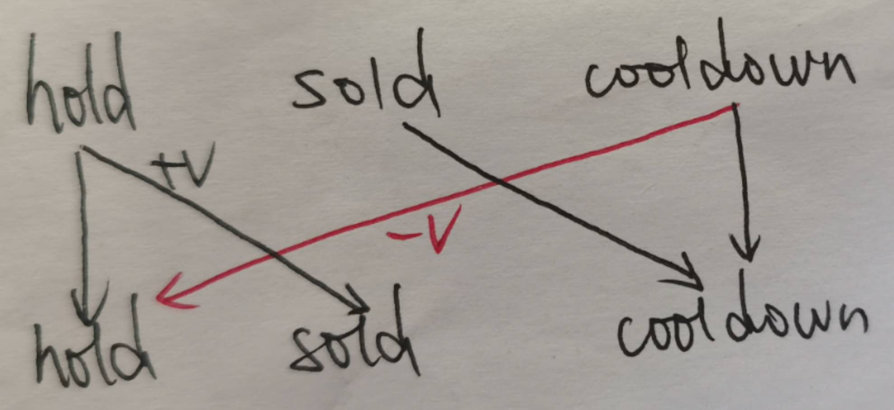

# 301-400

- [309. Best Time to Buy and Sell Stock with Cooldown](https://leetcode.com/problems/best-time-to-buy-and-sell-stock-with-cooldown/)

    - 动态规划，时间复杂度$O(n)$，空间复杂度$O(1)$

	

	```cpp
	int maxProfit(vector<int> &prices)
	{
		/**
		 * dynamic plan algorithm
		 *********************************
		 * 空间复杂度从O(n)优化到O(1)
		 * 
		 * 初始化条件：
		 * 		初始状态为get时收益为负无穷，初始状态为清仓售空时收益为0
		 * 返回值：
		 * 		只有最终状态为售出时才有可能获得最大收益
		*/
		int n = prices.size(), inf = numeric_limits<int>::max();
		int get1 = -inf, out1 = 0, get2 = -inf, out2 = 0;
		for (auto &&v : prices)
		{
			get1 = max(get1, -v);
			out1 = max(out1, get1 + v);
			get2 = max(get2, out1 - v);
			out2 = max(out2, get2 + v);
		}
		return max(out1, out2);
	}
	```

	- some test case

	```cpp
	[1,2,3,0,2]
	[3,3,5,0,0,3,1,4]
	[1,2,3,4,5]
	[7,6,4,3,1]
	```

- [315](https://leetcode.com/problems/count-of-smaller-numbers-after-self/)

	求逆序数对的问题，线段树或者归并排序(稳定排序)的过程中统计交换的次数或者BST。

	```cpp
	class Solution
	{
	private:
		struct myTreeNode
		{
			/* data */
			int val;
			int count;      // number of the value in nums
			int less_count; // number of x in nums where x < value and x is in the right of value
			myTreeNode *left;
			myTreeNode *right;
			myTreeNode(int x) : val(x), count(1), less_count(0), left(NULL), right(NULL) {}
		};

		int update_BST(myTreeNode *root, int val)
		{
			int cur_count = 0;
			if (root)
			{
				// three case of comparision between val and root->val
				if (val < root->val)
				{
					// go to left subtree
					root->less_count++;
					if (root->left)
					{
						cur_count += update_BST(root->left, val);
					}
					else
					{
						root->left = new myTreeNode(val);
					}
				}
				else if (val == root->val)
				{
					// return the result without update on the BST
					cur_count = root->less_count;
					root->count++;
				}
				else
				{
					// go to right subtree
					cur_count += root->count + root->less_count;
					if (root->right)
					{
						cur_count += update_BST(root->right, val);
					}
					else
					{
						root->right = new myTreeNode(val);
					}
				}
			}
			return cur_count;
		}

	public:
		vector<int> countSmaller(vector<int> &nums)
		{
			const int count = nums.size();
			vector<int> ans(count, 0);
			if (count > 0)
			{
				// iteration from right to left
				myTreeNode *root = new myTreeNode(nums.back());
				for (int i = count - 2; i >= 0; i--)
				{
					ans[i] = update_BST(root, nums.at(i));
				}
			}
			return ans;
		}
	};
	```

- [316. Remove Duplicate Letters](https://leetcode.com/problems/remove-duplicate-letters/)

    与[1081. Smallest Subsequence of Distinct Characters](https://leetcode.com/problems/smallest-subsequence-of-distinct-characters/)完全相同

- [318. Maximum Product of Word Lengths](https://leetcode.com/problems/maximum-product-of-word-lengths/)

	- **960ms** 使用数组来统计/标记每个单词中每个字符（a-z共有26个字符）是否出现，然后双重循环遍历所有单词，在没有重复且长度积大于ret的情况下更新ret，时间复杂度$O(n^2*max(words[i].length))$

	```cpp
	class Solution
	{
	private:
		bool nonRepeated(string s, vector<int> &count)
		{
			for (auto &&ch : s)
			{
				if (count[static_cast<int>(ch - 'a')] != 0)
				{
					return false;
				}
			}
			return true;
		}

	public:
		int maxProduct(vector<string> &words)
		{
			int const length = 26, n = words.size();
			vector<vector<int>> letters(n, vector<int>(26, 0));
			for (auto i = 0; i < n; i++)
			{
				for (auto &&ch : words[i])
				{
					letters[i][static_cast<int>(ch - 'a')]++;
				}
			}
			int ret = 0;
			for (auto i = 0; i < n; i++)
			{
				for (auto j = i + 1; j < n; j++)
				{
					int product = words[i].length() * words[j].length();
					if (product > ret && nonRepeated(words[i], letters[j]))
					{
						ret = product;
					}
				}
			}
			return ret;
		}
	};
	```

    - **76ms** 使用bitmap来代替数组标记每个单词中某个字符是否出现过，全部26个字符使用一个int值即可（32bits） **bit manipulation**

    ```cpp
	int maxProduct(vector<string> &words)
	{
		int const length = 26, n = words.size();
		int ret = 0;
		vector<int> letters(n, 0);
		for (auto i = 0; i < n; i++)
		{
			for (auto &&ch : words[i])
			{
				letters[i] = letters[i] | (1 << (static_cast<int>(ch - 'a')));
			}
			for (auto j = 0; j < i; j++)
			{
				if (!(letters[i] & letters[j]) && words[i].length() * words[j].length() > ret)
				{
					ret = words[i].length() * words[j].length();
				}
			}
		}
		return ret;
	}
    ```

- [319. Bulb Switcher](https://leetcode.com/problems/bulb-switcher/)

    - 模拟操作，时间复杂度$O(n^2)$，结果正确，但是$\color{red}{TLE}$

    ```cpp
    int bulbSwitch(int n)
    {
        vector<bool> bulbs(n, false);
        for (int i = 0; i < n; i++)
        {
            for (int j = i; j < n; j += i + 1)
            {
                bulbs[j] = !bulbs[j];
            }
        }
        int ret = 0;
        for (int i = 0; i < n; i++)
        {
            if (bulbs[i])
            {
                ret++;
            }
        }
        return ret;
    }
    ```

    - math方法，时间复杂度$O(1)$

    ```cpp
    int bulbSwitch(int n)
    {
        return (int)(sqrt(n));
    }
    ```

- [322. Coin Change](https://leetcode.com/problems/coin-change/)

    动态规划，$dp[i]$表示兑换钱数为i时需要的硬币总数，则$dp[i]=min_{j}(dp[i],dp[i-coins[j]]+1)$，时间复杂度$O(amount*coins.length)$

    ```cpp
    int coinChange(vector<int> &coins, int amount)
    {
        vector<int> dp(amount + 1, numeric_limits<int>::max());
        dp[0] = 0;
        for (auto &&v : coins)
        {
            for (int i = v; i <= amount; i++)
            {
                dp[i] = min(dp[i] - 1, dp[i - v]) + 1;
            }
        }
        return dp.back() == numeric_limits<int>::max() ? -1 : dp.back();
    }
    ```

- [326](https://leetcode.com/problems/power-of-three/)

    验证一个数是否是3的幂

    - 迭代式，循环用3去除，直到无法整除或值为1

    ```cpp
    bool isPowerOfThree(int n) {
		bool ret = false;
		if (n == 1)
		{
			ret = true;
		}
		else if (n > 1)
		{
			while (n % 3 == 0)
			{
				n /= 3;
			}
			ret = (n == 1) ? true : false;
		}
		return ret;
    }
    ```

    - 用数学方式直接判断，在官方[Solution](https://leetcode.com/problems/power-of-three/solution/)中有较为详细的解释

    ```cpp
    bool isPowerOfThree(int n)
    {
        return n > 0 && 1162261467 % n == 0;
    }
    ```

- [332. Reconstruct Itinerary](https://leetcode.com/problems/reconstruct-itinerary/)

	DFS搜索，求给定有向图中的最短哈密路径

	```cpp
	class Solution
	{
	private:
		bool dfs(string cur, vector<string> &ret, int n, unordered_map<string, map<string, int>> &m)
		{
			if (ret.size() == n)
			{
				return true; // n张ticket全部使用
			}
			for (auto node = m[cur].begin(); node != m[cur].end(); node++)
			{
				if (node->second > 0)
				{
					node->second--;
					ret.push_back(node->first);
					if (dfs(node->first, ret, n, m))
					{
						return true;
					}
					ret.pop_back();
					node->second++; // 回溯
				}
			}
			return false;
		}

	public:
		vector<string> findItinerary(vector<vector<string>> &tickets)
		{
			unordered_map<string, map<string, int>> m;
			for (auto &&ticket : tickets)
			{
				// 统计从a到b的tickets有多少，map里面可以实现字典序排序
				m[ticket[0]][ticket[1]]++;
			}
			string cur = "JFK";
			vector<string> ret{cur};
			dfs(cur, ret, tickets.size() + 1, m);
			return ret;
		}
	};
	```
    
- [337](https://leetcode.com/problems/house-robber-iii/)

    - 最简单版本[198](https://leetcode.com/problems/house-robber/)
        所有房子的价值以数组nums形式给出，顺序遍历dp即可
        $$dp[i]=\left\{\begin{matrix} x[0], i=0\\ max(x[0],x[1]), i=1\\ max(dp[i-2]+x[i],dp[i-1]), i\geqslant 2 \end{matrix}\right.$$

    - 升级版[213](https://leetcode.com/problems/house-robber-ii/)
        此时所有房子形成了一个环，即第一个和最后一个互相接壤，会互相影响，对数组nums[0,n-2],nums[1,n-1]执行两次dp取较大值即可

    - 本题中所有房子价值按照二叉树形式给出，只有一个入口，即根节点root，优质discussion在[这里](https://leetcode.com/problems/house-robber-iii/discuss/79330/Step-by-step-tackling-of-the-problem)
        - naive dp with recursion **[TLE](Time Limit Exceeded)**

        ```cpp
      	int rob(TreeNode* root) {
            int ret=0;
            if(root){
                int cur_value=root->val;
                if(root->left){
                    cur_value+=rob(root->left->left)+rob(root->left->right);
                }
                if(root->right){
                    cur_value+=rob(root->right->left)+rob(root->right->right);
                }
                ret=max(rob(root->left)+rob(root->right),cur_value);
            return ret;
        }
        ```

        - 朴素的递归过程中有很多的重复计算问题，可以通过hashmap来记录拜访过的子节点，在递归的过程中相当于实现了自底向上的dp过程，可以在$O(n)$时间和$O(n)$空间限制内解决问题

        ```cpp
        unordered_map<TreeNode*,int> visited;
        int rob(TreeNode* root) {
            int ret=0;
            if(root){
                if(visited.find(root)!=visited.end()){
                    ret=visited[root];
                }else{
                    int cur_value=root->val;
                    if(root->left){
                        cur_value+=rob(root->left->left)+rob(root->left->right);
                    }
                    if(root->right){
                        cur_value+=rob(root->right->left)+rob(root->right->right);
                    }
                    ret=max(rob(root->left)+rob(root->right),cur_value);
                    visited[root]=ret;
                }
            }
            return ret;
        }
        ```

        - 在每个节点计算两个值pair<int,int>，其中pair.first表示当前节点不选择时左右子树获得的最大价值，pair.second代表选择当前节点时当前节点及其子树可以获得的最大价值，递归之后在根节点的两个值中选择最大值即可

        ```cpp
        int rob(TreeNode* root) {
            pair<int,int> res=robsub(root);
            return max(res.first,res.second);
        }

        pair<int,int> robsub(TreeNode* root){
            if(root){
                /*
                    pair.first	当前节点不选择的最大价值
                    pair.second	当前节点选择的最大价值
                */
                pair<int,int> left=robsub(root->left);
                pair<int,int> right=robsub(root->right);
                return make_pair(max(left.first,left.second)+max(right.first,right.second),root->val+left.first+right.first);
            }else{
                return make_pair(0,0);
            }
        }
        ```

- [338](https://leetcode.com/problems/counting-bits/)

    注意分组统计的办法，类似和二进制表示中1的数量有关的问题和2的倍数有关系，主要有两条规则：
    - 一个偶数乘以2之后其二进制表示中1的个数不变
    - 一个奇数的二进制表示中1的个数等于它的前一个数（必然是偶数）的二进制表示中1的个数加一

    ```cpp
	vector<int> countBits(int num)
	{
		// method, count for every number
		// vector<int> ret(num + 1, 0);
		// for (int i = 1; i <= num; i++)
		// {
		// 	int count = 0, n = i;
		// 	while (n)
		// 	{
		// 		count += n & 1;
		// 		n = (n >> 1);
		// 	}
		// 	ret[i] = count;
		// }
		// return ret;

		// method 2, divide and computing
		vector<int> ret(num + 1, 0);
		for (int i = 1, distance = 1; i <= num; i++)
		{
			distance = (i == (distance << 1)) ? (distance << 1) : distance;
			ret[i] = ret[i - distance] + 1;
		}
		return ret;
	}
    ```

- [343. Integer Break](https://leetcode.com/problems/integer-break/)

	- 数学方法，列出推导式求导数优化求值，时间复杂度$O(1)$

	```cpp
	int integerBreak(int n)
	{
		int ret = n - 1;
		if (n > 3)
		{
			int q = n / 3, r = n % 3;
			if (r == 0)
			{
				ret = pow(3, q);
			}
			else if (r == 1)
			{
				ret = pow(3, q - 1) * 4;
			}
			else if (r == 2)
			{
				ret = pow(3, q) * 2;
			}
		}
		return ret;
	}
	```

    - 动态规划，状态转移方程为$f(n)=max_{1\le k \le n-1}(max\left\{\begin{matrix}k*f(n-k)\\ k*(n-k)\end{matrix}\right.)$，时间复杂度$O(n^2)$

    ```cpp
    int integerBreak(int n)
    {
        vector<int> dp(n + 1, 0);
        dp[1] = 1;
        for (int v = 2; v <= n; v++)
        {
            for (int k = 1; k < v; k++)
            {
                dp[v] = max(dp[v], max(k * dp[v - k], k * (v - k)));
            }
        }
        return dp.back();
    }
    ```

	- 根据数学计算的结果，每一段的长度必然小于等于3，则动态规划可以优化到时间复杂度$O(n)$

	```cpp
	int integerBreak(int n)
	{
		int ret = n - 1;
		if (n > 3)
		{
			vector<int> dp(n + 1, 0);
			dp[1] = 1, dp[2] = 2, dp[3] = 3;
			for (auto i = 4; i <= n; i++)
			{
				dp[i] = max(max(3 * dp[i - 3], 2 * dp[i - 2]), dp[i - 1]);
			}
			ret = dp.back();
		}
		return ret;
	}
	```

	- 使用static关键字，使得动态规划的结果在多个case之间复用

	```cpp
	int integerBreak(int n)
	{
		int ret = n - 1;
		if (n > 3)
		{
			static vector<int> dp{0, 1, 2, 3};
			for (auto i = dp.size(); i <= n; i++)
			{
				int v = max(max(3 * dp[i - 3], 2 * dp[i - 2]), dp[i - 1]);
				dp.push_back(v);
			}
			ret = dp[n];
		}
		return ret;
	}
	```

- [347. Top K Frequent Elements](https://leetcode.com/problems/top-k-frequent-elements/)

    先用hashmap统计每个数出现的frequency，然后使用quick sort或者heap来定位frequency第k高的值

    - quick sort，时间复杂度$O(nlog(n))$，LeetCode时间效率$\color{red}{24 ms, 41.43\%}$

    ```cpp
    vector<int> topKFrequent(vector<int> &nums, int k)
    {
        unordered_map<int, int> count;
        for (auto &&v : nums)
        {
            auto it = count.find(v);
            if (it == count.end())
            {
                count[v] = 1;
            }
            else
            {
                it->second++;
            }
        }
        vector<vector<int>> value_frequency;
        for (auto &&item : count)
        {
            value_frequency.push_back({item.first, item.second});
        }
        sort(value_frequency.begin(), value_frequency.end(), [](const vector<int> &a, const vector<int> &b) -> bool { return a[1] > b[1]; });
        vector<int> ret(k, 0);
        for (int i = 0; i < k; i++)
        {
            ret[i] = value_frequency[i][0];
        }
        return ret;
    }
    ```

    - heap，时间复杂度$O(nlog(k))$，LeetCode时间效率$\color{red}{20 ms, 80.85\%}$

    ```cpp
    vector<int> topKFrequent(vector<int> &nums, int k)
    {
        unordered_map<int, int> count;
        for (auto &&v : nums)
        {
            auto it = count.find(v);
            if (it == count.end())
            {
                count[v] = 1;
            }
            else
            {
                it->second++;
            }
        }
        priority_queue<int, vector<int>, greater<int>> max_k;
        for (auto &&item : count)
        {
            max_k.push(item.second);
            while (max_k.size() > k)
            {
                max_k.pop();
            }
        }
        vector<int> ret;
        for (auto &&item : count)
        {
            if (item.second >= max_k.top())
            {
                ret.push_back(item.first);
            }
        }
        return ret;
    }
    ```

    - bucket sort，时间复杂度$O(n)$，LeetCode时间效率$\color{red}{24 ms, 41.43\%}$

    ```cpp
    vector<int> topKFrequent(vector<int> &nums, int k)
    {
        unordered_map<int, int> count;
        for (auto &&v : nums)
        {
            auto it = count.find(v);
            if (it == count.end())
            {
                count[v] = 1;
            }
            else
            {
                it->second++;
            }
        }
        vector<vector<int>> buckets(nums.size() + 1, vector<int>{});
        for (auto &&item : count)
        {
            buckets[item.second].push_back(item.first);
        }
        vector<int> ret(k, 0);
        for (int i = nums.size(), j = 0; i >= 0 && j < k; i--)
        {
            int r = 0;
            while (r < buckets[i].size() && j < k)
            {
                ret[j++] = buckets[i][r++];
            }
        }
        return ret;
    }
    ```

- [349](https://leetcode.com/problems/intersection-of-two-arrays/)

    给定两个数组，求两个数组的交集，可以先用哈希表st存储第一个数组的值，然后遍历第二个数组，在哈希st中查询是否存在即可，时间复杂度$O(n)$

    ```cpp
    vector<int> intersection(vector<int> &nums1, vector<int> &nums2)
    {
        unordered_set<int> st(nums1.begin(), nums1.end()), intersection;
        for (auto x : nums2)
        {
            if (st.find(x) != st.end() && intersection.find(x) == intersection.end())
            {
                intersection.insert(x);
            }
        }
        return vector<int>(intersection.begin(), intersection.end());
    }
    ```

    仿照[350](https://leetcode.com/problems/intersection-of-two-arrays-ii/)先排序再遍历的方式在$O(nlog(n))$时间内实现，在n较大时效率高于hash的$O(n)$时间

    ```cpp
    vector<int> intersection(vector<int> &nums1, vector<int> &nums2)
    {
        sort(nums1.begin(), nums1.end());
        sort(nums2.begin(), nums2.end());
        vector<int> intersection;
        int i = 0, j = 0, count1 = nums1.size(), count2 = nums2.size();
        while (i < count1 && j < count2)
        {
            if (nums1[i] == nums2[j])
            {
                if (intersection.empty() || intersection.back() != nums1[i])
                {
                    intersection.push_back(nums1[i]);
                }
                i++, j++;
            }
            else if (nums1[i] < nums2[j])
            {
                i++;
            }
            else
            {
                j++;
            }
        }
        return intersection;
    }
    ```

- [350](https://leetcode.com/problems/intersection-of-two-arrays-ii/)

    与[349](https://leetcode.com/problems/intersection-of-two-arrays/)不同的是此题要求重复的数字也要在求得交集中重复出现，因此在$O(nlog(n))$时间内对两个数组排序，然后同时在线性时间内遍历两个数组，相同的数字插入交集中即可，实际上[349](https://leetcode.com/problems/intersection-of-two-arrays/)也可以用这种方式实现，只需要在将两个数组相同的数字插入交集前查询交集末尾是否存在相同的数即可，在n较大的情况下可能要比hash的方式效率更高

    ```cpp
    vector<int> intersect(vector<int> &nums1, vector<int> &nums2)
    {
        sort(nums1.begin(), nums1.end());
        sort(nums2.begin(), nums2.end());
        int i = 0, j = 0;
        vector<int> ret;
        while (i < nums1.size() && j < nums2.size())
        {
            if (nums1[i] == nums2[j])
            {
                ret.push_back(nums1[i]);
                i++;
                j++;
            }
            else if (nums1[i] < nums2[j])
            {
                i++;
            }
            else
            {
                j++;
            }
        }
        return ret;
    }
    ```

- [367](https://leetcode.com/problems/valid-perfect-square/)

    线性时间内判断一个数是否是完全平方数而不用开方函数，代码如下：

    ```cpp
    bool isPerfectSquare(int num) {
        long long i = 1, sum = 0;
        while (sum < num)
        {
            sum += i;
            i += 2;
        }
        return sum == num;
    }
    ```

    在数学上可以证明对于任何一个完全平方数有：
    $$
    \begin{array}{l}{n^{2}=1+3+5+ \ldots +(2 \cdot n-1)=\sum_{i=1}^{n}(2 \cdot i-1)} \\
    {\text { provement:}}
    \\ {\quad 1+3+5+\ldots+(2 \cdot n-1)} \\
    {=(2 \cdot 1-1)+(2 \cdot 2 - 1) + (2 \cdot 3-1)+\ldots+(2 \cdot n-1)} \\
    {=2 \cdot(1+2+3+\ldots+n)-(\underbrace{1+1+\ldots+1}_{n \text { times }})} \\
    {=2 \cdot \frac{n(n+1)}{2}-n} \\
    {=n^{2}+n-n} \\
    {=n^{2}}\end{array}
    $$

- [368. Largest Divisible Subset](https://leetcode.com/problems/largest-divisible-subset/)

    - 经典DP，dp[i]表示区间[i,count-1]内最大可整除子集的长度，再用一个parent数组记录最长可整除子集的路径，时间复杂度$O(n^2)$

    ```cpp
	vector<int> largestDivisibleSubset(vector<int> &nums)
	{
		int mx = 0, mx_idx = -1, count = nums.size();
		vector<int> dp(count, 0), parent(count, 0), ret;
		/**
		 * mx 表示当前最大可整除子集的长度
		 * mx_idx表示当前最大可整除子集的起始第一个数的坐标
		 * dp[i]表示区间[i,count-1]内最大可整除子集的长度
		 * parent[i]表示包含nums[i]的最大可整除子集的nums[i]的后一个数的下标index
		*/
		sort(nums.begin(), nums.end());
		for (auto i = count - 1; i >= 0; i--)
		{
			for (auto j = i; j < count; j++)
			{
				if (nums[j] % nums[i] == 0 && dp[i] < dp[j] + 1)
				{
					dp[i] = dp[j] + 1;
					parent[i] = j;
					if (mx < dp[i])
					{
						mx = dp[i], mx_idx = i;
					}
				}
			}
		}
		for (auto i = 0; i < mx; i++)
		{
			ret.push_back(nums[mx_idx]);
			mx_idx = parent[mx_idx];
		}
		return ret;
	}
	```
	
	- some test case

	```cpp
	[1,2,3]
	[1,2,4,8]
	[3,4,16,8]
	```

- [371](https://leetcode.com/problems/sum-of-two-integers/)

    不用加减操作求两个有符号整数的和，使用位操作实现，这里与一些列位操作相关问题[here](https://leetcode.com/problems/sum-of-two-integers/discuss/84278/A-summary%3A-how-to-use-bit-manipulation-to-solve-problems-easily-and-efficiently)

    ```cpp
    int getSum(int a, int b) {
        long long c = 0;
        while (b)
        {
            c = a & b;
            a = a ^ b;
            b = (c & 0xffffffff) << 1;
            /*
            这里c定义为长整型而又和0xffffffff按位与的目的是
            1. 避免signed int表示的最小负数左移时溢出的问题
            2. 将c限制在unsigned int的32 bits内
            */
        }
        return a;
    }
    ```

- [372. Super Pow](https://leetcode.com/problems/super-pow/)

    求一个$a^b，其中b是一个巨大的数，结果对1337取模

    ```cpp
    int superPow(int a, vector<int> &b)
    {
        vector<int> powers(10, 1);
        const int mode = 1337;
        a %= mode;
        for (int i = 1; i < 10; i++)
        {
            powers[i] = (powers[i - 1] * a) % mode;
        }
        int ans = 1;
        for (auto &&v : b)
        {
            int base = ans;
            for (int i = 1; i < 10; i++)
            {
                ans = (ans * base) % mode;
            }
            ans = (ans * powers[v]) % mode;
        }
        return ans;
    }
    ```

- [376. Wiggle Subsequence](https://leetcode.com/problems/wiggle-subsequence/)

    - 动态规划，$dp[i]$表示包含nums[i]的序列nums[0-i]区间内的LWS子问题的最优解，时间复杂度$O(n^2)$，空间复杂度$O(n)$

	```cpp
	int wiggleMaxLength(vector<int> &nums)
	{
		int n = nums.size(), ret = 0;
		if (n == 1)
		{
			ret = 1;
		}
		else if (n >= 2)
		{
			vector<int> dp(n + 1, 1);
			ret = 1; // initialization
			for (int i = 1; i < n; i++)
			{
				if (nums[i] == nums[i - 1])
				{
					continue;
				}
				int j = i;
				if (nums[i] > nums[i - 1])
				{
					while (j > 0 && nums[j] >= nums[j - 1])
					{
						j--;
					}
				}
				else if (nums[i] < nums[i - 1])
				{
					while (j > 0 && nums[j] <= nums[j - 1])
					{
						j--;
					}
				}
				dp[i + 1] += dp[j + 1];
				ret = max(ret, dp[i + 1]);
			}
		}
		return ret;
	}
	```

    - 动态规划，up表示以当前元素结尾且上升的最大长度，down表示以当前元素结尾且下降的最大长度，时间复杂度$O(n)$，空间复杂度$O(1)$

	```cpp
	int wiggleMaxLength(vector<int> &nums)
	{
		int n = nums.size(), ret = 0;
		if (n > 0)
		{
			int up = 1, down = 1;
			for (int i = 1; i < n; i++)
			{
				if (nums[i] > nums[i - 1])
				{
					up = down + 1;
				}
				else if (nums[i] < nums[i - 1])
				{
					down = up + 1;
				}
			}
			ret = max(up, down);
		}
		return ret;
	}
	```

- [377](https://leetcode.com/problems/combination-sum-iv/)

    与前面三个组合数相关的题目[39](https://leetcode.com/problems/combination-sum/)、[40](https://leetcode.com/problems/combination-sum-ii/)、[216](https://leetcode.com/problems/combination-sum-iii/)不同的是，这里不需要给出所有可能的结果，只需要求出可能的结果种类数即可，DP方法足以胜任，这里注意DP数组中的数据类型为unsigned int，防止数字超出int的限制，直接使用long long也可以有正确结果，但是会浪费空间资源并降低运算速度

    ```cpp
    int combinationSum4(vector<int> &nums, int target)
    {
        vector<unsigned int> dp(target + 1, 0);
        sort(nums.begin(), nums.end());
        dp[0] = 1;
        for (int i = 0; i <= target; i++)
        {
            for (int j = 0; j < nums.size() && nums[j] <= i; j++)
            {
                dp[i] += dp[i - nums[j]];
            }
        }
        return dp.back(); // dp[target]
    }
    ```

- [380. Insert Delete GetRandom O(1)](https://leetcode.com/problems/insert-delete-getrandom-o1/)

    - ListNode + HashMap

    ```cpp
	class RandomizedSet
	{
	private:
		ListNode *head, *last;
		unordered_map<int, ListNode *> prev;
		int size;

	public:
		/** Initialize your data structure here. */
		RandomizedSet()
		{
			head = new ListNode(0);
			last = head;
			prev.clear();
			size = 0;
		}

		/** Inserts a value to the set. Returns true if the set did not already contain the specified element. */
		bool insert(int val)
		{
			bool ret = false;
			if (prev.find(val) == prev.end())
			{
				ret = true;
				prev[val] = last;
				last->next = new ListNode(val);
				last = last->next;
				size++;
			}
			return ret;
		}

		/** Removes a value from the set. Returns true if the set contained the specified element. */
		bool remove(int val)
		{
			bool ret = false;
			if (prev.find(val) != prev.end())
			{
				ret = true;
				ListNode *cur = prev[val];
				prev.erase(val);
				if (cur->next->next == NULL)
				{
					last = cur;
				}
				else
				{
					prev[cur->next->next->val] = cur;
				}
				cur->next = cur->next->next;
				size--;
			}
			return ret;
		}

		/** Get a random element from the set. */
		int getRandom()
		{
			int n = rand() % size;
			ListNode *cur = head->next;
			while (n > 0)
			{
				cur = cur->next;
				n--;
			}
			return cur->val;
		}
	};
	```

	- hashmap+vector

	```cpp
	class RandomizedSet
	{
	private:
		unordered_map<int, int> key_index;
		vector<int> values;

	public:
		/** Initialize your data structure here. */
		RandomizedSet()
		{
			key_index.clear();
			values.clear();
		}

		/** Inserts a value to the set. Returns true if the set did not already contain the specified element. */
		bool insert(int val)
		{
			bool ret = false;
			if (key_index.find(val) == key_index.end())
			{
				ret = true;
				key_index[val] = values.size();
				values.push_back(val);
			}
			return ret;
		}

		/** Removes a value from the set. Returns true if the set contained the specified element. */
		bool remove(int val)
		{
			bool ret = false;
			if (key_index.find(val) != key_index.end())
			{
				ret = true;
				// 先交换（交换当前位置和values最后一个值，然后删除最后一个值）
				int loc = key_index[val];
				values[loc] = values.back();
				key_index[values[loc]] = loc;
				// 再删除
				values.pop_back();
				key_index.erase(val);
			}
			return ret;
		}

		/** Get a random element from the set. */
		int getRandom()
		{
			int n = rand() % values.size();
			return values[n];
		}
	};
	```

	- some test case

	```cpp
	["RandomizedSet","insert","remove","insert","getRandom","remove","insert","getRandom"]
	[[],[1],[2],[2],[],[1],[2],[]]
	["RandomizedSet","insert","insert","remove","insert","remove","getRandom"]
	[[],[0],[1],[0],[2],[1],[]]
	["RandomizedSet","remove","remove","insert","getRandom","remove","insert"]
	[[],[0],[0],[0],[],[0],[0]]
	```

- [384](https://leetcode.com/problems/shuffle-an-array/)

    给定一个数组，实现shuffle操作，即每次等概率地返回他的任何一种全排列。倒序遍历数组nums从i到0，每次对nums[i]，生成一个随机数r使得$r \in [0,i]$，交换nums[i]和nums[r]即可，数学上可以证明这是等概率操作

    ```cpp
    class Solution
    {
        public:
            vector<int> array;
            Solution(vector<int> &nums)
            {
                array = nums;
            }

            /** Resets the array to its original configuration and return it. */
            vector<int> reset()
            {
                vector<int> ans = array;
                return ans;
            }

            /** Returns a random shuffling of the array. */
            vector<int> shuffle()
            {
                vector<int> ans = array;
                for (int i = ans.size() - 1; i >= 0; i--)
                {
                    int r = random() % (i + 1);
                    swap(ans[i], ans[r]);
                }
                return ans;
            }
    };
    ```

- [386. Lexicographical Numbers](https://leetcode.com/problems/lexicographical-numbers/)

	- 从1-n的数字转化为字符串，字符串按照字典序排序，然后转换为int值输出，时间复杂度$O(nlog(n))$

	```cpp
    vector<int> lexicalOrder(int n)
    {
        vector<string> strs;
        for (int i = 1; i <= n; i++)
        {
            strs.push_back(to_string(i));
        }
        sort(strs.begin(), strs.end());
        vector<int> ret;
        for (auto i = 0; i < n; i++)
        {
            ret.push_back(stoi(strs[i]));
        }
        return ret;
    }
	```

	- 递归构造按照字典序排序的数字，时间复杂度$O(n)$

	```cpp
    class Solution
    {
    private:
        void helper(vector<int> &ret, int start, int boundary)
        {
            if (start <= boundary)
            {
                ret.push_back(start);
                for (auto i = 0; i <= 9; i++)
                {
                    helper(ret, start * 10 + i, boundary);
                }
            }
        }

    public:
        vector<int> lexicalOrder(int n)
        {
            vector<int> ret;
            int count = min(9, n);
            for (auto v = 1; v <= count; v++)
            {
                helper(ret, v, n);
            }
            return ret;
        }
    };
	```

- [388. Longest Absolute File Path](https://leetcode.com/problems/lexicographical-numbers/)

    首先将字符串预处理为每个目录项的深度levels，字符长度lengths，是否是文件的isfile标记数组，然后使用栈来DFS具体的每个文件路径，计算其最大长度，时间复杂度$O(n)$，其中n为给定字符串input的长度

    ```cpp
    class Solution
    {
    private:
        void pre_process_input(string input, vector<int> &levels, vector<int> &lengths, vector<int> &isfile)
        {
            input.push_back('\n'); // for last item
            int cur_level = 0, cur_length = 0, file = 0;
            char prev_char;
            for (auto &&ch : input)
            {
                if (ch == '\n')
                {
                    // get a single item
                    file == 1 ? cur_length : cur_length++; // 如果是目录有末尾的斜杠占一个字符位置
                    levels.push_back(cur_level);
                    lengths.push_back(cur_length);
                    isfile.push_back(file);
                    cur_level = 0, cur_length = 0, file = 0;
                }
                else if (ch == '\t')
                {
                    cur_level++;
                }
                else
                {
                    cur_length++;
                    if (prev_char == '.')
                    {
                        file = 1;
                    }
                }
                prev_char = ch;
            }
        }
    public:
        int lengthLongestPath(string input)
        {
            vector<int> levels, lengths, isfile;
            pre_process_input(input, levels, lengths, isfile);
            // cout << integerVectorToString(levels) << endl;
            // cout << integerVectorToString(lengths) << endl;
            // cout << integerVectorToString(isfile) << endl;
            int ret = 0, cur_length = 0, count = levels.size();
            stack<int> st;
            for (auto i = 0; i < count; i++)
            {
                while (st.size() > levels[i])
                {
                    cur_length -= st.top();
                    st.pop();
                }
                cur_length += lengths[i];
                st.push(lengths[i]);
                ret = isfile[i] ? max(ret, cur_length) : ret;
            }
            return ret;
        }
    };
    ```

- [394](https://leetcode.com/problems/decode-string/)

    关于括号中嵌套的问题，可以用递归的方法解决

    ```cpp
    string decodeString(string s)
    {
        string ans;
        if (s.length() > 0)
        {
            int i = 0, count = s.length();
            while (i < count)
            {
                if (isdigit(s[i]))
                {
                    int length = 0;
                    while (i < count && isdigit(s[i]))
                    {
                        length = length * 10 + (int)(s[i] - '0');
                        i++;
                    }
                    int open_start = i + 1, open_count = 1;
                    i++; // skip the first [
                    while (i < count && open_count > 0)
                    {
                        if (s[i] == '[')
                        {
                            open_count++;
                        }
                        else if (s[i] == ']')
                        {
                            open_count--;
                        }
                        i++;
                    }
                    string temp = s.substr(open_start, i - 1 - open_start); // substr(begin_index,length)
                    temp = decodeString(temp);
                    for (int j = 0; j < length; j++)
                    {
                        ans += temp;
                    }
                }
                else
                {
                    ans.push_back(s[i++]);
                }
            }
        }
        return ans;
    }
    ```

- [396. Rotate Function](https://leetcode.com/problems/rotate-function/)

    对于给定整数（可能是负数）数组A，定义$F(k)=\sum_{i=0}^{n-1}{i*A[(i+k)\%n]},n=A.length()$，求$max_{0 \le k \le n-1}{F(k)}$

    - 暴力搜索所有可能的$F(k)$，时间复杂度$O(n^2)$，结果正确，但是$\color{red}{TLE}$

    ```cpp
    int maxRotateFunction(vector<int> &A)
    {
        int ans = 0;
        const int count = A.size();
        if (count > 0)
        {
            ans = numeric_limits<int>::min();
            for (int i = 0; i < count; i++)
            {
                int temp = 0;
                for (int j = 0; j < count; j++)
                {
                    temp += j * A[(i + j) % count];
                }
                ans = max(ans, temp);
            }
        }
        return ans;
    }
    ```

    - 根据数学公式，在$O(n)$时间内遍历，$\color{red}{Accepted}$

    在数学上可以推导$F(0)=\sum_{i=0}^{n-1}{i*A[i]}$且$sum=\sum_{i=0}^{n-1}A[i]$，其中$n=A.length()$，则之后类似于高中数学数列的错位相减法，有递推公式：
    $$F(k+1)=F(k)-(n-1)*A[n-k]+sum-A[n-k]=F(k)+sum-n*A[n-k]$$

    ```cpp
    int maxRotateFunction(vector<int> &A)
    {
        const int count = A.size();
        long long ans = 0, n = count;
        if (count > 0)
        {
            long long F = 0, sum_of_A = 0;
            for (int i = 0; i < count; i++)
            {
                F += i * A[i], sum_of_A += A[i];
            }
            ans = F; // f[0]
            for (int i = 1; i < count; i++)
            {
                F = F + sum_of_A - n * A[count - i]; // F(k+1)=F(k)+sum-n*A[n-k]
                ans = max(ans, F);
            }
        }
        return (int)ans;
    }
    ```

- [397. Integer Replacement](https://leetcode.com/problems/integer-replacement/)

    - 递归写法，LeetCode提交时间效率30%

    ```cpp
    int integerReplacement(int n)
    {
        return unsignedIntegerReplacement((unsigned int)(n));
    }
    int unsignedIntegerReplacement(unsigned int n)
    {
        if (n > 1)
        {
            if (n & 0x1)
            {
                return 1 + min(unsignedIntegerReplacement(n + 1), unsignedIntegerReplacement(n - 1));
            }
            else
            {
                return 1 + unsignedIntegerReplacement(n >> 1);
            }
        }
        return 0;
    }
    ```

    - 非递归，统计1的数量并快速消除右侧的所有1，数学方法，LeetCode提交时间效率75%

    ```cpp
    int countbits(int n)
    {
        int ret = 0;
        while (n)
        {
            ret++;
            n &= n - 1;
        }
        return ret;
    }
    int integerReplacement(int n)
    {
        int ret = 0;
        if (n == numeric_limits<int>::max())
        {
            ret = 32;
        }
        else
        {
            while (n != 1)
            {
                if (n & 0x1)
                {
                    if (n == 3 || countbits(n - 1) < countbits(n + 1))
                    {
                        n--;
                    }
                    else
                    {
                        n++;
                    }
                }
                else
                {
                    n = (n >> 1);
                }
                ret++;
            }
        }
        return ret;
    }
    ```

- [400](https://leetcode.com/problems/nth-digit/)
    
    在$1,2,3,4,5,6,7,8,9,10,11,...$的数列中找到第n个数字，思想简单，分别计算不同位宽的数字个数即可(k位数一共占据$k*(9*10^k)$个位置)，但是注意实现时的具体细节处理。

    ```cpp
    int findNthDigit(int n)
    {
        long base = 9, digits = 1;
        while (n - base * digits > 0)
        {
            n -= base * digits;
            base *= 10;
            digits++;
        }
        int index = (n % digits) ? (n % digits) : digits;
        long num = 1;
        for (int i = 1; i < digits; i++)
        {
            num *= 10;
        }
        num += (index == digits) ? n / digits - 1 : n / digits;
        for (int i = index; i < digits; i++)
        {
            num /= 10;
        }
        return num % 10;
    }
    ```